<div align="center">
  <picture>
    <source media="(prefers-color-scheme: dark)" srcset="https://shdrojejslhgnojzkzak.supabase.co/storage/v1/object/public/public/doc-orchestrator/logos/1771371901777-lc3cse-logo-openframe-full-dark-bg.png">
    <source media="(prefers-color-scheme: light)" srcset="https://shdrojejslhgnojzkzak.supabase.co/storage/v1/object/public/public/doc-orchestrator/logos/1771372526604-k3y1w-logo-openframe-full-light-bg.png">
    
  </picture>
</div>

<p align="center">
  <a href="LICENSE.md"></a>
  <a href="https://join.slack.com/t/openmsp/shared_invite/zt-36bl7mx0h-3~U2nFH6nqHqoTPXMaHEHA"></a>
  <a href="https://openframe.ai"></a>
</p>

# MeshCentral

**MeshCentral** is an open-source, web-based remote device management platform that gives Managed Service Providers (MSPs), IT administrators, and enterprises a unified control plane for managing, monitoring, and remotely accessing devices at scale.

Built on Node.js with an Express HTTPS backend and a rich browser-native frontend, MeshCentral replaces proprietary remote-management software with a self-hosted, fully open-source alternative — enhanced in this repository by Flamingo's AI-driven MSP platform, [OpenFrame](https://openframe.ai).

> Deploy a single Node.js server, install lightweight agents on your managed devices, and get immediate browser-based remote desktop, terminal access, file management, Intel AMT out-of-band control, and real-time monitoring — all from a single web UI with no additional client software required.

---

## Features

| Feature | Description |
|---|---|
| **Browser-based Remote Desktop** | Full VNC/RFB client implementation via noVNC — no plugins required |
| **Browser Terminal** | Xterm.js-powered SSH and shell terminal with image rendering (SIXEL/OSC 1337) |
| **RDP Integration** | RDP clipboard (Cliprdr) virtual channel and client-side RDP stack |
| **Intel AMT / Out-of-Band** | Full CIRA, WSMAN, and ACM support for Intel vPro device management |
| **Multi-Database Support** | NeDB (default), MongoDB, MariaDB, MySQL, PostgreSQL, AceBase, SQLite3 |
| **Automated TLS** | Built-in Let's Encrypt / ZeroSSL / custom ACME certificate management |
| **Multi-Factor Authentication** | TOTP (OTP), FIDO2/WebAuthn hardware key support |
| **Multi-Tenant / Multi-Server** | Peer server clustering and multi-domain tenant isolation |
| **Plugin System** | Extensible plugin lifecycle with server-side hooks and browser-side injection |
| **Prometheus Metrics** | Optional `/metrics` endpoint for observability integrations |
| **OpenFrame Integration** | Flamingo AI-powered MSP overlay for multi-tenant device management |
| **CLI Control Tool** | `meshctrl.js` with 50+ administrative commands via WebSocket API |
| **MQTT Broker** | Embedded Aedes-based MQTT broker for device messaging |
| **Session Recording** | Binary and text relay session recording for compliance |

---

## Architecture

MeshCentral follows a layered architecture separating UI/presentation, remote interaction engines, transport and protocol layers, and crypto/compression subsystems.

```mermaid
flowchart TD
    subgraph browser["Browser"]
        WebUI["MeshCentral Web UI"]
        noVNC["noVNC RFB Client"]
        Xterm["Xterm.js Terminal"]
        RDP["RDP Clipboard (Cliprdr)"]
        Bootstrap["Bootstrap UI"]
    end

    subgraph server["MeshCentral Server (Node.js)"]
        Main["meshcentral.js (Entry Point)"]
        WebSrv["webserver.js (Express HTTPS)"]
        MeshAgent["meshagent.js (Agent WS Handler)"]
        Relay["meshrelay.js (Relay Sessions)"]
        MPS["mpsserver.js (Intel AMT CIRA)"]
        MQTT["mqttbroker.js (Aedes)"]
        DB["db.js (Database Abstraction)"]
        Plugin["pluginHandler.js (Plugins)"]
    end

    subgraph data["Data Layer"]
        NeDB["NeDB (Default)"]
        MongoDB["MongoDB"]
        Postgres["PostgreSQL / MySQL / MariaDB"]
    end

    subgraph agents["Managed Devices"]
        Agent["MeshAgent"]
        CIRA["Intel AMT CIRA"]
    end

    WebUI --> WebSrv
    noVNC --> Relay
    Xterm --> Relay
    RDP --> Relay

    Main --> WebSrv
    Main --> MPS
    Main --> MQTT
    Main --> DB
    Main --> Plugin

    WebSrv --> MeshAgent
    WebSrv --> Relay

    DB --> NeDB
    DB --> MongoDB
    DB --> Postgres

    Agent --> MeshAgent
    CIRA --> MPS
    Agent --> MQTT
```



---

## Quick Start

### Install via npm (fastest)

```bash
# 1. Install MeshCentral globally
npm install -g meshcentral

# 2. Start the server (auto-generates self-signed TLS on first run)
meshcentral

# 3. Open your browser and create your admin account
#    https://localhost:4430
```

### Install from Source (Flamingo fork)

```bash
# Clone the repository
git clone https://github.com/flamingo-stack/meshcentral.git
cd meshcentral

# Install dependencies
npm install

# Start the server
node meshcentral.js
```

On first launch, MeshCentral automatically:
- Creates a `meshcentral-data/` directory for persistent data
- Generates self-signed TLS certificates
- Starts the HTTPS server on port **4430** (non-root) or **443** (root/production)

> There are no default credentials. You define your admin username and password during first-run setup at `https://localhost:4430`.

### Minimal Production Configuration

Place this file at `meshcentral-data/config.json`:

```json
{
  "$schema": "https://raw.githubusercontent.com/Ylianst/MeshCentral/master/meshcentral-config-schema.json",
  "settings": {
    "cert": "mesh.yourdomain.com",
    "port": 443,
    "redirPort": 80,
    "sessionKey": "a-long-random-string-change-this"
  },
  "domains": {
    "": {
      "title": "My MeshCentral",
      "newAccounts": false
    }
  },
  "letsencrypt": {
    "email": "admin@yourdomain.com",
    "names": "mesh.yourdomain.com",
    "production": true
  }
}
```

---

## Prerequisites

| Software | Minimum Version | Notes |
|---|---|---|
| **Node.js** | 16.0.0 | Node.js 18 or 20 LTS recommended |
| **npm** | Bundled with Node.js | |
| **Git** | Any recent version | |
| **OpenSSL** | System-provided | Required for TLS operations |

**System requirements (production):** 2+ CPU cores, 2 GB+ RAM, 20 GB+ disk, Linux (Ubuntu 20.04+, Debian 11+, RHEL 8+).

```bash
# Verify your environment
node --version   # Must be ≥ 16.0.0
npm --version
git --version
openssl version
```

---

## Technology Stack

| Layer | Technology |
|---|---|
| **Server Runtime** | Node.js 16+ |
| **HTTP Framework** | Express 4 (`express`, `express-ws`, `express-handlebars`) |
| **WebSocket** | `ws` 8.x |
| **Database (default)** | NeDB (`@seald-io/nedb`) — no external DB required |
| **TLS/Crypto** | `node-forge` |
| **2FA/TOTP** | `otplib` |
| **Remote Desktop** | noVNC (RFB/VNC) — `public/novnc/` |
| **Terminal** | Xterm.js — `public/scripts/xterm*` |
| **RDP** | Custom RDP stack — `rdp/` |
| **MQTT** | Aedes broker — `mqttbroker.js` |
| **Frontend UI** | Vanilla JS + jQuery + Bootstrap + Chart.js |

---

## CLI Tool — meshctrl

`meshctrl.js` is a powerful CLI that connects to MeshCentral via WebSocket with 50+ administrative commands:

```bash
# List all connected devices
node meshctrl.js listdevices \
  --url wss://mesh.yourdomain.com \
  --loginuser admin \
  --loginpass yourpassword

# Run a remote command
node meshctrl.js runcommand \
  --url wss://mesh.yourdomain.com \
  --loginuser admin \
  --loginpass yourpassword \
  --id '//domain/device/nodeid' \
  --run "uptime"

# Monitor live events
node meshctrl.js showevents \
  --url wss://mesh.yourdomain.com \
  --loginuser admin \
  --loginpass yourpassword
```

---

## OpenFrame Integration

This repository is the **MeshCentral** component of the [OpenFrame](https://openframe.ai) unified MSP platform. OpenFrame integrates MeshCentral with Flamingo's AI-powered toolchain:

- **Mingo AI** — AI-powered assistant for technicians
- **Fae** — AI-powered client portal
- **Multi-tenant isolation** — per-tenant domain routing via `plugins/openframe.js`
- **Device status API** — real-time device connectivity queries for OpenFrame dashboards

OpenFrame plugin environment variables:

| Variable | Default | Purpose |
|---|---|---|
| `MESH_DIR` | `/opt/mesh` | Directory for `mesh_id` and `mesh_server_id` files |
| `MESH_DEVICE_GROUP` | `''` | Device group name in generated MSH agent config files |

---

## Documentation

📚 See the [Documentation](./docs/README.md) for comprehensive guides including architecture reference, development setup, security, and testing.

- [Introduction](./docs/getting-started/introduction.md) — Platform overview and key features
- [Prerequisites](./docs/getting-started/prerequisites.md) — Environment requirements
- [Quick Start](./docs/getting-started/quick-start.md) — Get running in under 5 minutes
- [First Steps](./docs/getting-started/first-steps.md) — Post-deployment configuration
- [Architecture Reference](./docs/reference/architecture/README.md) — Module-level technical docs

---

## Community

All questions, discussions, and support happen on the **OpenMSP Slack community**. We do not use GitHub Issues or GitHub Discussions.

- 🌐 **Website:** [https://www.openmsp.ai/](https://www.openmsp.ai/)
- 💬 **Join Slack:** [OpenMSP Slack](https://join.slack.com/t/openmsp/shared_invite/zt-36bl7mx0h-3~U2nFH6nqHqoTPXMaHEHA)
- 🦩 **Platform:** [https://flamingo.run](https://flamingo.run)
- 🔗 **OpenFrame:** [https://openframe.ai](https://openframe.ai)

---

## License

Licensed under the **Apache-2.0** License. See [`LICENSE`](https://github.com/flamingo-stack/meshcentral/blob/main/LICENSE) for details.

---

<div align="center">
  Built with 💛 by the <a href="https://www.flamingo.run/about"><b>Flamingo</b></a> team
</div>
