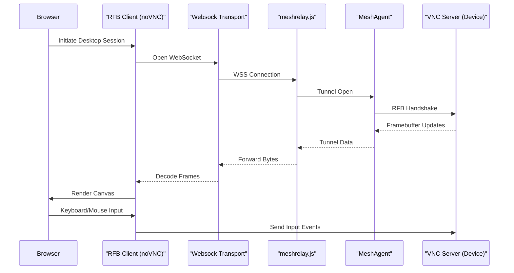
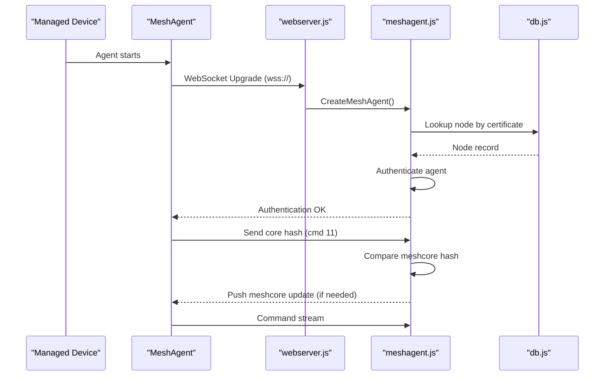
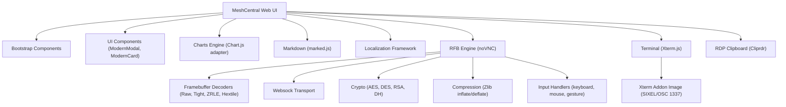
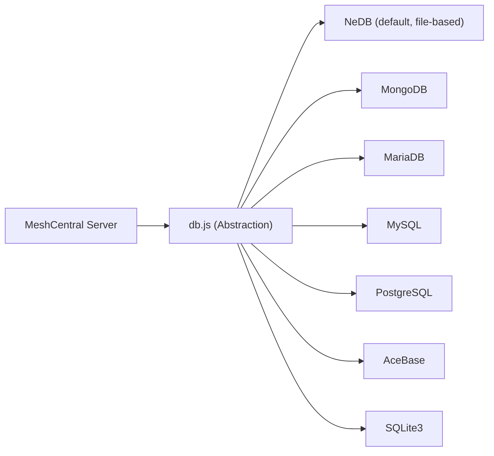

# Architecture Overview

MeshCentral follows a layered, modular architecture with a Node.js server at the centre, a rich browser-native frontend, and protocol-specific subsystems for remote access, device management, and communications.

---

## High-Level System Architecture

```mermaid
flowchart TD
    subgraph browser["Browser"]
        WebUI["MeshCentral Web UI"]
        noVNC["noVNC RFB Client"]
        Xterm["Xterm.js Terminal"]
        RDP["RDP Clipboard (Cliprdr)"]
        Bootstrap["Bootstrap UI"]
        Charts["Charts / Markdown"]
    end

    subgraph server["MeshCentral Server (Node.js)"]
        Main["meshcentral.js (Entry Point)"]
        WebSrv["webserver.js (Express HTTPS)"]
        MeshAgent["meshagent.js (Agent WS Handler)"]
        Relay["meshrelay.js (Relay Sessions)"]
        MPS["mpsserver.js (Intel AMT CIRA)"]
        MQTT["mqttbroker.js (Aedes)"]
        Multi["multiserver.js (Peer Cluster)"]
        DB["db.js (Database Abstraction)"]
        AMT["amtmanager.js (Intel AMT)"]
        LE["letsencrypt.js (ACME)"]
        Plugin["pluginHandler.js (Plugins)"]
        Monitor["monitoring.js (Prometheus)"]
    end

    subgraph data["Data Layer"]
        NeDB["NeDB (Default)"]
        MongoDB["MongoDB"]
        Postgres["PostgreSQL / MySQL / MariaDB"]
        SQLite["SQLite3"]
    end

    subgraph agents["Managed Devices"]
        Agent["MeshAgent"]
        CIRA["Intel AMT CIRA"]
    end

    WebUI --> WebSrv
    noVNC --> Relay
    Xterm --> Relay
    RDP --> Relay

    Main --> WebSrv
    Main --> MPS
    Main --> MQTT
    Main --> DB
    Main --> AMT
    Main --> LE
    Main --> Plugin
    Main --> Monitor
    Main --> Multi

    WebSrv --> MeshAgent
    WebSrv --> Relay

    MeshAgent --> DB
    Relay --> DB
    AMT --> MPS

    DB --> NeDB
    DB --> MongoDB
    DB --> Postgres
    DB --> SQLite

    Agent --> MeshAgent
    CIRA --> MPS
    Agent --> MQTT
```

---

## Core Components

| Module | File | Responsibility |
|---|---|---|
| **Entry Point** | `meshcentral.js` | Server bootstrap, subsystem orchestration, task limiting |
| **Web Server** | `webserver.js` | Express HTTPS, TLS, routing, user/mesh sessions, WebAuthn |
| **Agent Handler** | `meshagent.js` | MeshAgent WebSocket sessions, meshcore updates, authentication |
| **Relay** | `meshrelay.js` | Client↔agent relay tunnels, recording, access rights |
| **MPS Server** | `mpsserver.js` | Intel AMT CIRA/APF over TLS, dual security modes |
| **MQTT Broker** | `mqttbroker.js` | Aedes-based MQTT for device messaging and power control |
| **Multi-Server** | `multiserver.js` | Peer cluster WebSocket links, mutual TLS auth, 4-bit state machine |
| **Database** | `db.js` | Multi-backend abstraction (NeDB, MongoDB, PG, MySQL, SQLite, AceBase) |
| **AMT Manager** | `amtmanager.js` | Intel AMT device lifecycle, WSMAN stack, 802.1x/Wi-Fi profiles |
| **Let's Encrypt** | `letsencrypt.js` | ACME certificate acquisition and renewal |
| **WebAuthn** | `webauthn.js` | FIDO2/WebAuthn registration and assertion |
| **Plugin Handler** | `pluginHandler.js` | Plugin loading, hooks, browser-side injection, meshcore modules |
| **Monitoring** | `monitoring.js` | Prometheus `/metrics` endpoint |
| **meshctrl** | `meshctrl.js` | CLI admin tool (50+ commands via WebSocket) |
| **Common Utils** | `common.js` | Binary encoding, HTML escaping, crypto helpers, DB field escaping |
| **Password** | `pass.js` | PBKDF2/SHA-384 password hashing with salt |
| **Cert Operations** | `certoperations.js` | Intel AMT ACM certificate chain building and signing |

---

## Remote Desktop Data Flow (RFB/VNC)

---

## Agent Connection Flow

---

## Frontend Architecture

---

## Database Architecture

The database abstraction layer (`db.js`) supports 7 backends behind a unified interface:

The database stores:
- Device (node) records
- User accounts and groups
- Device groups (meshes)
- Events and power events
- Server statistics
- Plugin metadata

---

## Key Design Decisions

1. **Strict protocol state machines** — RFB, RDP, APF, and multi-server peer auth all use explicit state machines for reliability
2. **Streaming-safe binary processing** — All protocol parsers handle partial frames and buffered reads
3. **Browser-native rendering** — Remote desktop and terminal use Canvas and DOM (no native plugins)
4. **Transport abstraction** — `Websock` wraps both WebSocket and RTCDataChannel, enabling WebRTC relay paths
5. **Multi-backend database** — NeDB works out of the box; production systems can switch to MongoDB or SQL with a config change
6. **Plugin extensibility** — Plugins can inject both server-side hooks and browser-side JavaScript without modifying core
7. **Backwards-compatible crypto** — `LegacyCrypto` abstraction maintains compatibility with older VNC security types alongside RA2ne (AES)
8. **Accessibility-first terminal** — Xterm.js terminal mirrors viewport to an ARIA tree for screen reader support

---

## Reference Documentation

For detailed per-module documentation, see the [Reference Architecture](../../reference/architecture/README.md).
