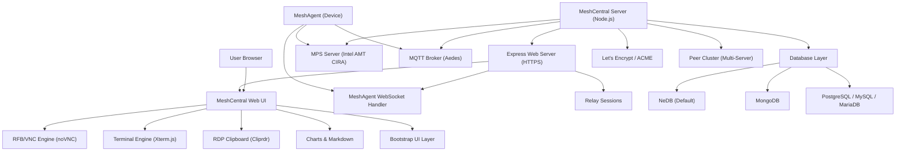

# Introduction to MeshCentral

MeshCentral is an open-source, web-based remote device management platform that gives Managed Service Providers (MSPs), IT administrators, and enterprises a unified control plane for managing, monitoring, and remotely accessing devices at scale.

Built on Node.js with an Express HTTP/HTTPS backend and a rich browser-native frontend, MeshCentral replaces proprietary remote-management software with a self-hosted, fully open-source alternative — enhanced in this repository by Flamingo's AI-driven MSP platform, [OpenFrame](https://openframe.ai).

---

## Elevator Pitch

> Deploy a single Node.js server, install lightweight agents on your managed devices, and get immediate browser-based remote desktop, terminal access, file management, Intel AMT out-of-band control, and real-time monitoring — all from a single web UI with no additional client software required.

---

## Key Features

| Feature | Description |
|---|---|
| **Browser-based Remote Desktop** | Full VNC/RFB client implementation via noVNC — no plugins required |
| **Browser Terminal** | Xterm.js-powered SSH and shell terminal with image rendering (SIXEL/OSC 1337) |
| **RDP Integration** | RDP clipboard (Cliprdr) virtual channel and client-side RDP stack |
| **Intel AMT / Out-of-Band** | Full CIRA, WSMAN, and ACM support for Intel vPro device management |
| **Multi-Database Support** | NeDB (default), MongoDB, MariaDB, MySQL, PostgreSQL, AceBase, SQLite3 |
| **Automated TLS** | Built-in Let's Encrypt / ZeroSSL / custom ACME certificate management |
| **Multi-Factor Authentication** | TOTP (OTP), FIDO2/WebAuthn hardware key support |
| **Multi-Tenant / Multi-Server** | Peer server clustering and multi-domain tenant isolation |
| **Plugin System** | Extensible plugin lifecycle with server-side hooks and browser-side injection |
| **Prometheus Metrics** | Optional `/metrics` endpoint for observability integrations |
| **OpenFrame Integration** | Flamingo AI-powered MSP overlay for multi-tenant device management |
| **CLI Control Tool** | `meshctrl.js` with 50+ administrative commands via WebSocket API |
| **MQTT Broker** | Embedded Aedes-based MQTT broker for device messaging |
| **Session Recording** | Binary and text relay session recording for compliance |

---

## Target Audience

- **MSP Technicians** using Flamingo/OpenFrame who need remote access and device management
- **IT Administrators** managing on-premise or hybrid device fleets
- **DevOps Engineers** who want self-hosted, auditable remote management infrastructure
- **Developers** extending MeshCentral through its plugin system or REST/WebSocket API

---

## High-Level Architecture

---

## How It Fits Into the Flamingo/OpenFrame Platform

This repository is the **MeshCentral** component of the [OpenFrame](https://openframe.ai) unified MSP platform. OpenFrame integrates MeshCentral with other open-source MSP tools, adding:

- **Mingo AI** — AI-powered assistant for technicians
- **Fae** — AI-powered client portal
- **Multi-tenant isolation** — per-tenant domain routing via the OpenFrame plugin (`plugins/openframe.js`)
- **Device status API** — real-time device connectivity queries for OpenFrame dashboards

---

## Repository

- **GitHub:** [https://github.com/flamingo-stack/meshcentral](https://github.com/flamingo-stack/meshcentral)
- **Version:** 1.1.57
- **License:** Apache-2.0
- **Community:** [OpenMSP Slack](https://join.slack.com/t/openmsp/shared_invite/zt-36bl7mx0h-3~U2nFH6nqHqoTPXMaHEHA)

---

## Where to Go Next

- **[Prerequisites](prerequisites.md)** — Verify your environment before installing
- **[Quick Start](quick-start.md)** — Get MeshCentral running in under 5 minutes
- **[First Steps](first-steps.md)** — Explore key features after your first deployment
