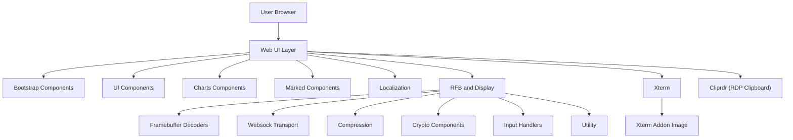
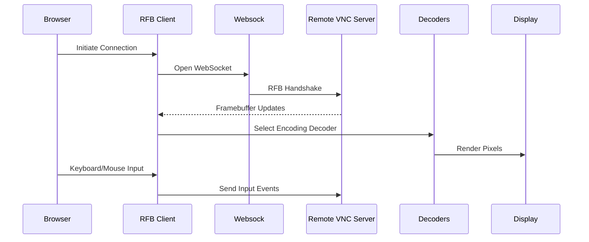
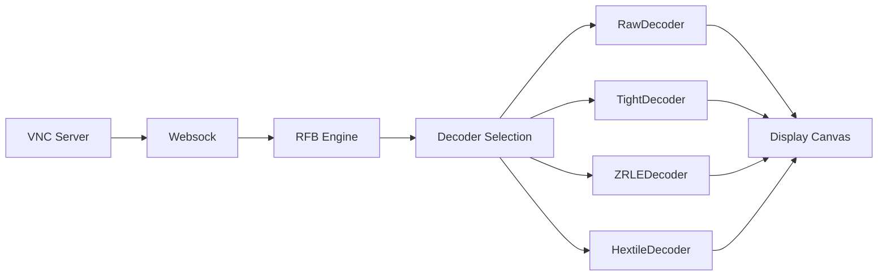
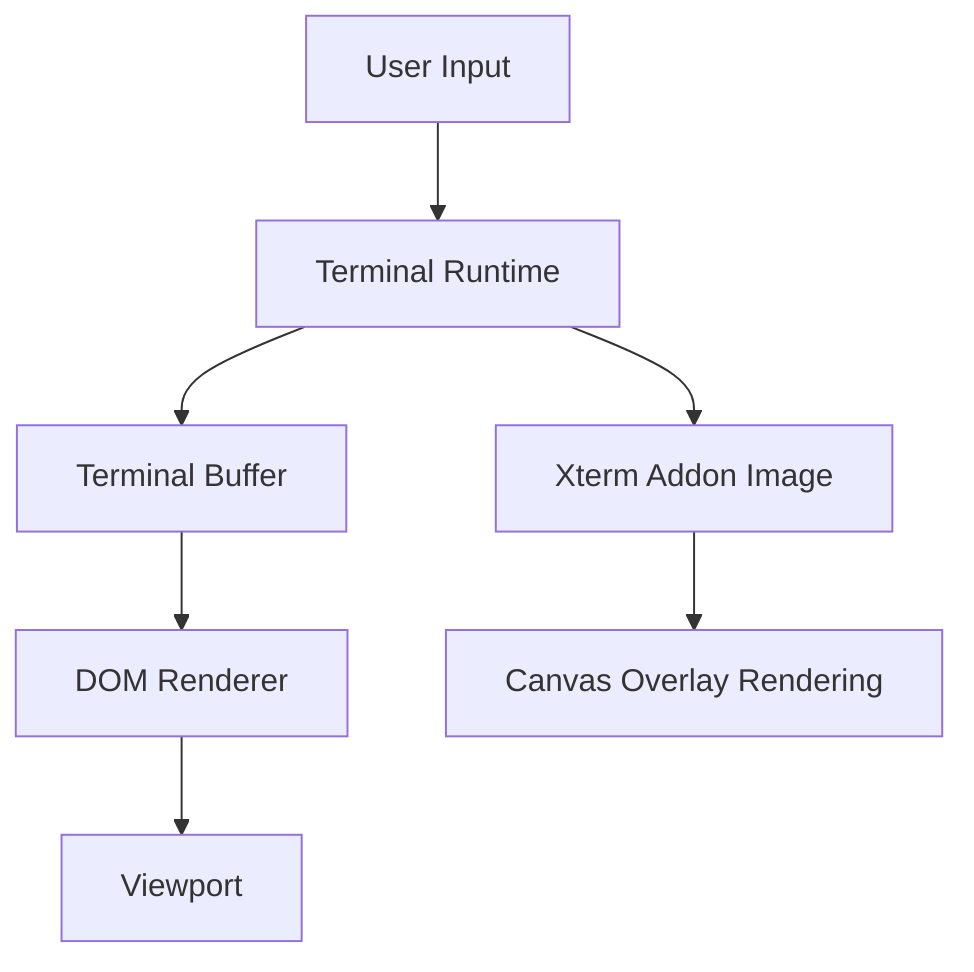
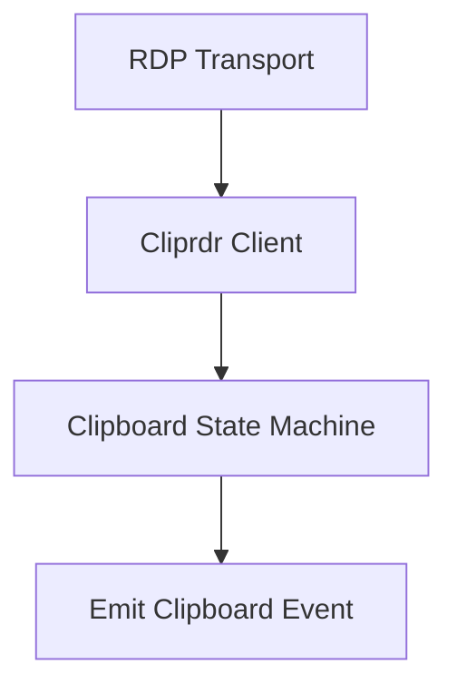
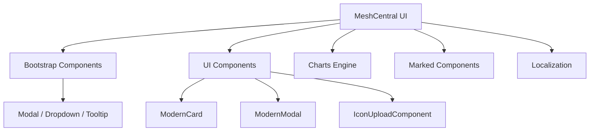

# MeshCentral – Repository Overview

**Repository:** https://github.com/flamingo-stack/meshcentral  
**Owner:** flamingo-stack  
**Project:** MeshCentral (AI-powered MSP-ready remote management platform)

MeshCentral is a full-stack remote management and remote access platform designed for secure device administration, browser-based remote desktop, terminal access, RDP integration, and centralized monitoring. It combines a Node.js backend with a highly modular browser frontend built around noVNC, Xterm.js, RDP protocol components, Bootstrap UI, and rich visualization tools.

The repository includes:

- Remote desktop (VNC / RFB) client stack
- RDP clipboard and protocol integration
- Browser-based terminal (Xterm)
- Image rendering inside terminals (SIXEL / OSC 1337)
- Cryptographic and compression subsystems
- UI component framework (Bootstrap + Modern UI layer)
- Charting and Markdown rendering engines
- Localization framework
- Transport abstraction (Websock)
- Clipboard virtual channel for RDP

---

# High-Level System Architecture

MeshCentral follows a layered architecture separating:

- UI / Presentation
- Remote interaction engines (RFB, RDP, Terminal)
- Transport & Protocol layers
- Crypto & Compression
- Utility subsystems

---

# End-to-End Remote Desktop Flow (RFB)

The browser-based remote desktop uses a complete RFB (VNC) implementation powered by noVNC.

Core responsibilities:

- Protocol negotiation
- Security negotiation (RSA-AES / legacy types)
- Framebuffer decoding
- Double-buffered canvas rendering
- Keyboard, mouse, gesture handling
- Clipboard synchronization

See:
- `public/novnc/core/rfb`
- `public/novnc/core/display`
- `public/novnc/core/ra2`

---

# Remote Desktop Rendering Pipeline

Core modules:
- **Decoders** (`public/novnc/core/decoders`)
- **Compression** (`public/novnc/core/inflator`, `deflator`)
- **Websock** (`public/novnc/core/websock`)
- **Crypto Components** (`public/novnc/core/crypto`)

---

# Terminal Architecture (Xterm)

MeshCentral integrates a browser-native terminal runtime using Xterm.js.

Key capabilities:

- Terminal emulation
- IME and composition support
- Clipboard integration
- Accessibility (ARIA tree mirroring)
- Image rendering (SIXEL / OSC 1337)
- Lifecycle-safe rendering services

Core paths:
- `public/scripts/xterm`
- `public/scripts/xterm-addon-image`

---

# RDP Clipboard (Cliprdr)

RDP clipboard support is implemented via the Cliprdr virtual channel.

Responsibilities:

- Capability negotiation
- Clipboard format advertisement
- Format data request/response
- UCS-2 text handling
- Event-driven clipboard updates

Path:
- `rdp/protocol/pdu/cliprdr`

---

# Frontend UI Architecture

The web UI is modular and layered:

## Core UI Modules

### UI Components (`public/js`)
- `ModernModal`
- `ModernCard`
- `IconUploadComponent`

### Bootstrap Components (`public/scripts`)
- Modal
- Dropdown
- Tooltip
- Toast
- Carousel
- FocusTrap
- Backdrop

### Charts Components
- Chart lifecycle engine
- Scale computation
- Dataset controllers
- Animation scheduling
- Plugin registry

### Marked Components
- Markdown parsing pipeline
- Lexer / Tokenizer
- Renderer / Hooks
- Extension system

### Localization
- Language negotiation
- JSON dictionary loading
- DOM translation
- Fallback-safe design

---

# Transport, Compression & Cryptography

## Websock
High-performance binary transport abstraction:
- Buffered receive queue (rQ)
- Buffered send queue (sQ)
- WebSocket / RTCDataChannel support

## Compression
- Zlib inflate/deflate
- Streaming support
- Tight / ZRLE encoding support

## Crypto Components
- AES (ECB, EAX)
- DES (ECB, CBC)
- RSA (PKCS#1 v1.5)
- Diffie–Hellman
- LegacyCrypto abstraction

These modules enable secure authentication (RA2ne), encrypted sessions, and compressed framebuffer delivery.

---

# Core Module Documentation References

| Module | Path |
|--------|------|
| UI Components | `public/js` |
| Bootstrap Components | `public/scripts` |
| Charts Components | `public/scripts/charts` |
| Marked Components | `public/scripts/marked.js` |
| Localization | `public/novnc/app` |
| RFB and Display | `public/novnc/core` |
| Decoders | `public/novnc/core/decoders` |
| Compression | `public/novnc/core` |
| Crypto Components | `public/novnc/core/crypto` |
| Websock | `public/novnc/core/websock` |
| Input Handlers | `public/novnc/core/input` |
| Utility | `public/novnc/core/util` |
| Xterm | `public/scripts/xterm` |
| Xterm Addon Image | `public/scripts/xterm-addon-image` |
| Cliprdr | `rdp/protocol/pdu` |

---

# Design Principles

MeshCentral emphasizes:

1. Strict protocol state machines (RFB, RDP)
2. Streaming-safe binary processing
3. Browser-native rendering (Canvas + DOM)
4. Modular frontend architecture
5. Backwards-compatible crypto support
6. Transport abstraction
7. Accessibility-first terminal design
8. Extensibility via registry and plugin patterns

---

# Summary

The **flamingo-stack/meshcentral** repository implements a complete browser-based remote management platform combining:

- Secure RFB/VNC client implementation
- RDP clipboard channel integration
- Terminal emulation with graphical support
- Modular UI architecture
- High-performance transport buffering
- Zlib compression and legacy-compatible crypto
- Rich charting and Markdown rendering engines
- Localization support
- Structured utility infrastructure

It delivers a fully integrated remote desktop and terminal experience directly in the browser, supported by robust protocol, rendering, cryptographic, and UI subsystems.