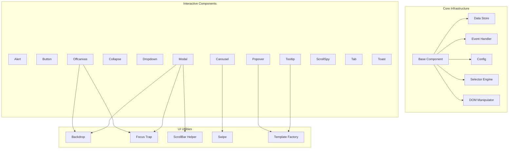
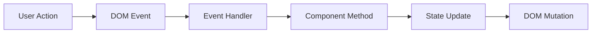
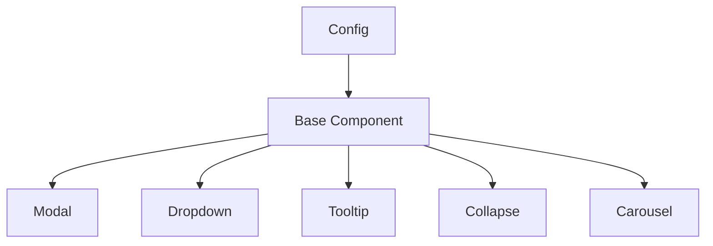
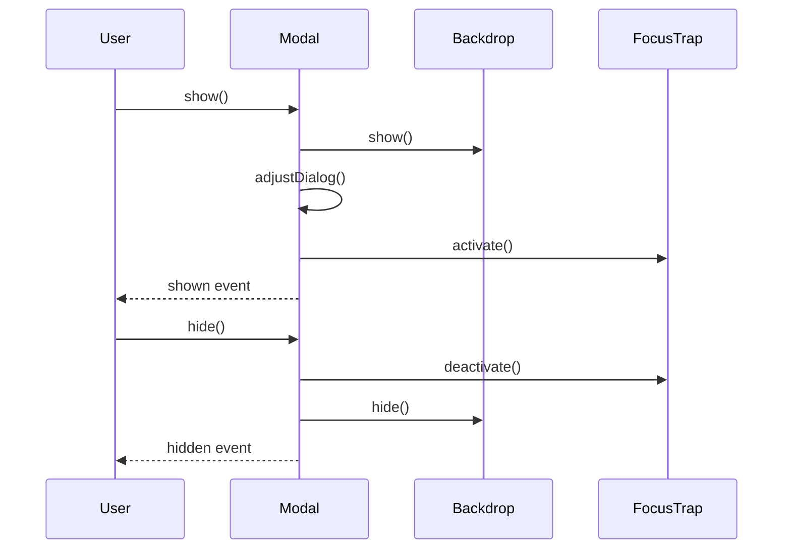
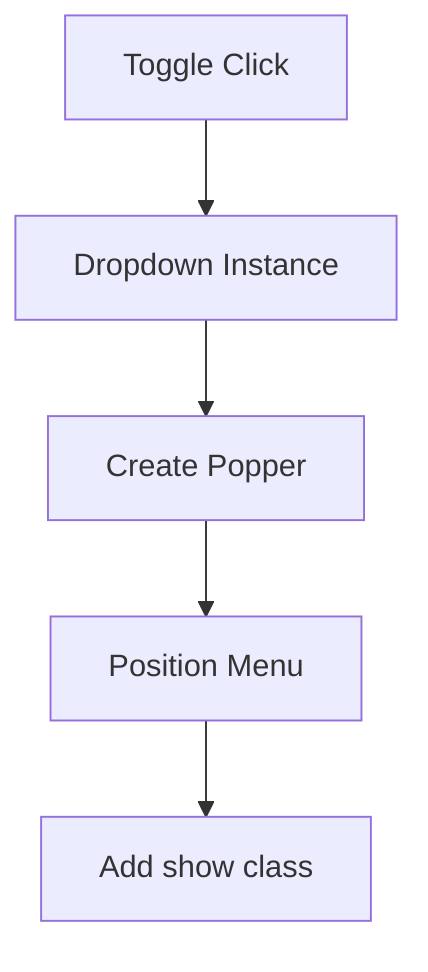

# Bootstrap Components

The **Bootstrap Components** module provides the interactive UI behavior layer for MeshCentral’s web interface. It bundles Bootstrap v5.3.3 JavaScript components and utilities, enabling dynamic, accessible, and responsive user interface elements such as modals, dropdowns, tooltips, tabs, toasts, and more.

This module acts as the behavioral foundation for higher-level UI modules such as [UI Components](ui-components/ui-components.md), integrating DOM manipulation, event handling, configuration management, animation timing, accessibility helpers, and Popper-based positioning.

---

## 1. Purpose and Responsibilities

The Bootstrap Components module is responsible for:

- Providing reusable interactive UI primitives (Modal, Dropdown, Tooltip, etc.)
- Managing component lifecycle and instance binding to DOM elements
- Handling events via a unified event system
- Managing configuration via data attributes and runtime options
- Supporting accessibility (ARIA attributes, focus trapping)
- Coordinating layout adjustments (scrollbars, backdrop, transitions)
- Integrating Popper for dynamic positioning

---

## 2. High-Level Architecture

The module is structured around a shared infrastructure layer and multiple concrete UI components built on top of it.

---

## 3. Core Infrastructure

### 3.1 Data Store

The `Data` utility maintains a `Map<Element, Map<Key, Instance>>`, ensuring:

- One component instance per element per component type
- Safe retrieval via `getInstance()` and `getOrCreateInstance()`
- Proper cleanup on `dispose()`

This prevents duplicate bindings and memory leaks.

---

### 3.2 Event Handler

`EventHandler` abstracts:

- Event registration (`on`, `one`, `off`)
- Delegated event binding
- Namespaced events
- Custom event triggering

All components rely on this centralized event system.

---

### 3.3 Config and Base Component

All components extend `BaseComponent`, which:

- Merges configuration from:
  - Static defaults
  - Data attributes (`data-bs-*`)
  - Runtime config object
- Performs type checking
- Registers instance in `Data`
- Provides `_queueCallback()` for transition-safe execution

Inheritance structure:

---

## 4. Utility Subsystems

### 4.1 Backdrop

Provides reusable overlay functionality:

- Used by Modal and Offcanvas
- Supports animation
- Handles click callbacks
- Injected into configurable root element

### 4.2 Focus Trap

Ensures keyboard focus remains inside:

- Modal dialogs
- Offcanvas panels

It intercepts `Tab` navigation and redirects focus appropriately.

### 4.3 ScrollBar Helper

Manages layout adjustments when body scrolling is disabled:

- Computes scrollbar width
- Adjusts padding/margins
- Restores original layout on reset

### 4.4 Swipe

Used by Carousel to:

- Detect touch gestures
- Trigger left/right transitions

### 4.5 Template Factory and Sanitization

Used by Tooltip and Popover:

- Dynamically generates DOM from templates
- Injects content safely
- Sanitizes HTML against an allowlist

---

## 5. Component Interaction Patterns

### 5.1 Modal Lifecycle

### 5.2 Dropdown with Popper

Dropdown integrates with Popper for dynamic positioning.

---

## 6. Data API Integration

Most components support automatic activation via data attributes.

Examples:

- `data-bs-toggle="modal"`
- `data-bs-toggle="dropdown"`
- `data-bs-dismiss="alert"`

The module registers global delegated listeners that:

1. Detect matching selectors
2. Resolve target elements
3. Instantiate components if needed
4. Invoke appropriate methods

---

## 7. Accessibility and Standards

The Bootstrap Components module enforces:

- ARIA role assignments (dialog, tablist, tabpanel)
- `aria-expanded`, `aria-selected`, `aria-modal`
- Keyboard navigation support
- Focus trapping for overlays
- Escape key handling

This ensures consistent behavior across browsers and assistive technologies.

---

## 8. Integration Within the MeshCentral UI

The Bootstrap Components module serves as the interactive behavior layer beneath:

- [UI Components](ui-components/ui-components.md) — higher-level UI abstractions
- [Marked Components](marked-components/marked-components.md) — rendered markdown content with tooltips or modals
- [Charts Components](charts-components/charts-components.md) — dashboards that may use tabs, tooltips, and dropdowns

It does not implement business logic itself. Instead, it provides the reusable primitives that other modules compose into feature-rich interfaces.

---

## 9. Design Principles

- **Single Instance per Element** — enforced via `Data`
- **Event-Driven Architecture** — consistent lifecycle events
- **Config-First Design** — defaults + data attributes + runtime config
- **Accessibility by Default** — ARIA + keyboard support
- **Composable Utilities** — Backdrop, FocusTrap, ScrollBarHelper reused across components

---

## 10. Summary

The **Bootstrap Components** module is the foundational UI interaction engine for MeshCentral’s web interface. It provides:

- A shared component infrastructure
- Rich interactive elements
- Robust lifecycle management
- Accessibility and keyboard support
- Seamless integration with higher-level UI modules

By abstracting DOM complexity and event orchestration, it enables consistent, maintainable, and scalable UI behavior across the entire platform.
