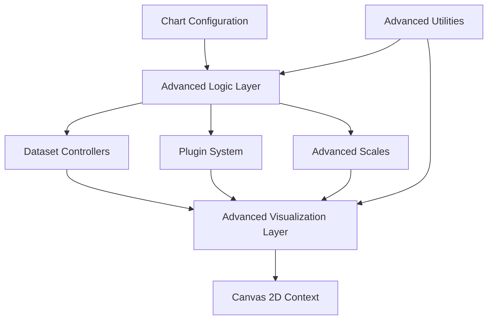
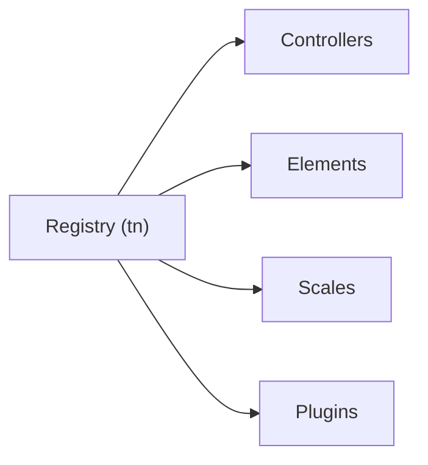
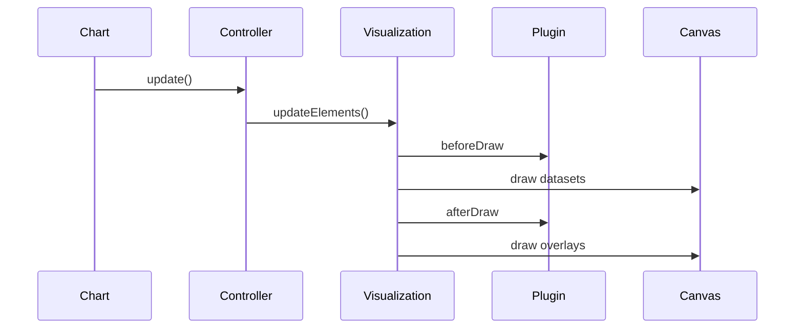
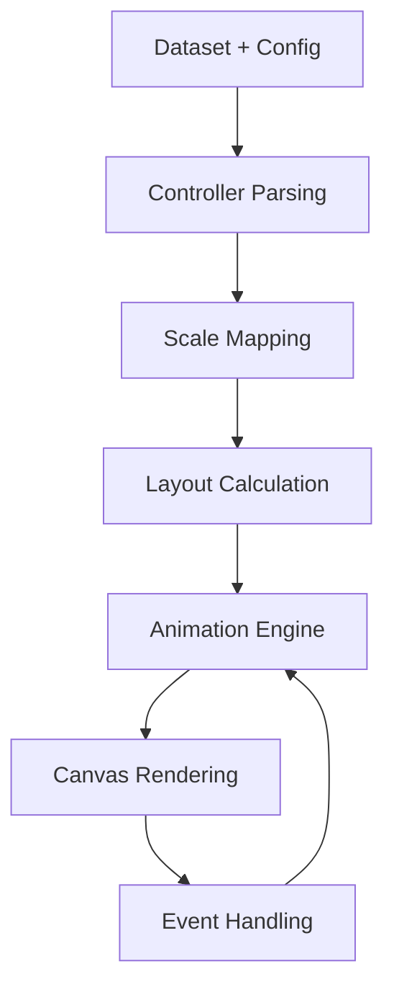
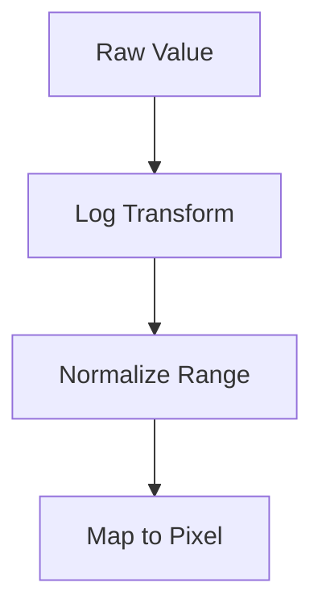
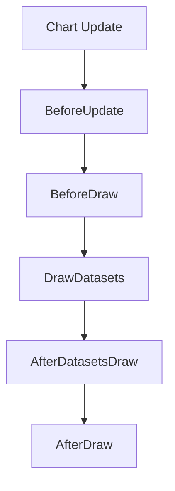
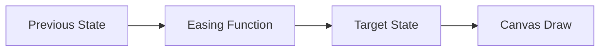
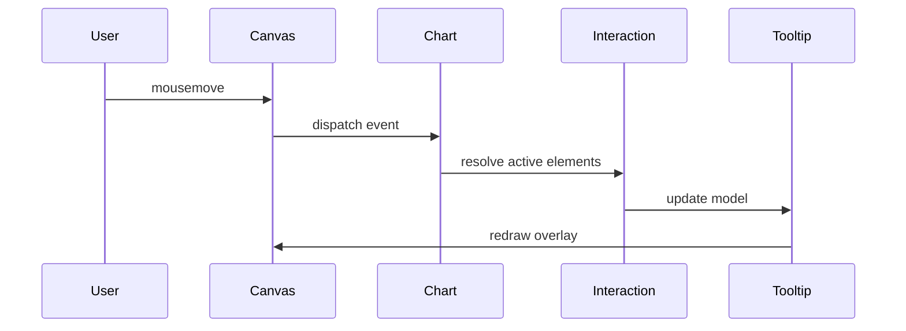

# Chart Advanced Components

The **Chart Advanced Components** module provides the high-level orchestration, rendering intelligence, and extensibility layer for advanced charting capabilities inside MeshCentral.

Built on top of Chart.js v4 (bundled in `public/scripts/charts.js`), this module combines:

- Advanced visualization rendering
- Runtime logic orchestration
- Scale implementations
- Animation coordination
- Plugin integration
- Utility infrastructure

It extends the **Chart Core Components** with richer behaviors, improved interaction handling, and advanced scale support.

---

## Repository Structure

**Path:** `public/scripts`  
**Namespace:** `meshcentral.public.scripts.charts`

### Advanced Components

- `meshcentral.public.scripts.charts.rs`
- `meshcentral.public.scripts.charts.sn`
- `meshcentral.public.scripts.charts.so`
- `meshcentral.public.scripts.charts.tn`
- `meshcentral.public.scripts.charts.wo`
- `meshcentral.public.scripts.charts.ws`
- `meshcentral.public.scripts.charts.ya`

### Submodules

```
charts-components
└── chart-advanced-components
    ├── chart-advanced-visualization
    ├── chart-advanced-logic
    └── chart-advanced-utilities
```

### Submodule Responsibilities

| Submodule | Responsibility |
|------------|----------------|
| Chart Advanced Visualization | Rendering engine, animations, plugin-driven drawing |
| Chart Advanced Logic | Registry, controller orchestration, advanced scale logic |
| Chart Advanced Utilities | Shared helpers and infrastructure support |

---

# Architectural Position

The module sits between chart configuration and final canvas rendering.



---

# Core Architectural Layers

## 1. Advanced Logic Layer

**Primary components:**

- `tn` → Registry system
- `wo` → LogarithmicScale implementation

### Responsibilities

- Controller resolution
- Scale registration
- Plugin lifecycle coordination
- Dataset stacking & parsing
- Interaction orchestration
- Animation scheduling

### Registry Architecture



This registry enables runtime extensibility without hardcoded dependencies.

---

## 2. Advanced Visualization Layer

**Primary components:**

- `rs`
- `sn`
- `so`

### Responsibilities

- Dataset drawing
- Tooltip rendering
- Legend rendering
- Title & subtitle drawing
- Animation interpolation
- Segment-aware line rendering
- Canvas abstraction

### Rendering Flow



---

## 3. Advanced Utilities Layer

**Primary components:**

- `ws`
- `ya`

### Responsibilities

- Helper abstractions
- Shared computation utilities
- Data normalization support
- Layout helpers
- Plugin support utilities

This layer reduces duplication across visualization and logic modules.

---

# Rendering & Update Pipeline

The advanced module enforces a deterministic update pipeline:



### Phases

1. Configuration resolution  
2. Dataset parsing  
3. Scale normalization  
4. Layout computation  
5. Animation interpolation  
6. Dataset rendering  
7. Overlay rendering  
8. Interaction handling  

---

# Advanced Scale Support

The module introduces advanced numeric scaling logic.

### Logarithmic Scale (wo)



Features:

- Logarithmic tick generation
- Major/minor tick detection
- Domain expansion logic
- Pixel ↔ value transformation
- Precision control for multi-order magnitude datasets

---

# Plugin & Interaction System

The advanced module tightly integrates built-in plugins:

| Plugin | Purpose |
|--------|----------|
| Tooltip | Interactive data inspection |
| Legend | Dataset toggling |
| Title / Subtitle | Chart headers |
| Filler | Area fill logic |
| Decimation | Performance optimization |
| Colors | Auto color resolution |

### Plugin Hook Flow



Plugins may:

- Modify layout
- Override styles
- Cancel drawing phases
- Inject animation behavior
- Add external rendering logic

---

# Animation System

Animations are coordinated globally and per-element.



Capabilities include:

- Property-level interpolation
- Color blending
- Hover transitions
- Resize transitions
- Tooltip fade animations
- Batched frame scheduling

---

# Interaction Handling

Supported interaction modes:

- `nearest`
- `index`
- `dataset`
- `point`
- Axis-based filtering (`x`, `y`)

### Interaction Flow



---

# Relationship to Chart Core Components

The **Chart Advanced Components** module extends:

- Chart Core Utilities
- Chart Core Logic
- Chart Core Operations

| Layer | Focus |
|--------|--------|
| Chart Core | Fundamental parsing, operations, utilities |
| Chart Advanced | Extensibility, rendering intelligence, scale complexity |

This separation ensures:

- Clean architecture boundaries
- Runtime extensibility
- Plugin-first design
- Scalable performance

---

# Design Principles

1. **Extensibility First** — Registry-driven component registration  
2. **Deterministic Rendering** — Structured update → layout → draw cycle  
3. **Separation of Concerns** — Logic, visualization, utilities isolated  
4. **Performance Optimization** — Decimation & animation batching  
5. **Interactive by Default** — Rich tooltip and legend integration  

---

# Summary

The **Chart Advanced Components** module is the intelligence and rendering backbone of MeshCentral’s advanced charting system.

It:

- Orchestrates controllers, scales, and plugins
- Manages animations and transitions
- Enables logarithmic and advanced scale behavior
- Coordinates interaction handling
- Optimizes rendering performance
- Bridges configuration to final canvas rendering

By combining advanced logic, visualization, and utility layers, it delivers a responsive, extensible, and high-performance charting engine fully integrated into the MeshCentral UI.