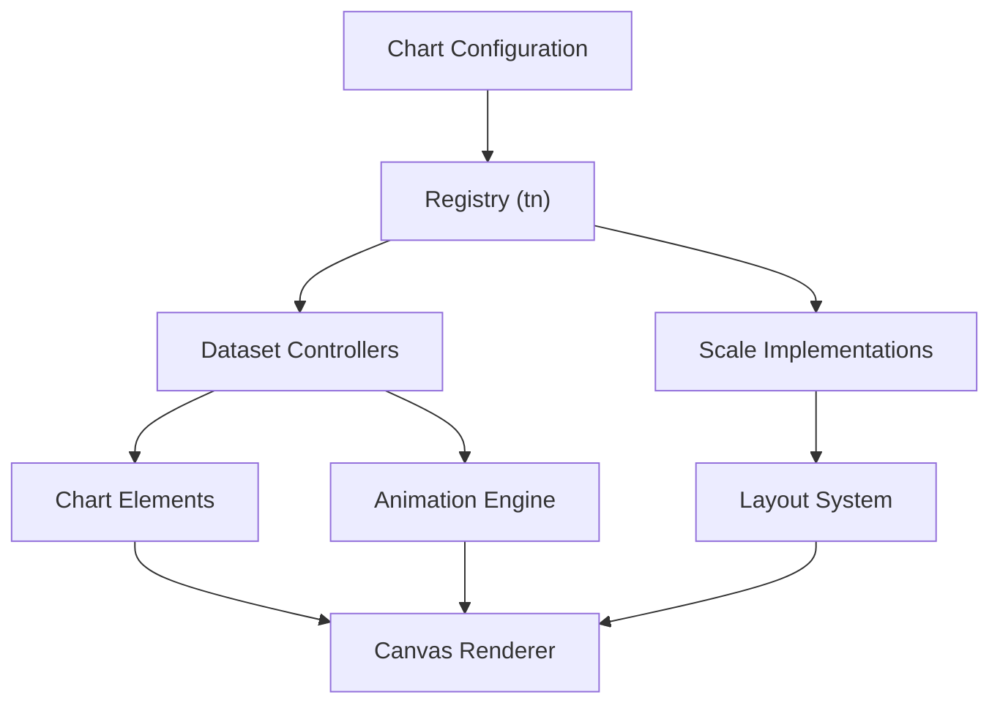
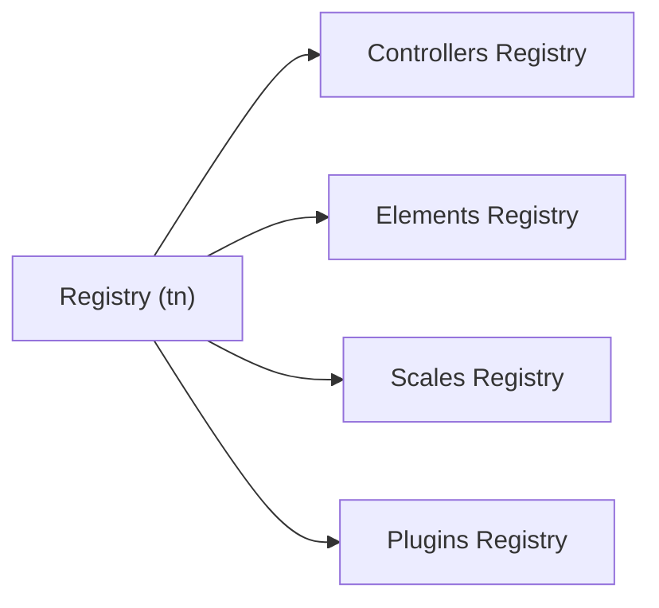
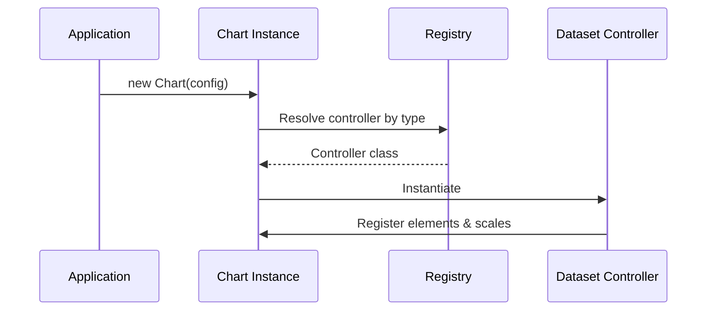
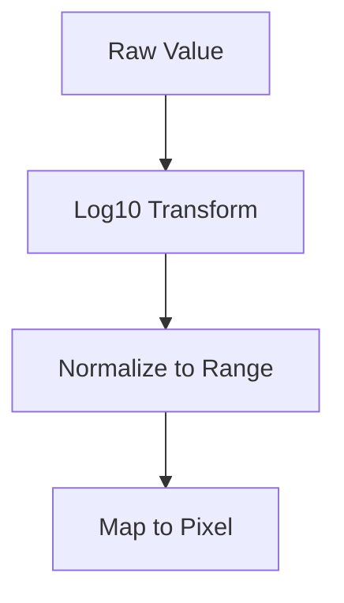
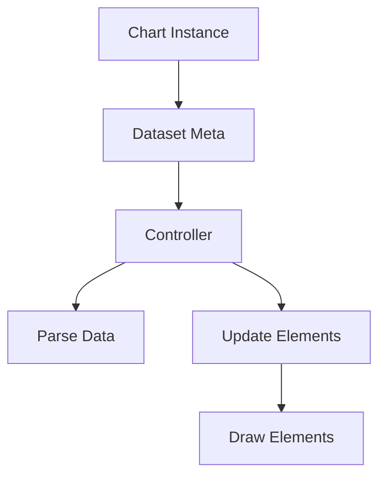
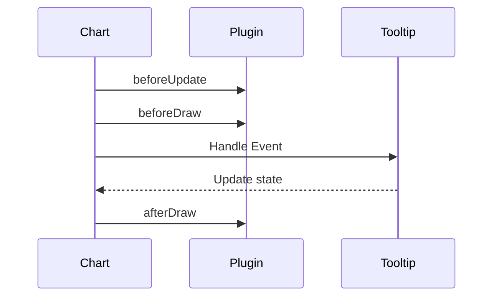
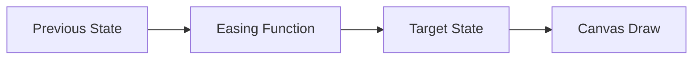
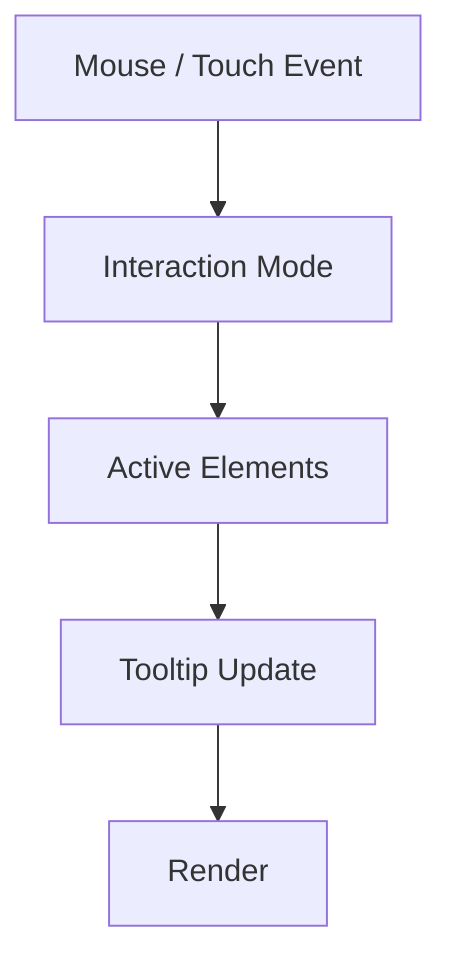
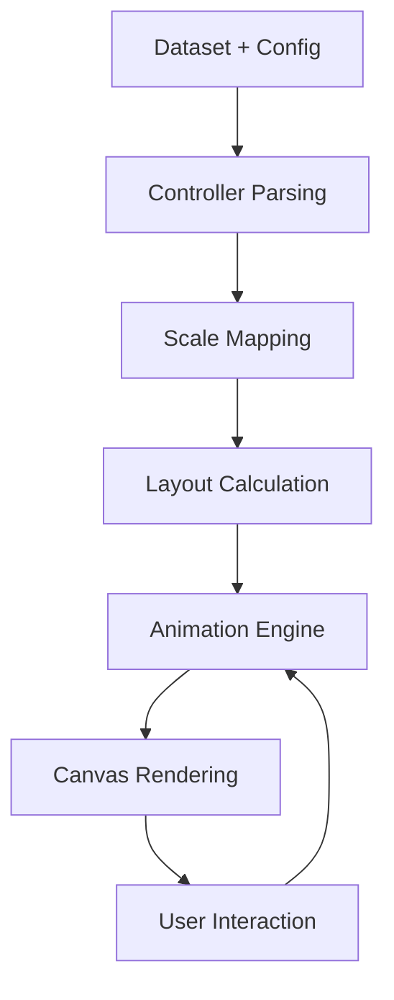

# Chart Advanced Logic

The **Chart Advanced Logic** module encapsulates the high-level orchestration and runtime behavior for advanced Chart.js features within MeshCentral. It is responsible for:

- Chart type registration and lifecycle management
- Controller and scale orchestration
- Tooltip, legend, title, and filler logic integration
- Animation and transition coordination
- Advanced interaction handling and event propagation

This module builds on top of the core Chart.js runtime and integrates tightly with:

- [Chart Advanced Visualization](../chart-advanced-visualization/chart-advanced-visualization.md)
- [Chart Advanced Utilities](../chart-advanced-utilities/chart-advanced-utilities.md)
- [Chart Core Logic](../../chart-core-components/chart-core-logic/chart-core-logic.md)

At runtime, it acts as the coordination layer between chart configuration, datasets, scales, plugins, and rendering.

---

## Core Components

The module is implemented in `public/scripts/charts.js` and exposes the following key components:

- `meshcentral.public.scripts.charts.tn` → **Registry**
- `meshcentral.public.scripts.charts.wo` → **LogarithmicScale** (advanced scale logic)

Together, these components enable advanced registration, scale handling, and dynamic chart behavior.

---

## Architectural Overview

The Chart Advanced Logic module sits between configuration and rendering.



### Responsibilities by Layer

| Layer | Responsibility |
|-------|---------------|
| Registry | Registers controllers, elements, plugins, and scales |
| Controllers | Manage dataset parsing, stacking, drawing logic |
| Scales | Convert data values into pixel coordinates |
| Layout | Compute chart area and box placement |
| Animation | Interpolate state transitions |
| Renderer | Draw elements onto canvas |

---

## Registry (tn)

The **Registry** is the extensibility backbone of the chart system.

### Purpose

It dynamically registers and resolves:

- Dataset controllers
- Chart elements (arc, line, point, bar)
- Scales (linear, logarithmic, time, radial)
- Plugins (tooltip, legend, title, filler)

### Internal Structure



Each registry is type-aware and validates compatibility between chart types and registered components.

### Lifecycle Flow



This enables MeshCentral to support multiple chart types dynamically without hardcoding dependencies.

---

## Logarithmic Scale (wo)

The **LogarithmicScale** provides advanced numeric scaling for exponential data.

### Key Capabilities

- Logarithmic tick generation
- Major/minor tick detection
- Automatic domain normalization
- Pixel ↔ value transformation

### Data-to-Pixel Transformation



### Tick Generation Logic

1. Determine min/max bounds
2. Expand bounds if needed (beginAtZero logic)
3. Compute logarithmic intervals
4. Mark major ticks
5. Convert to renderable tick objects

This allows precise visualization of data spanning multiple magnitudes.

---

## Dataset Controller Integration

Although controllers are defined in the broader charts system, this module coordinates them via the Registry.



Advanced logic responsibilities include:

- Dataset stacking resolution
- Shared option resolution
- Transition handling (reset, resize, active)
- Interaction-based style changes

---

## Plugin & Interaction Orchestration

The module integrates advanced plugins such as:

- Tooltip
- Legend
- Title
- Subtitle
- Filler
- Decimation
- Colors

### Plugin Invocation Flow



Plugins can:

- Cancel rendering phases
- Modify layout
- Override styles
- Provide external rendering hooks

---

## Animation & State Transitions

Animations are coordinated through:

- `Animation`
- `Animations`
- `Animator`

### Animation Pipeline



Features include:

- Property-level animations
- Dataset-level transitions
- Tooltip fade transitions
- Resize-aware recalculation

---

## Event Handling & Active Elements

Advanced interaction logic supports:

- Nearest point detection
- Dataset mode
- Index mode
- Axis filtering



This enables dynamic hover states and contextual tooltips.

---

## Data Flow Summary



The Chart Advanced Logic module ensures all stages remain synchronized.

---

## Integration Within Charts Components

Within the overall hierarchy:

```
charts-components
  └── chart-advanced-components
        └── chart-advanced-logic
```

It complements:

- Visualization-focused rendering logic
- Utility helpers for data and layout
- Core parsing and operations layers

---

## Key Design Principles

1. **Extensibility** – Runtime registration via Registry
2. **Separation of Concerns** – Controllers, Scales, Plugins isolated
3. **Declarative Configuration** – Behavior driven by config objects
4. **Deterministic Rendering Pipeline** – Update → Layout → Draw
5. **Plugin-First Architecture** – Hooks at every stage

---

## Conclusion

The **Chart Advanced Logic** module is the orchestration layer that transforms configuration and data into interactive, animated, and extensible chart visualizations.

By combining registry-driven extensibility, advanced scale logic, plugin coordination, and animation management, it provides the runtime intelligence behind MeshCentral's advanced charting capabilities.