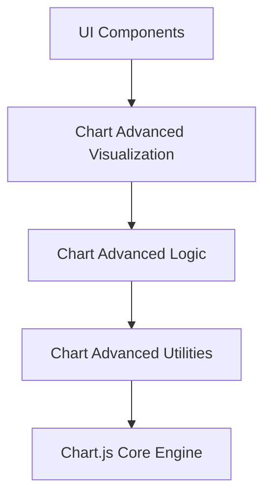
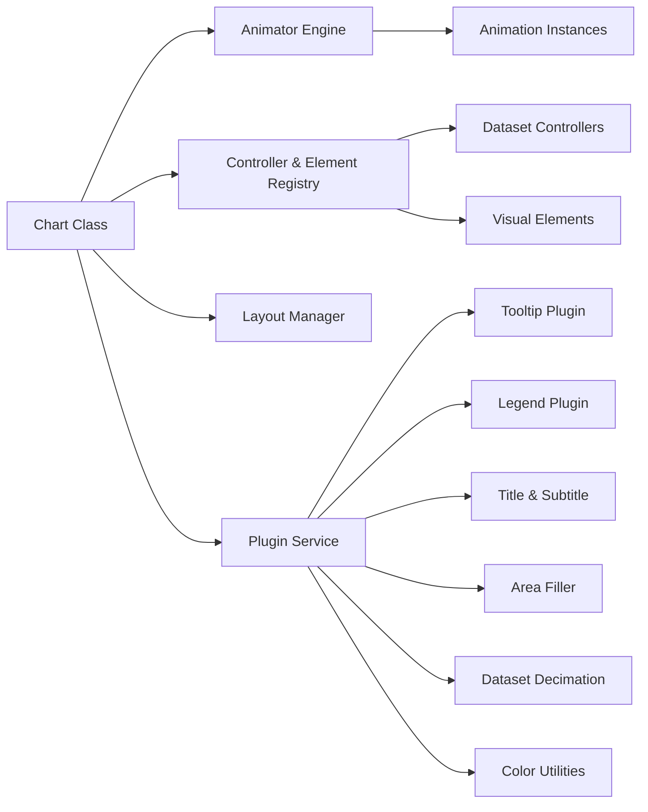
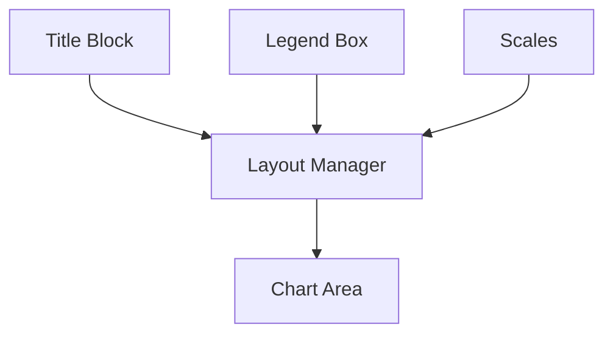
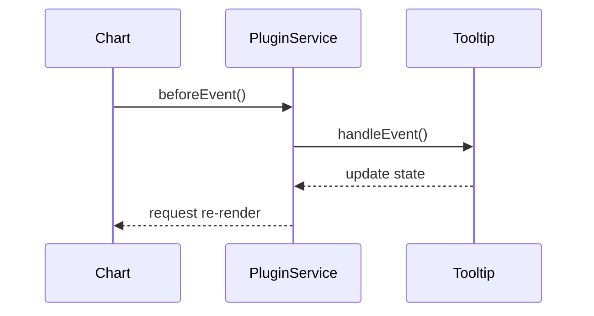
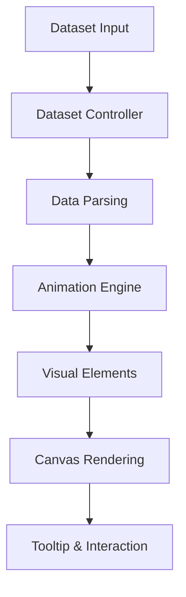
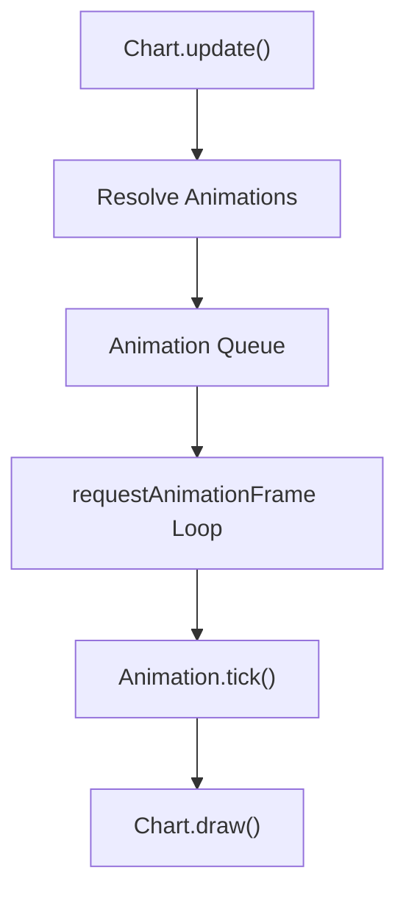
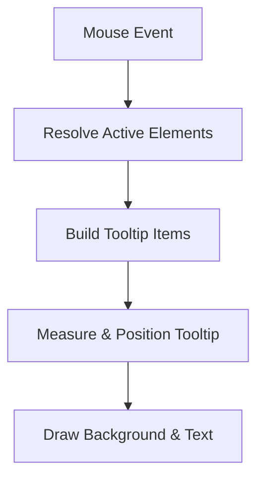

# Chart Advanced Utilities

The **Chart Advanced Utilities** module provides high-level utility logic that enhances advanced chart rendering and behavior within the Charts Components subsystem. Built on top of Chart.js v4.3.3, this module exposes advanced helper functionality used by complex visualizations, animation orchestration, interaction handling, and plugin-level extensions.

It acts as a refinement layer above core and advanced chart logic, enabling:

- Advanced animation orchestration
- Plugin lifecycle coordination
- Layout and rendering utilities
- Tooltip, legend, and title extensions
- Dataset decimation and color utilities

This module is part of the **Chart Advanced Components** layer and works closely with:

- [Chart Advanced Visualization](../chart-advanced-visualization/chart-advanced-visualization.md)
- [Chart Advanced Logic](../chart-advanced-logic/chart-advanced-logic.md)

---

## Core Components

The module is primarily composed of two bundled Chart.js exports:

- `meshcentral.public.scripts.charts.ws`
- `meshcentral.public.scripts.charts.ya`

These correspond to the bundled UMD build of Chart.js and expose:

- Core `Chart` class
- Animation engine
- Scale system
- Controller registry
- Plugin system
- Layout manager
- Rendering primitives

---

## Architectural Position

The Chart Advanced Utilities module sits directly above the Chart.js engine and provides reusable orchestration logic consumed by advanced visualization and logic modules.

---

## Internal Architecture Overview

### Key Subsystems

#### 1. Animation Engine

- `Animation` and `Animations` classes
- Central animator singleton
- Easing functions and interpolation helpers
- Property-level animation orchestration

This enables smooth transitions for:

- Dataset updates
- Tooltip movement
- Axis range changes
- Layout resizing

---

#### 2. Registry System

The registry dynamically manages:

- Dataset controllers (Bar, Line, Scatter, Doughnut, etc.)
- Visual elements (Arc, Line, Point, Bar)
- Scales (Linear, Logarithmic, Time, Radial)
- Plugins

This allows runtime extension and custom chart type registration.

---

#### 3. Layout and Box Model

The layout system coordinates:

- Legend placement
- Title and subtitle blocks
- Axis sizing
- Chart area calculation

---

#### 4. Plugin Lifecycle

The plugin service provides hook-based extension points:

- `beforeInit`
- `beforeUpdate`
- `afterDraw`
- `afterEvent`
- `beforeDatasetDraw`
- `afterTooltipDraw`

Plugins included in this module:

- **Tooltip**
- **Legend**
- **Title**
- **Subtitle**
- **Filler** (area fills)
- **Decimation** (data reduction)
- **Colors** (automatic color assignment)

---

## Data Flow Through Utilities

Utilities enhance:

- Parsing normalization
- Stacking logic
- Coordinate transformation
- Hover state resolution
- Interaction mode evaluation

---

## Interaction and Hit Detection

Advanced utilities provide:

- Nearest-point detection
- Index-based selection
- Dataset-level interaction modes
- Radial and Cartesian hit testing

These interaction modes are used by higher-level modules to enable:

- Hover highlighting
- Click-driven filtering
- Dynamic tooltip positioning

---

## Animation Orchestration Flow

The animator singleton ensures coordinated multi-property animation with proper easing and cancellation support.

---

## Tooltip Rendering Lifecycle

Advanced utilities manage:

- Smart alignment (`xAlign`, `yAlign`)
- Caret placement
- Label color extraction
- Text measurement and wrapping

---

## Dataset Decimation

For large datasets, the Decimation plugin supports:

- Min/Max sampling
- LTTB (Largest Triangle Three Buckets)

This reduces rendering cost while preserving visual fidelity.

---

## Responsibilities Within the System

The Chart Advanced Utilities module is responsible for:

- Providing the runtime chart engine
- Managing rendering lifecycle
- Orchestrating animations
- Coordinating plugins
- Supporting interaction logic
- Optimizing performance via decimation

It does **not** define application-specific chart configurations — those belong to:

- [Chart Advanced Logic](../chart-advanced-logic/chart-advanced-logic.md)
- [Chart Advanced Visualization](../chart-advanced-visualization/chart-advanced-visualization.md)

---

## Summary

The **Chart Advanced Utilities** module is the execution backbone of advanced charting within the MeshCentral UI layer. It wraps and exposes the full Chart.js engine, augmented with plugin orchestration, animation management, and performance utilities.

Higher-level modules depend on it for:

- Declarative chart configuration
- Dynamic data updates
- Interactive visual behavior
- Optimized large dataset rendering

Without this layer, advanced chart components would lack animation control, plugin extensibility, and coordinated layout behavior.