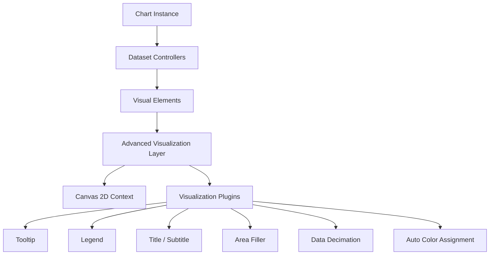
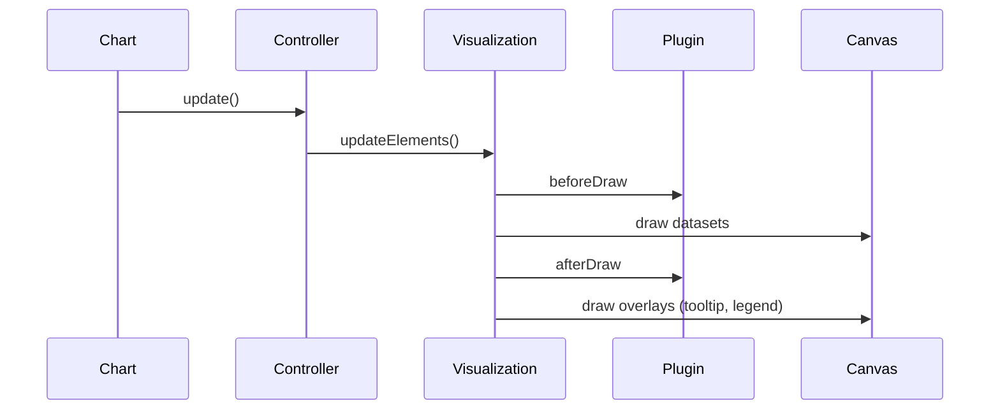
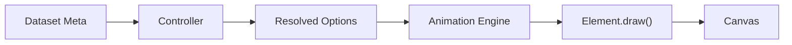
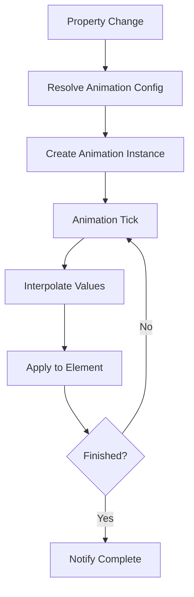
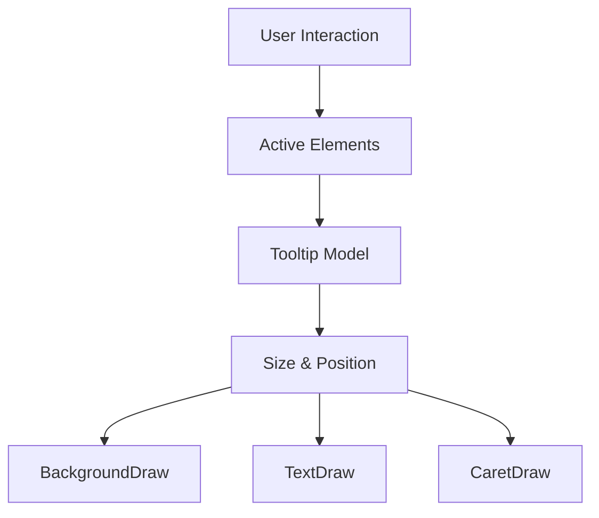
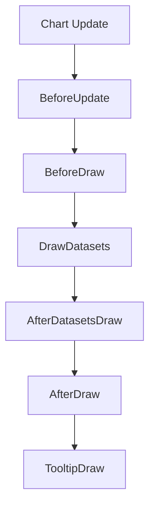
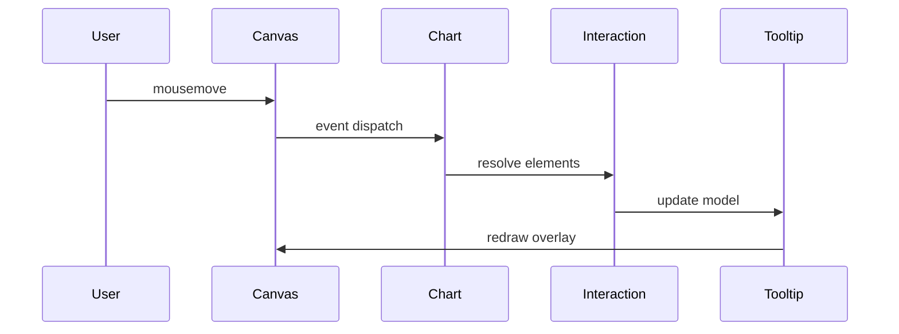

# Chart Advanced Visualization

The **Chart Advanced Visualization** module provides the high-level rendering layer for advanced chart behaviors in MeshCentral’s UI. Built on top of Chart.js v4, it is responsible for:

- Advanced dataset rendering (line, arc, segment-aware drawing)
- Tooltip and interaction visualization
- Plugin-driven enhancements (colors, decimation, filler, legend, title)
- Animation orchestration and visual transitions
- Integration with scale and layout systems

This module acts as the visual execution layer of the advanced chart stack, sitting above chart logic and utilities and directly interacting with controllers, elements, scales, and plugins.

---

## Position in the Module Hierarchy

Chart Advanced Visualization is part of the advanced chart subsystem:

- Parent: charts-components → chart-advanced-components
- Siblings:
  - [Chart Advanced Logic](../chart-advanced-logic/chart-advanced-logic.md)
  - [Chart Advanced Utilities](../chart-advanced-utilities/chart-advanced-utilities.md)

This module focuses purely on **rendering and visual orchestration**, while logic and utilities handle computations and shared helpers.

---

## Core Components

From `public/scripts/charts.js` (Chart.js v4.3.3 UMD bundle), this module includes:

- `meshcentral.public.scripts.charts.rs`
- `meshcentral.public.scripts.charts.sn`
- `meshcentral.public.scripts.charts.so`

Conceptually, these correspond to:

- **Platform abstraction layer** (DOM / basic rendering platform)
- **Plugin orchestration system**
- **Line and visual element rendering engine**

---

# Architectural Overview

## High-Level Rendering Architecture



### Responsibilities

| Layer | Responsibility |
|--------|----------------|
| Dataset Controllers | Parse and prepare data |
| Elements | Represent drawable units (line, arc, bar, point) |
| Advanced Visualization | Execute draw routines and animations |
| Plugins | Extend visual behavior |
| Canvas Context | Final rendering target |

---

# Rendering Pipeline

The module executes a deterministic rendering pipeline per frame.



### Phases

1. **Data Parsing** – Controllers normalize data.
2. **Layout Resolution** – Scales and layout boxes positioned.
3. **Element Update** – Geometry calculated.
4. **Animation Resolution** – Interpolated values applied.
5. **Dataset Draw** – Elements rendered.
6. **Overlay Draw** – Tooltip, legend, titles.

---

# Visual Element System

The module renders multiple element types:

- Line elements (segment-aware drawing)
- Arc elements (pie/doughnut)
- Bar elements
- Point elements
- Radial line elements

## Element Rendering Flow



### Key Features

- Scriptable and indexable options
- Segment-based line interpolation
- Border radius handling
- Pixel alignment for crisp rendering
- Dynamic style resolution per data point

---

# Animation Engine

Animations are managed via:

- `Animation` (property-level animation)
- `Animations` (animation collection per element)
- Global animator scheduler

## Animation Lifecycle



### Supported Animations

- Numeric interpolation
- Color blending
- Easing functions
- Looping transitions
- Hover state transitions

---

# Tooltip Visualization System

The tooltip component is a fully integrated visualization element.

## Tooltip Architecture



### Capabilities

- Dynamic positioning (average, nearest)
- Caret alignment logic
- Multi-line content support
- Scriptable callbacks
- Animation support (opacity, position)

---

# Plugin Integration

The module integrates multiple built-in plugins.

| Plugin | Purpose |
|--------|----------|
| Colors | Auto-assign dataset colors |
| Decimation | Reduce dataset points for performance |
| Filler | Area fill between lines |
| Legend | Interactive dataset toggling |
| Title / Subtitle | Chart heading rendering |
| Tooltip | Interactive data inspection |

## Plugin Hook Flow



Plugins may:

- Modify layout
- Alter drawing order
- Inject animations
- Modify element styling
- Cancel rendering steps

---

# Scale and Layout Interaction

The visualization layer relies heavily on scale abstractions:

- Linear
- Logarithmic
- Time
- Category
- Radial

Scales convert:

```text
Data Value → Decimal Position → Pixel Position
```

Layout engine responsibilities:

- Reserve space for legend and titles
- Compute chart area bounds
- Adjust padding
- Handle responsive resizing

---

# Performance Optimizations

## 1. Data Decimation

Reduces rendering cost for large datasets.

Algorithms:
- LTTB (Largest Triangle Three Buckets)
- Min–Max sampling

## 2. Segment Rendering

Only visible line segments are drawn.

## 3. Animation Batching

Global animator avoids redundant frame scheduling.

## 4. Cached Style Resolution

Option resolution cached where safe.

---

# Event Handling and Interaction

The visualization layer supports interaction modes:

- `nearest`
- `index`
- `dataset`
- `point`
- `x` / `y` axis modes

## Interaction Flow



---

# Responsibilities vs. Sibling Modules

| Module | Responsibility |
|----------|----------------|
| Chart Advanced Visualization | Rendering, animation, visual orchestration |
| Chart Advanced Logic | Data computation and control logic |
| Chart Advanced Utilities | Shared helpers and infrastructure |

This separation ensures:

- Clean rendering abstraction
- Testable logic layer
- Extensible plugin ecosystem

---

# Summary

The **Chart Advanced Visualization** module is the visual engine powering MeshCentral’s advanced charts. It:

- Orchestrates controllers and elements
- Manages animations and transitions
- Integrates interactive tooltips and legends
- Supports multiple scale types
- Enables plugin-based extensibility
- Optimizes rendering performance

It forms the final execution layer between processed chart data and the HTML5 Canvas drawing context, ensuring responsive, animated, and interactive data visualization.