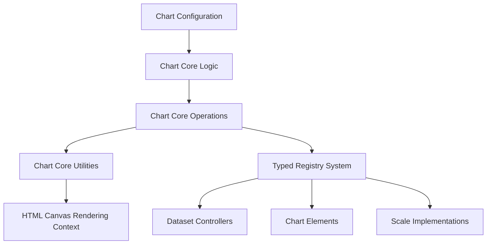
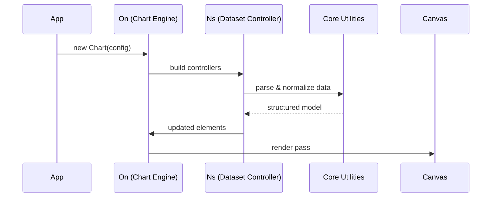
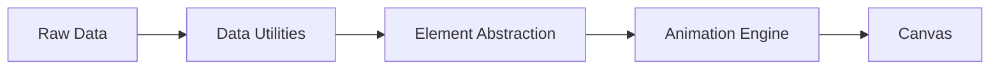
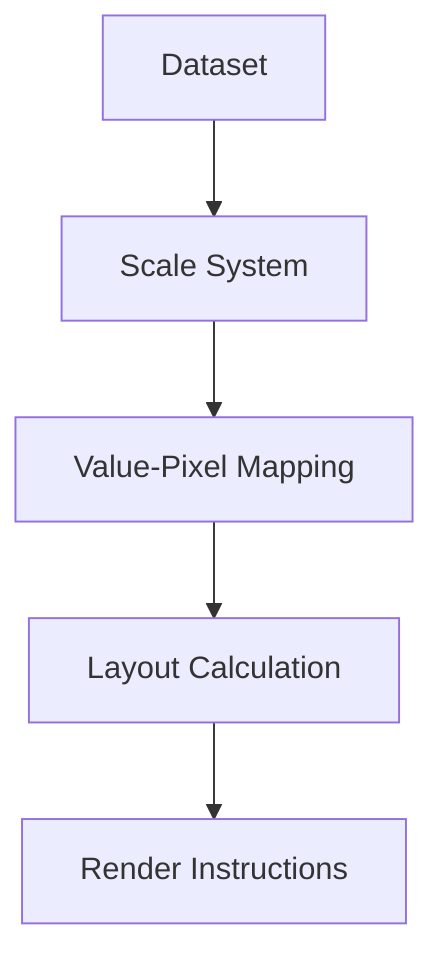
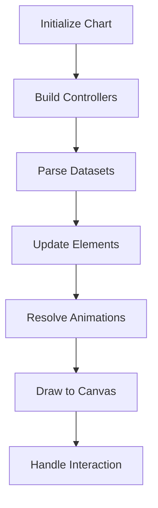
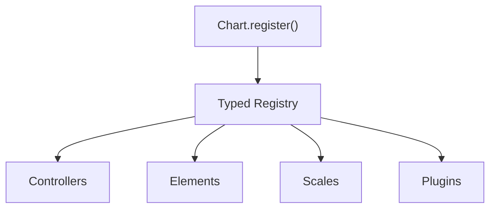
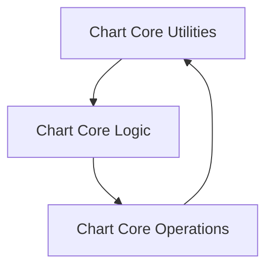

# Chart Core Components

The **Chart Core Components** module forms the foundational layer of the charting system within the MeshCentral frontend. It defines the structural primitives, base controllers, animation engines, and registry mechanisms required to render interactive charts using a canvas-based pipeline.

This module lives under:

```text
public/scripts/
└── charts/
    └── chart-core-components/
```

It acts as the architectural bridge between:

- Low-level utilities (geometry, animation, tooltips)
- Runtime orchestration (chart lifecycle and rendering engine)
- Dataset execution and operational flow

---

## 1. Purpose of the Module

The **Chart Core Components** module provides:

- Core element abstractions
- Dataset controllers
- Chart engine runtime
- Scale implementations
- Animation orchestration
- Typed registration system
- Tooltip and interaction systems

It ensures:

- Clean separation of concerns
- Deterministic rendering lifecycle
- Extensibility via registry
- High-performance animation handling
- Modular chart type integration

---

## 2. High-Level Architecture



### Layer Responsibilities

| Layer | Responsibility |
|--------|---------------|
| Chart Core Utilities | Data normalization, element abstraction, animation primitives |
| Chart Core Logic | Scale computation, lifecycle coordination |
| Chart Core Operations | Runtime execution, dataset control, rendering pipeline |
| Registry | Extensibility and component registration |
| Canvas | Final rendering output |

---

## 3. Repository Structure

```text
public/scripts/charts/chart-core-components/
├── chart-core-utilities/
├── chart-core-logic/
└── chart-core-operations/
```

### Core Component Groups

#### Chart Core Utilities
- `Cs` – Animation Engine  
- `Fa` – Tooltip Engine  
- `Hn` – Radial Data Utilities  
- `Hs` – Base Element Abstraction  

Documentation:  
`chart-core-utilities/chart-core-utilities.md`

---

#### Chart Core Logic
- `Js` – Base Scale  
- `Ln` – Date Adapter Abstraction  
- `Lo` – Radial Linear Scale  

Documentation:  
`chart-core-logic/chart-core-logic.md`

---

#### Chart Core Operations
- `Ns` – Base Dataset Controller  
- `On` – Chart Engine  
- `Os` – Animation Resolver  
- `Qs` – Typed Registry  

Documentation:  
`chart-core-operations/chart-core-operations.md`

---

## 4. Internal Execution Flow

The module follows a layered execution model from configuration to rendering:



---

## 5. Component Architecture Overview

### 5.1 Utilities Layer

Provides:

- Element abstraction (`Hs`)
- Radial geometry processing (`Hn`)
- Property-based animation (`Cs`)
- Tooltip rendering (`Fa`)



---

### 5.2 Logic Layer

Responsible for structural orchestration:

- Tick generation
- Pixel/value mapping
- Layout fitting
- Scale rendering
- Time abstraction



---

### 5.3 Operations Layer

Controls runtime execution:

- Dataset lifecycle
- Animation scheduling
- Rendering passes
- Plugin coordination
- Event handling



---

## 6. Extensibility Model

The **Typed Registry (Qs)** enables modular extension of:

- Chart types
- Elements
- Scales
- Plugins



This ensures new chart types can be added without modifying the core runtime.

---

## 7. Rendering Pipeline Summary


The rendering pipeline guarantees:

- Deterministic layout
- Smooth transitions
- Stack-aware datasets
- Efficient redraw cycles

---

## 8. Relationship Between Submodules



- **Utilities** provide math, geometry, and animation primitives.
- **Logic** defines scale behavior and lifecycle coordination.
- **Operations** executes the runtime update and rendering cycle.

Together, they form a cohesive, modular chart framework.

---

## 9. Design Principles

The Chart Core Components module follows:

- Strict separation of data and rendering
- Animation-first update model
- Canvas-based high-performance drawing
- Registry-driven extensibility
- Deterministic lifecycle management
- Interaction-aware rendering state

---

## 10. Summary

The **Chart Core Components** module is the architectural backbone of the MeshCentral charting system.

It provides:

- Core element abstractions (`Hs`)
- Data utilities and radial computation (`Hn`)
- Animation engine (`Cs`)
- Tooltip system (`Fa`)
- Scale system (`Js`, `Lo`)
- Chart runtime engine (`On`)
- Dataset controllers (`Ns`)
- Animation resolver (`Os`)
- Typed registry (`Qs`)

By separating utilities, logic, and operations into clear layers, it delivers:

- Modular design  
- High performance  
- Smooth animations  
- Extensibility  
- Predictable rendering lifecycle  

This module enables the MeshCentral frontend to render robust, interactive, and extensible chart visualizations with a clean and maintainable internal architecture.