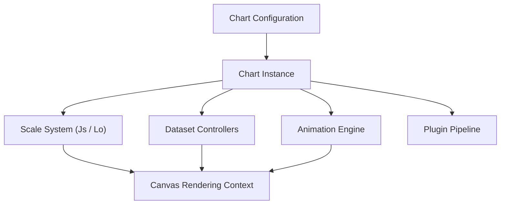
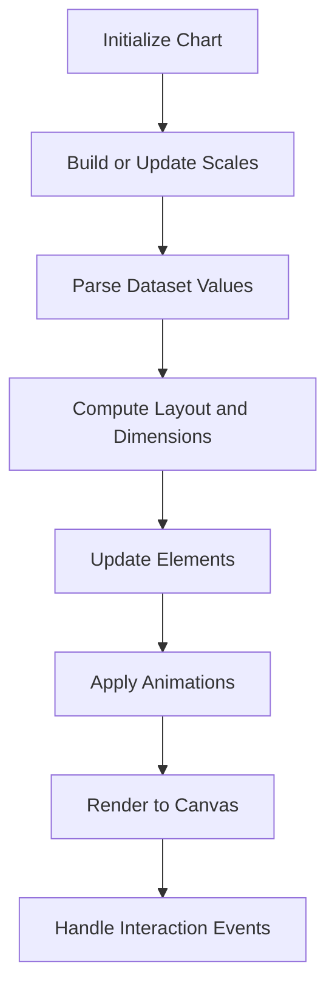
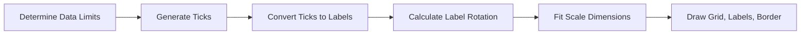
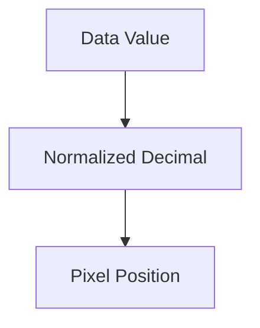
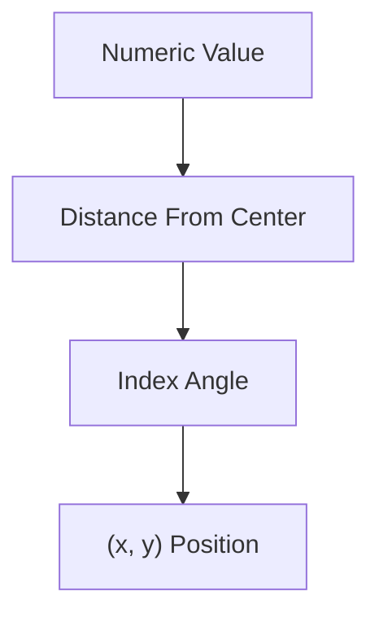
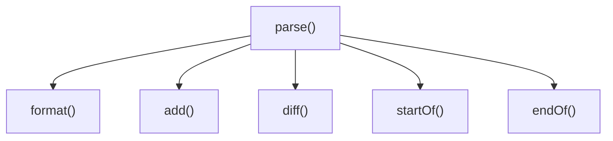
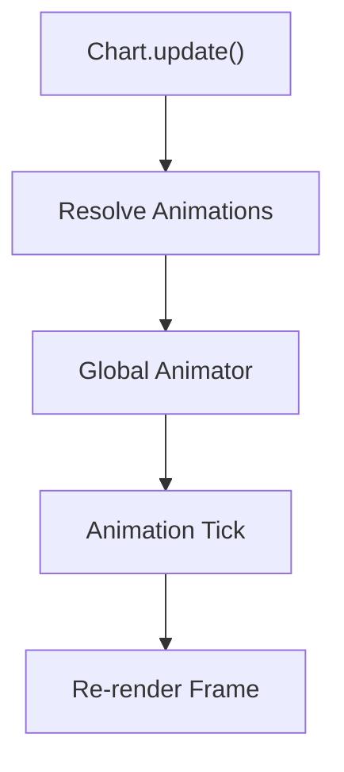
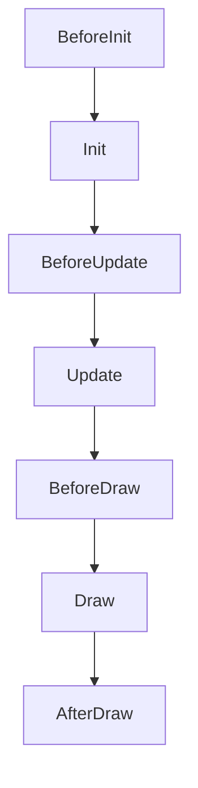
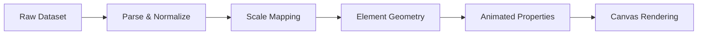
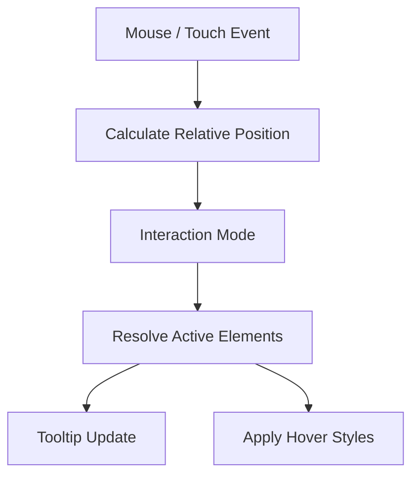

# Chart Core Logic

The **Chart Core Logic** module encapsulates the foundational runtime behavior of Chart.js within the MeshCentral frontend. It is responsible for:

- Chart lifecycle management
- Scale and coordinate calculations
- Dataset parsing and normalization
- Animation orchestration
- Plugin coordination
- Rendering pipeline control

This module builds on the Chart Core Components layer and provides the execution engine that transforms configuration and datasets into rendered visualizations.

---

## Core Components

The Chart Core Logic module is primarily composed of:

- `meshcentral.public.scripts.charts.Js` — Base Scale implementation
- `meshcentral.public.scripts.charts.Ln` — Date Adapter abstraction
- `meshcentral.public.scripts.charts.Lo` — Radial Linear Scale implementation

Together, these components implement axis computation, time abstraction, radial geometry handling, and scale rendering behavior.

---

# Architectural Overview

The Chart Core Logic module sits between configuration parsing and visual rendering. It coordinates scales, datasets, animations, and plugins.

---

# Chart Lifecycle Flow

The lifecycle defines how charts are initialized, updated, and rendered.

Key responsibilities of Chart Core Logic during lifecycle:

- Ensures scale ranges are valid
- Calculates pixel-to-value mapping
- Applies stacking logic
- Synchronizes animations
- Delegates drawing to elements

---

# Scale System (Js)

`Js` is the base class for all scales. It defines:

- Tick generation
- Axis bounds calculation
- Pixel/value transformations
- Grid line rendering
- Label formatting

## Scale Rendering Structure

### Core Responsibilities

1. **Determine Data Limits**
   - Aggregates dataset min/max values
   - Applies user overrides
   - Applies stacking rules

2. **Tick Generation**
   - Numeric, logarithmic, or time-based ticks
   - Auto-skipping logic
   - Major/minor tick detection

3. **Coordinate Mapping**

Mapping functions:

- `getPixelForValue()`
- `getValueForPixel()`
- `getDecimalForPixel()`

---

# Radial Linear Scale (Lo)

`Lo` extends the base scale to support radar and polar area charts.

## Radial Geometry Flow

### Key Features

- Circular grid rendering
- Angle-based point positioning
- Radial distance computation
- Point label layout correction
- Polar coordinate transformations

Radial scales introduce:

- `getPointPosition()`
- `getDistanceFromCenterForValue()`
- `getValueForDistanceFromCenter()`

---

# Date Adapter Abstraction (Ln)

`Ln` defines the interface for time handling. It allows Chart.js to operate independently from any specific date library.

## Adapter Interface Responsibilities

Concrete adapters must implement:

- Parsing timestamps
- Formatting display values
- Time arithmetic
- Unit rounding

This abstraction enables the Time Scale to support multiple backends without modifying core logic.

---

# Animation Integration

Chart Core Logic integrates tightly with the animation subsystem.

Responsibilities include:

- Property interpolation
- Duration and easing management
- Transition states (show, hide, resize)
- Shared animation caching

---

# Plugin Coordination

The Chart instance orchestrates plugins during lifecycle phases.

The core logic:

- Registers plugins
- Notifies lifecycle hooks
- Supports cancellation of phases
- Manages plugin-scoped options

---

# Data Flow Summary

---

# Interaction Handling

Chart Core Logic evaluates pointer events and resolves interaction modes.

Supported interaction modes include:

- Nearest
- Index
- Dataset
- X / Y axis matching

---

# Performance Considerations

Chart Core Logic incorporates several optimization strategies:

- Tick auto-skipping
- Decimation support (via plugin)
- Shared option caching
- Lazy scale computation
- Animation batching

These mechanisms ensure performance remains stable even with large datasets.

---

# How Chart Core Logic Fits into the System

Within the MeshCentral UI:

- Chart Core Components define base rendering primitives.
- Chart Core Logic orchestrates execution and lifecycle.
- Chart Core Operations manage higher-level chart behaviors.
- Chart Advanced Components extend functionality.

Chart Core Logic is the execution backbone that connects configuration, data, geometry, and rendering into a unified charting pipeline.

---

# Summary

The **Chart Core Logic** module provides:

- The chart lifecycle engine
- Scale computation and layout control
- Dataset parsing and normalization
- Animation orchestration
- Plugin lifecycle management
- Interaction resolution

It is the runtime brain of the charting system, transforming configuration and datasets into fully interactive visualizations rendered on the canvas.
