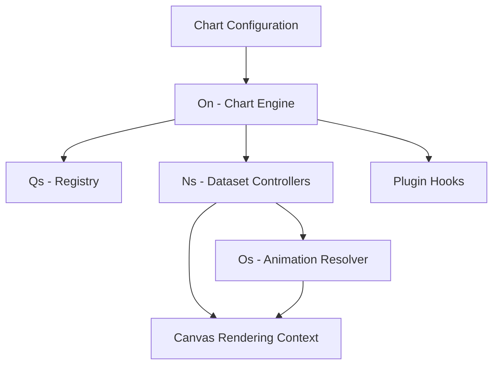
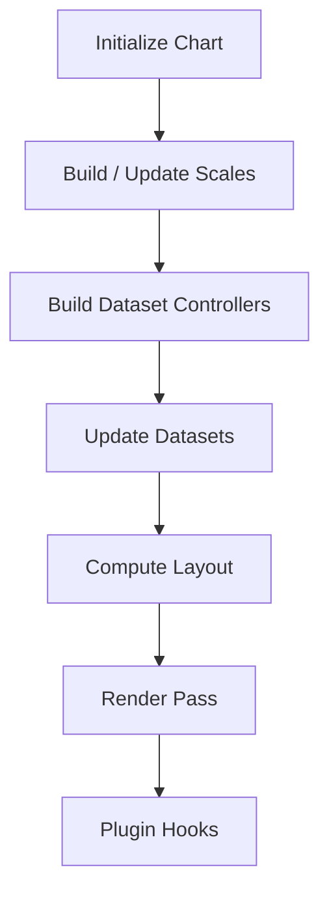
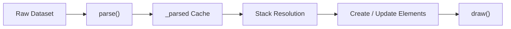
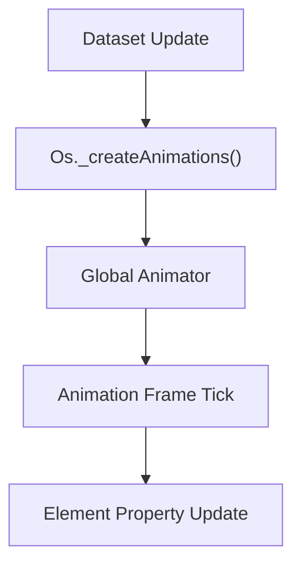
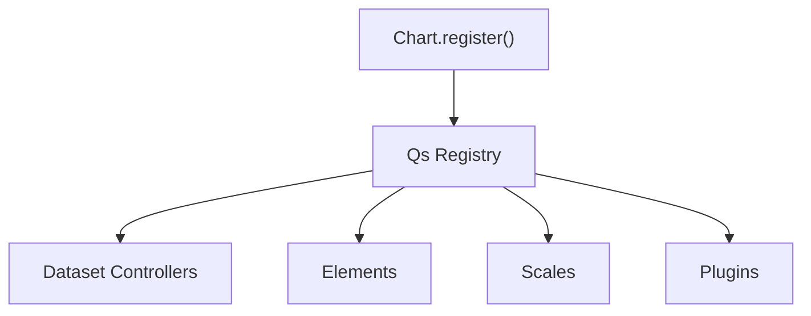
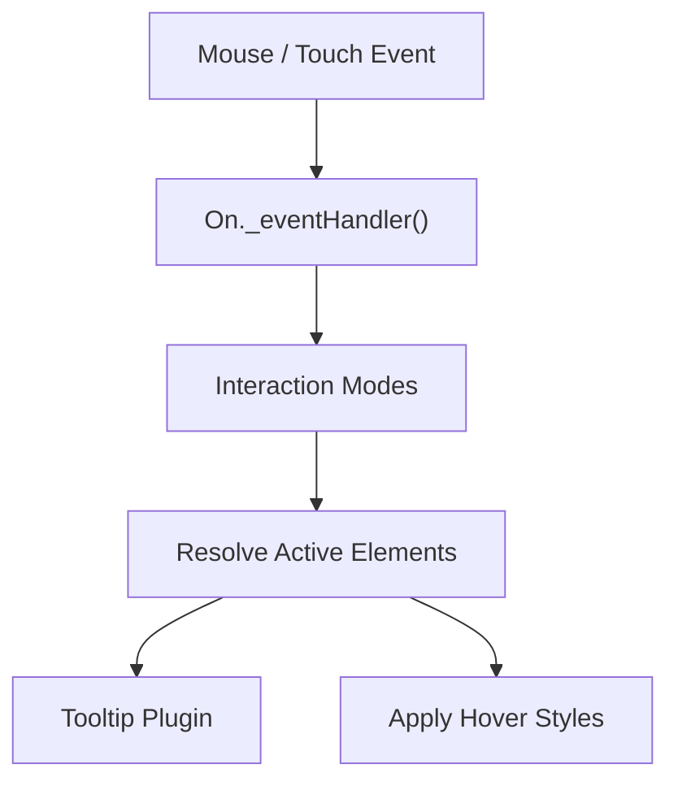
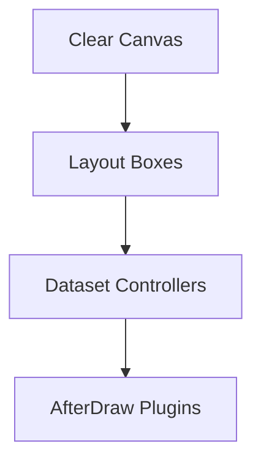

# Chart Core Operations

The **Chart Core Operations** module is responsible for the runtime execution layer of the Chart.js integration within MeshCentral. It orchestrates dataset lifecycle management, element updates, rendering passes, interaction handling, animations, and plugin coordination.

While lower-level math, utilities, and structural logic are defined in:

- [Chart Core Utilities](../chart-core-utilities/chart-core-utilities.md)
- [Chart Core Logic](../chart-core-logic/chart-core-logic.md)

this module executes the chart pipeline end-to-end through the following core components:

- `Ns` → Base Dataset Controller  
- `On` → Chart Engine (main orchestrator)  
- `Os` → Animation Resolver  
- `Qs` → Typed Registry System  

Together, these components form the operational backbone of chart rendering.

---

## 1. Architectural Overview

At runtime, Chart Core Operations sits between configuration/state and canvas rendering.

### Responsibilities

| Component | Responsibility |
|------------|---------------|
| On | Global lifecycle, layout, update loop, event routing |
| Ns | Dataset parsing, stacking, element updates |
| Os | Animation scheduling and property transitions |
| Qs | Registration and resolution of controllers, elements, scales, plugins |

---

## 2. The Chart Engine (On)

`On` is the top-level chart runtime. It:

- Acquires rendering context
- Builds scales and controllers
- Manages layout boxes
- Handles events
- Executes update + render cycle
- Coordinates plugins

### Lifecycle Flow

### Key Responsibilities

- Tracks active elements
- Maintains `_metasets` per dataset
- Performs hit detection
- Handles responsive resizing
- Executes animation frames via animator

`On` delegates dataset-specific behavior to `Ns` instances.

---

## 3. Dataset Controller (Ns)

`Ns` is the abstract dataset controller used by all chart types (line, bar, pie, etc.).

It manages:

- Parsing raw data
- Stacking logic
- Element instantiation
- Element updates
- Style resolution
- Hover state handling

### Dataset Processing Pipeline

### Important Behaviors

- Maintains `_cachedMeta`
- Supports shared options for performance
- Integrates with animation resolver
- Applies stacking via `applyStack()`
- Calculates min/max for scales

`Ns` does not render directly; it updates drawable elements.

---

## 4. Animation Resolver (Os)

`Os` manages animation configuration and property interpolation.

It:

- Reads animation definitions from options
- Creates `Cs` animation objects
- Schedules updates via the animator
- Supports property-based animations

### Animation Flow

Animations may target:

- Position (x, y)
- Dimensions (width, height)
- Radius
- Opacity
- Angles (arc charts)

If animations are disabled, updates apply instantly.

---

## 5. Registry System (Qs)

`Qs` is the typed registry system responsible for:

- Registering controllers
- Registering elements
- Registering scales
- Registering plugins

### Registration Model

This allows modular extension of the chart system without modifying core logic.

---

## 6. Interaction and Event Handling

Chart Core Operations also coordinates interaction modes such as:

- Nearest
- Index
- Dataset
- X/Y axis matching

### Event Handling Flow

The engine computes active elements and updates styling or tooltips accordingly.

---

## 7. Rendering Pipeline

The rendering pipeline is layered:

Each dataset controller draws its elements in reverse z-order to ensure proper stacking.

---

## 8. Relationship to Other Chart Core Modules

Chart Core Operations depends on:

- [Chart Core Utilities](../chart-core-utilities/chart-core-utilities.md) for math, geometry, and helpers
- [Chart Core Logic](../chart-core-logic/chart-core-logic.md) for structural configuration and scale behavior

This module focuses purely on **runtime orchestration and execution**, not low-level math.

---

## 9. Operational Responsibilities Summary

| Domain | Responsibility |
|---------|---------------|
| Lifecycle | Initialization, resize, update, destroy |
| Data | Parsing, stacking, normalization |
| Rendering | Element updates, canvas drawing |
| Animation | Property interpolation, timing |
| Interaction | Hover detection, tooltips |
| Extensibility | Registry + plugin system |

---

## 10. Conclusion

The **Chart Core Operations** module is the execution engine of the chart system. It transforms configuration and datasets into animated, interactive visualizations by coordinating:

- Controllers (`Ns`)
- The chart runtime (`On`)
- Animations (`Os`)
- Registries (`Qs`)

It is the operational layer that binds together utilities, logic, rendering, and extensibility into a cohesive runtime chart framework.