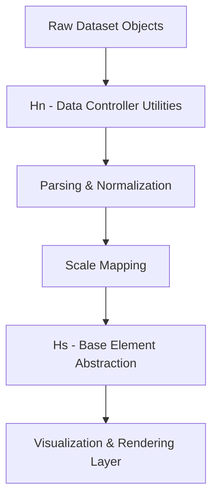
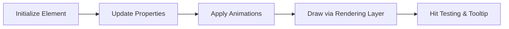
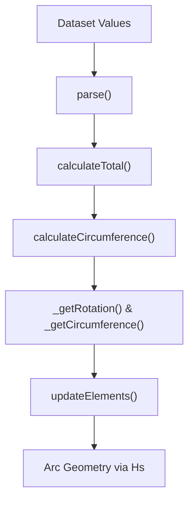
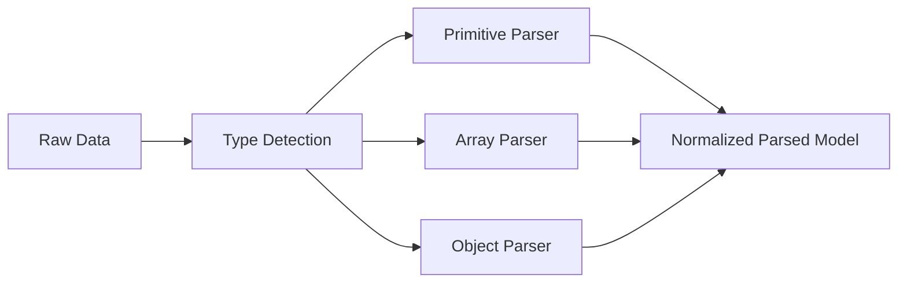
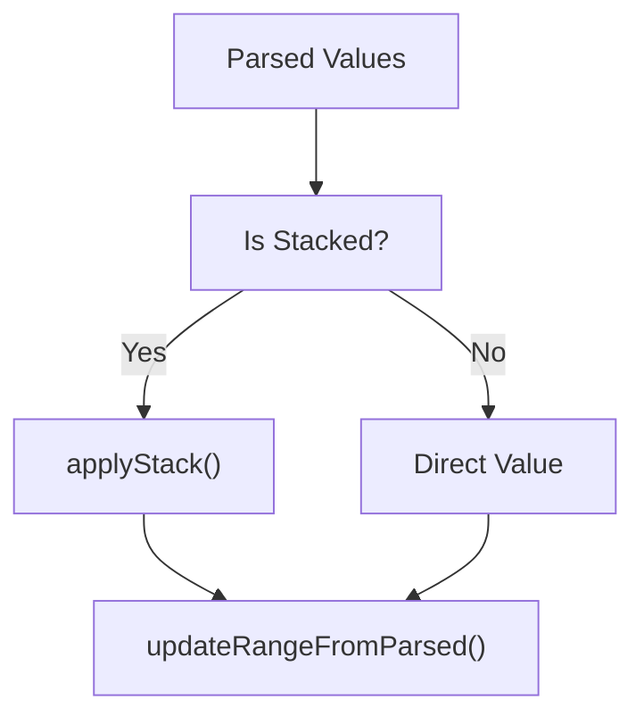
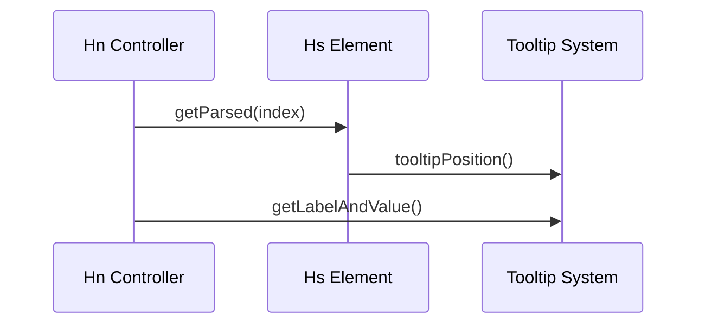
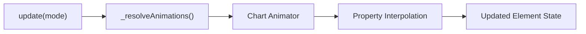
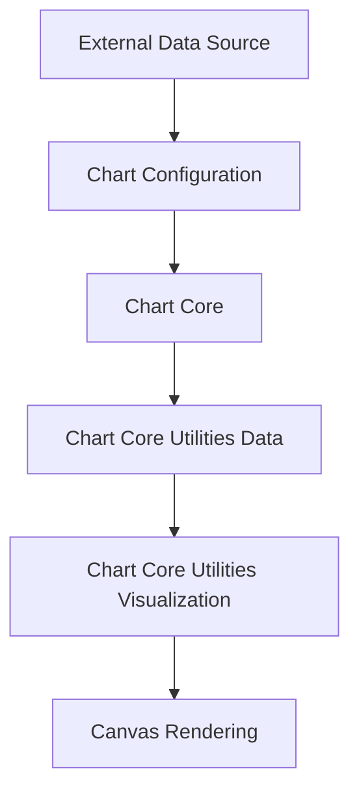

# Chart Core Utilities Data

The **Chart Core Utilities Data** module provides the foundational data processing, normalization, parsing, and transformation logic that powers Chart.js within MeshCentral. It focuses on preparing raw datasets for rendering by controllers, scales, and visualization layers.

This module is built around two core components from `meshcentral.public.scripts.charts`:

- `Hn` – Doughnut/Pie-style data controller utilities
- `Hs` – Base element abstraction for chart primitives

Together, they form the backbone for dataset parsing, value normalization, geometry computation, and interaction metadata used by higher-level chart components.

---

## Position in the Chart Architecture

Chart Core Utilities Data sits beneath rendering and visualization layers, and above raw dataset input. It bridges:

- Raw dataset objects
- Scale calculations
- Geometry elements (arcs, bars, points, lines)

See also:

- Parent module: [Chart Core Utilities](../chart-core-utilities.md)
- Sibling module: [Chart Core Utilities Visualization](../chart-core-utilities-visualization/chart-core-utilities-visualization.md)

---

## High-Level Architecture



**Key Responsibilities:**

- Parse primitive, array, and object datasets
- Normalize stacked and segmented data
- Compute angular and radial values for circular charts
- Generate geometry primitives via base elements
- Provide interaction metadata (labels, tooltips, visibility)

---

## Core Component: Hs (Base Element Abstraction)

`Hs` is the abstract base class for all chart elements (arcs, bars, points, lines). It defines:

### Responsibilities

- Common element properties (`x`, `y`, `options`, `active`)
- Animation state management
- Tooltip positioning
- Value validation (`hasValue()`)
- Property interpolation (`getProps()`)

### Element Lifecycle



### Key Behaviors

- Scriptable and indexable option resolution
- Dataset-aware context propagation
- Animation lifecycle hooks
- Uniform interface for all geometry types

This abstraction ensures all visual primitives behave consistently regardless of chart type.

---

## Core Component: Hn (Doughnut / Circular Data Utilities)

`Hn` extends the dataset controller layer and specializes in radial data structures such as doughnut and pie charts.

### Responsibilities

- Parse radial datasets
- Compute total values
- Calculate arc circumference
- Manage inner/outer radius
- Handle segment visibility
- Generate label/value metadata

### Radial Data Flow



### Angular Computation

For each data point:

- Normalize value against dataset total
- Convert to angular span
- Apply rotation offset
- Compute inner and outer radii

This ensures proportional rendering of circular segments.

---

## Dataset Parsing Strategies

The module supports multiple input formats:

### 1. Primitive Data
```text
[10, 20, 30]
```

### 2. Array-Based Data
```text
[[x1, y1], [x2, y2]]
```

### 3. Object-Based Data
```text
[{ x: 10, y: 20 }, { x: 15, y: 25 }]
```

Parsing pipeline:



The normalized parsed model becomes the canonical internal representation.

---

## Stacking & Value Resolution

For stacked datasets and cumulative calculations:



This mechanism ensures:

- Correct min/max scale bounds
- Accurate cumulative totals
- Proper dataset ordering

---

## Interaction & Tooltip Metadata

Both `Hn` and `Hs` contribute to tooltip generation.



Generated metadata includes:

- Label
- Formatted value
- Dataset reference
- Parsed raw value
- Index and dataset index

---

## Animation Integration

The module integrates with the central animation system:



Animated properties include:

- Angular span
- Radius
- Position
- Opacity

---

## Error Handling & Edge Cases

The module gracefully handles:

- Null or undefined values
- Zero totals in circular charts
- Reversed datasets
- Empty datasets
- Stacked datasets with missing values

Safeguards include:

- Null checks during parsing
- Finite number validation
- Conditional animation bypass
- Safe normalization when total equals zero

---

## How It Fits Into the Overall System



**Chart Core Utilities Data provides:**

- Deterministic data normalization
- Geometry calculation consistency
- Stack-aware value handling
- Tooltip-ready metadata
- Animation-ready state models

Without this layer, visualization modules would require duplicated parsing and transformation logic.

---

## Summary

The **Chart Core Utilities Data** module is the data intelligence layer of the charting system. It transforms raw datasets into structured, scale-aware, animation-capable, and interaction-ready models.

Through `Hn` and `Hs`, it ensures:

- Unified element abstraction
- Consistent dataset parsing
- Robust circular chart computation
- Integrated animation handling
- Clean separation between data and rendering

It forms a critical bridge between chart configuration and visual output within the MeshCentral charting architecture.
