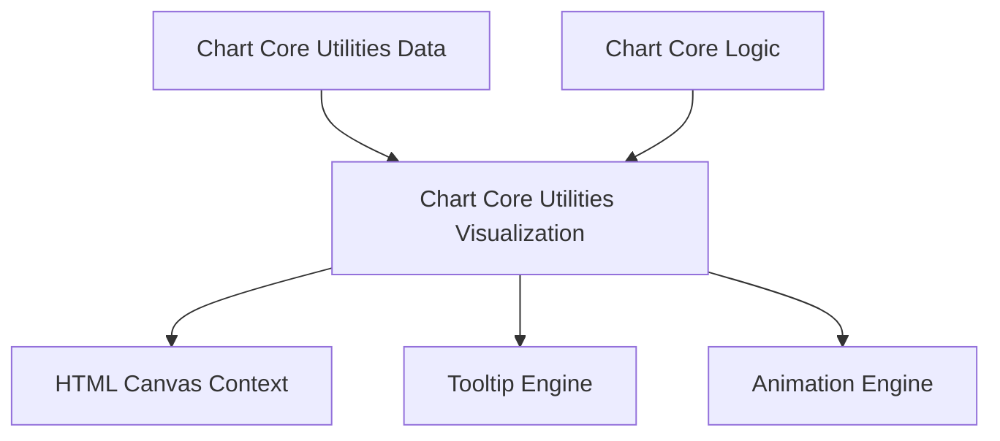
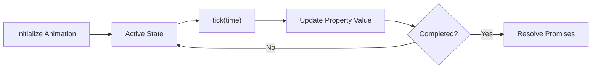
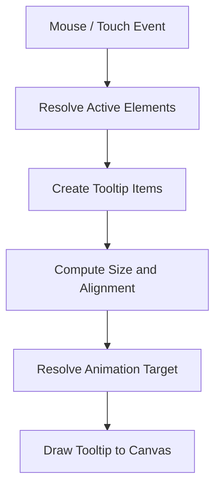
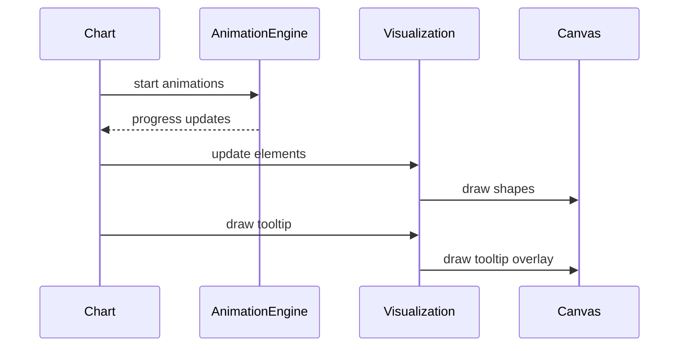
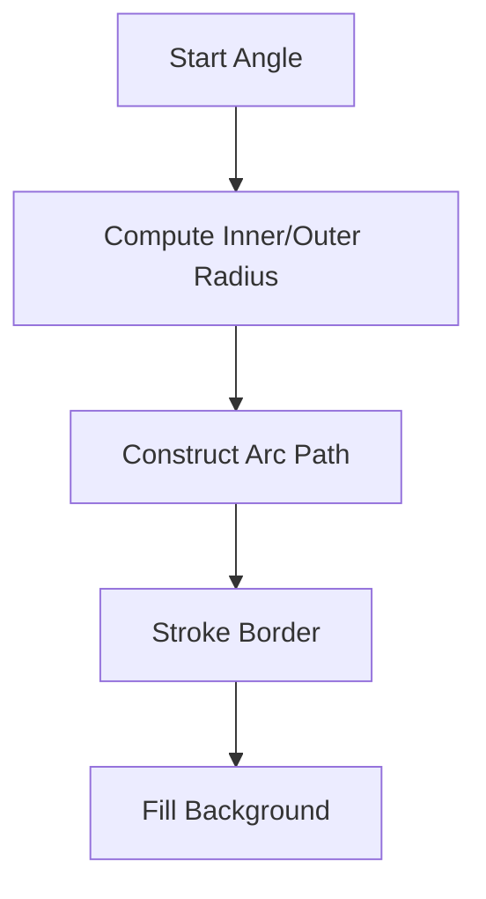
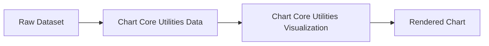

# Chart Core Utilities Visualization

The **Chart Core Utilities Visualization** module provides low-level rendering, drawing, animation, and geometric utilities that power chart visualization across the platform. Built on top of Chart.js v4, this module focuses on visual computation and canvas rendering logic rather than data transformation or chart orchestration.

It is a child of [Chart Core Utilities](../chart-core-utilities.md) and works closely with [Chart Core Utilities Data](../chart-core-utilities-data/chart-core-utilities-data.md) to transform processed datasets into animated, interactive visual elements.

Core components in this module:
- `meshcentral.public.scripts.charts.Cs` (Animation Engine)
- `meshcentral.public.scripts.charts.Fa` (Tooltip Engine)

---

## 1. Module Responsibilities

The Chart Core Utilities Visualization module is responsible for:

- Rendering visual chart elements to canvas
- Managing animation lifecycles
- Handling tooltip layout and drawing
- Computing geometry for arcs, lines, bars, and points
- Managing pixel alignment and device scaling
- Providing interaction-aware visual updates

It does **not**:
- Parse raw data (handled by data utilities)
- Decide chart types or orchestration (handled by core logic and operations)

---

## 2. High-Level Architecture

### Key Concepts

- **Animation Engine (Cs)**: Interpolates numeric and color properties over time.
- **Tooltip Engine (Fa)**: Computes layout, formatting, and rendering of tooltips.
- **Canvas Drawing Utilities**: Arc, line, bar, and point drawing helpers.
- **Geometry & Math Utilities**: Angle normalization, interpolation, bezier control points.

---

## 3. Animation Engine (Cs)

The `Cs` component represents an animation unit applied to a specific property of a target object.

### Responsibilities

- Track animation duration and easing
- Interpolate between start and end values
- Support looping animations
- Resolve promises when animation completes
- Integrate with global animation scheduler

### Animation Lifecycle

### Interpolation Strategy

The animation engine supports multiple value types:

- **Number interpolation**
- **Color blending**
- **Boolean toggling**
- **Custom interpolation via function**

Easing functions are selected from a predefined easing map (linear, easeInOut, elastic, bounce, etc.).

---

## 4. Tooltip Engine (Fa)

The `Fa` component manages all tooltip-related behavior:

- Activation via interaction events
- Layout computation (title, body, footer)
- Alignment and caret positioning
- Animation of tooltip appearance
- Rendering background and text

### Tooltip Rendering Flow

### Tooltip Layout Computation

The layout engine calculates:

- Title height
- Body line count
- Footer height
- Padding
- Color box dimensions
- Caret orientation

Alignment is dynamically computed based on:

- Chart area bounds
- Caret size and padding
- Tooltip width and height
- X and Y alignment rules

---

## 5. Rendering Pipeline Integration

This module integrates into the Chart rendering lifecycle.

### Rendering Phases

1. Dataset update
2. Scale calculation
3. Element positioning
4. Animation interpolation
5. Canvas drawing
6. Tooltip overlay

---

## 6. Geometry and Drawing Utilities

The module includes numerous helpers for:

- Angle normalization
- Pixel alignment
- Bezier curve control points
- Stepped line interpolation
- Radial arc drawing
- Rounded rectangle paths

### Example: Arc Rendering

These utilities ensure consistent rendering across:

- Doughnut charts
- Pie charts
- Polar area charts
- Radar charts

---

## 7. Device Pixel Ratio Handling

To ensure crisp rendering on high-DPI displays, the module:

- Detects device pixel ratio
- Rescales canvas dimensions
- Adjusts drawing transforms
- Aligns pixels for sharp strokes

This prevents blurry lines and misaligned borders.

---

## 8. Interaction Integration

The visualization layer cooperates with interaction modes such as:

- Nearest
- Index
- Dataset
- X-axis and Y-axis modes

Tooltip positioning and element highlighting depend on:

- Distance calculations
- Element bounding boxes
- Scale transformations

---

## 9. Relationship to Other Modules

### Parent Module

- [Chart Core Utilities](../chart-core-utilities.md)

### Sibling Module

- [Chart Core Utilities Data](../chart-core-utilities-data/chart-core-utilities-data.md)

The typical execution chain:

---

## 10. Key Design Principles

- **Separation of concerns**: Data parsing is separate from drawing.
- **Immutable animation targets**: Animations interpolate values without mutating structure.
- **Canvas-first rendering**: Direct 2D context drawing.
- **Pluggable tooltip callbacks**: Highly customizable label rendering.
- **Performance-aware**: Decimation, caching, and minimal reflow.

---

## 11. Summary

The Chart Core Utilities Visualization module is the rendering and animation backbone of the charting system. It transforms computed chart state into animated, interactive canvas visuals.

Through the Animation Engine (`Cs`) and Tooltip Engine (`Fa`), it enables:

- Smooth transitions
- Interactive feedback
- Accurate geometric rendering
- High-DPI visual fidelity

Together with data and logic modules, it completes the full chart rendering pipeline.