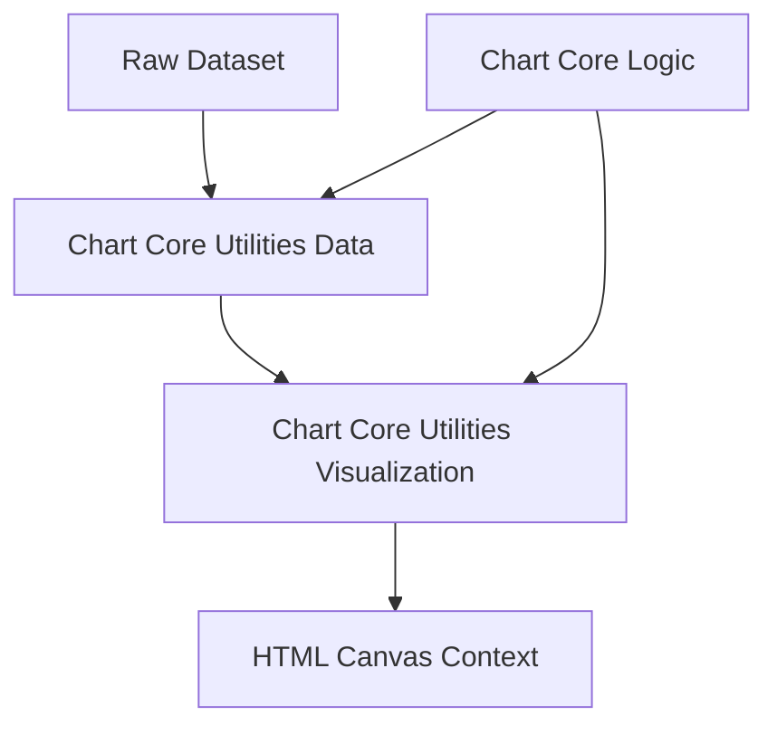
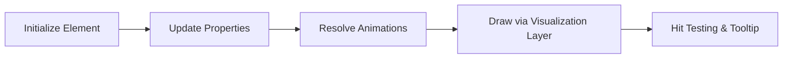
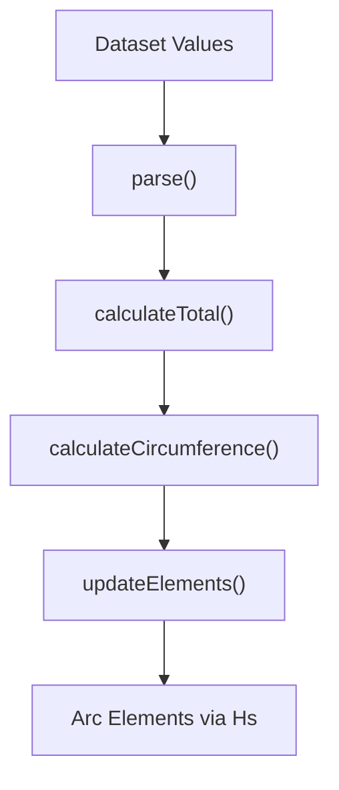
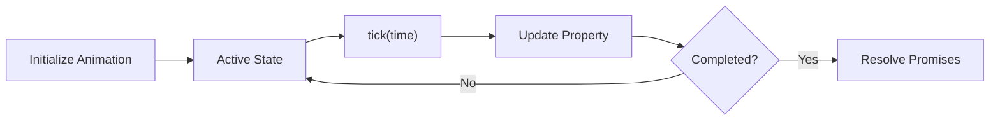
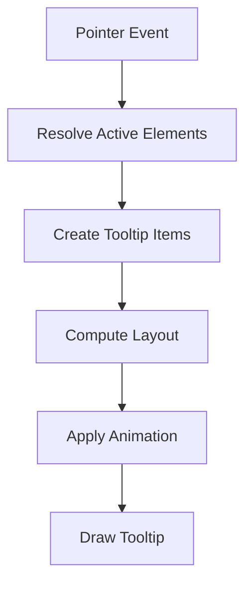
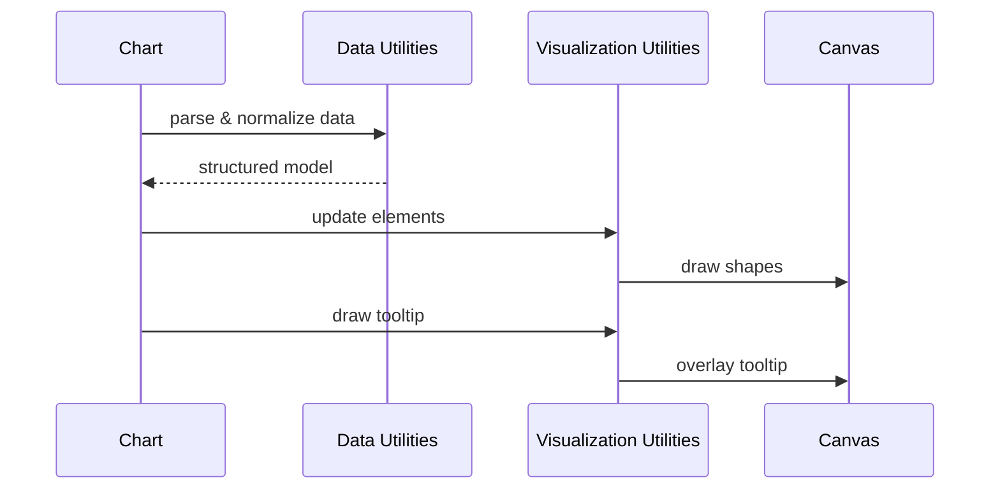
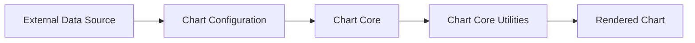

# Chart Core Utilities

The **Chart Core Utilities** module provides the foundational data processing and visualization primitives that power chart rendering in the MeshCentral frontend. Built on top of Chart.js v4 concepts, it separates **data normalization** from **canvas rendering and animation**, ensuring clean architecture and high performance.

This module lives under:

```text
public/scripts
└── charts
    └── chart-core-components
        └── chart-core-utilities
```

It contains the following core components:

- `meshcentral.public.scripts.charts.Cs`
- `meshcentral.public.scripts.charts.Fa`
- `meshcentral.public.scripts.charts.Hn`
- `meshcentral.public.scripts.charts.Hs`

---

## 1. Purpose of the Module

The **Chart Core Utilities** module acts as the bridge between:

- Raw datasets
- Chart configuration
- Rendering logic
- Animation systems

It is responsible for:

- Parsing and normalizing datasets
- Managing chart element abstractions
- Computing geometry (arcs, lines, bars, points)
- Handling animation lifecycles
- Rendering tooltips and interaction overlays

It does **not**:

- Define high-level chart orchestration (handled by Chart Core Logic)
- Execute operational transformations (handled by Chart Core Operations)

---

## 2. High-Level Architecture



### Architectural Layers

| Layer | Responsibility |
|-------|----------------|
| Data Utilities | Parse and normalize raw datasets |
| Visualization Utilities | Render shapes, tooltips, and animations |
| Logic Layer | Orchestrate updates and lifecycle |
| Canvas | Final visual output |

---

## 3. Repository Structure

```text
public/scripts/charts/chart-core-components/chart-core-utilities/
├── Cs  (Animation Engine)
├── Fa  (Tooltip Engine)
├── Hn  (Radial Data Controller Utilities)
└── Hs  (Base Element Abstraction)
```

### Submodules

- **Chart Core Utilities Data**
  - Focused on dataset parsing and geometry preparation
  - See: `chart-core-utilities-data/chart-core-utilities-data.md`

- **Chart Core Utilities Visualization**
  - Focused on animation, tooltip rendering, and drawing
  - See: `chart-core-utilities-visualization/chart-core-utilities-visualization.md`

---

## 4. Core Components Overview

### 4.1 Hs – Base Element Abstraction

`Hs` defines the foundational structure for all visual chart elements.

Responsibilities:

- Common element properties (`x`, `y`, `options`, `active`)
- Animation state resolution
- Tooltip positioning
- Property interpolation
- Scriptable option evaluation



This ensures consistent behavior across arcs, bars, lines, and points.

---

### 4.2 Hn – Radial Data Utilities

`Hn` specializes in circular chart types (doughnut, pie).

Responsibilities:

- Parse radial datasets
- Compute totals
- Calculate angular spans
- Manage inner and outer radii
- Update arc elements



It converts numeric values into proportional angular geometry.

---

### 4.3 Cs – Animation Engine

`Cs` represents an animation unit applied to a specific property.

Responsibilities:

- Track duration and easing
- Interpolate values
- Support numeric and color animation
- Resolve completion promises



It integrates with the global animation scheduler.

---

### 4.4 Fa – Tooltip Engine

`Fa` manages tooltip computation and rendering.

Responsibilities:

- Detect active elements
- Generate tooltip items
- Compute layout and alignment
- Animate appearance
- Draw tooltip background and text



Tooltips dynamically adapt to chart bounds and interaction mode.

---

## 5. Execution Flow Within a Chart Update



---

## 6. Relationship to Other Chart Modules

### Parent

- Chart Core Components

### Sibling Modules

- Chart Core Logic
- Chart Core Operations
- Chart Core Utilities Data
- Chart Core Utilities Visualization

### Integration Pipeline



---

## 7. Design Principles

The module follows strict architectural separation:

- **Data vs Rendering separation**
- **Reusable element abstraction**
- **Animation-first updates**
- **Canvas-based rendering**
- **Interaction-aware visual state**

It ensures:

- High-DPI crisp rendering
- Smooth animated transitions
- Stack-aware and normalized data
- Predictable rendering lifecycle

---

## 8. Summary

The **Chart Core Utilities** module is the foundational engine that transforms structured datasets into animated, interactive visual representations.

Through:

- `Hs` (Element Abstraction)
- `Hn` (Radial Data Utilities)
- `Cs` (Animation Engine)
- `Fa` (Tooltip Engine)

It delivers:

- Deterministic data normalization
- Consistent geometry computation
- Smooth animation interpolation
- Dynamic tooltip rendering
- Clean separation of concerns

Together with the logic and operations layers, Chart Core Utilities completes the core rendering pipeline of the MeshCentral charting architecture.