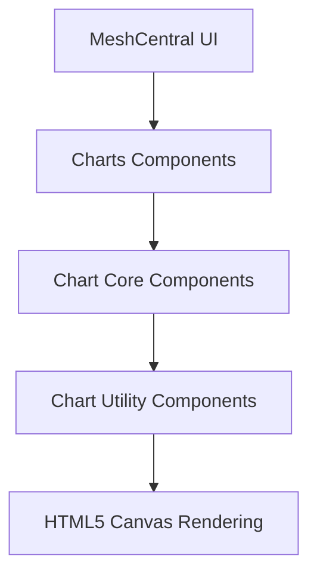
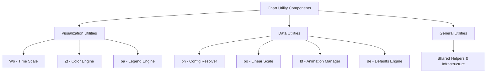
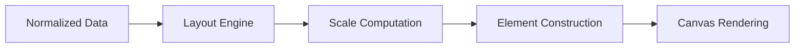
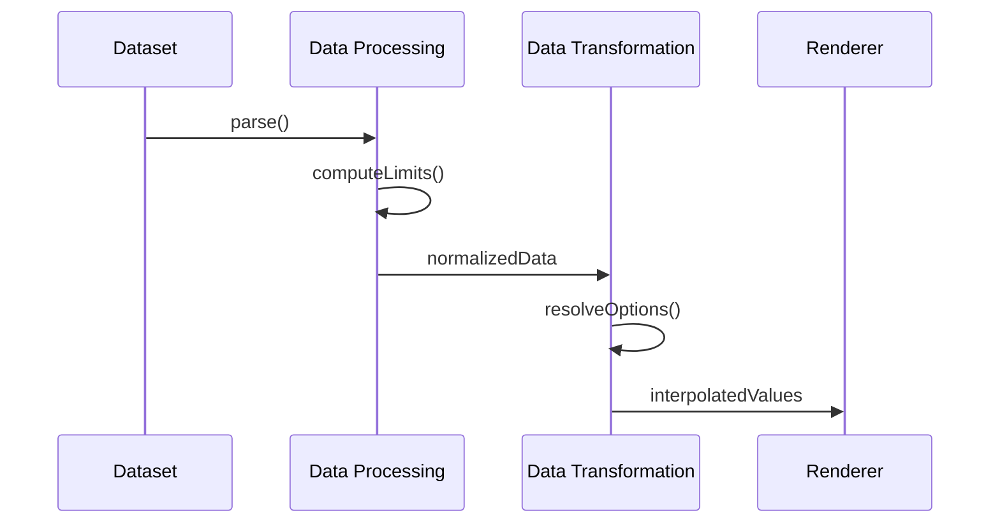
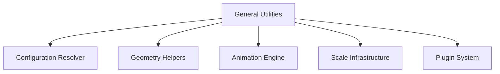
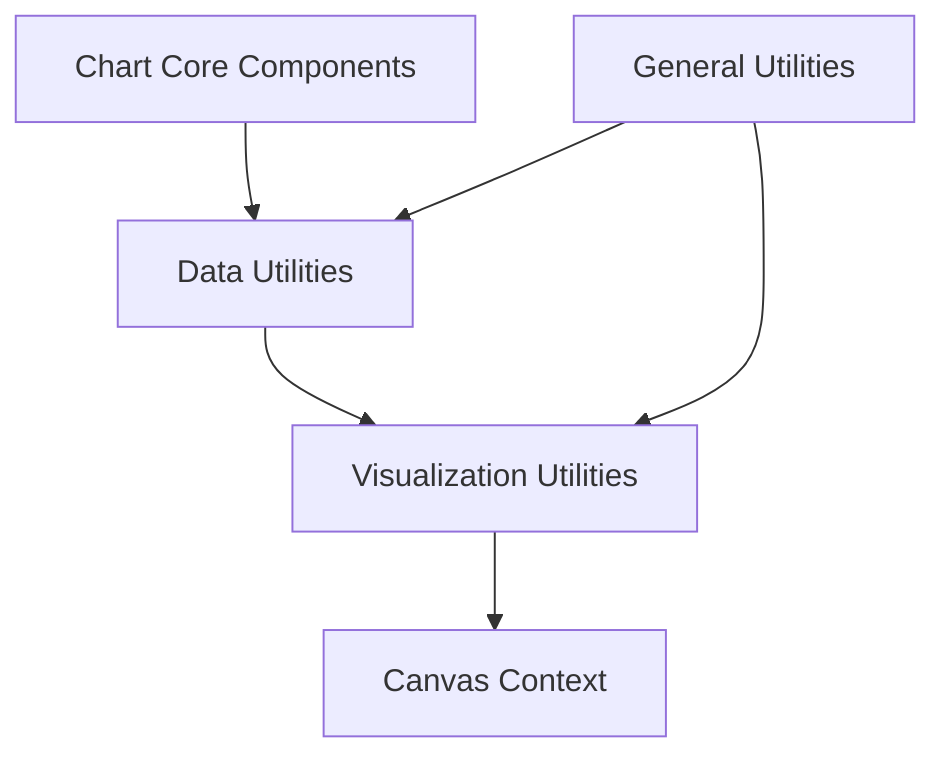

# Chart Utility Components

The **Chart Utility Components** module provides the shared infrastructure layer that supports chart rendering, data handling, animation, styling, and interaction within the MeshCentral UI.

Located under `public/scripts/charts`, this module sits between the **Chart Core Components** and the underlying canvas rendering system. It consolidates reusable visualization utilities, data processing logic, configuration resolution, animation orchestration, and general helpers extracted from Chart.js (v4.3.3).

It ensures that all charts in the system are:

- Consistent in styling and behavior  
- Deterministic in scale and layout computation  
- Efficient in rendering and animation  
- Extensible via configuration and plugin patterns  

---

## Repository Structure

**Path:** `public/scripts/charts`

### Core Components

```text
Chart Utility Components
├── meshcentral.public.scripts.charts.Wo
├── meshcentral.public.scripts.charts.Zt
├── meshcentral.public.scripts.charts.ba
├── meshcentral.public.scripts.charts.bn
├── meshcentral.public.scripts.charts.bo
├── meshcentral.public.scripts.charts.bt
├── meshcentral.public.scripts.charts.de
├── meshcentral.public.scripts.charts.jn
├── meshcentral.public.scripts.charts.la
├── meshcentral.public.scripts.charts.ls
└── meshcentral.public.scripts.charts.mo
```

### Submodules

- **Visualization Utilities**
  - `Wo` – Time scale utilities  
  - `Zt` – Color manipulation engine  
  - `ba` – Legend layout and rendering engine  

- **Data Utilities**
  - `bn` – Configuration resolver  
  - `bo` – Linear scale engine  
  - `bt` – Animation orchestrator  
  - `de` – Defaults & resolver engine  

- **General Utilities**
  - `jn`, `la`, `ls`, `mo` – Shared infrastructure for parsing, geometry, animation, and scale logic  

---

# Architectural Overview

The Chart Utility Components module acts as the computational and rendering backbone of the chart system.



### Responsibility Layers

| Layer | Responsibility |
|--------|---------------|
| Chart Core | Dataset controllers, element coordination |
| Chart Utility Components | Rendering, scaling, animation, parsing |
| Canvas Layer | Low-level drawing operations |

---

# Internal Architecture

The module is divided into three major subsystems:



---

# 1. Visualization Utilities

The **Visualization Utilities** subsystem provides low-level rendering and visual logic.

### Core Components

- `meshcentral.public.scripts.charts.Wo`
- `meshcentral.public.scripts.charts.Zt`
- `meshcentral.public.scripts.charts.ba`

### Responsibilities

- Time axis parsing and tick generation  
- Color parsing, blending, and transformation  
- Legend layout and interaction handling  
- Layout integration with scales  
- Canvas drawing helpers  
- Interaction hit detection  

### Rendering Pipeline



📘 See detailed documentation:  
**Visualization Utilities**

---

# 2. Data Utilities

The **Data Utilities** subsystem ensures structured, validated, and animated dataset processing.

### Core Components

- `meshcentral.public.scripts.charts.bn`
- `meshcentral.public.scripts.charts.bo`
- `meshcentral.public.scripts.charts.bt`
- `meshcentral.public.scripts.charts.de`

### Responsibilities

- Dataset parsing and normalization  
- Scale limit calculation  
- Tick generation  
- Value-to-pixel mapping  
- Configuration resolution  
- Runtime animation interpolation  

### Data Lifecycle



📘 See detailed documentation:  
- **Data Utilities**  
  - Data Processing Utilities  
  - Data Transformation Utilities  

---

# 3. General Utilities

The **General Utilities** subsystem provides shared infrastructure reused by all chart types.

### Core Components

- `meshcentral.public.scripts.charts.jn`
- `meshcentral.public.scripts.charts.la`
- `meshcentral.public.scripts.charts.ls`
- `meshcentral.public.scripts.charts.mo`

### Responsibilities

- Configuration merging & resolver pattern  
- Geometry and path construction helpers  
- Global animation scheduler  
- Scale abstraction (linear, log, category, time)  
- Plugin registration and lifecycle hooks  
- Dataset parsing utilities  



📘 See detailed documentation:  
**General Utilities**

---

# Interaction Between Subsystems



- **General Utilities** provide shared logic.
- **Data Utilities** prepare and animate structured data.
- **Visualization Utilities** render final graphical output.
- **Chart Core Components** orchestrate datasets and controllers.

---

# Design Principles

- **Separation of concerns** between data, rendering, and configuration  
- **Deterministic scaling** for reliable tooltip alignment  
- **Centralized animation management**  
- **Composable utility layers**  
- **Extensible plugin architecture**  
- **Canvas-first rendering for performance**

---

# Relationship to Other Chart Modules

The Chart Utility Components module directly supports:

- **Chart Core Components** (controllers, dataset logic)  
- **Chart Advanced Components** (specialized visualization behaviors)  

It does not define chart types itself; instead, it provides the reusable primitives that enable:

- Line charts  
- Bar charts  
- Pie and doughnut charts  
- Time series charts  
- Animated and interactive dashboards  

---

# Summary

The **Chart Utility Components** module is the foundational infrastructure layer of the MeshCentral charting subsystem.

It:

- Standardizes dataset processing  
- Controls scaling and tick generation  
- Resolves hierarchical configuration  
- Manages animation lifecycles  
- Provides color and legend systems  
- Implements reusable geometry and rendering helpers  

By centralizing these cross-cutting concerns, it ensures that all charts within the MeshCentral UI are performant, consistent, and extensible.