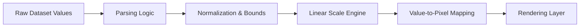
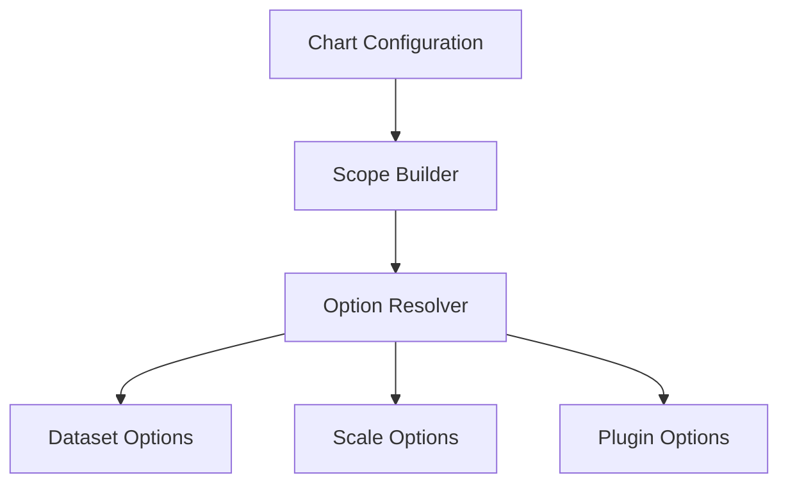
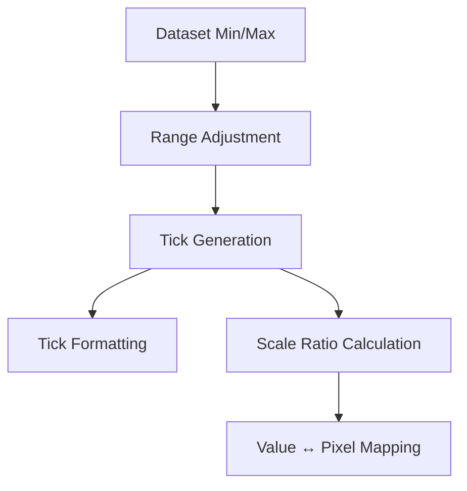
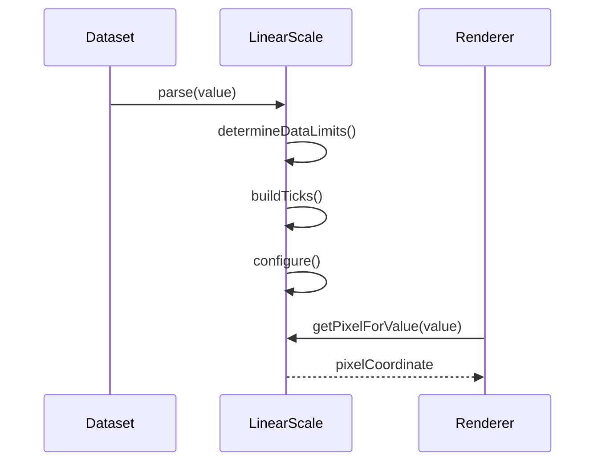
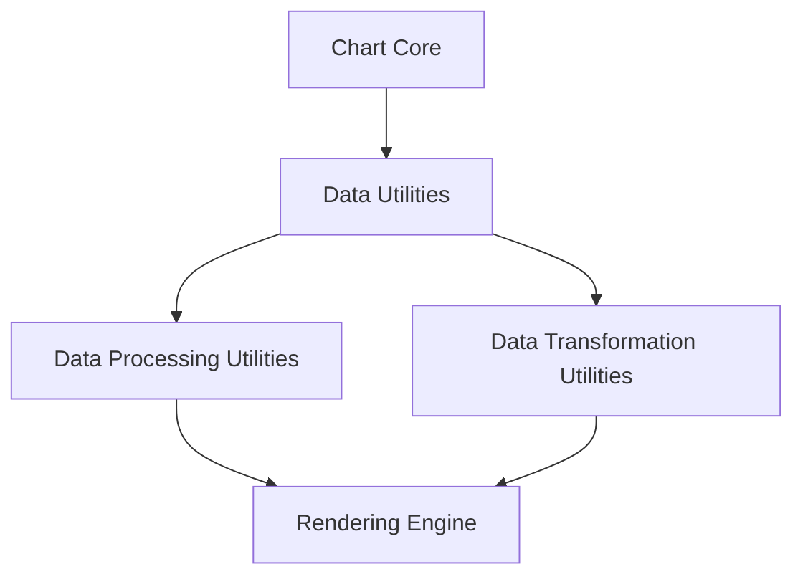
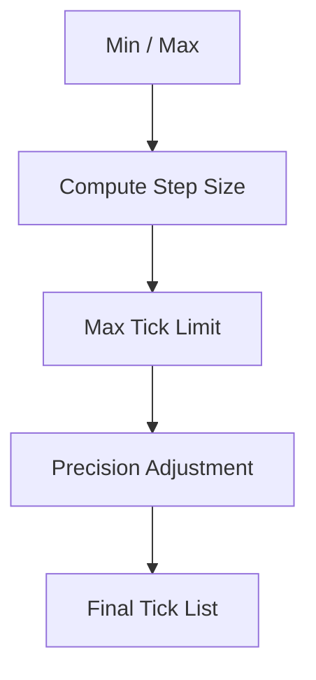

# Data Processing Utilities

The **Data Processing Utilities** module provides foundational data normalization and numeric processing helpers used throughout the charting subsystem. Built on top of Chart.js core primitives, this module focuses on transforming raw dataset inputs into internally consistent, validated, and efficiently structured data representations.

At its core, the module leverages two primary components:

- `meshcentral.public.scripts.charts.bn` – Configuration and resolver infrastructure
- `meshcentral.public.scripts.charts.bo` – Linear scale implementation for numeric data processing

This module is part of the Chart Utility Components hierarchy and works closely with:

- Parent module: [Data Utilities](../data-utilities.md)
- Sibling module: [Data Transformation Utilities](../data-transformation-utilities/data-transformation-utilities.md)

---

## 1. Purpose and Responsibilities

The Data Processing Utilities module is responsible for:

- Parsing raw dataset values into numeric form
- Determining data bounds (min/max)
- Generating normalized tick values
- Mapping numeric values to pixel space
- Handling rounding, precision, and step logic
- Providing formatting hooks for display layers

It sits between raw dataset ingestion and higher-level rendering logic.



---

## 2. Core Components

### 2.1 Configuration Resolver (`bn`)

The configuration resolver provides:

- Scoped option resolution
- Dataset-level overrides
- Plugin option merging
- Scriptable and indexable option handling

It ensures that data processing logic uses correctly merged configuration values.

#### Responsibilities

- Create scoped option resolvers
- Merge dataset and global options
- Cache resolution results for performance
- Provide fallback behavior



This component is fundamental for ensuring consistent numeric behavior across datasets and scales.

---

### 2.2 Linear Scale (`bo`)

The Linear Scale is the primary numeric processing engine in this module.

It extends the base scale class and provides:

- Numeric domain calculation
- Tick generation
- Tick limit computation
- Pixel-to-value conversion
- Value-to-pixel conversion

#### Key Capabilities

- Automatic min/max detection
- Step size calculation
- Precision handling
- Begin-at-zero enforcement
- Bounds adjustment



---

## 3. Data Processing Workflow

The typical lifecycle for numeric data processing:



### Step Breakdown

1. **Parsing** – Raw values converted to finite numeric form
2. **Limit Detection** – Min/max derived from datasets
3. **Tick Computation** – Logical divisions created
4. **Normalization** – Decimal precision enforced
5. **Pixel Mapping** – Linear interpolation applied

---

## 4. Architecture Context

Within the chart utility stack:



### Interaction with Sibling Module

- **Data Processing Utilities** → Numeric normalization and scale handling
- **Data Transformation Utilities** → Structural reshaping and dataset transformation

Processing occurs before transformation logic affects display ordering or structural mapping.

---

## 5. Numeric Scaling Model

The linear scale uses a normalized ratio model:

```text
normalized = (value - min) / (max - min)
pixel = startPixel + normalized * pixelLength
```

Reverse mapping:

```text
value = min + ((pixel - startPixel) / pixelLength) * (max - min)
```

This deterministic mapping ensures:

- Stable rendering
- Predictable zoom behavior
- Accurate tooltip alignment

---

## 6. Tick Generation Strategy

Tick generation follows a bounded interval strategy:

1. Determine usable numeric range
2. Compute optimal step size
3. Respect maximum tick limits
4. Adjust precision
5. Optionally enforce begin-at-zero



This avoids overly dense tick rendering and ensures legible axis labels.

---

## 7. Performance Considerations

The module incorporates:

- Option resolver caching
- Tick limit enforcement
- Numeric precision control
- Early exit for invalid values

These optimizations reduce:

- Rendering overhead
- Memory churn
- Recalculation costs

---

## 8. Extension Points

Developers can extend behavior by:

- Overriding scale configuration
- Supplying custom tick callbacks
- Modifying parsing behavior
- Injecting custom resolver scopes

Because configuration resolution is centralized in `bn`, scale behavior can be modified without rewriting processing logic.

---

## 9. Summary

The **Data Processing Utilities** module provides the numeric backbone of the chart system. It:

- Converts raw data into validated numeric values
- Computes logical axis bounds
- Generates readable tick sequences
- Performs consistent value-to-pixel mapping
- Ensures configuration consistency via scoped resolvers

It is a foundational layer beneath rendering and visualization modules, and directly supports both the [Data Utilities](../data-utilities.md) parent module and the [Data Transformation Utilities](../data-transformation-utilities/data-transformation-utilities.md) sibling module.

This module ensures that all numeric data entering the rendering pipeline is normalized, predictable, and efficiently processed.