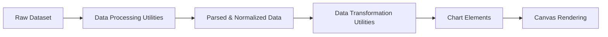
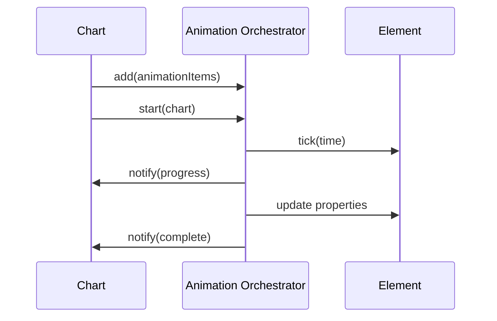
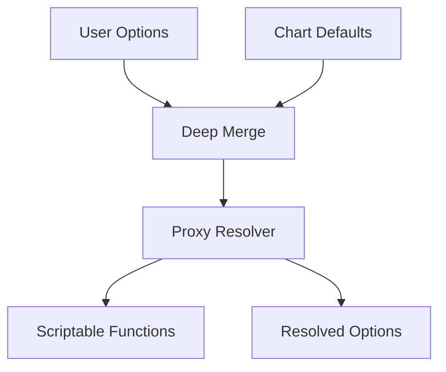
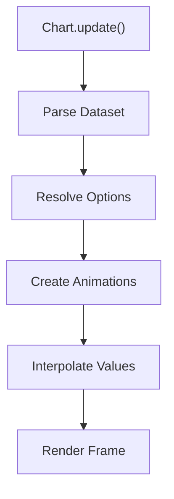

# Data Transformation Utilities

The **Data Transformation Utilities** module provides low-level transformation and animation infrastructure used by the charting system. It is built on top of Chart.js core internals and focuses on:

- Runtime data mutation and transformation
- Animation lifecycle orchestration
- Configuration resolution and merging
- Color parsing and manipulation

This module underpins dynamic chart updates, smooth transitions, and consistent data-to-visual transformations across all chart types.

It works closely with its sibling module, [Data Processing Utilities](../data-processing-utilities/data-processing-utilities.md), which prepares and aggregates data before transformation and rendering.

---

## Core Components

The module exposes two primary internal classes from `charts.js`:

- `meshcentral.public.scripts.charts.bt` → **Animation Orchestrator** (internal animation manager)
- `meshcentral.public.scripts.charts.de` → **Defaults & Configuration Resolver**

Together, they handle state transitions and configuration-driven data transformation.

---

## Architectural Context

Within the chart subsystem, Data Transformation Utilities sit between parsed datasets and visual elements.

### Responsibilities by Layer

| Layer | Responsibility |
|--------|----------------|
| Data Processing Utilities | Parsing, normalization, stacking |
| **Data Transformation Utilities** | Animation, interpolation, config resolution |
| Chart Elements | Geometry computation |
| Rendering | Canvas drawing |

---

## Animation Orchestrator (bt)

The Animation Orchestrator manages all active chart animations.

### Responsibilities

- Track animation items per chart instance
- Drive animation frames via `requestAnimationFrame`
- Dispatch progress and completion callbacks
- Cancel and clean up animations

### Animation Lifecycle

### Internal Data Model

Each chart has an animation state object:

- `items[]` – active animation descriptors
- `listeners.progress[]`
- `listeners.complete[]`
- `running` – boolean flag

This design enables multiple simultaneous animated properties (position, size, opacity, etc.) per dataset.

---

## Defaults & Configuration Resolver (de)

The Defaults & Configuration Resolver provides:

- Centralized default configuration
- Deep merge of user options and system defaults
- Scriptable and indexable property resolution
- Route-based inheritance (e.g., scale → ticks → colors)

### Configuration Resolution Flow

### Key Capabilities

1. **Deep Object Merge**
   - Prevents prototype pollution
   - Clones nested structures safely

2. **Scriptable Options**
   - Functions evaluated with runtime context
   - Allows dynamic color, radius, or scale behavior

3. **Indexable Properties**
   - Supports per-datapoint configuration arrays

4. **Scoped Resolution**
   - Dataset → Element → Global fallback chain

---

## Data Transformation Pipeline

When chart data changes, the transformation process follows this path:

### Interpolation Types

- Linear numeric interpolation
- Color blending (RGBA, HSL)
- Boolean toggles (visibility)
- Custom easing functions

Easing functions include quadratic, cubic, elastic, bounce, and others.

---

## Color Transformation

The module includes a color utility layer capable of:

- Parsing RGB, RGBA, HSL, HSV, HEX
- Converting between formats
- Mixing two colors
- Lighten, darken, saturate, desaturate
- Alpha blending

Example transformation chain:

This enables dynamic hover states, theme adjustments, and animated color transitions.

---

## Interaction with Other Chart Utility Modules

### With Data Processing Utilities

- Receives parsed and stacked numeric values
- Applies animated transitions to processed values

See: [Data Processing Utilities](../data-processing-utilities/data-processing-utilities.md)

### With Visualization Utilities

- Supplies resolved style options (color, border width, radius)
- Provides animated geometry values

### With Chart Core Components

- Drives dataset controllers
- Updates element instances before rendering

---

## Performance Considerations

The module includes several performance safeguards:

- Cached resolvers to avoid repeated deep merges
- Animation batching per frame
- Conditional decimation support (handled elsewhere but integrated)
- Numeric precision controls for ticks and scaling

Animation manager stops its internal loop when no items remain, preventing unnecessary frame scheduling.

---

## Extension Points

Developers extending the chart subsystem can:

- Provide custom easing functions
- Override default option scopes
- Inject scriptable property callbacks
- Register new dataset or element types that leverage animation orchestration

Because transformation is separated from parsing and rendering, new visual types can reuse the same animation and configuration infrastructure.

---

## Summary

The **Data Transformation Utilities** module is the dynamic engine of the charting system. It:

- Bridges parsed data and rendered visuals
- Applies animation-driven transitions
- Resolves complex hierarchical configuration
- Handles color and numeric interpolation

Without this module, chart updates would be static and configuration resolution inconsistent. It ensures smooth, flexible, and predictable visual transformations across the entire chart ecosystem.
