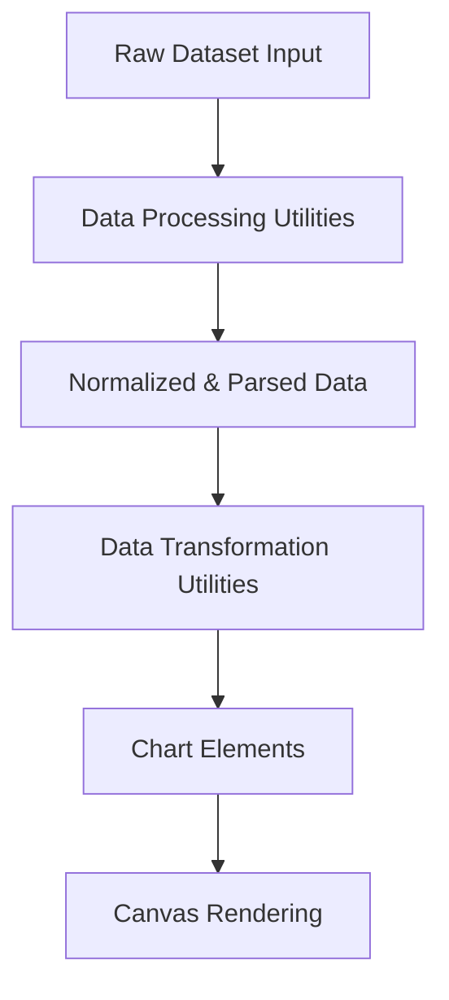
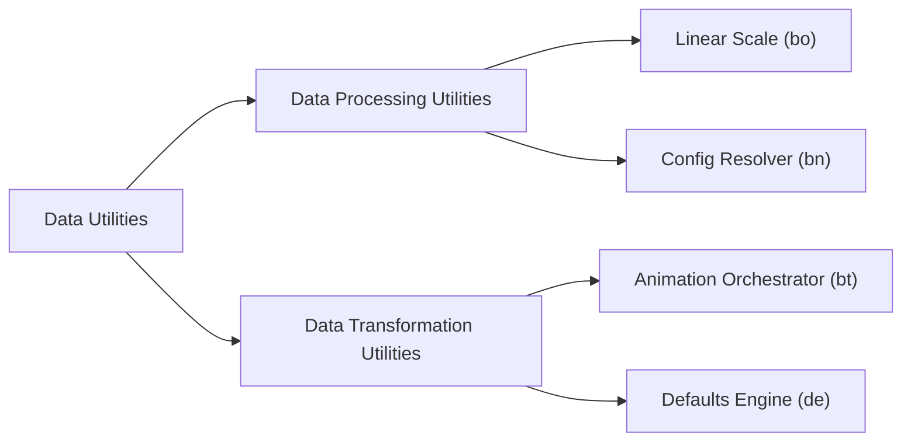
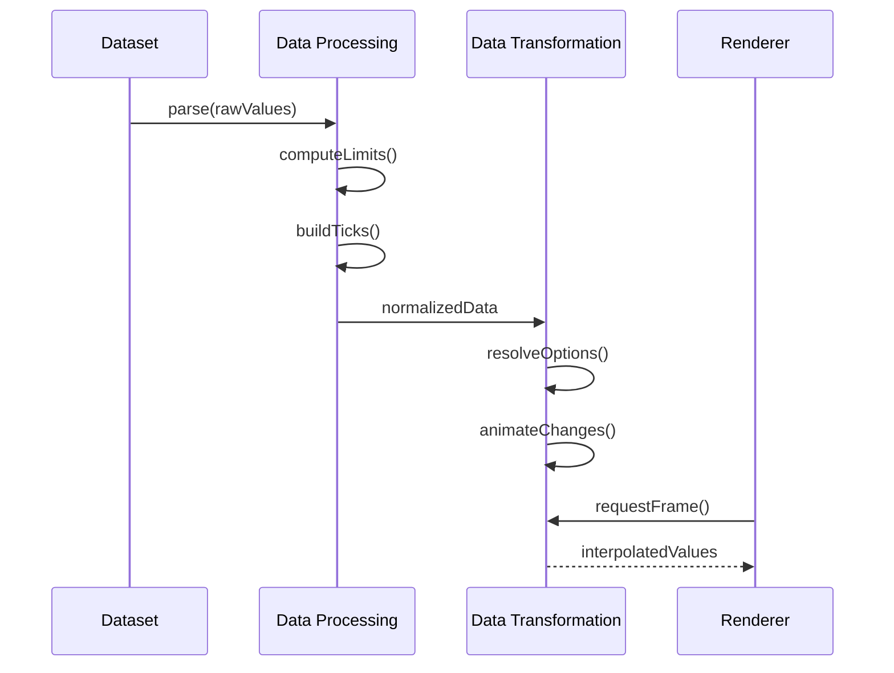
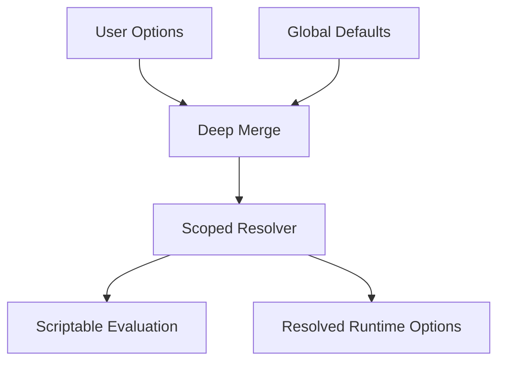

# Data Utilities

The **Data Utilities** module provides foundational data handling, transformation, normalization, and animation infrastructure for the charting subsystem located under `public/scripts/charts`.  

It acts as the intermediate layer between raw dataset ingestion and final rendering, ensuring that all chart data is:

- Parsed and validated
- Normalized and scaled
- Transformed and animated
- Configured consistently via hierarchical resolution

This module is part of the **Chart Utility Components** hierarchy and is composed of two primary submodules:

- [Data Processing Utilities](./data-processing-utilities/data-processing-utilities.md)
- [Data Transformation Utilities](./data-transformation-utilities/data-transformation-utilities.md)

---

## 1. Purpose of the Module

The **Data Utilities** module is responsible for:

- Converting raw dataset values into validated numeric representations
- Resolving hierarchical configuration and defaults
- Computing scale bounds and tick sequences
- Performing value-to-pixel and pixel-to-value mapping
- Managing runtime animation and interpolation
- Enabling dynamic visual updates with deterministic behavior

It ensures that all chart elements operate on structured, consistent, and optimized data.

---

## 2. Repository Structure

**Path:** `public/scripts/charts`

### Core Components

```text
Data Utilities
├── meshcentral.public.scripts.charts.bn   (Configuration Resolver)
├── meshcentral.public.scripts.charts.bo   (Linear Scale)
├── meshcentral.public.scripts.charts.bt   (Animation Orchestrator)
└── meshcentral.public.scripts.charts.de   (Defaults & Resolver Engine)
```

### Submodules

```text
data-utilities
├── data-processing-utilities
│   ├── bn (Resolver Infrastructure)
│   └── bo (Linear Scale Engine)
└── data-transformation-utilities
    ├── bt (Animation Manager)
    └── de (Defaults & Config Resolver)
```

---

## 3. Architectural Overview

The **Data Utilities** module sits between chart core logic and rendering layers.



### Responsibilities by Layer

| Layer | Responsibility |
|--------|----------------|
| Data Processing Utilities | Parsing, normalization, scaling |
| Data Transformation Utilities | Animation, interpolation, option resolution |
| Chart Elements | Geometry & layout |
| Rendering | Canvas drawing |

---

## 4. Internal Architecture

The module is divided into two complementary subsystems:



### Data Processing Utilities

Handles numeric validation and scale logic:

- Determines min/max bounds
- Generates ticks
- Handles precision and rounding
- Maps values to pixels
- Provides deterministic scaling

See: [Data Processing Utilities](./data-processing-utilities/data-processing-utilities.md)

---

### Data Transformation Utilities

Handles runtime data mutation and animation:

- Manages animation lifecycle
- Interpolates numeric and color values
- Resolves hierarchical configuration
- Merges user options with defaults
- Applies scriptable and indexable properties

See: [Data Transformation Utilities](./data-transformation-utilities/data-transformation-utilities.md)

---

## 5. Data Lifecycle

The typical lifecycle of chart data within this module:



### Execution Stages

1. **Parsing** – Convert raw values to numeric form  
2. **Normalization** – Determine bounds and precision  
3. **Scaling** – Generate tick values  
4. **Resolution** – Merge user options with defaults  
5. **Animation** – Interpolate changes  
6. **Rendering** – Pass computed values to drawing layer  

---

## 6. Numeric Scaling Model

The linear scale engine uses normalized interpolation:

```text
normalized = (value - min) / (max - min)
pixel = startPixel + normalized * pixelLength
```

Reverse mapping:

```text
value = min + ((pixel - startPixel) / pixelLength) * (max - min)
```

This guarantees:

- Stable rendering
- Accurate tooltip alignment
- Predictable zoom and scaling
- Deterministic layout computation

---

## 7. Configuration Resolution Flow

Configuration is resolved hierarchically:



Capabilities include:

- Deep option merging
- Fallback chains (dataset → element → global)
- Scriptable functions
- Indexable per-datapoint configuration
- Cached resolution for performance

---

## 8. Performance Characteristics

The **Data Utilities** module incorporates several optimizations:

- Cached configuration resolvers
- Tick limit enforcement
- Numeric precision normalization
- Frame-based animation batching
- Automatic animation loop termination

These ensure scalable rendering even with large datasets.

---

## 9. Extension Points

Developers extending the chart system can:

- Override scale configuration
- Provide custom tick callbacks
- Add easing functions
- Inject scriptable option logic
- Extend animation orchestration

Because parsing, transformation, and rendering are decoupled, new visualization types can reuse the entire Data Utilities infrastructure.

---

## 10. Summary

The **Data Utilities** module forms the computational backbone of the chart subsystem. It:

- Standardizes dataset normalization
- Controls numeric scaling behavior
- Resolves hierarchical configuration
- Manages animated transitions
- Supplies deterministic value-to-pixel mapping

It integrates tightly with:

- [Data Processing Utilities](./data-processing-utilities/data-processing-utilities.md)
- [Data Transformation Utilities](./data-transformation-utilities/data-transformation-utilities.md)

Together, these components ensure that all chart data is validated, transformed, animated, and rendered consistently across the MeshCentral UI.