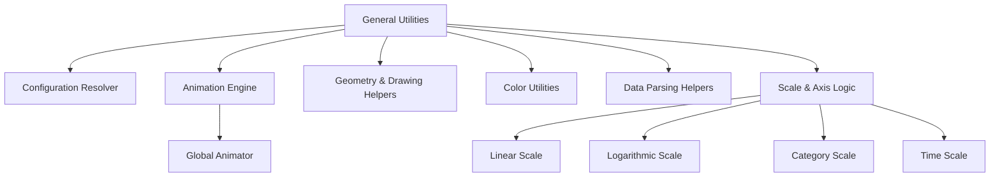
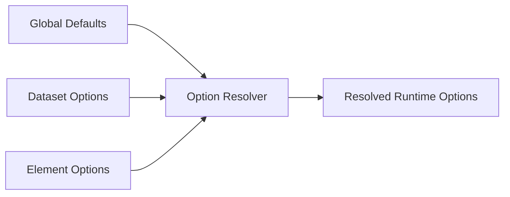
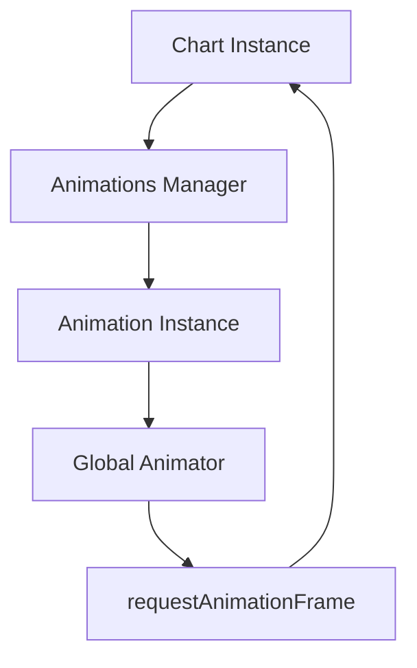
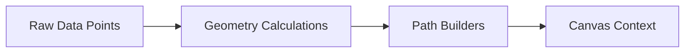
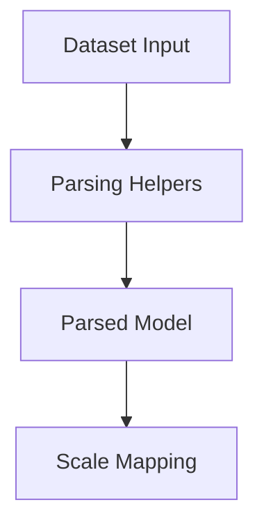
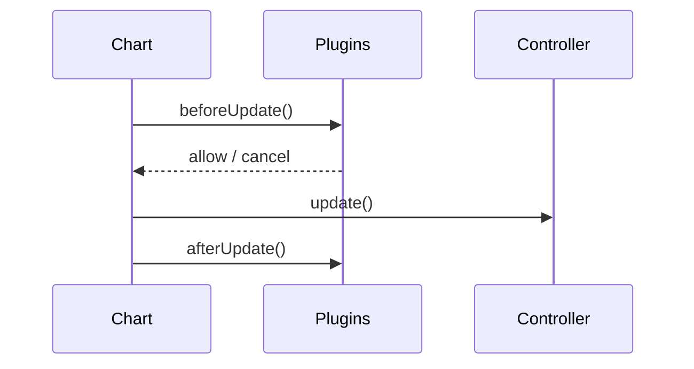
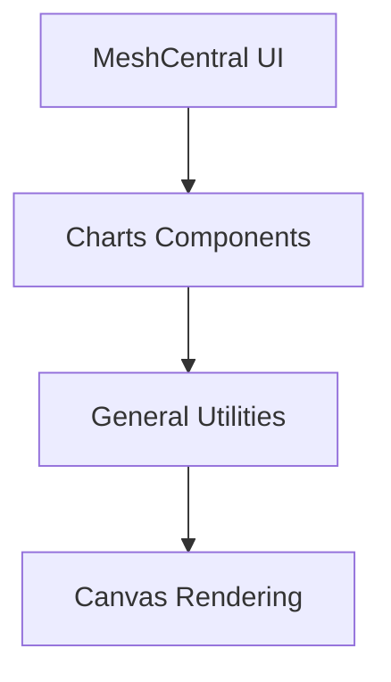

# General Utilities

The **General Utilities** module provides shared helper logic used across the Charts Components subsystem. It is built on top of Chart.js (v4.3.3) and exposes reusable utilities that support rendering, geometry calculations, color handling, animation orchestration, configuration resolution, and plugin integration.

Within the MeshCentral UI stack, this module acts as a foundational layer that:

- Normalizes configuration objects
- Manages animation lifecycles
- Handles geometry and canvas drawing helpers
- Provides color parsing and manipulation
- Supports dataset parsing and scale calculations
- Enables plugin extensibility

Core components in this module (minified identifiers in `charts.js`):

- `meshcentral.public.scripts.charts.jn`
- `meshcentral.public.scripts.charts.la`
- `meshcentral.public.scripts.charts.ls`
- `meshcentral.public.scripts.charts.mo`

These components collectively represent utility controllers, helpers, scale logic, and shared infrastructure extracted from Chart.js.

---

## Architectural Overview

The General Utilities module underpins higher-level chart features such as controllers, scales, elements, legends, and tooltips.

This separation allows chart controllers and visual elements to remain focused on rendering logic while delegating shared behavior to utilities.

---

## Core Functional Areas

### 1. Configuration & Option Resolution

The module provides a layered configuration resolution system:

- Dataset-level options
- Element-level overrides
- Global defaults
- Scriptable and indexable option handling

Key responsibilities:

- Deep merging of configuration objects
- Fallback routing between related options
- Scriptable callback execution with contextual data
- Caching for performance

This ensures consistent behavior across all chart types.

---

### 2. Animation Engine

Animation handling is centralized through:

- `Animation` objects
- `Animations` collections
- A global animator scheduler

Features include:

- Easing functions (linear, cubic, elastic, bounce, etc.)
- Property interpolation (number, color, boolean)
- Delays and looping
- Shared option animation
- Dataset transition management

The animation engine updates element properties incrementally and triggers re-rendering through the chart lifecycle.

---

### 3. Geometry & Canvas Drawing Helpers

General Utilities provide reusable geometry logic for:

- Angle normalization
- Bezier interpolation
- Stepped interpolation
- Pixel alignment
- Arc and rectangle path construction
- Clipping and un-clipping areas

This abstraction allows elements (lines, arcs, bars, points) to use consistent math utilities without duplicating logic.

---

### 4. Color Utilities

The module integrates a color system that supports:

- RGB, RGBA, HSL parsing
- Hex conversion
- Alpha manipulation
- Lighten/darken/saturate/desaturate
- Interpolation between colors

Color resolution is used by:

- Dataset styling
- Hover states
- Legend generation
- Tooltip formatting

Color transitions are also animation-aware.

---

### 5. Data Parsing & Normalization

Utilities support multiple dataset formats:

- Primitive values
- `[x, y]` arrays
- Object-based datasets
- Radial and stacked datasets

Responsibilities:

- Axis-aware parsing
- Stack computation
- Range normalization
- Sorting detection
- Min/max calculations

Parsed values are cached inside dataset metadata for efficient rendering and updates.

---

### 6. Scale & Axis Infrastructure

General Utilities define base scale behavior and several scale implementations:

- Linear scale
- Logarithmic scale
- Category scale
- Time and Time Series scales
- Radial linear scale

Common scale responsibilities:

- Data limit determination
- Tick generation
- Pixel-to-value conversion
- Value-to-pixel conversion
- Label formatting

This shared infrastructure ensures consistent axis behavior across all chart types.

---

### 7. Plugin & Extension System

The utilities include a registry and plugin system:

- Typed registries (controllers, elements, scales, plugins)
- Lifecycle hooks (`beforeUpdate`, `afterDraw`, etc.)
- Context-aware callbacks
- Override support

This architecture enables features like:

- Legends
- Tooltips
- Fillers
- Decimation
- Color auto-assignment

---

## Internal Design Patterns

The module follows several architectural patterns:

- **Resolver Pattern** for configuration layering
- **Observer Pattern** for animation listeners
- **Registry Pattern** for extensibility
- **Strategy Pattern** for interpolation and scale behavior
- **Decorator Pattern** for plugin hooks

These patterns ensure flexibility while keeping rendering performance optimized.

---

## Role Within the Overall System

Within MeshCentral:

- Higher-level chart modules depend on this layer for shared logic.
- UI components rely on consistent rendering, animation, and formatting.
- Decoupled utilities reduce duplication across chart types.

The General Utilities module is therefore a **core infrastructure layer** that stabilizes chart behavior, improves maintainability, and centralizes cross-cutting concerns such as animation, parsing, and configuration management.

---

## Summary

The **General Utilities** module:

- Centralizes shared Chart.js logic
- Provides animation, geometry, color, and parsing helpers
- Implements scale and axis infrastructure
- Enables plugin extensibility
- Serves as the foundation for all chart rendering in MeshCentral

It is a critical backbone component that ensures charts are consistent, extensible, and performant across the entire application.
