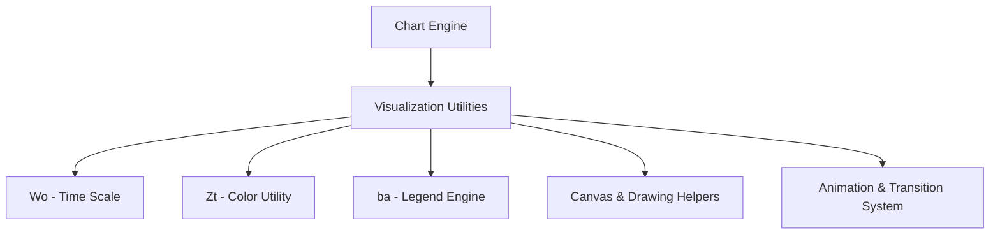
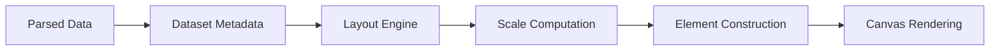
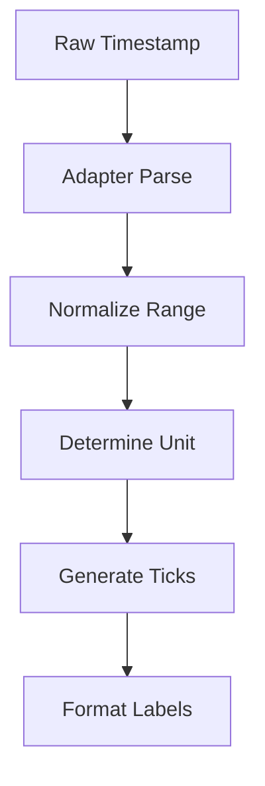
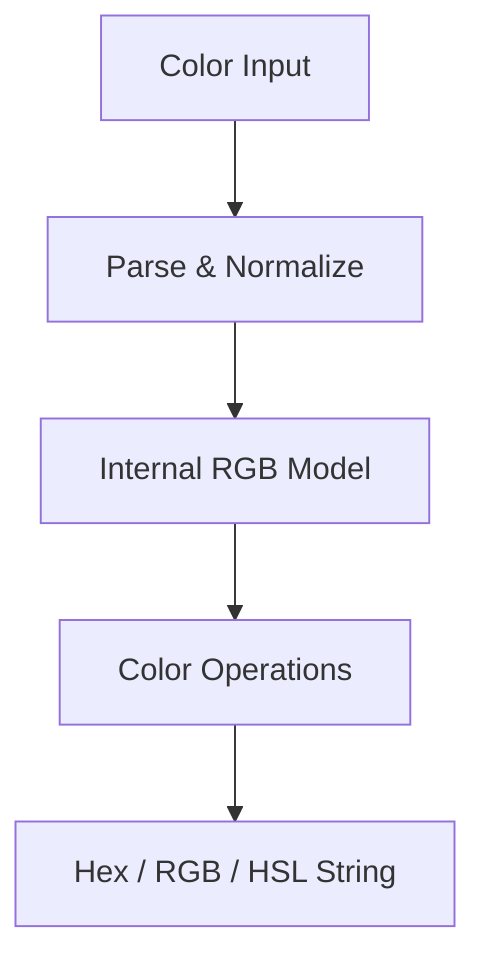
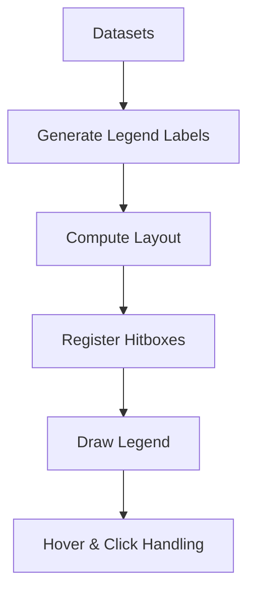
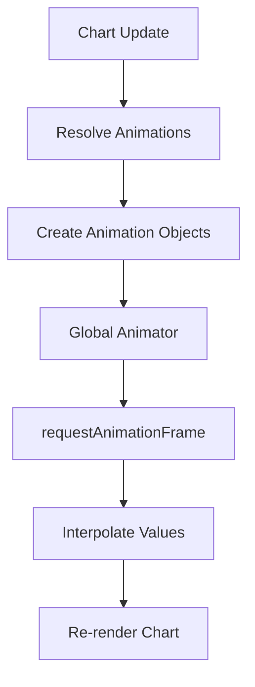
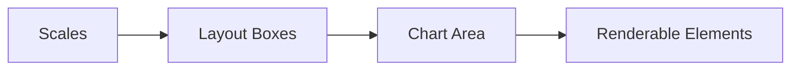
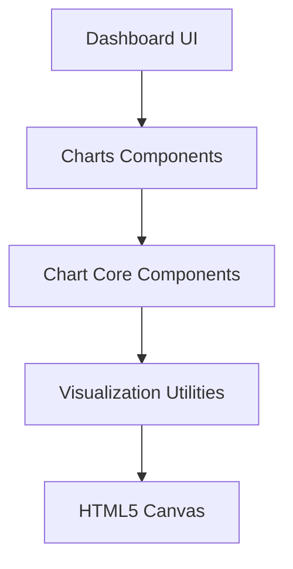

# Visualization Utilities

The **Visualization Utilities** module provides the low-level rendering, color processing, animation, and drawing helpers that power chart visualization within the Charts Components subsystem. Built on top of Chart.js v4.3.3, this module encapsulates reusable primitives used by higher-level chart logic and utility layers.

It acts as the rendering foundation for chart elements such as lines, bars, arcs, scales, legends, tooltips, and layout managers.

---

## Module Position in the Architecture

The Visualization Utilities module is part of the Charts Components hierarchy:

- Parent module: [Chart Utility Components](../chart-utility-components/chart-utility-components.md)
- Root charts module: [Charts Components](../../charts-components/charts-components.md)

It provides reusable rendering and styling utilities that are consumed by:

- Chart Core Components
- Chart Advanced Components
- Higher-level visualization and dashboard features

---

## Core Components

This module exposes the following core components from `public/scripts/charts.js`:

- `meshcentral.public.scripts.charts.Wo`
- `meshcentral.public.scripts.charts.Zt`
- `meshcentral.public.scripts.charts.ba`

These map to the following logical responsibilities:

| Component | Responsibility |
|-----------|---------------|
| `Wo` | Time scale utilities (time axis, parsing, tick generation) |
| `Zt` | Color utility class (color parsing, manipulation, blending) |
| `ba` | Legend layout and rendering engine |

---

# High-Level Architecture

The module bundles several internal subsystems:

- Rendering pipeline
- Scale calculation logic
- Color processing
- Layout computation
- Animation controller
- Tooltip and legend rendering

---

# Rendering Pipeline

Visualization Utilities define the drawing lifecycle used by all chart types.

### Key Responsibilities

- Coordinate calculation
- Pixel alignment
- Bezier curve interpolation
- Path building
- Clipping regions
- Hit detection

The rendering layer abstracts raw Canvas API usage behind reusable helpers.

---

# Time Scale Utilities (Wo)

The `Wo` component implements time-based axis support.

## Responsibilities

- Parsing timestamps
- Normalizing datasets
- Generating time ticks
- Handling time units (millisecond → year)
- Adaptive tick spacing

### Features

- ISO week support
- Auto unit selection
- Adaptive label capacity
- Pixel-to-time interpolation

This component ensures consistent time visualization across dashboards and reporting views.

---

# Color Utility (Zt)

The `Zt` class provides a full color abstraction layer.

## Supported Features

- Hex parsing
- RGB / RGBA
- HSL / HSLA
- HSV / HWB
- Named colors
- Alpha blending
- Interpolation
- Lighten / Darken
- Saturate / Desaturate
- Rotation (hue shift)

### Example Internal Capabilities

- `mix()` — blend two colors
- `alpha()` — adjust transparency
- `lighten()` / `darken()` — modify luminance
- `rotate()` — hue rotation

This abstraction enables consistent styling and theming across charts.

---

# Legend Engine (ba)

The `ba` component manages legend layout and rendering.

## Responsibilities

- Generating legend items
- Layout computation (rows/columns)
- Hitbox tracking
- Hover detection
- Click interactions
- Responsive positioning

### Layout Modes

- Horizontal (top / bottom)
- Vertical (left / right)
- Alignment options
- RTL support

The legend engine integrates tightly with chart metadata to reflect visibility changes dynamically.

---

# Animation and Transition System

The module includes a robust animation controller:

## Capabilities

- Easing functions (linear, cubic, elastic, bounce, etc.)
- Per-property animation
- Dataset-level transitions
- Resize transitions
- Progressive rendering

The animation engine coordinates with dataset controllers and element classes.

---

# Layout Engine Integration

Visualization Utilities work alongside the layout system to calculate:

- Chart area
- Padding
- Scale regions
- Title and subtitle blocks
- Legend placement

This ensures adaptive resizing and proper spacing across screen sizes.

---

# Interaction Utilities

The module defines interaction modes such as:

- Nearest
- Index
- Dataset
- X-axis / Y-axis proximity

It provides hit-testing logic used by:

- Tooltips
- Legends
- Hover states
- Click handlers

---

# How It Fits Into the System

Visualization Utilities act as the **rendering backbone** for all chart types.

Higher-level modules define:

- What to render (data, configuration)
- How to configure datasets
- Business logic

Visualization Utilities define:

- How it is rendered
- How it animates
- How it scales
- How it interacts

---

# Key Design Principles

- **Canvas-first rendering** for performance
- **Composable elements** (Arc, Line, Bar, Point)
- **Scale abstraction** (Linear, Logarithmic, Time, Radial)
- **Adapter-based time parsing**
- **Centralized animation manager**
- **Pluggable legend and tooltip system**

---

# Summary

The **Visualization Utilities** module provides:

- Time scale logic (`Wo`)
- Color engine (`Zt`)
- Legend rendering (`ba`)
- Layout engine integration
- Animation framework
- Canvas drawing helpers
- Interaction utilities

It forms the rendering core beneath all chart-based visualizations within the Charts Components subsystem and ensures consistent, high-performance, and flexible data visualization behavior across the application.
