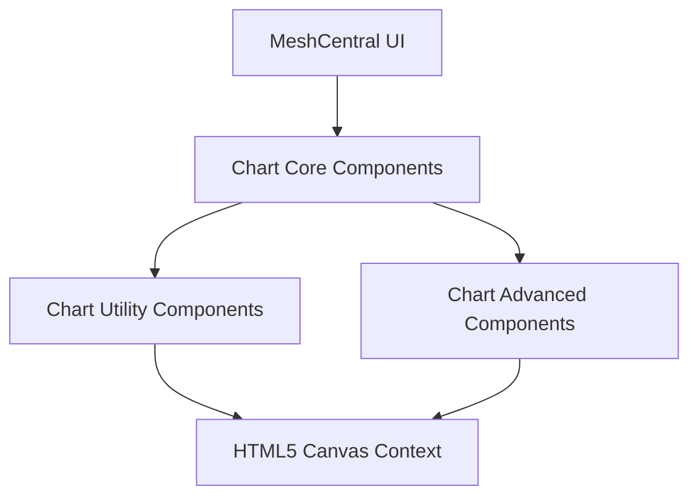
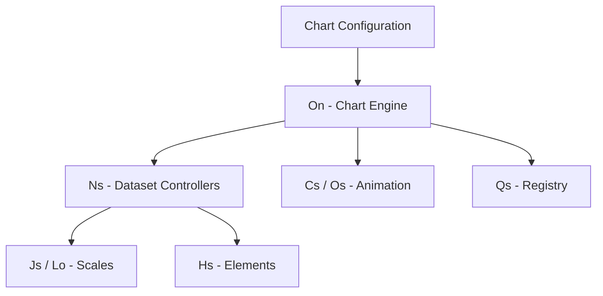
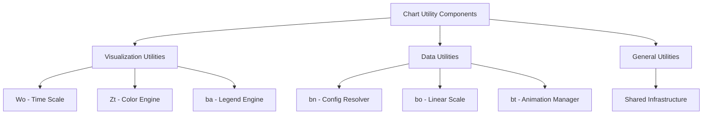
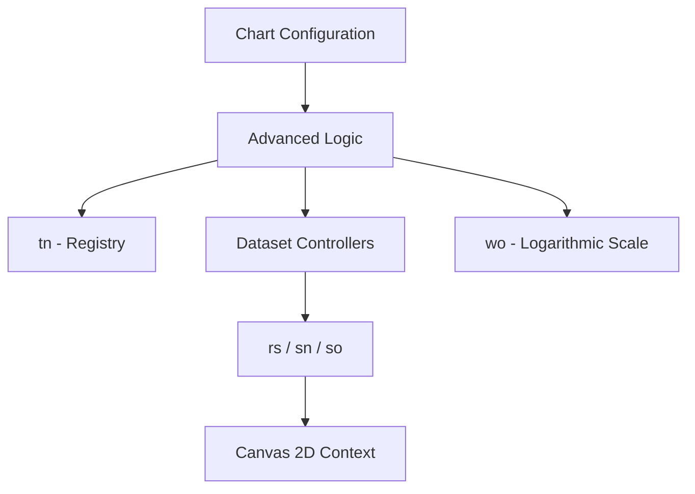
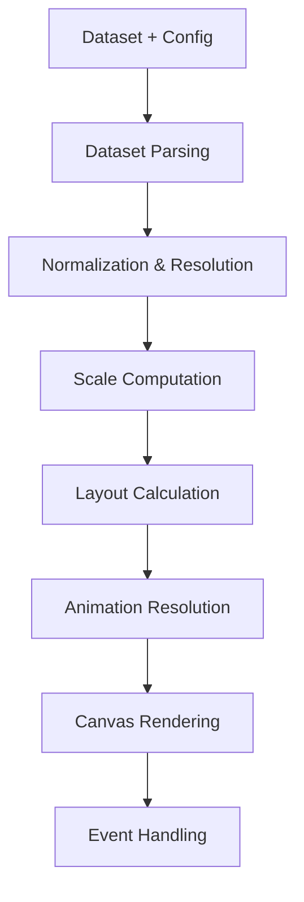
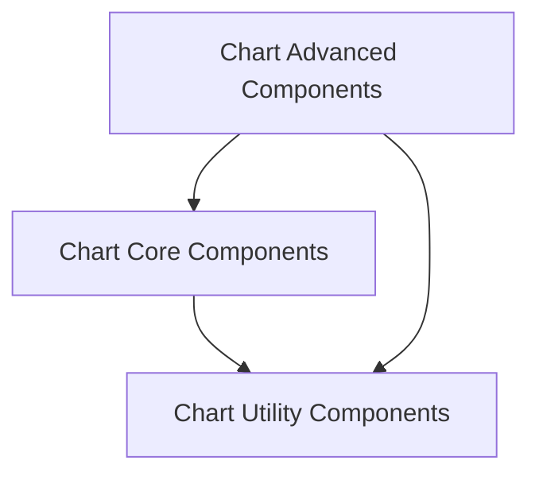

# Charts Components

The **Charts Components** module provides the complete charting infrastructure for the MeshCentral frontend. Located under `public/scripts`, it integrates a layered architecture built on top of Chart.js (v4.x), enabling interactive, animated, and extensible visualizations rendered on an HTML5 canvas.

This module is responsible for:

- Rendering dashboards and statistical visualizations  
- Managing datasets and scale computation  
- Handling animation lifecycles  
- Providing plugin and registry extensibility  
- Supporting advanced chart types and interactions  

It is organized into three major submodules:

1. **Chart Core Components**
2. **Chart Utility Components**
3. **Chart Advanced Components**

---

## Repository Structure

**Path:** `public/scripts`

```text
public/scripts/
└── charts/
    ├── Cs
    ├── Fa
    ├── Hn
    ├── Hs
    ├── Js
    ├── Ln
    ├── Lo
    ├── Ns
    ├── On
    ├── Os
    ├── Qs
    ├── Wo
    ├── Zt
    ├── ba
    ├── bn
    ├── bo
    ├── bt
    ├── de
    ├── jn
    ├── la
    ├── ls
    ├── mo
    ├── rs
    ├── sn
    ├── so
    ├── tn
    ├── wo
    ├── ws
    └── ya
```

---

# Architectural Overview

The Charts Components module follows a layered architecture:



### Layer Responsibilities

| Layer | Responsibility |
|--------|---------------|
| Chart Core Components | Lifecycle orchestration, dataset controllers, registry |
| Chart Utility Components | Scaling, parsing, animation primitives, rendering helpers |
| Chart Advanced Components | Advanced scales, plugin system, interaction intelligence |
| Canvas | Low-level drawing output |

---

# 1. Chart Core Components

The **Chart Core Components** module forms the structural and lifecycle backbone of the charting engine.

### Primary Components

- `Cs` – Animation engine  
- `Fa` – Tooltip engine  
- `Hn` – Radial data utilities  
- `Hs` – Base element abstraction  
- `Js` – Base scale  
- `Ln` – Date adapter abstraction  
- `Lo` – Radial linear scale  
- `Ns` – Dataset controller  
- `On` – Chart engine runtime  
- `Os` – Animation resolver  
- `Qs` – Typed registry  

### Architecture



### Documentation

- See **Chart Core Components** documentation  
- Subsections:
  - Chart Core Utilities  
  - Chart Core Logic  
  - Chart Core Operations  

---

# 2. Chart Utility Components

The **Chart Utility Components** module provides shared infrastructure for rendering, data handling, configuration resolution, and layout management.

### Primary Components

- `Wo` – Time scale utilities  
- `Zt` – Color engine  
- `ba` – Legend engine  
- `bn` – Configuration resolver  
- `bo` – Linear scale engine  
- `bt` – Animation manager  
- `de` – Defaults resolver  
- `jn`, `la`, `ls`, `mo` – Shared helpers  

### Internal Structure



### Responsibilities

- Dataset parsing and normalization  
- Tick generation and scale mapping  
- Configuration merging and resolution  
- Color manipulation and layout logic  
- Centralized animation coordination  

### Documentation

- See **Chart Utility Components** documentation  
  - Visualization Utilities  
  - Data Utilities  
  - General Utilities  

---

# 3. Chart Advanced Components

The **Chart Advanced Components** module provides advanced rendering intelligence, scale implementations, and plugin-driven extensibility.

### Primary Components

- `rs`, `sn`, `so` – Advanced visualization engine  
- `tn` – Registry system  
- `wo` – Logarithmic scale  
- `ws`, `ya` – Advanced utilities  

### Architecture



### Responsibilities

- Plugin lifecycle coordination  
- Advanced numeric scales  
- Interaction modes (nearest, index, dataset)  
- Dataset stacking logic  
- Animation scheduling and batching  
- Overlay rendering (tooltip, legend, titles)  

### Documentation

- See **Chart Advanced Components** documentation  
  - Chart Advanced Visualization  
  - Chart Advanced Logic  
  - Chart Advanced Utilities  

---

# End-to-End Rendering Pipeline

The full rendering lifecycle flows through all submodules:



This guarantees:

- Deterministic rendering order  
- Smooth animated transitions  
- Interaction-aware redraw cycles  
- Extensibility through registry and plugins  

---

# Submodule Relationships



- **Core** orchestrates lifecycle and datasets  
- **Utilities** provide reusable infrastructure  
- **Advanced** enhances rendering intelligence and extensibility  

---

# Design Principles

The Charts Components module is built on:

- Strict separation of concerns  
- Registry-driven extensibility  
- Deterministic update lifecycle  
- Animation-first rendering model  
- Canvas-based high-performance drawing  
- Plugin-oriented architecture  

---

# Summary

The **Charts Components** module is the complete charting framework within MeshCentral’s frontend.

It:

- Manages chart lifecycle and dataset controllers  
- Provides scale, animation, and configuration infrastructure  
- Implements advanced scale logic and plugin systems  
- Renders interactive charts to an HTML5 canvas  
- Supports extensible and modular visualization patterns  

By combining **Chart Core**, **Chart Utility**, and **Chart Advanced** layers, it delivers a scalable, high-performance, and extensible charting system fully integrated into the MeshCentral UI.