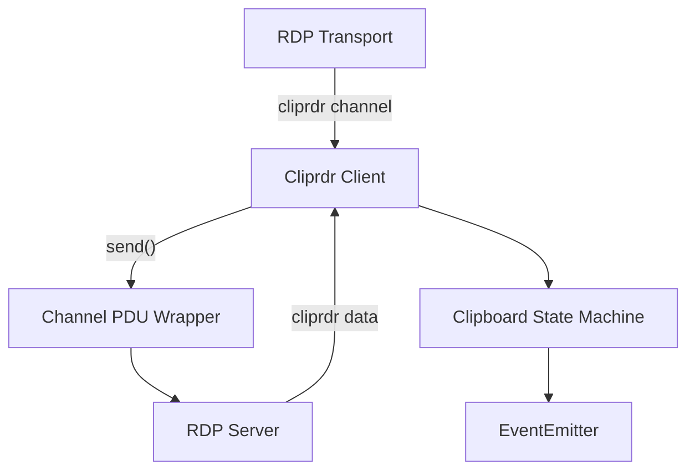
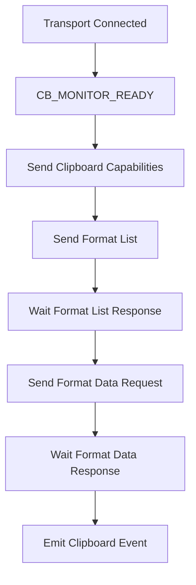
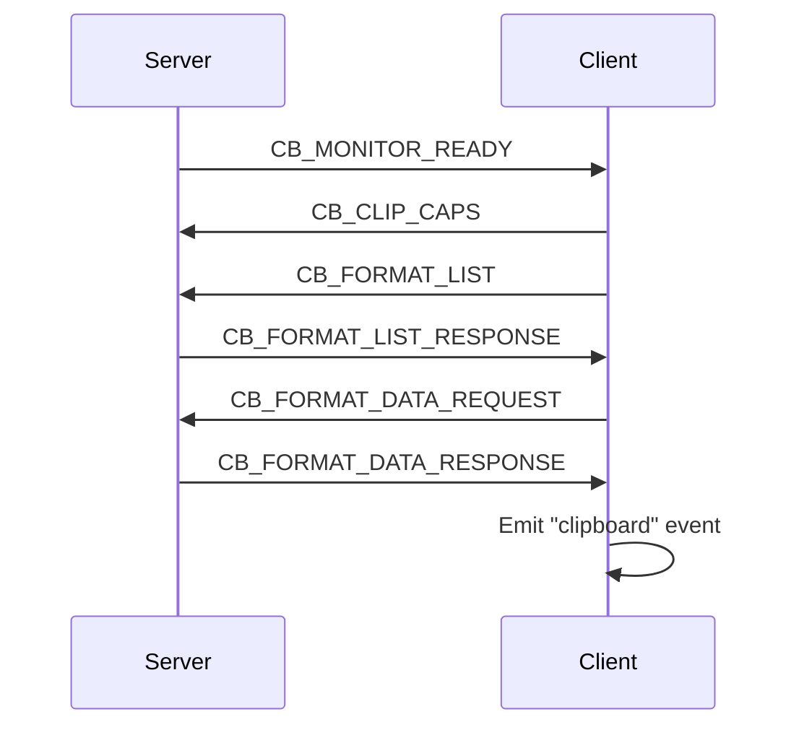
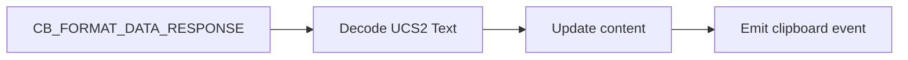
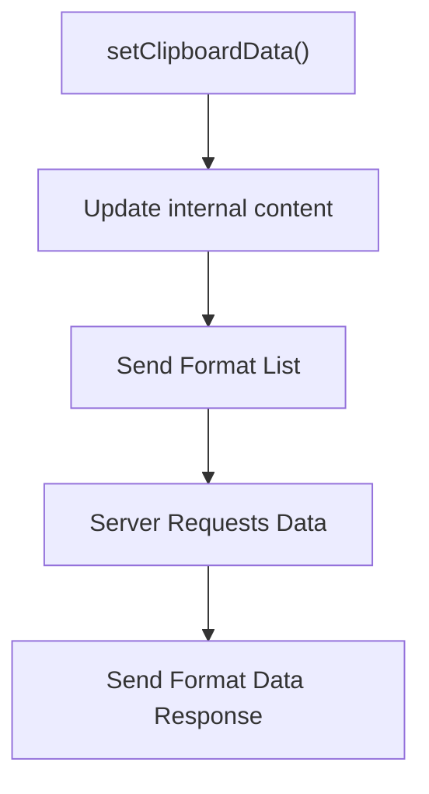

# Cliprdr

The **Cliprdr** module implements the RDP Clipboard Virtual Channel (CLIPRDR) protocol for MeshCentral. It is responsible for negotiating clipboard capabilities and transferring clipboard data (primarily text in the current implementation) between an RDP client and server.

This module operates at the RDP PDU layer and integrates with the RDP transport stack. It handles:

- Clipboard capability negotiation
- Clipboard format advertisement
- Clipboard data request/response handling
- Event-driven clipboard updates

The implementation is centered around two primary classes:

- `Cliprdr` – Base channel abstraction
- `Client` – Client-side clipboard channel state machine

---

## Architectural Overview

The Cliprdr module sits on top of the RDP transport and exchanges Protocol Data Units (PDUs) over the `cliprdr` virtual channel.



### Key Responsibilities

| Component | Responsibility |
|------------|----------------|
| Cliprdr | Base channel abstraction and state container |
| Client | Client-side protocol automation and PDU handling |
| Transport | Delivers and receives `cliprdr` channel messages |
| data.clipPDU() | Parses and constructs Clipboard PDUs |

---

## Core Components

### Cliprdr (Base Class)

The `Cliprdr` class extends `EventEmitter` and provides:

- Transport binding
- Channel metadata (userId, channelId)
- Capability storage
- Base event infrastructure

It does not implement protocol logic directly. That responsibility is delegated to the `Client` subclass.

### Client (Client-Side Automaton)

The `Client` class extends `Cliprdr` and implements the full clipboard negotiation and transfer workflow.

Key properties:

- `transport` – Underlying RDP transport
- `userId` – RDP user session ID
- `channelId` – Assigned channel identifier
- `content` – Current clipboard string data

The class registers transport event listeners:

- `connect` – Initializes channel state
- `cliprdr` – Receives channel PDUs

---

## Protocol State Machine

The Client implements a simplified RDP Clipboard Virtual Channel state machine.



### Incoming PDU Types Handled

| Message Type | Handler |
|--------------|----------|
| CB_MONITOR_READY | `recvMonitorReadyPDU()` |
| CB_FORMAT_LIST | `recvFormatListPDU()` |
| CB_FORMAT_LIST_RESPONSE | `recvFormatListResponsePDU()` |
| CB_FORMAT_DATA_REQUEST | `recvFormatDataRequestPDU()` |
| CB_FORMAT_DATA_RESPONSE | `recvFormatDataResponsePDU()` |
| CB_CLIP_CAPS | `recvClipboardCapsPDU()` |

---

## Clipboard Negotiation Flow

The following sequence diagram illustrates a typical negotiation between the client and server.



### Step-by-Step Description

1. Server sends `CB_MONITOR_READY`.
2. Client responds with clipboard capabilities.
3. Client advertises supported formats.
4. Server acknowledges format list.
5. Client requests data for a specific format.
6. Server returns clipboard data.
7. Client updates internal content and emits a `clipboard` event.

---

## Data Encoding and Format Handling

### Supported Formats (Current Implementation)

The client advertises multiple clipboard format identifiers, including:

- Unicode text
- Native format
- Standard text identifiers

Clipboard text is encoded using UCS-2 (UTF-16LE compatible) via:

```text
Buffer.from(content + '\x00', 'ucs2')
```

This ensures:

- Null-terminated string
- Windows-compatible clipboard encoding

---

## Sending and Receiving PDUs

All PDUs are wrapped using a `type.Component` structure:

```text
Channel PDU Header
- UInt32Le: Total Size
- UInt32Le: Channel Flags (0x13)
- Clipboard Message Payload
```

The `send()` method ensures:

- Proper size calculation
- Required channel flags
- Encapsulation into the cliprdr virtual channel

Incoming messages are parsed using `data.clipPDU().read(stream)` after setting the correct offset.

---

## Event Model

The Cliprdr module emits events using Node.js `EventEmitter`.

### Emitted Events

| Event | Description |
|-------|--------------|
| clipboard | Fired when new clipboard content is received |

Example logical flow:



Consumers of this module can subscribe to clipboard updates:

```javascript
client.on('clipboard', (text) => {
    console.log('Clipboard updated:', text);
});
```

---

## Clipboard Write Workflow

The module also allows programmatic clipboard updates:

```javascript
client.setClipboardData('New content');
```

This performs:

1. Updates internal `content`
2. Sends a new `CB_FORMAT_LIST`
3. Triggers format negotiation
4. Responds to server data requests



---

## Integration Within the RDP Stack

The Cliprdr module integrates with:

- RDP transport layer
- PDU parsing utilities
- Virtual channel infrastructure

It depends on:

- `type` utilities for structured binary encoding
- `data` module for PDU definitions
- Node.js `EventEmitter`

The module is transport-agnostic beyond requiring a transport that:

- Emits `connect`
- Emits `cliprdr` data events
- Supports `send(channelName, payload)`

---

## Security Considerations

- Clipboard content is transmitted in plain UCS-2 format at the Cliprdr layer.
- Transport-level encryption (TLS or RDP security) must secure the channel.
- No internal validation or sanitization is applied to clipboard data.
- Only basic text exchange is implemented; advanced formats are partially stubbed.

---

## Current Limitations

- Primarily supports text clipboard exchange
- Partial capability parsing
- Limited error handling
- File transfer and advanced clipboard formats are not fully implemented

---

## Summary

The Cliprdr module implements a client-side RDP Clipboard Virtual Channel handler. It manages capability negotiation, format advertisement, and text clipboard data exchange through an event-driven architecture.

Its design emphasizes:

- Clear PDU encapsulation
- Minimal state machine logic
- Event-based clipboard updates
- Compatibility with standard RDP clipboard negotiation

This module forms a critical bridge between the RDP session and higher-level clipboard consumers in MeshCentral.