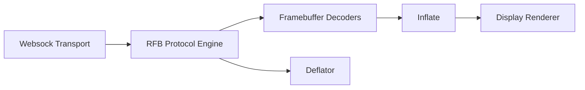
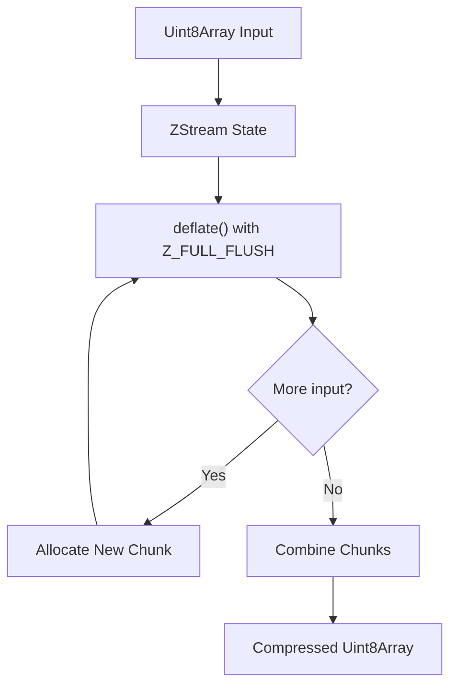
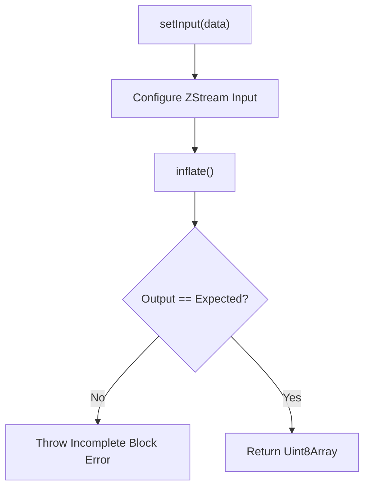
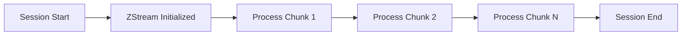

# Compression

The **Compression** module provides low-level data compression and decompression services for the noVNC-based remote display stack used within MeshCentral. It wraps zlib functionality (via the embedded pako library) into streamlined, stateful JavaScript classes that are optimized for streaming binary data over WebSocket connections.

This module plays a critical role in:

- Reducing bandwidth usage during remote sessions
- Supporting compressed VNC encodings (such as Tight and ZRLE)
- Handling zlib streams used by the RFB protocol
- Enabling efficient binary transport through the Websock layer

The module consists of two core components:

- `Deflator` — Handles zlib-based compression
- `Inflate` — Handles zlib-based decompression

Both components are built around the zlib streaming model and operate on `Uint8Array` buffers.

---

## Architectural Overview

The Compression module sits between protocol handling (RFB) and the transport layer (Websock), and is frequently used by decoders that require compressed framebuffer data.



### Responsibilities in the Pipeline

- **Incoming Data Path**:
  1. Compressed binary data arrives via Websock
  2. RFB determines encoding type
  3. Decoders request decompression via `Inflate`
  4. Decompressed pixel data is passed to Display

- **Outgoing Data Path (if applicable)**:
  1. Raw binary data prepared by RFB
  2. `Deflator` compresses payload
  3. Websock transmits compressed stream

---

## Core Components

### 1. Deflator

**Component:** `meshcentral.public.novnc.core.deflator.Deflator`

The `Deflator` class provides a streaming wrapper around zlib's deflate algorithm using the pako implementation.

#### Key Characteristics

- Uses `Z_DEFAULT_COMPRESSION`
- Applies `Z_FULL_FLUSH` during deflation
- Operates on `Uint8Array`
- Handles chunked compression internally
- Returns a single contiguous compressed buffer

#### Internal Design



#### Processing Flow

1. Input buffer assigned to `ZStream`
2. Initial deflate executed
3. If `avail_in > 0`, additional chunks are processed
4. Chunks are concatenated into a single `Uint8Array`
5. Internal input pointers are reset

#### Error Handling

- Throws `Error("zlib deflate failed")` on negative return codes

This ensures upstream components (e.g., RFB) can fail fast and terminate the session safely if compression becomes inconsistent.

---

### 2. Inflate

**Component:** `meshcentral.public.novnc.core.inflator.Inflate`

The `Inflate` class wraps zlib's inflate functionality and is designed for predictable, bounded decompression.

Unlike `Deflator`, `Inflate` expects a known decompressed size (`expected`) and validates output length strictly.

#### Key Characteristics

- Uses streaming `ZStream`
- Allows dynamic resizing of output buffer
- Validates full decompression against expected size
- Supports state reset

#### Internal Design



#### Methods

**setInput(data)**
- Assigns input buffer to the zlib stream
- Resets input state if `null`

**inflate(expected)**
- Resizes output buffer if needed
- Decompresses exactly `expected` bytes
- Throws error if output size mismatch

**reset()**
- Calls `inflateReset()` to reinitialize state

#### Error Handling

- `Error("zlib inflate failed")` on inflate failure
- `Error("Incomplete zlib block")` if decompressed size mismatches expected length

This strict validation is critical for:

- Preventing corrupted framebuffer rendering
- Avoiding protocol desynchronization
- Detecting malformed or malicious payloads

---

## Integration with Other Modules

The Compression module is tightly coupled with several higher-level modules:

### RFB and Display
- RFB orchestrates encoding negotiation
- Compressed encodings depend on Inflate
- Display receives decompressed pixel buffers

### Decoders
Encodings such as Tight and ZRLE rely on zlib compression internally. These decoders:

- Feed compressed segments into `Inflate`
- Request exact byte lengths
- Convert decompressed data into pixel regions

### Websock
- Transports compressed binary data
- Provides raw buffers to RFB

---

## Streaming Model

Both components use a persistent `ZStream` instance, meaning:

- Compression and decompression are stateful
- Context (dictionary/history) is preserved across calls
- Reset must be invoked explicitly when required



This model is essential for:

- Efficient framebuffer delta updates
- Maintaining sliding window compression efficiency
- Handling long-lived remote desktop sessions

---

## Memory Management Strategy

### Fixed Initial Chunk Size

Both classes initialize with:

```text
chunkSize = 1024 * 10 * 10
```

This provides a balanced default buffer size for typical framebuffer segments.

### Dynamic Resizing (Inflate Only)

`Inflate` increases its output buffer when the expected size exceeds the default chunk size. This avoids:

- Repeated allocations
- Post-processing chunk flattening

### Chunk Aggregation (Deflator Only)

`Deflator` collects multiple compressed chunks and merges them into a single contiguous buffer before returning.

---

## Failure Modes and Defensive Design

The Compression module is designed to fail fast and visibly in the following scenarios:

- Corrupted zlib stream
- Incorrect expected decompression length
- Internal zlib return errors

By throwing explicit exceptions, upstream modules can:

- Abort rendering safely
- Close the WebSocket session
- Trigger protocol recovery

---

## Summary

The **Compression** module provides a minimal, robust abstraction over zlib compression for the noVNC-based remote desktop stack.

Its design emphasizes:

- Streaming efficiency
- Deterministic output validation
- Controlled memory allocation
- Clear error signaling

Together, `Deflator` and `Inflate` form the foundational compression layer that enables efficient, secure, and scalable remote desktop sessions within MeshCentral.