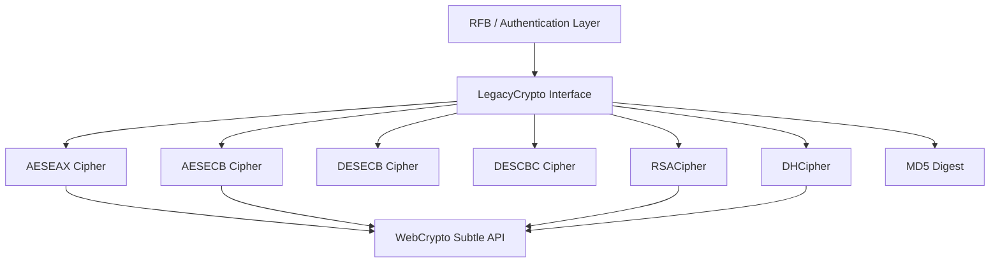
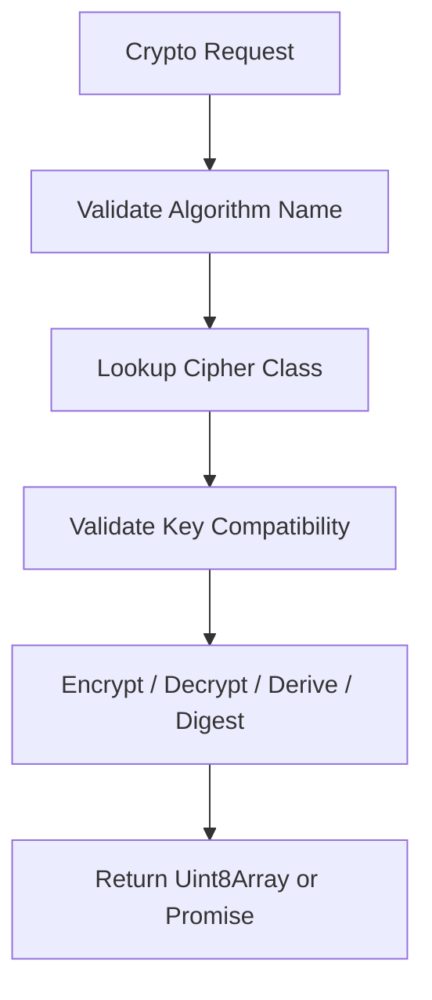
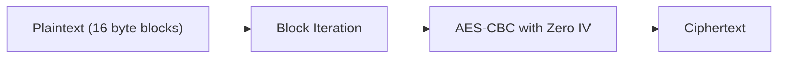
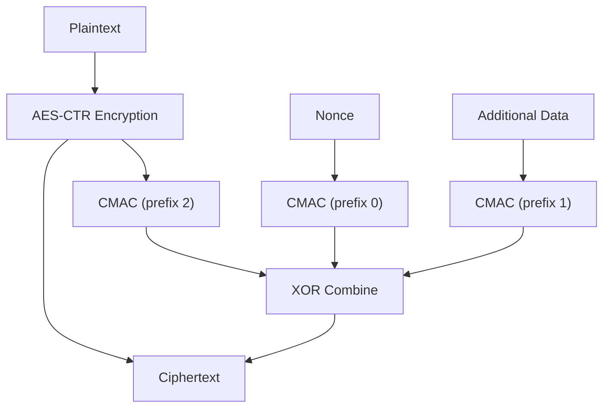
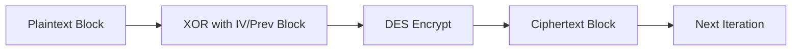
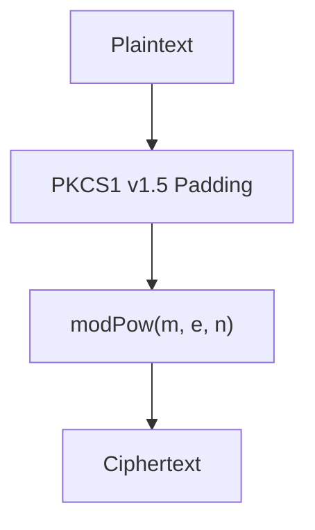
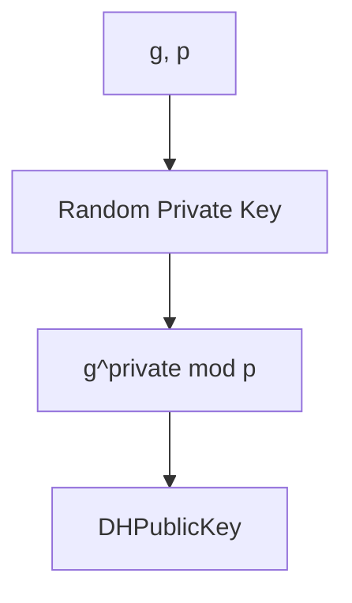

# Crypto Components

The **Crypto Components** module provides cryptographic primitives used by the noVNC client within MeshCentral. It implements legacy and protocol-specific algorithms that are either not fully supported by the browser `SubtleCrypto` API or require custom behavior to match VNC/RFB specifications.

This module is responsible for:

- Symmetric encryption (AES, DES)
- Authenticated encryption (AES-EAX)
- Asymmetric encryption (RSA-PKCS1-v1_5)
- Key exchange (Diffie–Hellman)
- Digest support (MD5 via LegacyCrypto integration)
- A unified compatibility interface for non-standard crypto operations

It plays a critical role in securing Remote Framebuffer (RFB) sessions, authentication handshakes, and key negotiations.

---

## Architectural Overview

The module centers around a compatibility layer (`LegacyCrypto`) that exposes a WebCrypto-like interface while delegating to algorithm-specific cipher implementations.

### Key Design Principles

- **WebCrypto-first approach** where possible
- **Protocol compatibility** with VNC/RFB security types
- **Fallback and extension layer** for algorithms not directly supported
- **Minimal surface API** mirroring `window.crypto.subtle`

---

# Core Components

## LegacyCrypto

**Component:** `meshcentral.public.novnc.core.crypto.crypto.LegacyCrypto`

`LegacyCrypto` acts as a unified abstraction layer for cryptographic operations not natively handled by the browser or requiring protocol-specific behavior.

### Responsibilities

- Algorithm dispatching via an internal registry
- Key import/export abstraction
- Encryption/decryption delegation
- Digest operations
- Diffie–Hellman bit derivation

### Supported Algorithms

- AES-ECB
- AES-EAX
- DES-ECB
- DES-CBC
- RSA-PKCS1-v1_5
- DH
- MD5

### Logical Flow

This design allows protocol layers (such as RFB authentication) to interact with a consistent API regardless of the underlying algorithm.

---

# Symmetric Encryption

## AESECB Cipher

**Component:** `meshcentral.public.novnc.core.crypto.aes.AESECBCipher`

Implements AES in ECB mode using the WebCrypto `AES-CBC` primitive internally with a zero IV per block.

### Characteristics

- 16-byte block size
- No padding logic (caller must provide aligned input)
- Encrypt-only implementation
- Used for compatibility with legacy VNC mechanisms

### Processing Model

---

## AESEAX Cipher

**Component:** `meshcentral.public.novnc.core.crypto.aes.AESEAXCipher`

Implements AES-EAX authenticated encryption combining:

- AES-CTR for encryption
- AES-CBC-based CMAC for authentication

### Internal Structure

### Features

- Authenticated encryption
- 128-bit authentication tag
- Rejects invalid MAC during decryption
- Protects both ciphertext and additional authenticated data (AAD)

This mode is typically used in stronger VNC authentication/security types.

---

# DES Support

## DES Core

**Component:** `meshcentral.public.novnc.core.crypto.des.DES`

Implements classic DES block cipher logic including:

- Key scheduling
- Permutations
- S-box processing
- 16 Feistel rounds

Primarily maintained for compatibility with legacy VNC authentication schemes.

---

## DESECB Cipher

**Component:** `meshcentral.public.novnc.core.crypto.des.DESECBCipher`

- 8-byte block processing
- Direct block encryption
- No IV
- Used in classic VNC challenge-response flows

---

## DESCBCCipher

**Component:** `meshcentral.public.novnc.core.crypto.des.DESCBCCipher`

- CBC mode using DES
- Requires IV
- XOR chaining before block encryption

---

# Asymmetric Cryptography

## RSACipher

**Component:** `meshcentral.public.novnc.core.crypto.rsa.RSACipher`

Implements RSA with PKCS#1 v1.5 padding.

### Capabilities

- Key generation (via WebCrypto RSA-OAEP then exported to JWK)
- Public key import
- Encryption
- Decryption
- Optional key export (if extractable)

### Encryption Flow

RSA is used during secure authentication negotiation phases.

---

# Key Exchange

## DHCipher and DHPublicKey

**Components:**

- `meshcentral.public.novnc.core.crypto.dh.DHCipher`
- `meshcentral.public.novnc.core.crypto.dh.DHPublicKey`

Implements Diffie–Hellman key exchange using big integer modular exponentiation.

### Key Generation

### Shared Secret Derivation

### Characteristics

- Uses browser randomness
- Converts between `Uint8Array` and `BigInt`
- Supports `deriveBits`

Used for negotiating shared symmetric keys during secure session setup.

---

# Security Considerations

- DES and AES-ECB are retained strictly for protocol compatibility.
- AES-EAX provides authenticated encryption and integrity protection.
- RSA uses PKCS#1 v1.5 padding, consistent with legacy RFB expectations.
- Diffie–Hellman relies on correct parameter selection (`g`, `p`) by higher layers.
- All modern operations leverage `window.crypto.subtle` when possible.

---

# Integration Within the System

The Crypto Components module supports higher-level modules such as:

- RFB session establishment
- Authentication negotiation
- Secure key exchange
- Encrypted framebuffer transport

It serves as the cryptographic foundation beneath remote desktop functionality while maintaining backward compatibility with legacy VNC security types.

---

# Summary

The **Crypto Components** module provides a comprehensive, protocol-aware cryptographic layer for MeshCentral’s noVNC client. It combines:

- Modern browser cryptography
- Custom algorithm implementations
- Legacy compatibility support
- Unified API abstraction

This architecture ensures secure remote session establishment while preserving compatibility with a wide range of VNC security configurations.