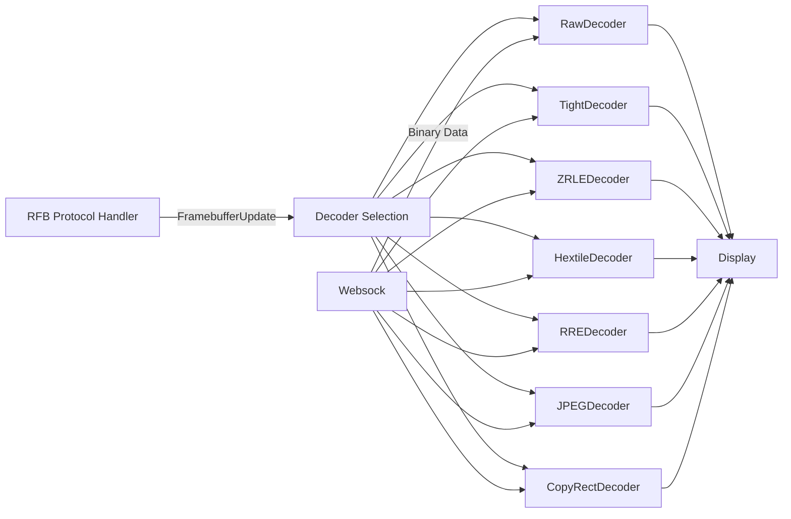
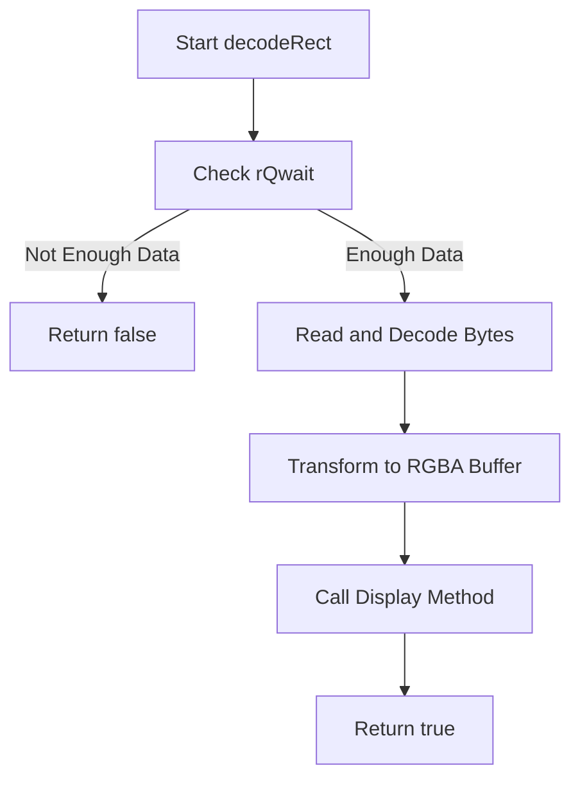
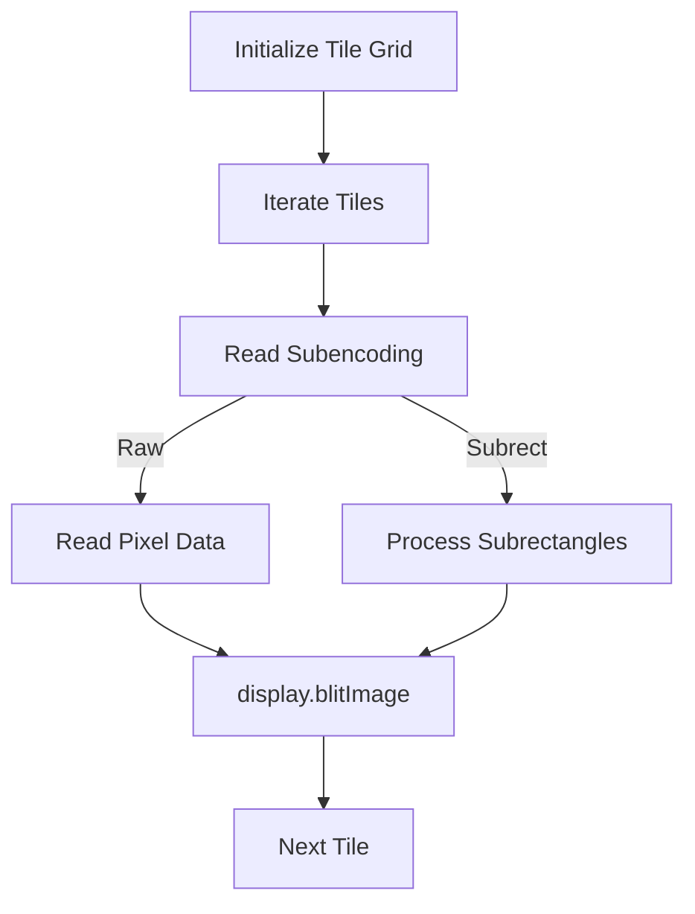
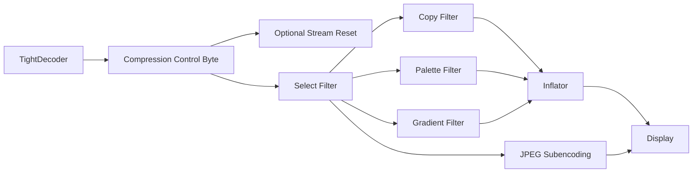
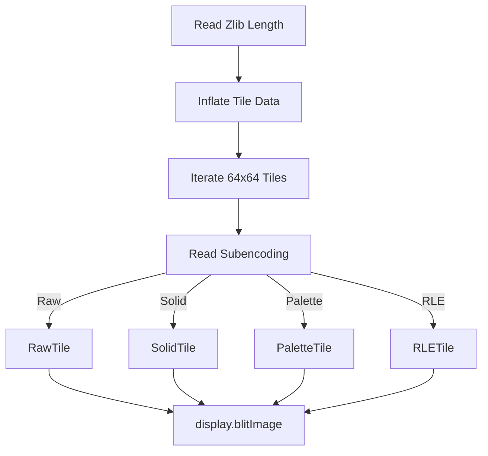

# Decoders

The **Decoders** module is a core part of the noVNC rendering pipeline within MeshCentral. It is responsible for translating encoded framebuffer updates received from a VNC server into raw pixel operations that can be rendered by the Display subsystem.

In the Remote Framebuffer (RFB) protocol, screen updates are transmitted using different *encodings* to optimize bandwidth and performance. The Decoders module implements these encoding strategies and converts them into drawing instructions such as pixel blits, fills, image draws, and copy operations.

---

## Purpose and Responsibilities

The Decoders module:

- Interprets framebuffer update rectangles from the RFB layer
- Reads binary data from the WebSocket receive queue
- Decodes various VNC encodings (Raw, CopyRect, Hextile, Tight, ZRLE, etc.)
- Produces pixel buffers or drawing commands
- Delegates final rendering to the Display component

It acts as a translation layer between:

- The **RFB protocol handler** (which selects the encoding)
- The **Websock** transport (which provides binary data)
- The **Display** subsystem (which renders pixels to the canvas)

---

## Supported Encodings

The module implements the following encoding decoders:

| Decoder | Encoding Type | Primary Use Case |
|----------|---------------|------------------|
| RawDecoder | Raw pixel stream | Simple, uncompressed updates |
| CopyRectDecoder | CopyRect | Move existing screen regions |
| RREDecoder | Rise-and-Run-length Encoding | Solid background + subrectangles |
| HextileDecoder | Hextile | Tile-based partial updates |
| TightDecoder | Tight | Compressed and filtered updates |
| TightPNGDecoder | TightPNG | PNG-based Tight variant |
| JPEGDecoder | JPEG | JPEG-compressed rectangles |
| ZRLEDecoder | ZRLE | Zlib + RLE tile encoding |

Each decoder implements a common method signature:

```text
decodeRect(x, y, width, height, sock, display, depth)
```

---

## High-Level Architecture

The Decoders module sits in the rendering pipeline as shown below:



### Key Interactions

- **Websock** supplies binary data via receive queue operations such as `rQwait`, `rQshiftBytes`, and `rQshift16`.
- **RFB** selects the correct decoder based on the encoding value in the framebuffer update message.
- **Display** receives drawing instructions such as:
  - `blitImage(...)`
  - `fillRect(...)`
  - `copyImage(...)`
  - `imageRect(...)`

---

## Decoder Execution Flow

All decoders follow a similar control pattern:



Returning `false` indicates that more data is needed before decoding can continue. This enables incremental decoding over asynchronous WebSocket streams.

---

# Decoder Implementations

## CopyRectDecoder

**Component:** `meshcentral.public.novnc.core.decoders.copyrect.CopyRectDecoder`

### Purpose
Optimizes bandwidth by copying an existing region of the framebuffer to a new location.

### Behavior
- Reads two 16-bit offsets (`deltaX`, `deltaY`)
- Calls `display.copyImage(...)`
- Does not decode pixel data

This is one of the cheapest encodings computationally.

---

## RawDecoder

**Component:** `meshcentral.public.novnc.core.decoders.raw.RawDecoder`

### Purpose
Handles uncompressed pixel data.

### Behavior
- Reads line-by-line pixel data
- Converts 8-bit depth to RGBA when required
- Forces alpha channel to fully opaque
- Calls `display.blitImage(...)`

### Characteristics
- Simple logic
- High bandwidth usage
- Minimal CPU overhead

---

## RREDecoder

**Component:** `meshcentral.public.novnc.core.decoders.rre.RREDecoder`

### Purpose
Encodes rectangles using:
- A single background color
- Multiple foreground subrectangles

### Behavior
1. Fill full rectangle with background color
2. Iterate through subrectangles
3. Render each via `display.fillRect(...)`

Efficient for large flat regions with small differences.

---

## HextileDecoder

**Component:** `meshcentral.public.novnc.core.decoders.hextile.HextileDecoder`

### Purpose
Divides rectangles into 16x16 tiles and encodes each tile separately.

### Capabilities
- Raw tile rendering
- Background/foreground reuse
- Subrectangle drawing

### Internal Flow



### Characteristics
- Reduces bandwidth compared to Raw
- More CPU-intensive than Raw

---

## JPEGDecoder

**Component:** `meshcentral.public.novnc.core.decoders.jpeg.JPEGDecoder`

### Purpose
Handles full JPEG image rectangles.

### Behavior
- Reads complete JPEG segments
- Reconstructs missing Huffman or quantization tables
- Concatenates segments
- Calls `display.imageRect(..., "image/jpeg", data)`

### Optimization
Caches quantization and Huffman tables across frames to reduce redundancy.

---

## TightDecoder

**Component:** `meshcentral.public.novnc.core.decoders.tight.TightDecoder`

### Purpose
Implements the Tight encoding, a highly efficient compression format.

### Features
- Zlib compression streams (4 parallel streams)
- Multiple filters:
  - Copy filter
  - Palette filter
  - Gradient filter
- Optional JPEG sub-encoding
- Solid fill optimization

### Compression Architecture



### Complexity
- Highest flexibility
- Excellent compression ratio
- Higher CPU cost

---

## TightPNGDecoder

**Component:** `meshcentral.public.novnc.core.decoders.tightpng.TightPNGDecoder`

### Purpose
Specialized variant of Tight encoding using PNG image data.

### Differences from TightDecoder
- Overrides PNG handling
- Disallows basic compression mode
- Calls `display.imageRect(..., "image/png", data)`

---

## ZRLEDecoder

**Component:** `meshcentral.public.novnc.core.decoders.zrle.ZRLEDecoder`

### Purpose
Combines Zlib compression with tile-based Run-Length Encoding.

### Tile Configuration
- Tile size: 64x64
- Each tile independently encoded

### Subencodings Supported
- Raw tile
- Solid color tile
- Palette-based tile
- RLE tile
- RLE + Palette tile

### Internal Flow



### Characteristics
- Very bandwidth efficient
- Higher decoding complexity
- Balanced performance for large desktop updates

---

# State Management and Streaming

Most decoders maintain internal state to support incremental decoding:

- Line counters (Raw)
- Subrectangle counters (RRE)
- Tile tracking (Hextile)
- Compression stream state (Tight)
- Zlib length tracking (ZRLE)

This design allows decoding to pause when insufficient data is available and resume seamlessly once more data arrives.

---

# Performance Considerations

| Encoding | Bandwidth | CPU Usage | Best For |
|----------|-----------|-----------|----------|
| Raw | High | Low | Small updates |
| CopyRect | Minimal | Minimal | Window moves |
| RRE | Low | Low | Solid UI regions |
| Hextile | Medium | Medium | Mixed graphics |
| JPEG | Very Low | Medium | Photo-like content |
| Tight | Very Low | High | General desktop |
| ZRLE | Very Low | High | Large screen updates |

---

# Integration with the Rendering Stack

The Decoders module works in coordination with:

- **RFB**: Determines which decoder to invoke
- **Websock**: Supplies binary data
- **Inflator/Deflator utilities**: Provide compression support
- **Display**: Executes final rendering operations

Together, these components form the real-time remote rendering pipeline used by MeshCentral’s browser-based remote desktop client.

---

# Summary

The Decoders module is a critical performance-sensitive component that:

- Translates compressed framebuffer updates into pixel operations
- Supports multiple VNC encoding strategies
- Maintains streaming state for incremental decoding
- Balances bandwidth efficiency against client CPU usage

Its design enables MeshCentral to deliver responsive, browser-based remote desktop sessions across a wide range of network conditions and server implementations.