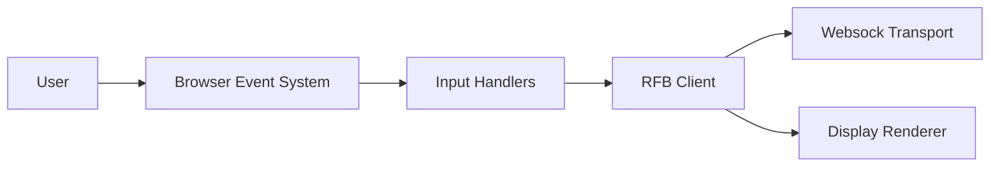
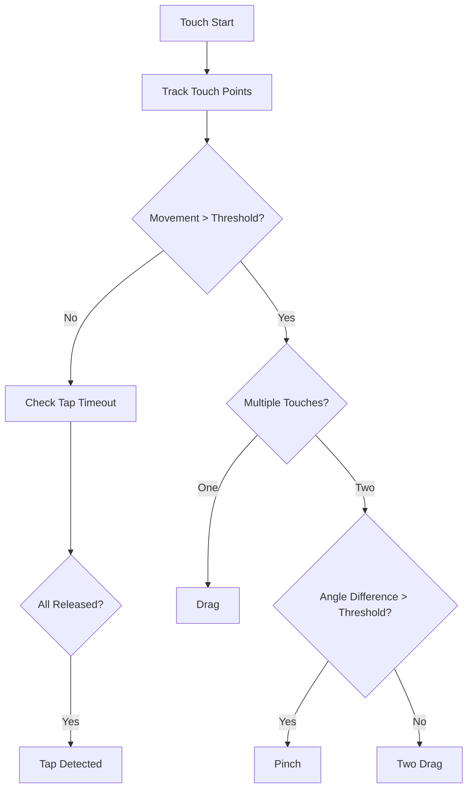
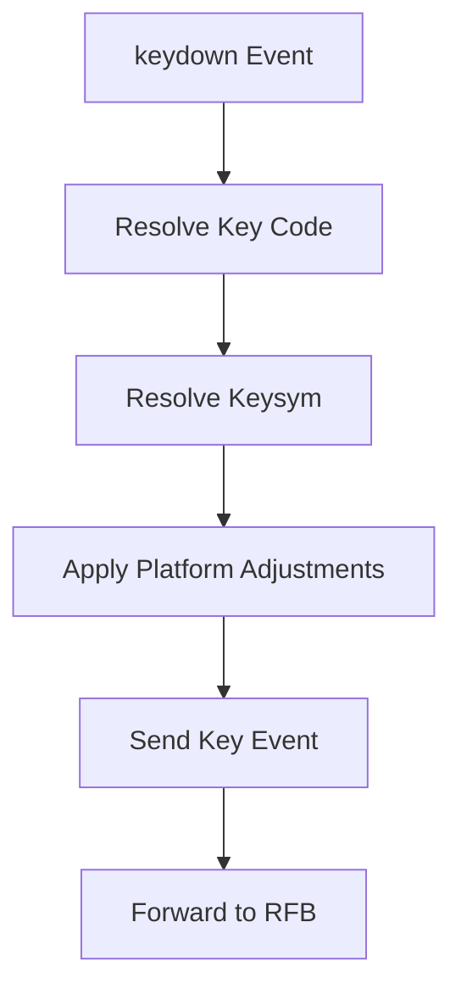
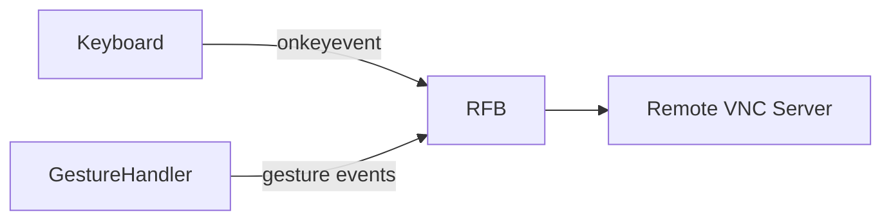

# Input Handlers

The **Input Handlers** module is responsible for capturing, normalizing, and translating user input events (keyboard and touch gestures) into structured events that can be transmitted to remote systems via the RFB protocol.

This module acts as the bridge between the browser's native input system and the remote desktop session managed by the RFB and Display layer. It ensures that user interactions are:

- Cross-platform compatible (Windows, macOS, Linux, iOS, Android)
- Browser-consistent
- Properly encoded into protocol-level representations (e.g., keysyms)
- Delivered in the correct order and state

The Input Handlers module consists of two core components:

- **GestureHandler** – Multi-touch gesture recognition and abstraction
- **Keyboard** – Cross-platform keyboard event normalization and keysym mapping

---

## Architectural Context

The Input Handlers module sits between the browser event system and the RFB client implementation.



### Responsibilities Within the System

| Layer | Responsibility |
|--------|----------------|
| Browser | Emits raw DOM events (keydown, touchstart, etc.) |
| Input Handlers | Normalize and interpret events |
| RFB | Encodes input into VNC protocol messages |
| Websock | Transports messages to remote server |
| Display | Renders remote framebuffer updates |

This separation ensures that input logic is modular and independent from networking and rendering concerns.

---

# Core Components

## GestureHandler

**Component:** `meshcentral.public.novnc.core.input.gesturehandler.GestureHandler`

The GestureHandler processes multi-touch events and converts them into high-level gesture events such as taps, drags, pinches, and long presses.

### Supported Gestures

| Gesture | Description |
|----------|-------------|
| onetap | Single quick tap |
| twotap | Two-finger tap |
| threetap | Three-finger tap |
| drag | Single-finger movement |
| twodrag | Two-finger parallel movement |
| pinch | Two-finger scaling gesture |
| longpress | Press and hold |

---

## Gesture Recognition Model

Gesture detection is implemented as a bitmask-based state machine.

Each possible gesture corresponds to a bit flag. As touch events occur, incompatible gestures are eliminated until only one valid gesture remains.



### Key Mechanisms

- **Bitmask State Filtering** – Removes incompatible gestures dynamically
- **Movement Threshold** – Prevents noise from triggering gestures
- **Angle Threshold** – Differentiates pinch from two-finger drag
- **Timeout-Based Decisions** – Resolves ambiguity between similar gestures
- **CustomEvent Dispatching** – Emits standardized gesture events

---

## Gesture Event Model

When a gesture is detected, a `CustomEvent` is dispatched:

- `gesturestart`
- `gesturemove`
- `gestureend`

Each event contains:

```text
{
  type: "pinch" | "drag" | "onetap" | ...,
  clientX: number,
  clientY: number,
  magnitudeX?: number,
  magnitudeY?: number
}
```

This abstraction ensures that the RFB layer receives clean, high-level input events.

---

## Keyboard

**Component:** `meshcentral.public.novnc.core.input.keyboard.Keyboard`

The Keyboard component captures and normalizes keyboard input across browsers and operating systems.

Its main goals are:

- Translate DOM keyboard events to X11 keysyms
- Maintain correct key press/release state
- Handle platform-specific inconsistencies
- Normalize modifier behavior (AltGr, CapsLock, Shift, etc.)

---

## Keyboard Event Flow



### Core Behaviors

#### 1. Key Tracking

Maintains an internal `_keyDownList` to:

- Prevent duplicate presses
- Ensure releases match correct keysyms
- Recover state on focus loss

#### 2. Platform Adaptation

Special logic exists for:

- **Windows** – AltGr emulation, Shift release bug workaround
- **macOS / iOS** – Modifier remapping, CapsLock handling, Meta-key behavior
- **Japanese IM keys** – Immediate press-release emulation

#### 3. AltGr Detection

Windows does not provide a real AltGr key. Instead:

- Detect rapid `ControlLeft` + `AltRight`
- Convert into ISO Level 3 Shift
- Prevent duplicate control events

This ensures correct character generation on non-Windows remote systems.

#### 4. Focus Recovery

When the browser window loses focus:

- All pressed keys are automatically released
- Prevents stuck modifier keys

---

## Integration with RFB

The Keyboard component exposes:

- `grab()` – Attach keyboard listeners
- `ungrab()` – Remove listeners and reset state
- `onkeyevent()` – Callback used by RFB to transmit events

GestureHandler integrates similarly by attaching to a DOM target and emitting normalized gesture events consumed by higher-level modules.



---

# Cross-Module Relationships

The Input Handlers module collaborates with:

- **RFB and Display** – Sends translated input to the remote session
- **Websock** – Transports encoded input over WebSocket
- **Utility modules** – Uses logging, browser detection, and event utilities

It does not perform:

- Rendering
- Network transport
- Cryptography
- Compression

This strict separation maintains clarity and modularity.

---

# Design Principles

## 1. Platform Consistency

Different browsers and operating systems emit inconsistent input events. This module abstracts those differences.

## 2. Stateless External API

Although internally stateful (tracking keys and gestures), the external interface emits deterministic, normalized events.

## 3. Defensive Event Handling

- Prevents propagation of raw DOM events
- Guards against ambiguous gesture states
- Automatically resolves conflicting states

## 4. Protocol-Oriented Output

All outputs are designed to map cleanly into VNC/RFB protocol messages.

---

# Summary

The **Input Handlers** module provides the critical translation layer between user interactions and remote desktop protocol communication.

It ensures that:

- Touch gestures are accurately recognized and classified
- Keyboard input is normalized across platforms
- Modifier and layout inconsistencies are corrected
- The remote session receives reliable, protocol-compliant input events

Without this module, remote control interactions would be inconsistent, unreliable, and platform-dependent.

The Input Handlers module therefore forms a foundational layer in the MeshCentral noVNC client architecture, enabling precise and robust remote interaction.