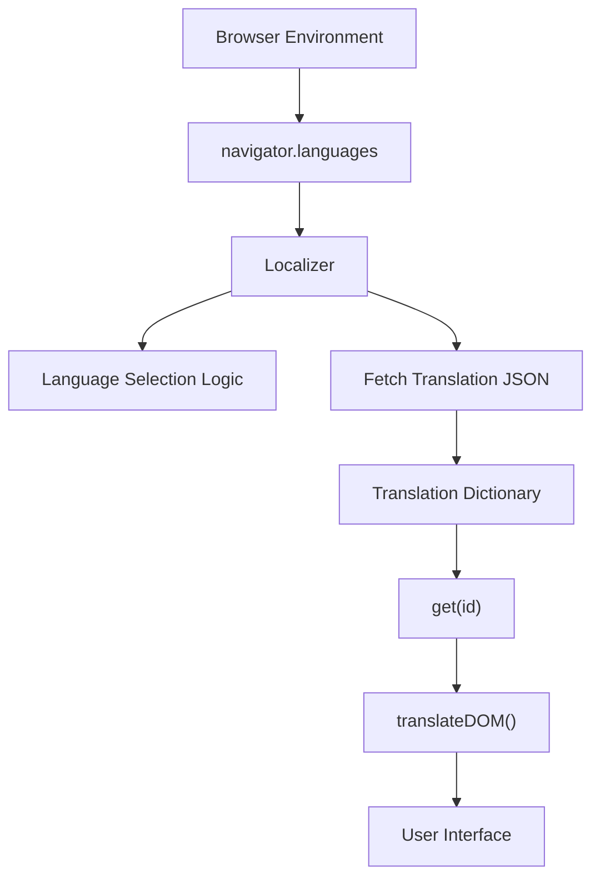
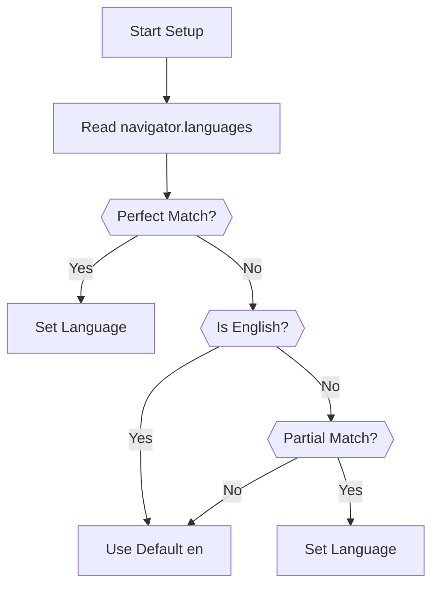
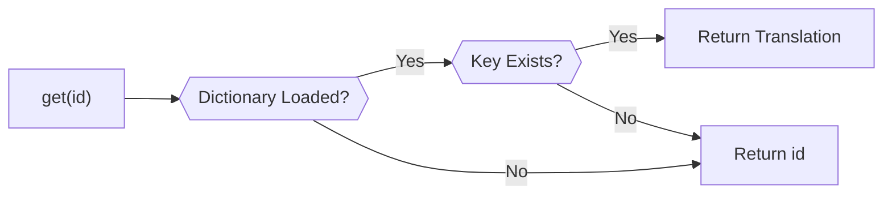
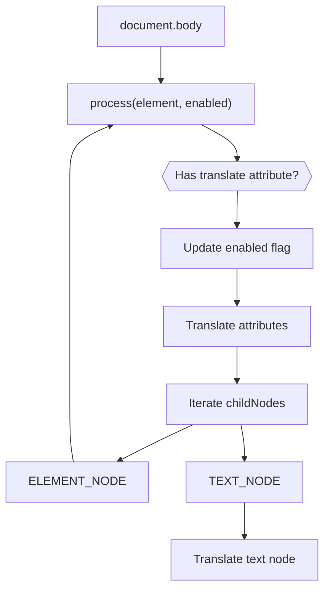
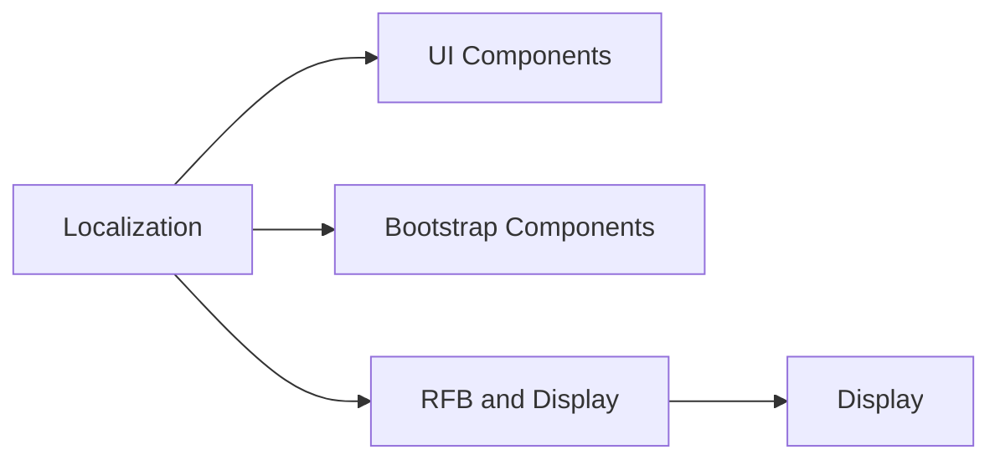
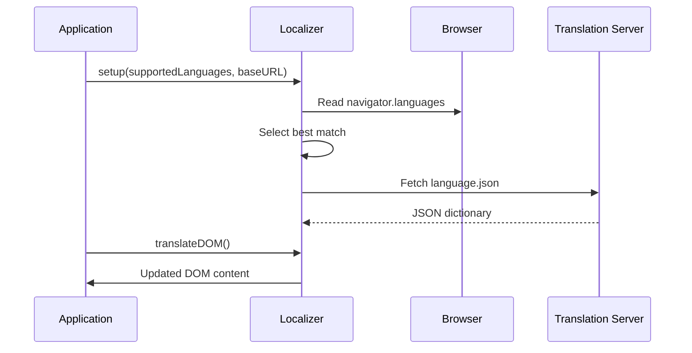

# Localization

The **Localization** module provides client-side internationalization (i18n) support for the MeshCentral web interface and embedded noVNC application. It is responsible for:

- Detecting the user’s preferred language from the browser
- Selecting the best match from supported languages
- Loading translation dictionaries dynamically
- Translating static and dynamic DOM content
- Providing a simple API for retrieving localized strings

At the core of this module is the `Localizer` class (`meshcentral.public.novnc.app.localization.Localizer`), which coordinates language detection, dictionary loading, and DOM translation.

---

## 1. Purpose and Scope

The Localization module ensures that the user interface can adapt to different languages without requiring server-side rendering changes. It operates entirely in the browser and integrates seamlessly with:

- UI components
- noVNC remote desktop interface
- Bootstrap-based components
- Other DOM-driven modules

Unlike backend-based i18n systems, Localization is lightweight and operates on pre-rendered HTML and attributes.

---

## 2. Core Component

### Localizer

**Class:** `meshcentral.public.novnc.app.localization.Localizer`

Responsibilities:

- Language negotiation using `navigator.languages`
- Loading translation dictionaries (`.json` files)
- Translating DOM nodes and attributes
- Providing a lookup method for translated strings

### Public API

| Method | Description |
|--------|------------|
| `setup(supportedLanguages, baseURL)` | Initializes language selection and loads dictionary |
| `get(id)` | Returns translated string or fallback ID |
| `translateDOM()` | Traverses DOM and replaces text/attributes |

Additionally:

- `l10n` — Singleton instance
- Default export — Bound `get()` function for direct string lookup

---

## 3. High-Level Architecture



The Localization module sits between browser language preferences and the UI rendering layer.

---

## 4. Language Selection Algorithm

The `Localizer` performs language negotiation in three passes:

### Step 1: Perfect Match

Matches both language and region:

- `en-US` matches `en-US`
- `fr-CA` matches `fr-CA`

### Step 2: English Fallback

If the browser language is English, fallback to default `en`.

### Step 3: Language-Only Match

If region does not match:

- `fr-CA` can match `fr`
- `de-AT` can match `de`

If no match is found, default language remains `en`.



---

## 5. Dictionary Loading

After language selection, `_setupDictionary(baseURL)`:

- Appends trailing `/` if missing
- Skips fetch if language is `en`
- Loads `<language>.json`
- Parses JSON into `_dictionary`

### Fetch Example

```text
baseURL = "/locales/"
language = "fr"
Fetches: /locales/fr.json
```

If the fetch fails, an error is thrown containing HTTP status information.

---

## 6. Translation Lookup

The `get(id)` method:

- Returns translated value if present in dictionary
- Otherwise returns the original `id`

This design ensures graceful degradation — untranslated keys display as readable fallback text.



---

## 7. DOM Translation Engine

The `translateDOM()` method recursively traverses the DOM starting from `document.body`.

### Translation Rules

It respects the HTML `translate` attribute:

- `translate="yes"` or empty → enabled
- `translate="no"` → disabled

### Translated Attributes

When enabled, it translates:

- `title`
- `placeholder`
- `value` (buttons)
- `alt`
- `label`
- `download`
- `abbr` (for `TH`)

### Processing Flow



### Text Normalization

Before translation:

- Line breaks are trimmed
- Surrounding whitespace removed
- Multiple lines joined with spaces

This ensures dictionary keys are stable and not affected by formatting.

---

## 8. Integration with Other Modules

Localization interacts primarily at the UI layer.

### UI Components

Modules such as UI components and Bootstrap components rely on DOM text and attributes. Localization updates those fields dynamically without requiring component-level changes.



### RFB and Display

The noVNC interface may include status messages and control elements that are localized via the same DOM translation mechanism.

See: [RFB and Display](rfb-and-display/rfb-and-display.md)

---

## 9. Singleton Pattern and Usage

The module exports:

- `l10n` — A singleton `Localizer` instance
- Default export — `l10n.get.bind(l10n)`

Typical usage:

```javascript
import _ from './localization.js';

const message = _('Connection established');
```

This pattern allows simple shorthand usage across the application.

---

## 10. Error Handling and Fallback Strategy

The Localization module prioritizes resilience:

- Defaults to `en`
- Returns original string if dictionary missing
- Throws descriptive error if fetch fails
- Skips dictionary load for default language

This ensures UI remains functional even when:

- Translation files are unavailable
- Network errors occur
- Partial dictionaries exist

---

## 11. Lifecycle Summary



---

## 12. Design Characteristics

| Characteristic | Implementation Detail |
|---------------|----------------------|
| Client-side only | Uses `fetch()` and DOM traversal |
| Non-intrusive | Works without modifying component logic |
| Standards-based | Respects HTML `translate` attribute |
| Fallback-safe | Returns key when translation missing |
| Lazy loading | Loads only selected language |

---

## 13. How Localization Fits the System

Within the overall MeshCentral frontend architecture:

- It operates at the presentation layer
- It does not interact with cryptography, compression, or networking layers
- It enhances usability without affecting protocol or transport logic

This separation ensures that language handling remains independent from:

- [Crypto Components](crypto-components/crypto-components.md)
- [Decoders](decoders/decoders.md)
- [Websock](websock/websock.md)

Localization focuses strictly on user-facing content while other modules manage transport, encryption, rendering, and interaction.

---

## Conclusion

The **Localization** module provides a lightweight, browser-driven internationalization layer for the MeshCentral UI and embedded noVNC client. Through automatic language detection, dynamic dictionary loading, and DOM-based translation, it ensures global usability without coupling language logic to business or transport layers.

Its design emphasizes:

- Simplicity
- Resilience
- Standards compliance
- Minimal integration overhead

This makes Localization a foundational presentation-layer utility that enhances user experience across the entire frontend system.