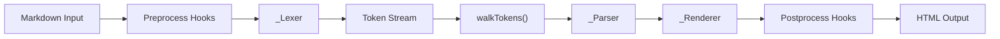
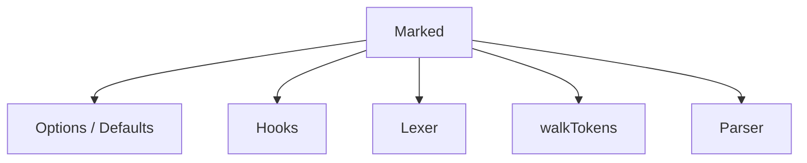
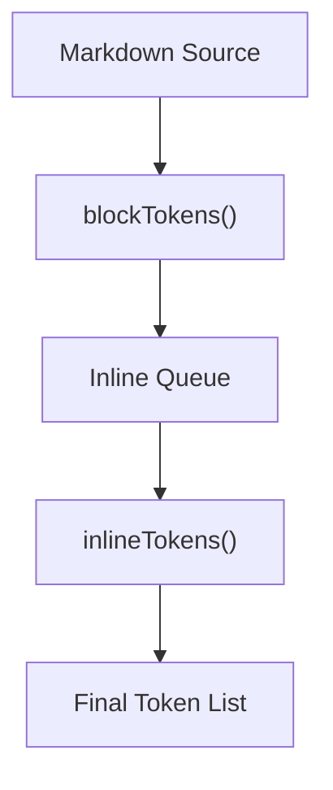
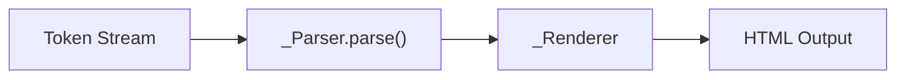
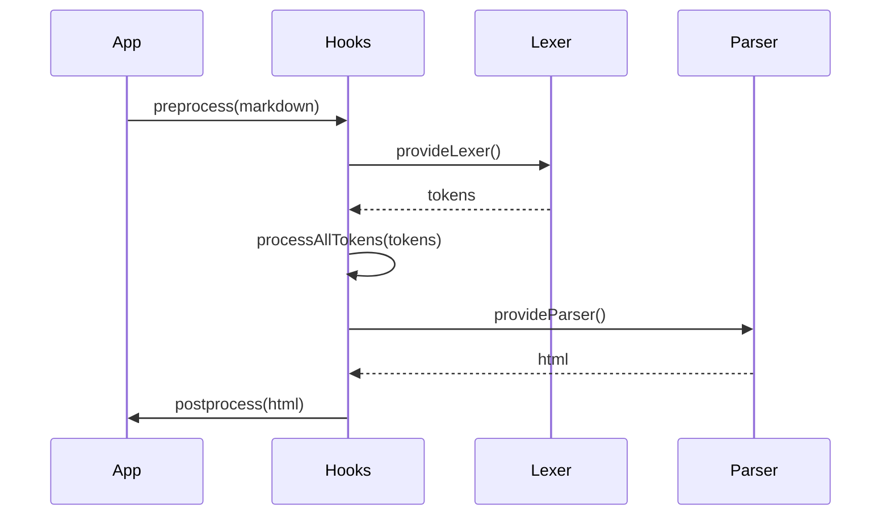
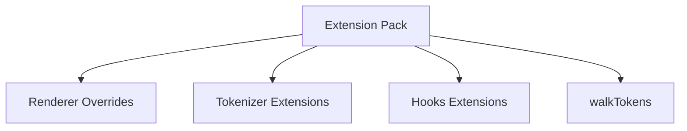
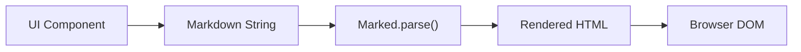

# Marked Components

The **Marked Components** module integrates the `marked` Markdown parsing engine into the MeshCentral web application. It is responsible for transforming Markdown content into safe, structured HTML for rendering inside the UI.

This module provides a complete Markdown processing pipeline including:

- Lexical analysis (tokenization)
- Block and inline parsing
- HTML rendering
- Extension and hook support
- Token walking and transformation

It enables rich documentation rendering, formatted text display, and dynamic content formatting across the MeshCentral interface.

---

## 1. Purpose and Responsibilities

The Marked Components module:

1. Converts Markdown strings into HTML
2. Provides extensibility through tokenizers, renderers, and hooks
3. Supports GitHub-Flavored Markdown (GFM)
4. Enables custom rendering logic via extension APIs
5. Provides safe error handling with configurable silent mode

The implementation is based on `marked v14.1.3` and is bundled into `public/scripts/marked.js`.

---

## 2. High-Level Architecture

The Markdown pipeline follows a structured multi-stage processing model.



### Processing Stages

| Stage | Component | Responsibility |
|--------|------------|----------------|
| Preprocessing | `_Hooks` | Modify Markdown before parsing |
| Lexing | `_Lexer`, `_Tokenizer` | Convert text into structured tokens |
| Token Traversal | `Marked.walkTokens()` | Inspect or modify tokens |
| Parsing | `_Parser` | Transform tokens into HTML structure |
| Rendering | `_Renderer` | Produce final HTML output |
| Postprocessing | `_Hooks` | Final HTML adjustments |

---

## 3. Core Components

### 3.1 Marked (Facade API)

**Class:** `meshcentral.public.scripts.marked.Marked`

This is the primary interface for Markdown parsing.

Responsibilities:

- Manages default options
- Provides `parse()` and `parseInline()`
- Registers extensions via `use()`
- Coordinates lexer and parser
- Handles async parsing
- Centralizes error handling

Simplified internal orchestration:



Key methods:

- `parse(src, options)`
- `parseInline(src, options)`
- `use(extensionPack)`
- `setOptions(options)`
- `walkTokens(tokens, callback)`

---

### 3.2 _Lexer (Block & Inline Tokenization)

**Class:** `meshcentral.public.scripts.marked._Lexer`

The Lexer converts Markdown text into structured tokens.

It operates in two phases:

1. Block-level tokenization
2. Inline-level tokenization



Responsibilities:

- Apply block grammar rules (headings, lists, tables, code blocks)
- Apply inline grammar rules (links, emphasis, code spans)
- Manage parsing state (inLink, inRawBlock, top)
- Support extensions

The Lexer relies on `_Tokenizer` to match grammar rules.

---

### 3.3 _Tokenizer (Grammar Engine)

**Class:** `meshcentral.public.scripts.marked._Tokenizer`

The Tokenizer contains rule-driven methods that match Markdown syntax patterns.

Examples of token types:

- `heading`
- `paragraph`
- `list`
- `code`
- `blockquote`
- `table`
- `link`
- `image`
- `strong`
- `em`

Tokenizer responsibilities:

- Apply regex grammar rules
- Produce structured token objects
- Support GFM, pedantic, and breaks modes

The Tokenizer does not generate HTML — it only produces tokens.

---

### 3.4 _Parser (Token-to-HTML Compiler)

**Class:** `meshcentral.public.scripts.marked._Parser`

The Parser consumes tokens and delegates rendering to the Renderer.



Responsibilities:

- Iterate over tokens
- Dispatch to renderer methods based on token type
- Handle inline vs block rendering
- Apply renderer extensions

The Parser supports both:

- Block parsing (`parse()`)
- Inline parsing (`parseInline()`)

---

### 3.5 _Renderer (HTML Output Generator)

**Class:** `meshcentral.public.scripts.marked._Renderer`

The Renderer converts structured tokens into HTML strings.

Examples:

- `heading()` → `<h1>...</h1>`
- `paragraph()` → `<p>...</p>`
- `list()` → `<ul>` / `<ol>`
- `code()` → `<pre><code>`
- `link()` → `<a href="...">`

Rendering responsibilities:

- Escape unsafe HTML
- Sanitize URLs
- Generate semantic HTML
- Support override via extensions

Renderer methods can be overridden using `marked.use({ renderer })`.

---

### 3.6 _TextRenderer (Plain Text Renderer)

**Class:** `meshcentral.public.scripts.marked._TextRenderer`

This renderer extracts only textual content from tokens.

Used for:

- Plain-text previews
- Indexing/search
- Non-HTML rendering contexts

It strips formatting while preserving readable content.

---

### 3.7 _Hooks (Lifecycle Customization)

**Class:** `meshcentral.public.scripts.marked._Hooks`

Hooks allow lifecycle-level customization.

Supported hooks:

- `preprocess(markdown)`
- `processAllTokens(tokens)`
- `postprocess(html)`
- `provideLexer()`
- `provideParser()`

Hook execution order:



Hooks support both synchronous and asynchronous pipelines.

---

## 4. Extension Model

The Marked Components module supports advanced extension mechanisms.

Extension types:

1. Renderer extensions
2. Tokenizer extensions (block or inline)
3. Hooks extensions
4. walkTokens extensions



Extensions are registered via:

- `marked.use(extensionObject)`

The extension system supports:

- Fallback chaining
- Async parsing
- Token child traversal

---

## 5. Token Structure

Tokens are structured objects describing Markdown elements.

Example token shape:

```text
{
  type: "heading",
  depth: 2,
  text: "Example",
  tokens: [...]
}
```

Common token properties:

- `type`
- `raw`
- `text`
- `tokens` (nested inline tokens)
- `href`, `title` (links/images)
- `items` (lists)
- `rows` (tables)

Nested tokens allow recursive rendering.

---

## 6. Error Handling Model

The `Marked` class provides centralized error handling:

- Throws errors in strict mode
- Returns HTML error output in silent mode
- Supports Promise rejection in async mode

Errors include guidance for reporting issues upstream.

---

## 7. Configuration Options

Default options include:

```text
{
  async: false,
  breaks: false,
  gfm: true,
  pedantic: false,
  renderer: null,
  tokenizer: null,
  hooks: null,
  silent: false,
  walkTokens: null
}
```

These options control parsing behavior, grammar modes, and rendering output.

---

## 8. How Marked Components Fit into MeshCentral

Within the broader UI architecture:

- Used to render documentation and help content
- Used in user-generated Markdown content areas
- Supports rich formatting inside dashboards
- Enables extensible content rendering

Integration typically follows:



This design keeps formatting logic isolated from UI components.

---

## 9. Design Characteristics

- Fully modular pipeline
- Strict separation of tokenization and rendering
- Extension-first architecture
- Safe HTML generation
- Recursive token processing
- Sync and async support

The Marked Components module provides a powerful, extensible, and standards-compliant Markdown engine that integrates seamlessly into the MeshCentral frontend architecture.