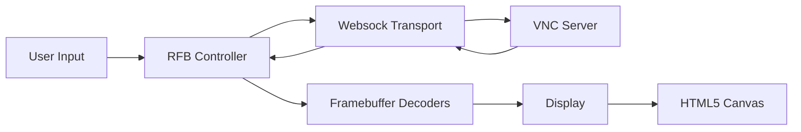
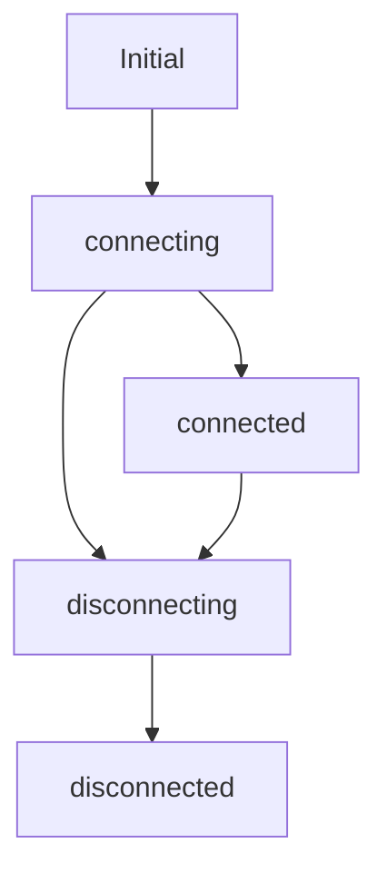
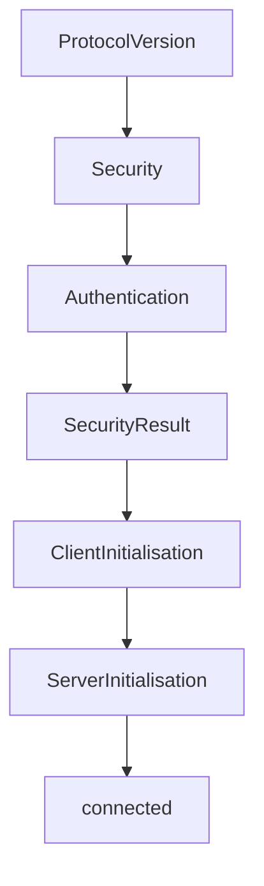
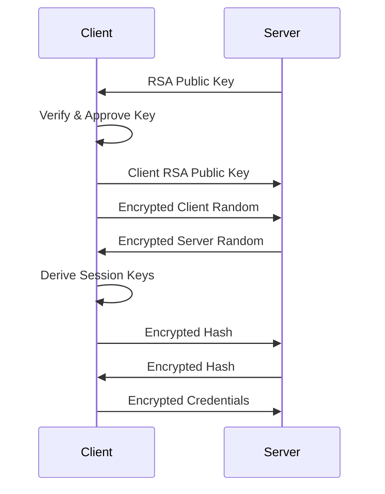
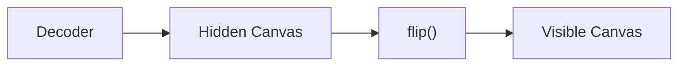
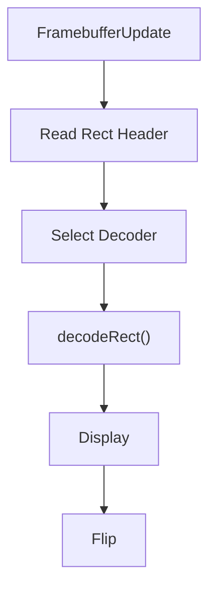
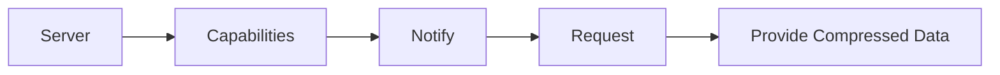
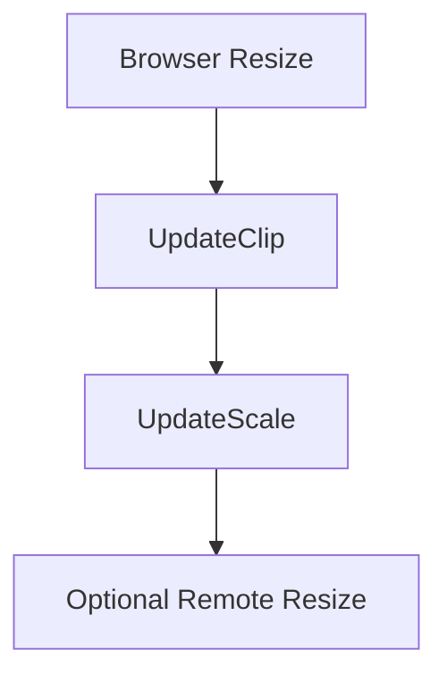

# Rfb And Display

The **Rfb And Display** module implements the core client-side logic for rendering and interacting with remote desktops using the Remote Framebuffer (RFB) protocol (commonly known as VNC). It is responsible for:

- Establishing and managing the RFB protocol handshake
- Negotiating authentication (including RSA-AES based RA2ne)
- Managing WebSocket communication
- Decoding framebuffer updates
- Rendering remote graphics to an HTML5 canvas
- Handling keyboard, mouse, gesture, and clipboard input/output

This module is the heart of the noVNC-based remote desktop experience within MeshCentral.

---

## Core Components

The Rfb And Display module consists of three primary components:

- `meshcentral.public.novnc.core.display.Display`
- `meshcentral.public.novnc.core.ra2.RA2Cipher`
- `meshcentral.public.novnc.core.ra2.RSAAESAuthenticationState`
- `meshcentral.public.novnc.core.rfb.RFB`

Each plays a distinct role in transport, authentication, rendering, and interaction.

---

## Architectural Overview

At a high level, the module sits between the browser UI and the remote VNC server.

### Key Responsibilities by Layer

| Layer | Responsibility |
|--------|----------------|
| RFB | Protocol state machine, handshake, message parsing |
| RSAAESAuthenticationState | RA2ne secure authentication negotiation |
| Websock | Binary transport over WebSocket or RTCDataChannel |
| Decoders | Decode framebuffer rectangles (Raw, Tight, ZRLE, etc.) |
| Display | Canvas rendering, viewport control, scaling |

---

# RFB Class

The `RFB` class is the central controller implementing the full RFB protocol lifecycle.

## Responsibilities

1. Connection lifecycle management
2. Protocol version negotiation
3. Security and authentication negotiation
4. Framebuffer update handling
5. Input event transmission
6. Clipboard synchronization
7. Cursor management

---

## Connection State Machine

The RFB object transitions through strict connection states:

Invalid transitions are rejected to maintain protocol integrity.

---

## Protocol Initialization Phases

During connection, the client progresses through defined initialization states:

Each state consumes structured binary messages from the server and transitions only when complete.

---

## Security & Authentication

The module supports multiple security types, including:

- None
- VNC Authentication (DES challenge-response)
- Tight Authentication
- VeNCrypt
- Plain
- ARD
- MSLogonII
- **RA2ne (RSA + AES secure authentication)**

### RA2ne Authentication Flow

RA2ne provides mutual authentication and session key derivation.

### RSAAESAuthenticationState

This class:

- Orchestrates asynchronous negotiation
- Dispatches `serververification` events
- Dispatches `credentialsrequired` events
- Derives AES session keys
- Validates message integrity

It uses `RA2Cipher` internally for AES-EAX authenticated encryption.

---

# Display Class

The `Display` class manages all rendering operations.

## Core Rendering Model

The rendering architecture uses a double-buffering strategy:

### Why Double Buffering?

- Ensures in-order rendering
- Prevents flicker
- Allows partial damage tracking
- Enables asynchronous image loading

---

## Rendering Features

### 1. Render Queue

Operations are queued to guarantee strict ordering:

- `fillRect`
- `copyImage`
- `blitImage`
- `imageRect`
- `flip`

The queue ensures that asynchronous image loads do not break visual consistency.

### 2. Damage Tracking

Only modified regions are redrawn:

- Tracks `left`, `top`, `right`, `bottom`
- Minimizes canvas redraw area

### 3. Viewport Management

Supports:

- Viewport clipping
- Viewport panning
- Autoscaling
- Coordinate translation (`absX`, `absY`)

### 4. Scaling

Scaling modifies CSS dimensions rather than canvas resolution to avoid clearing the buffer.

---

# Framebuffer Update Pipeline

When the server sends updates:

### Supported Encodings

- Raw
- CopyRect
- RRE
- Hextile
- Tight
- TightPNG
- ZRLE
- JPEG

Pseudo-encodings handle:

- Cursor updates
- Desktop resize
- Continuous updates
- Extended clipboard
- Fence synchronization

---

# Input Handling

The RFB class integrates keyboard and pointer handling.

## Keyboard

- KeySym mapping
- QEMU Extended Key Events
- CapsLock/NumLock synchronization
- Ctrl-Alt-Del convenience method

## Mouse

- Button mask tracking
- Wheel accumulation logic
- Drag viewport mode
- Rate-limited move events

## Gesture Support

Touch gestures are mapped to:

- Clicks
- Right-click
- Drag
- Scroll
- Pinch-to-zoom

Gesture sensitivity thresholds prevent excessive event spam.

---

# Clipboard Integration

Supports both:

- Standard `ServerCutText`
- Extended Clipboard (compressed, multi-format)

Extended clipboard flow:

Data is compressed with zlib via `Deflator` and `Inflator`.

---

# Cursor Handling

The module supports:

- Standard cursor pseudo-encoding
- VMware cursor encoding
- Software-rendered fallback
- Dot cursor fallback for transparent cursors

Cursor updates are processed and converted to RGBA pixel buffers.

---

# Continuous Updates & Resize

The module supports advanced extensions:

- Continuous framebuffer updates
- Extended desktop size negotiation
- Client-requested resize
- Fence synchronization

Resize workflow:

---

# RA2Cipher

`RA2Cipher` is a lightweight AES-EAX wrapper used during RA2ne authentication.

## Responsibilities

- Import AES session key
- Encrypt authenticated messages
- Maintain 16-byte counter IV
- Decrypt and verify incoming messages

Each message includes:

- 2-byte length prefix
- AES-encrypted payload
- 16-byte authentication tag

---

# Integration Within the System

The Rfb And Display module integrates with:

- Websock transport layer
- Decoder modules
- Compression utilities (Inflator/Deflator)
- Input handling modules
- Cryptographic utilities

It acts as the real-time orchestration engine for remote desktop sessions.

---

# Key Design Principles

1. Strict protocol state validation
2. Asynchronous-safe rendering
3. Minimal redraw for performance
4. Pluggable encoding support
5. Backwards compatibility with multiple VNC variants
6. Secure authentication support

---

# Summary

The **Rfb And Display** module is a complete browser-based RFB client implementation. It:

- Implements full VNC protocol negotiation
- Supports multiple security models including RSA-AES
- Efficiently decodes and renders remote framebuffers
- Provides rich input and clipboard synchronization
- Supports advanced extensions like continuous updates and resizing

It is the core engine enabling secure, high-performance remote desktop access in MeshCentral.
