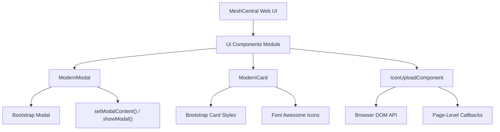
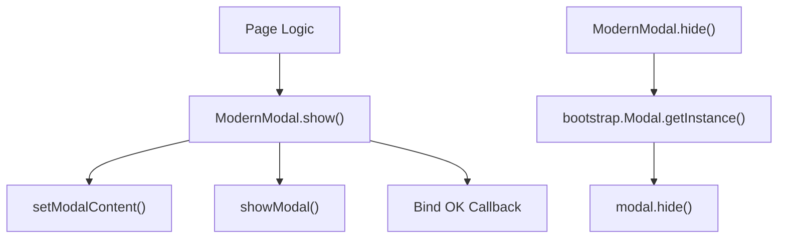
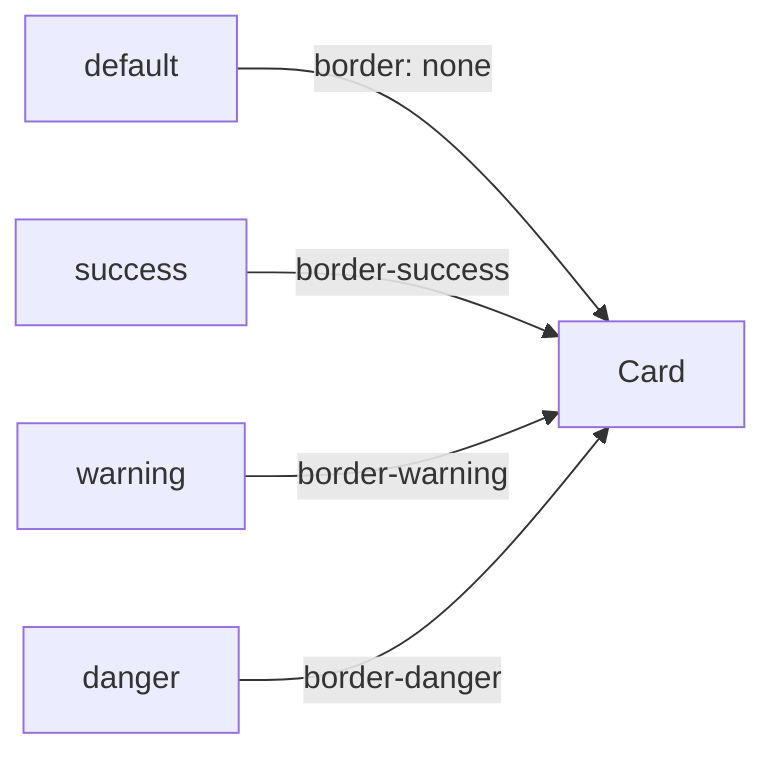
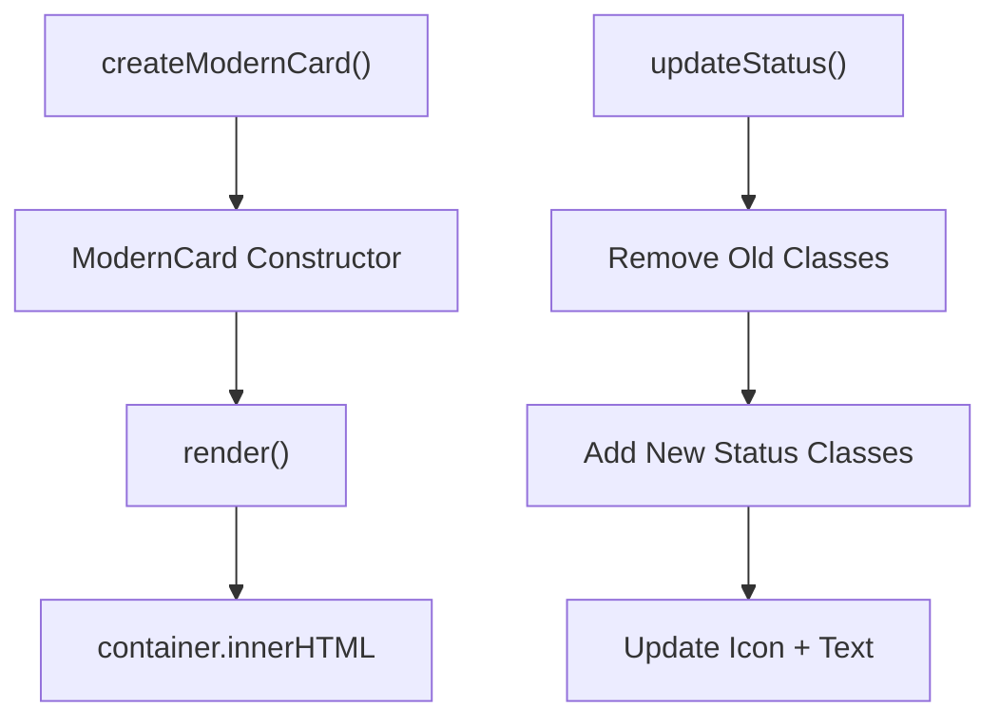
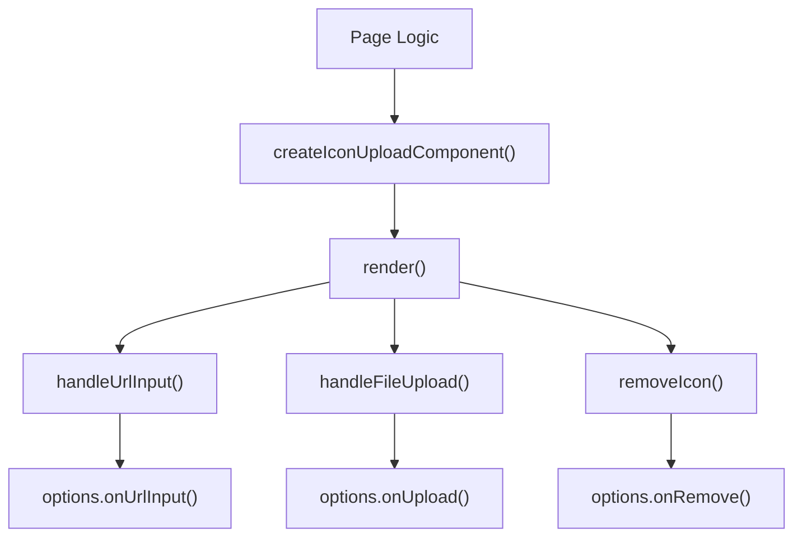
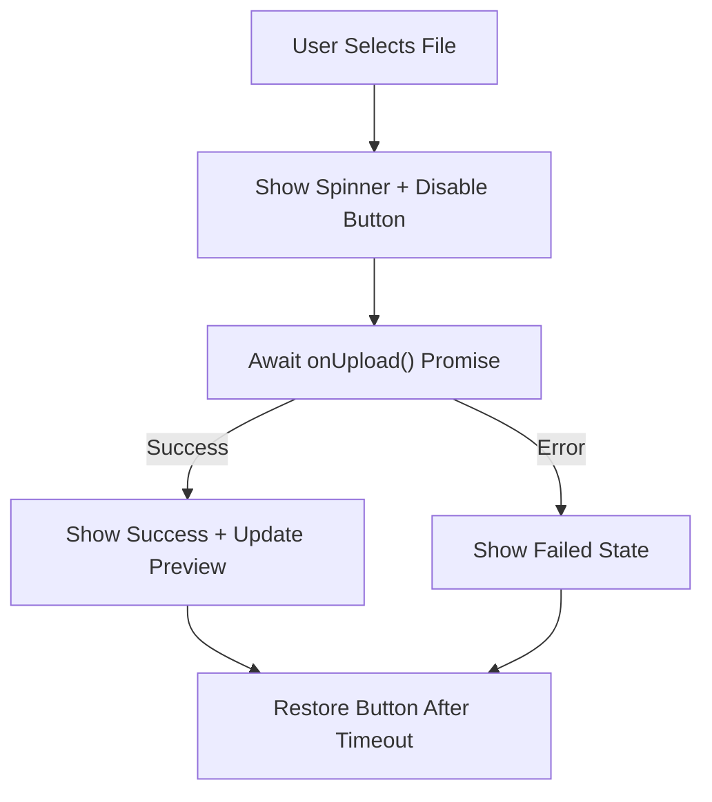

# Ui Components

The **Ui Components** module provides reusable, client-side interface building blocks for the MeshCentral web application. It standardizes modal dialogs, status cards, and icon upload workflows while integrating with Bootstrap, global modal helpers, and other frontend subsystems.

This module is designed to:

- Reduce duplication in template files (notably modal invocation patterns).
- Provide consistent visual and interaction patterns.
- Encapsulate DOM manipulation logic into reusable classes.
- Serve as a foundation for future component modularization.

At its core, the module defines three primary components:

- `ModernModal`
- `ModernCard`
- `IconUploadComponent`

Along with helper factory functions such as `createModernModal`, `createModernCard`, `createIconUploadComponent`, and `openModal`.

---

## 1. Architectural Overview

The Ui Components module operates within the browser runtime and integrates with:

- Bootstrap (Modal, styling utilities)
- Global modal helpers (`setModalContent`, `showModal`)
- Font Awesome icons
- Page-level business logic via callbacks

### High-Level Architecture



The module does not directly handle persistence, authentication, or network logic. Instead, it delegates domain-specific behavior to caller-provided callbacks.

---

## 2. ModernModal

### Purpose

`ModernModal` standardizes modal creation and invocation. It wraps Bootstrap modal behavior and unifies content injection and OK-button handling.

It significantly reduces duplication in template files by replacing repeated:

- `setModalContent(...)`
- `showModal(...)`

calls with a single, reusable abstraction.

### Responsibilities

- Configure modal size and behavior.
- Inject title and body content.
- Optionally wire an OK callback.
- Hide an existing modal instance.

### Component Structure



### Key Options

| Option | Description | Default |
|--------|-------------|----------|
| size | Modal size (`medium`, `large`, `extra-large`) | `medium` |
| showCloseButton | Whether to render header close button | `true` |
| backdrop | Enable backdrop behavior | `true` |
| keyboard | Allow ESC close | `true` |

### Usage Pattern

```javascript
const modal = createModernModal('myModal', { size: 'large' });

modal.show(
  'Confirm Action',
  '<p>Are you sure?</p>',
  () => { console.log('Confirmed'); },
  'Confirm'
);
```

### `openModal` Helper

The `openModal` utility further reduces boilerplate by consolidating:

- Modal ID selection
- Title and body injection
- OK button wiring

This is particularly useful when migrating legacy modal usage patterns.

---

## 3. ModernCard

### Purpose

`ModernCard` provides a reusable, status-aware card component using Bootstrap styling conventions.

It supports:

- Title and icon display
- Status visualization (default, success, warning, danger)
- Dynamic content injection
- Footer actions
- Runtime status updates

### Status Model

Each card state affects:

- Border color
- Status icon
- Text color



### Rendering Flow



### Example Usage

```javascript
const card = createModernCard(containerElement, {
  title: 'Agent Status',
  icon: 'fa-desktop',
  status: 'success',
  content: '<p>Agent is online</p>',
  actions: [
    { label: 'Restart', onclick: 'restartAgent()', class: 'btn-warning' }
  ]
});

card.updateStatus('warning');
```

---

## 4. IconUploadComponent

### Purpose

`IconUploadComponent` encapsulates a full icon management workflow, including:

- URL input
- File upload
- Live preview
- Removal/reset to default
- Asynchronous upload integration

It separates UI responsibilities from persistence and backend logic by delegating operations through callbacks.

### Core Design Principles

- The component owns DOM rendering and preview state.
- The page owns business logic and persistence.
- Upload behavior is injected via `onUpload` callback.

### Component Architecture



### Upload Lifecycle



### Key Options

| Option | Description |
|--------|-------------|
| label | Display name for the icon |
| currentValue | Initial icon URL or data URL |
| onUpload | Async file upload handler |
| onUrlInput | URL change callback |
| onRemove | Removal callback |
| normalizePreviewUrl | Optional preview transformation |

### Example Usage

```javascript
createIconUploadComponent('agentIcon', containerElement, {
  label: 'Agent Icon',
  currentValue: '',
  async onUpload(key, file) {
    const result = await uploadIconToServer(file);
    return { path: result.url };
  },
  onUrlInput(key, value) {
    console.log('URL updated:', value);
  },
  onRemove(key) {
    console.log('Icon removed');
  }
});
```

---

## 5. Interaction with Other Frontend Subsystems

Although self-contained, Ui Components integrates conceptually with several other frontend areas in the broader system:

- Bootstrap components for layout and modal handling.
- Charting and visualization modules when cards display analytics.
- Localization systems when modal titles or card content are translated.
- Remote display and terminal modules when cards reflect session or device status.

The module remains UI-focused and does not embed business logic from those systems.

---

## 6. Design Patterns and Best Practices

### 6.1 Callback Injection

All domain-specific behavior is passed via options:

- Promotes reuse.
- Avoids tight coupling.
- Enables testability.

### 6.2 Encapsulation of DOM Manipulation

Each component:

- Owns its rendering logic.
- Updates its internal state.
- Avoids leaking DOM structure assumptions to callers.

### 6.3 Progressive Refactoring Strategy

The module supports incremental migration from legacy template logic:

1. Replace repeated modal invocations with `openModal`.
2. Replace repeated card markup with `ModernCard`.
3. Replace custom icon upload snippets with `IconUploadComponent`.

This reduces duplication and centralizes UI behavior.

---

## 7. Export and Runtime Environment

The module supports both:

- Browser global usage.
- CommonJS export (Node-style environments).

```javascript
if (typeof module !== 'undefined' && module.exports) {
  module.exports = {
    ModernModal,
    ModernCard,
    IconUploadComponent,
    createModernModal,
    createModernCard,
    createIconUploadComponent
  };
}
```

This dual-mode pattern ensures compatibility with build systems and test environments.

---

# Summary

The **Ui Components** module provides a structured, reusable abstraction layer over common UI patterns in MeshCentral:

- `ModernModal` standardizes dialog behavior.
- `ModernCard` encapsulates visual status panels.
- `IconUploadComponent` centralizes icon management workflows.

By isolating DOM logic and standardizing interaction patterns, the module improves maintainability, reduces duplication, and creates a scalable foundation for future frontend evolution.