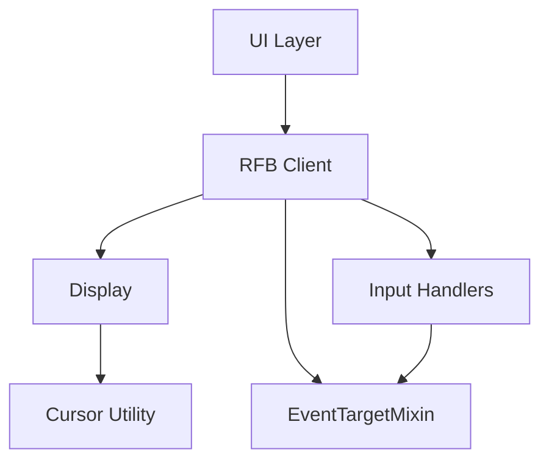
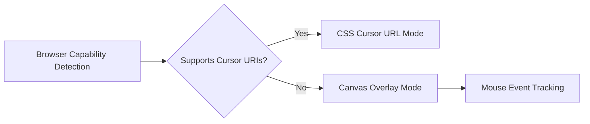
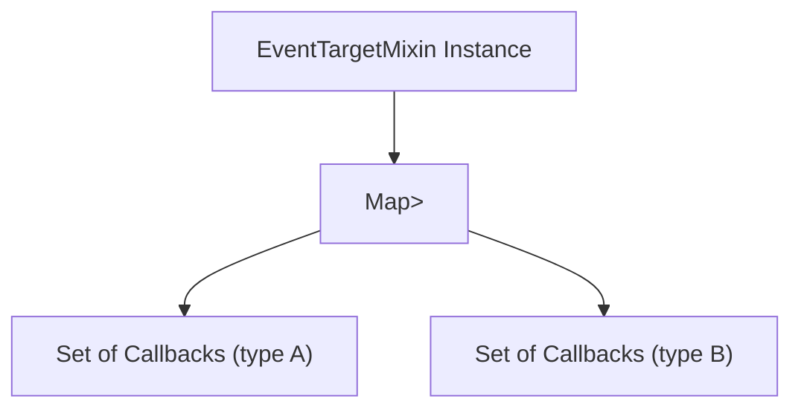
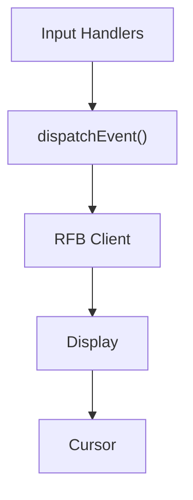

# Utility

The **Utility** module provides foundational helper components that support higher-level subsystems within the MeshCentral web client, particularly the noVNC-based remote desktop stack. It encapsulates reusable primitives for:

- Custom cursor rendering and management
- Lightweight event dispatching and listener management

These utilities are intentionally minimal and dependency-light, enabling reuse across rendering, networking, and protocol layers without introducing tight coupling.

The core components in this module are:

- `meshcentral.public.novnc.core.util.cursor.Cursor`
- `meshcentral.public.novnc.core.util.eventtarget.EventTargetMixin`

---

## Architectural Overview

The Utility module acts as a low-level support layer for interactive and event-driven components such as RFB sessions, display rendering, and input handlers.

### Key Design Principles

- **Separation of concerns** – Cursor rendering is isolated from display logic.
- **Composable event system** – EventTargetMixin enables consistent event APIs without depending on the browser's native `EventTarget`.
- **Browser compatibility** – Cursor implementation gracefully falls back when advanced cursor APIs are unavailable.

---

## Component: Cursor

**Class:** `meshcentral.public.novnc.core.util.cursor.Cursor`

The Cursor class manages dynamic cursor rendering in the noVNC client. It supports both:

- Native CSS cursor updates using `url(dataURI)`
- A canvas-based fallback mode for environments where custom cursor URIs are unsupported or unreliable (e.g., touch devices, specific Safari/iOS constraints)

### Responsibilities

- Attach and detach from a target DOM element
- Render RGBA cursor bitmaps to a canvas
- Manage hotspot positioning
- Synchronize cursor visibility with DOM interactions
- Provide fallback rendering using a fixed-position canvas overlay

### Operational Modes

### Core Methods

| Method | Purpose |
|--------|----------|
| `attach(target)` | Binds cursor logic to a DOM element |
| `detach()` | Removes listeners and cleans up resources |
| `change(rgba, hotx, hoty, w, h)` | Updates cursor bitmap and hotspot |
| `clear()` | Resets cursor to hidden state |
| `move(clientX, clientY)` | Moves fallback cursor manually |

### Event Handling Strategy

In fallback mode, the Cursor instance registers capturing listeners:

- `mouseover`
- `mouseleave`
- `mousemove`
- `mouseup`

These listeners:

- Track pointer position
- Update overlay position
- Determine visibility using DOM containment and computed style checks

### Visibility Logic

The cursor is shown only if:

1. The pointer is over the target or its child
2. The child element does not override the cursor
3. A pointer capture state does not redirect behavior

This ensures consistent behavior during drag operations and complex DOM updates.

---

## Component: EventTargetMixin

**Class:** `meshcentral.public.novnc.core.util.eventtarget.EventTargetMixin`

EventTargetMixin provides a lightweight, framework-agnostic event system. It mimics the browser `EventTarget` API while remaining portable and minimal.

### Responsibilities

- Register event listeners
- Remove event listeners
- Dispatch typed events
- Respect `defaultPrevented` semantics

### Internal Structure

### API Methods

| Method | Description |
|--------|------------|
| `addEventListener(type, callback)` | Registers a callback for an event type |
| `removeEventListener(type, callback)` | Removes a previously registered callback |
| `dispatchEvent(event)` | Invokes callbacks and returns `true` if not prevented |

### Dispatch Semantics

When `dispatchEvent(event)` is called:

1. Listeners for `event.type` are retrieved
2. Each callback is invoked with `call(this, event)`
3. The return value reflects whether `event.defaultPrevented` is set

This makes it suitable for higher-level components such as RFB clients or protocol handlers that require deterministic event flows.

---

## Interaction Between Cursor and Event System

Although the Cursor component relies on DOM-native events, higher-level modules may use EventTargetMixin to:

- Emit synthetic pointer events
- Trigger state changes in display logic
- Coordinate input subsystems

The Utility module therefore bridges:

- Low-level browser interaction (Cursor)
- Abstracted event-driven architecture (EventTargetMixin)

---

## Role Within the Overall System

Within the broader module tree, Utility supports:

- **RFB and Display** – Custom cursor rendering for remote desktops
- **Input Handlers** – Event propagation and state signaling
- **WebSocket and Protocol Layers** – Indirectly, via event-driven architecture

Because these utilities are independent of transport, encryption, and rendering implementations, they can be reused across multiple subsystems without introducing circular dependencies.

---

## Summary

The Utility module provides essential foundational building blocks for the MeshCentral client:

- A robust, browser-compatible cursor rendering system
- A lightweight event dispatch abstraction

Together, these components enable consistent interactivity, composability, and maintainability across the remote desktop stack while preserving architectural separation between rendering, networking, and user interaction layers.
