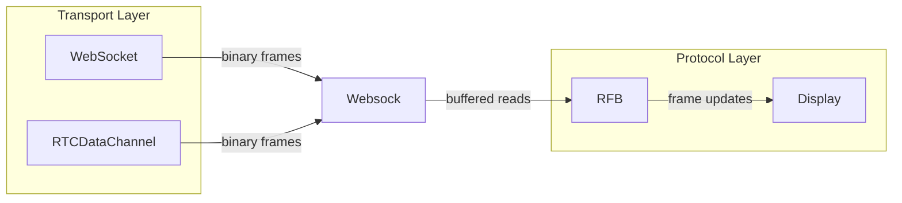
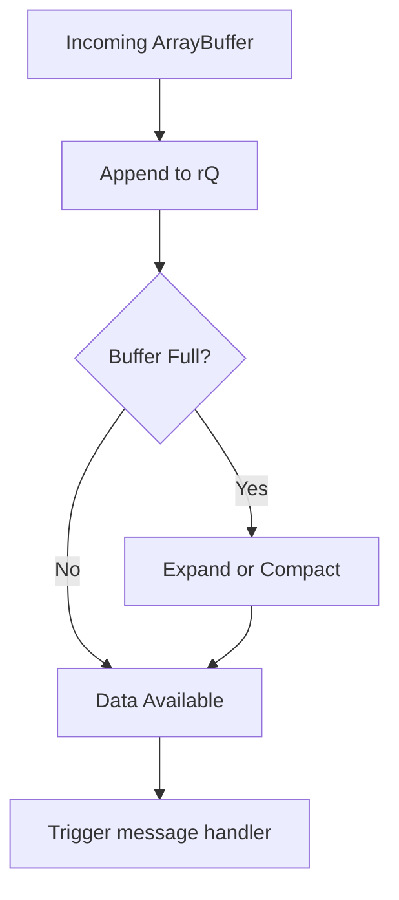
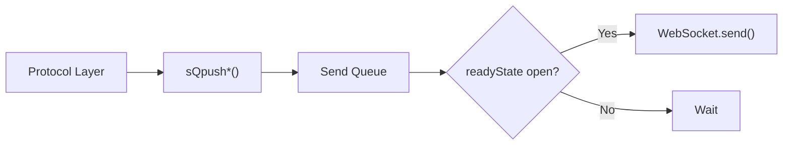
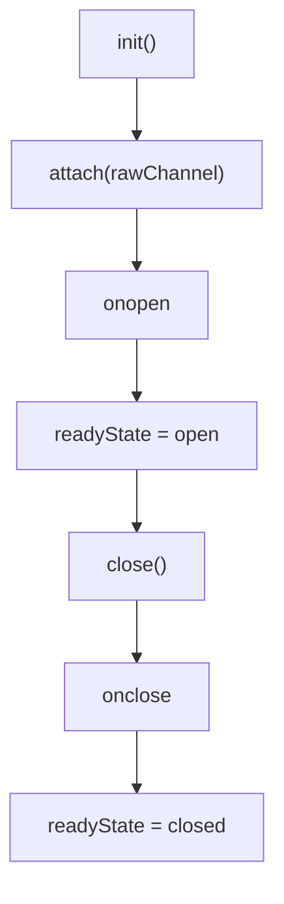
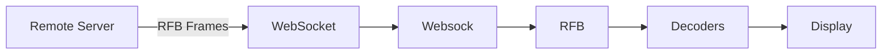

# Websock

The **Websock** module provides a high-performance, buffered abstraction over native browser communication channels such as `WebSocket` and `RTCDataChannel`. It is a foundational transport layer used by the noVNC-based stack inside MeshCentral to reliably exchange binary protocol data (such as RFB frames) with minimal overhead and precise buffer control.

Unlike the standard WebSocket API, Websock separates transport notifications from data access. Incoming messages only signal that data is available; actual parsing and consumption are handled through an internal receive queue.

---

## Purpose and Responsibilities

The Websock module is responsible for:

- Wrapping raw transport channels (`WebSocket` or `RTCDataChannel`)
- Managing a high-performance receive queue (rQ)
- Managing a buffered send queue (sQ)
- Providing binary-safe read/write helpers (8/16/32-bit operations)
- Normalizing ready states across channel types
- Dispatching connection lifecycle events

It acts as the **transport abstraction layer** for upper-level protocol handlers such as the RFB implementation in the [RFB and Display](rfb-and-display/rfb-and-display.md) module.

---

## High-Level Architecture

Websock sits between the browser’s raw communication API and protocol parsers.

### Key Design Principle

Websock does **not** expose raw `message` payloads. Instead:

1. Data is appended to an internal `Uint8Array` receive queue.
2. Upper layers pull structured data from the queue.
3. Parsing remains deterministic and efficient.

---

## Internal Buffer Architecture

Websock maintains two core buffers:

| Buffer | Purpose | Default Size |
|--------|----------|-------------|
| Receive Queue (rQ) | Stores incoming binary data | 4 MiB |
| Send Queue (sQ) | Temporarily buffers outgoing data | 10 KiB |

### Receive Queue Model

### Receive Queue Characteristics

- Backed by a `Uint8Array`
- Maintains:
  - `_rQi` → current read index
  - `_rQlen` → write index
- Automatically expands (up to 40 MiB max)
- Compacts when safe to avoid excessive memory growth

The expansion logic balances performance and memory safety.

---

## Receive Queue API

Websock exposes granular binary parsing helpers:

### Peek Operations

- `rQpeek8()` – Peek one byte without consuming
- `rQpeekBytes(len)` – Peek multiple bytes

### Shift Operations (Consume Data)

- `rQshift8()`
- `rQshift16()`
- `rQshift32()`
- `rQshiftBytes(len)`
- `rQshiftStr(len)`
- `rQshiftTo(target, len)`

These are optimized for protocol parsing in modules such as:

- [RFB and Display](rfb-and-display/rfb-and-display.md)
- Decoders (e.g., Tight, ZRLE, Raw)

### Flow Control Helper

`rQwait(msg, num, goback)` allows upper layers to verify sufficient bytes exist before parsing.

This prevents partial frame parsing errors.

---

## Send Queue Architecture

The send queue batches outgoing writes before flushing.

### Send Helpers

- `sQpush8(num)`
- `sQpush16(num)`
- `sQpush32(num)`
- `sQpushString(str)`
- `sQpushBytes(bytes)`
- `flush()`

This batching mechanism:

- Reduces system calls
- Minimizes frame fragmentation
- Improves throughput

---

## Connection Lifecycle

Websock normalizes state handling across WebSocket and RTCDataChannel.

### Unified Ready States

Internally maps:

- `CONNECTING`
- `OPEN`
- `CLOSING`
- `CLOSED`

Returned values:

- `"connecting"`
- `"open"`
- `"closing"`
- `"closed"`
- `"unused"`

### Lifecycle Flow

### Event System

Websock exposes a minimal event API:

- `on(event, handler)`
- `off(event)`

Supported events:

- `message`
- `open`
- `close`
- `error`

Internally, these are bridged from the raw channel.

---

## Data Flow in the noVNC Stack

Websock is a foundational dependency for higher-level modules.

### Related Modules

- [RFB and Display](rfb-and-display/rfb-and-display.md)
- Decoders (e.g., Tight, ZRLE, JPEG)
- Compression utilities
- Crypto components (used during authentication phases)

Websock does not implement protocol logic; it strictly provides structured binary transport.

---

## Memory Management Strategy

Websock uses a smart growth and compaction strategy:

1. If buffer usage is low → compact in place.
2. If buffer insufficient → expand (doubling strategy).
3. Hard limit enforced at 40 MiB.
4. Throws explicit error if message exceeds safe capacity.

This prevents:

- Unbounded memory growth
- Frequent reallocation
- Performance degradation

---

## Error Handling

Websock handles:

- Channel property validation during `attach()`
- Controlled shutdown on `close()`
- Forwarding of raw transport errors
- Buffer overflow protection

Errors are propagated through the registered `error` handler.

---

## Why Websock Exists

Native WebSocket APIs:

- Deliver message payloads directly
- Provide no structured binary parsing helpers
- Do not offer queue compaction or expansion control

Websock adds:

- Deterministic binary parsing
- Controlled memory growth
- Buffered send batching
- Transport abstraction (WebSocket + RTCDataChannel)
- Protocol-friendly read primitives

It enables efficient implementation of complex binary protocols like RFB in the browser.

---

## Summary

The **Websock** module is the high-performance transport backbone of the noVNC integration within MeshCentral.

It provides:

- Buffered binary transport
- Unified channel abstraction
- Efficient memory handling
- Structured parsing primitives

All upper-level protocol logic—including authentication, decoding, and display rendering—depends on Websock’s predictable and optimized buffering behavior.