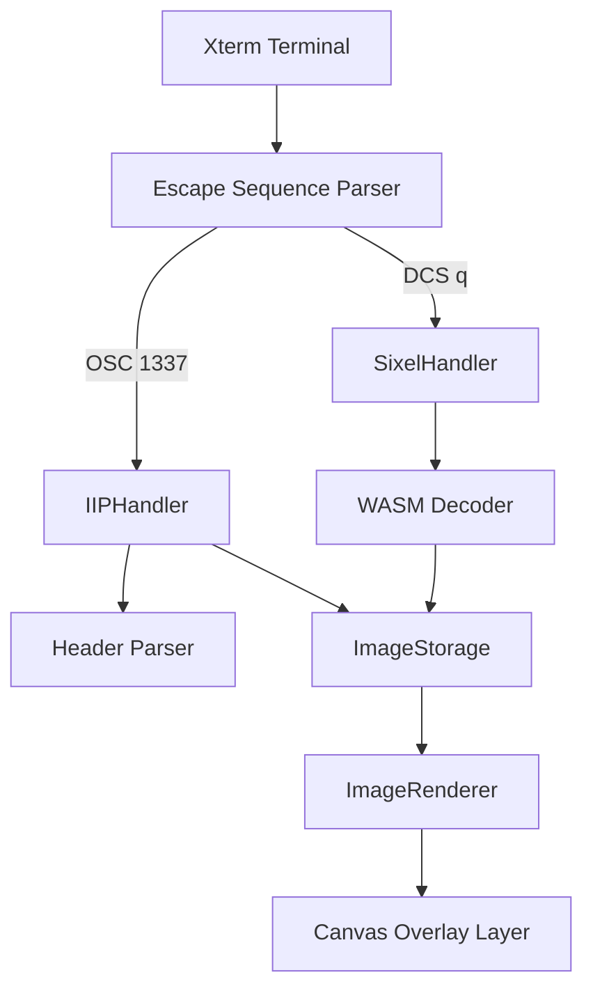
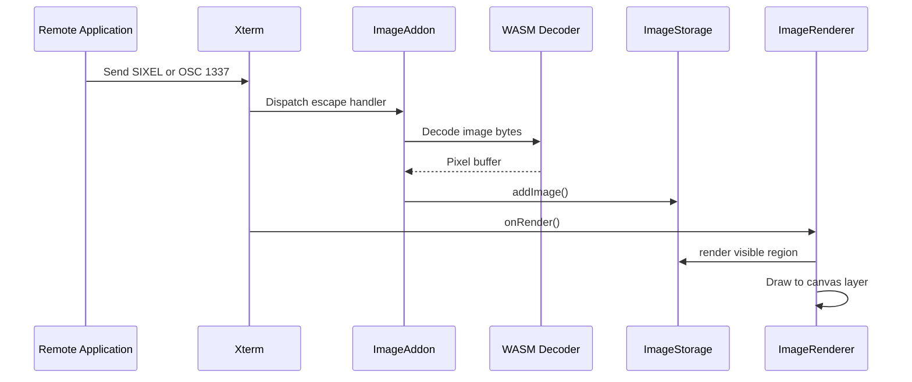
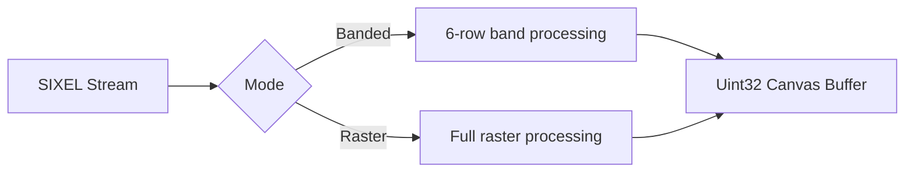
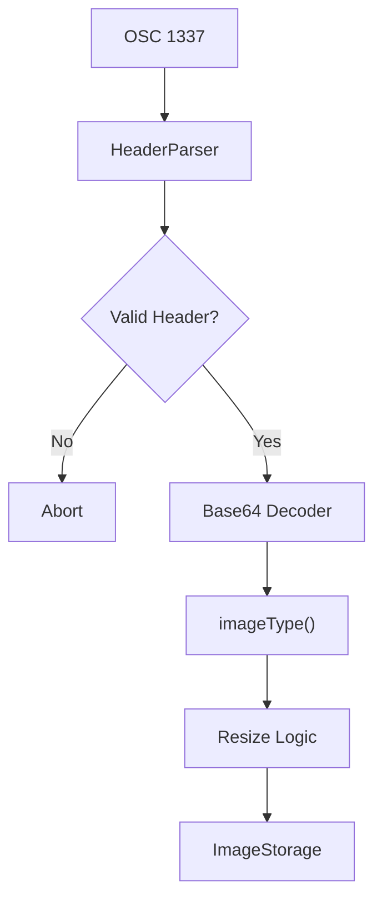
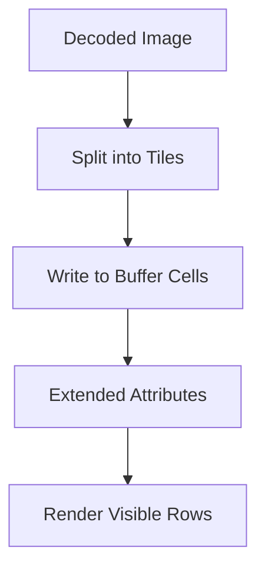
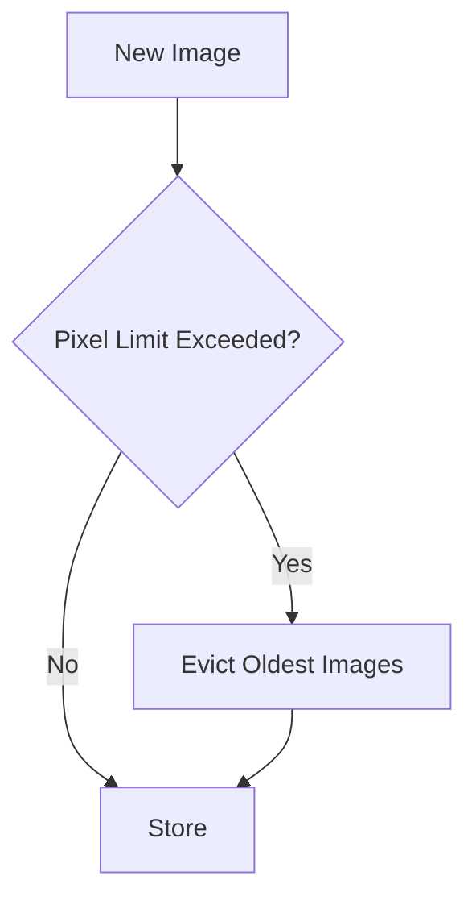
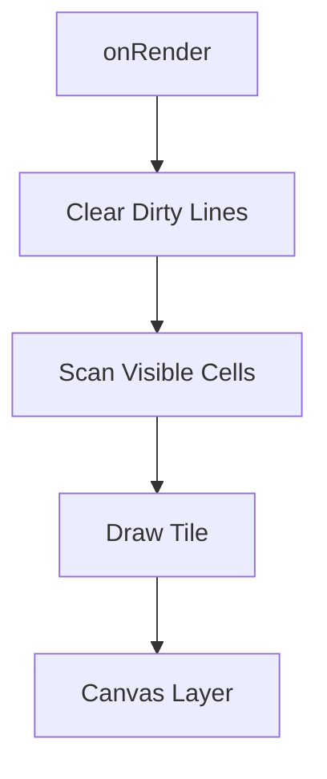
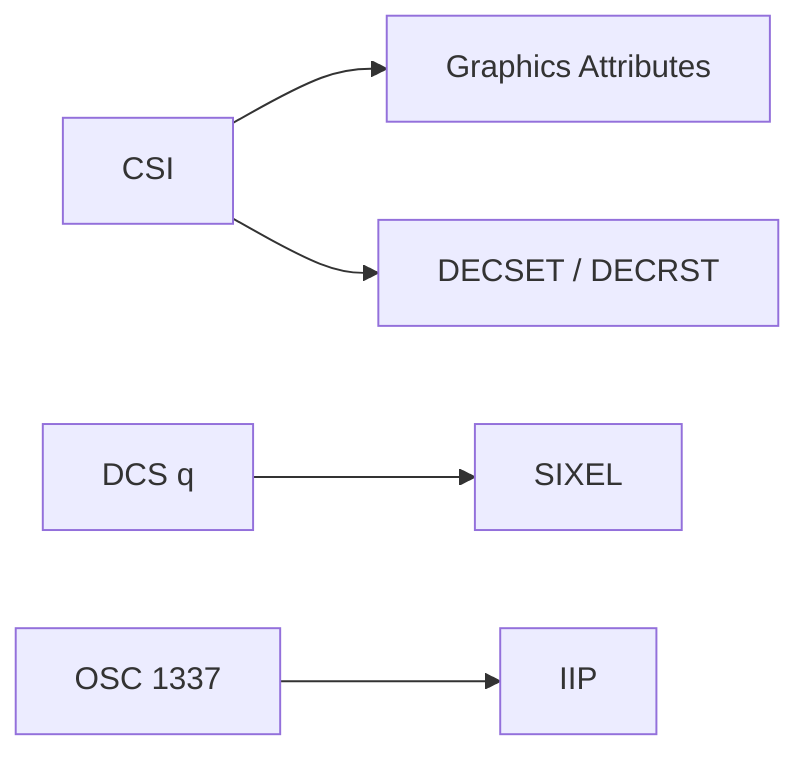
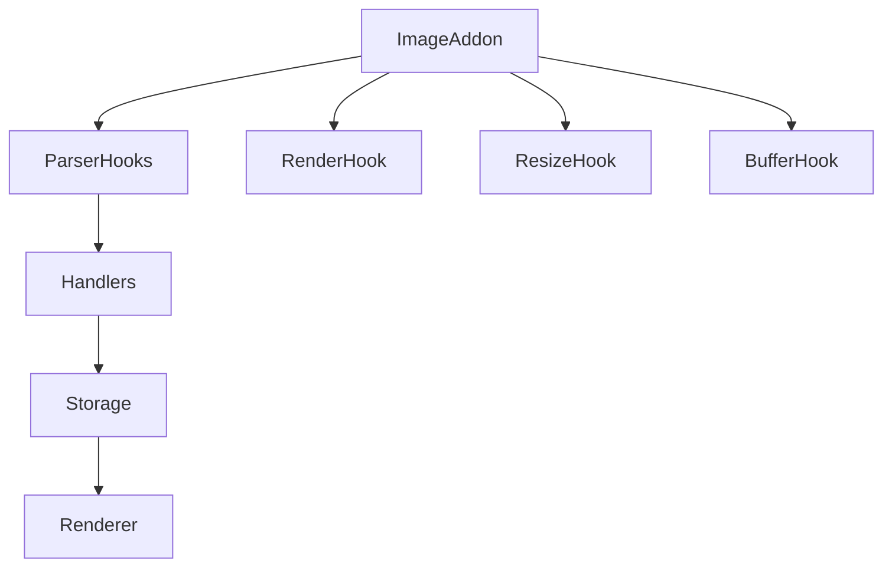

# Xterm Addon Image Core

The **Xterm Addon Image Core** module provides the foundational image decoding and rendering infrastructure for the Xterm image addon within MeshCentral. It is responsible for decoding SIXEL and inline images (IIP), managing image storage inside the terminal buffer, and rendering images efficiently onto a dedicated canvas layer.

This module is the execution backbone of the higher-level [Xterm Addon Image](../xterm-addon-image.md) module and works closely with [Xterm Addon Image Utilities](../xterm-addon-image-utilities/xterm-addon-image-utilities.md) for extended functionality.

---

## 1. Purpose and Responsibilities

The Xterm Addon Image Core module provides:

- ✅ SIXEL image decoding via WebAssembly
- ✅ Inline image protocol (IIP / OSC 1337) support
- ✅ Terminal-aware image storage and eviction
- ✅ Tile-based rendering mapped to terminal cells
- ✅ Canvas-based rendering layer integration
- ✅ Memory and pixel limit enforcement

It bridges raw image data received via terminal escape sequences with the visual output layer in Xterm.

---

## 2. Core Components

This module is implemented in `public/scripts/xterm-addon-image.js` and includes the following primary runtime components:

| Component | Responsibility |
|------------|----------------|
| `ImageAddon` | Main integration class registered with Xterm |
| `ImageRenderer` | Canvas layer rendering engine |
| `ImageStorage` | Buffer-aware image lifecycle management |
| `SixelHandler` | SIXEL decoder integration |
| `IIPHandler` | Inline image (OSC 1337) handler |
| `Decoder` / `DecoderAsync` | WebAssembly-based SIXEL decoder |

---

## 3. High-Level Architecture



### Architectural Layers

1. **Protocol Layer** – Parses escape sequences
2. **Decoding Layer** – Converts SIXEL / base64 to pixel buffers
3. **Storage Layer** – Maps images into terminal buffer cells
4. **Rendering Layer** – Draws images aligned with terminal grid

---

## 4. Image Lifecycle

### Step-by-Step Flow



---

## 5. SIXEL Decoding Engine

The SIXEL implementation uses a WebAssembly-based decoder for performance and memory control.

### Decoder Characteristics

- Streaming decode support
- Palette management
- Memory growth control
- Chunk-based processing
- Mode handling (banded vs raster)

### Decoder Modes



The decoder exposes:

- `width`
- `height`
- `data32`
- `data8`
- `memoryUsage`
- `palette`

Memory limits are enforced via configurable pixel and byte caps.

---

## 6. Inline Image Protocol (IIP)

The IIP handler processes OSC 1337 sequences.

### Responsibilities

- Parse header fields
- Validate size limits
- Decode base64 payload
- Detect image type (PNG / JPEG / GIF)
- Resize to fit terminal viewport
- Convert to `ImageBitmap` or `Canvas`



Security controls include:

- `iipSizeLimit`
- `pixelLimit`
- Strict header parsing

---

## 7. Image Storage and Buffer Integration

`ImageStorage` maintains a mapping between terminal buffer cells and image tiles.

### Key Responsibilities

- Assign image IDs
- Track tile positions
- Evict images when memory limit exceeded
- Handle alternate buffer wipes
- Respond to viewport resize
- Support extraction of image tiles

### Cell Mapping Model



Each buffer cell stores:

- Image ID
- Tile ID
- Underline and extended flags

Eviction strategy:



---

## 8. Rendering Engine

`ImageRenderer` creates and maintains a dedicated canvas overlay layer.

### Rendering Strategy

- Canvas sized to terminal viewport
- Tile-based rendering aligned to cell grid
- Dirty row rendering
- Optional placeholder pattern
- Image rescaling when font size changes



The renderer integrates with Xterm's internal render service and attaches a DOM layer named `xterm-image-layer`.

---

## 9. Configuration Options

Default options include:

```text
pixelLimit: 16777216
sixelSupport: true
sixelScrolling: true
sixelPaletteLimit: 256
sixelSizeLimit: 25e6
storageLimit: 128 MB
showPlaceholder: true
iipSupport: true
iipSizeLimit: 20e6
```

These options influence decoding, storage, and rendering behavior.

---

## 10. Terminal Escape Sequence Support

The module registers handlers for:

- `DCS q` → SIXEL images
- `OSC 1337` → Inline images
- `CSI ? h / l` → SIXEL scrolling toggle
- `CSI c` → Device attributes
- `CSI ? S` → Graphics attributes



---

## 11. Memory and Performance Controls

To prevent excessive resource usage:

- Pixel count limits
- Storage memory caps
- WASM memory growth management
- Eviction of off-screen images
- Alternate buffer cleanup

The module is designed to safely handle untrusted terminal streams.

---

## 12. Integration with Xterm Core

The module integrates through:

- Parser registration
- Render event hooks
- Resize hooks
- Buffer change notifications
- Marker-based lifecycle cleanup



---

## 13. Relationship to Other Modules

- Parent module: [Xterm Addon Image](../xterm-addon-image.md)
- Utilities: [Xterm Addon Image Utilities](../xterm-addon-image-utilities/xterm-addon-image-utilities.md)
- Terminal engine: Xterm core modules

The Core module focuses strictly on decoding, storage, and rendering mechanics. Higher-level behaviors and utilities are implemented outside this module.

---

## 14. Summary

The **Xterm Addon Image Core** module provides a high-performance, memory-safe image rendering engine for Xterm terminals inside MeshCentral. It:

- Implements SIXEL and IIP decoding
- Integrates deeply with terminal buffer mechanics
- Maintains strict memory boundaries
- Renders images in alignment with terminal cells
- Handles viewport resizing and alternate buffers

It is the critical infrastructure layer that enables graphical output in otherwise text-based terminal sessions.
