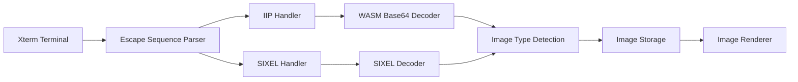
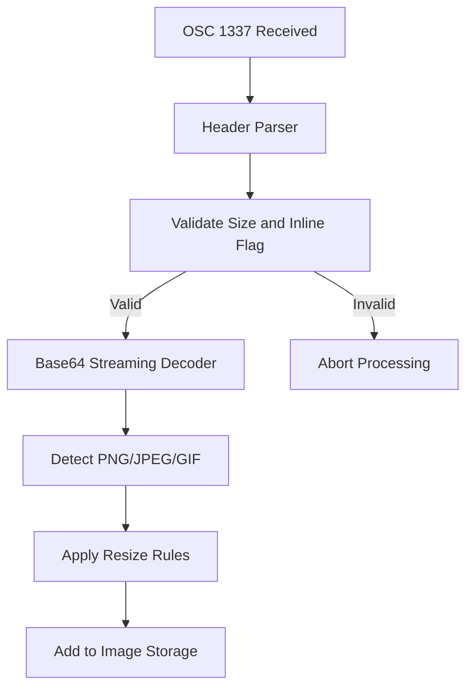
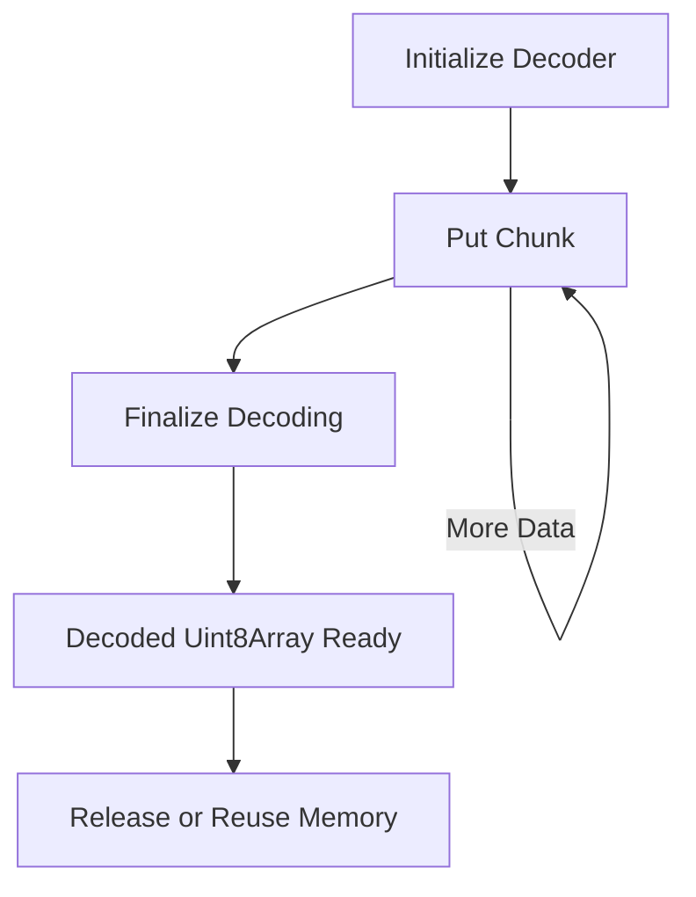
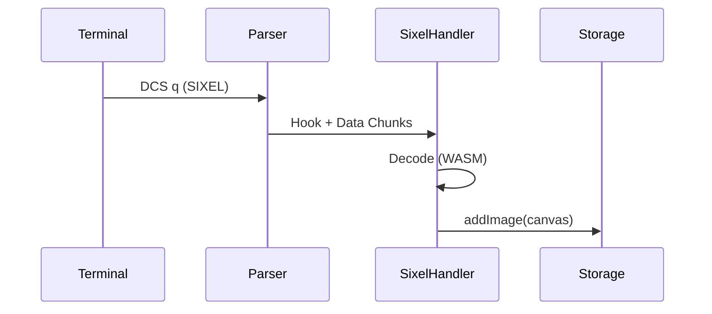

# Xterm Addon Image Advanced Utilities

The **Xterm Addon Image Advanced Utilities** module provides high-level image protocol handling and decoding capabilities for the Xterm image addon integration. It focuses on advanced image ingestion paths such as inline image protocols and SIXEL decoding, acting as a bridge between terminal escape sequences and the rendering/storage subsystems.

This module builds on:

- [Xterm Addon Image Utilities](../xterm-addon-image-utilities.md)
- [Xterm Addon Image Core Utilities](../xterm-addon-image-core-utilities/xterm-addon-image-core-utilities.md)

It is responsible for:

- Parsing inline image protocol (IIP / OSC 1337) sequences
- Decoding SIXEL graphics (DCS q sequences)
- Managing decoding pipelines (WASM-backed where applicable)
- Enforcing size, palette, and memory limits
- Converting decoded image data into renderable canvas/bitmap objects

---

## Core Components

This module contains the following core components:

- `meshcentral.public.scripts.xterm-addon-image.r` – Base64 streaming decoder (WASM-backed)
- `meshcentral.public.scripts.xterm-addon-image.u` – Inline Image Protocol (IIP) handler

Together, they enable efficient decoding and validation of image data embedded in terminal streams.

---

## Architectural Position

The module sits between the terminal parser layer and the rendering/storage layer.



### Responsibilities by Layer

| Layer | Responsibility |
|--------|----------------|
| Parser | Detects OSC/DCS sequences |
| Advanced Utilities | Decode, validate, resize images |
| Storage | Tile management and eviction |
| Renderer | Canvas drawing and scaling |

---

## Inline Image Protocol (IIP) Handler

### Overview

The IIP handler processes OSC 1337 escape sequences containing base64-encoded image payloads.

Example flow:

```text
OSC 1337 ; File=name=...;size=...;inline=1:BASE64DATA BEL
```

### Processing Pipeline



### Header Validation Rules

The handler ensures:

- `inline=1` must be set
- `size` must be within configured limits
- Pixel count must not exceed `pixelLimit`
- MIME type must be supported (PNG, JPEG, GIF)

If any constraint fails, decoding is aborted safely.

### Resizing Logic

Resizing considers:

- Terminal cell size
- Canvas dimensions
- `width` and `height` header values
- Aspect ratio preservation flag

The handler calculates final pixel dimensions before creating the image bitmap.

---

## Base64 Streaming Decoder (WASM-backed)

The base64 decoder component provides:

- Streaming base64 ingestion
- Chunked decoding
- WebAssembly acceleration
- Memory reuse strategy

### Decoder Lifecycle



### Key Features

- Preallocated memory region
- Automatic memory growth if needed
- Controlled release when exceeding retention threshold
- Efficient typed array access

This design prevents unnecessary allocations for large inline images.

---

## SIXEL Integration

Although SIXEL decoding is primarily handled in adjacent utilities, this module participates by:

- Managing palette limits
- Applying pixel size constraints
- Resetting decoder state on terminal reset

SIXEL decoding uses a WebAssembly-backed decoder and integrates with the same image storage system.



---

## Memory and Limit Enforcement

The module enforces multiple constraints to prevent runaway resource usage:

### 1. Pixel Limit

Maximum allowed pixel count for any image.

### 2. Size Limit (IIP)

Maximum allowed base64 payload size.

### 3. Palette Limit (SIXEL)

Maximum allowed color entries.

### 4. Storage Limit

Total megabytes allowed for image storage.

These checks occur before rendering to protect both memory and UI responsiveness.

---

## Interaction with Storage and Renderer

After decoding and validation:

1. A `Canvas` or `ImageBitmap` is created.
2. The image is passed to Image Storage.
3. Storage assigns image IDs and tile IDs.
4. Renderer draws tiles onto a dedicated overlay layer.


---

## Error Handling Strategy

The module follows a defensive design:

- Abort early on malformed headers
- Catch decoder exceptions
- Release WASM memory on failure
- Fallback to placeholder rendering if enabled

This ensures terminal stability even when invalid or malicious sequences are received.

---

## Reset Behavior

On terminal reset or DEC private mode changes:

- SIXEL scrolling mode is restored
- Palette limits are reset
- Decoders are reinitialized
- Storage may be cleared depending on buffer context

Reset is idempotent and safe to call multiple times.

---

## Summary

The **Xterm Addon Image Advanced Utilities** module is the protocol intelligence layer of the image addon. It:

- Converts terminal escape sequences into image data
- Uses WebAssembly-backed decoders for performance
- Enforces strict memory and size limits
- Integrates seamlessly with storage and rendering subsystems

By isolating protocol parsing and decoding logic from rendering and storage mechanics, the design maintains clear separation of concerns while enabling advanced inline and SIXEL graphics support within terminal sessions.