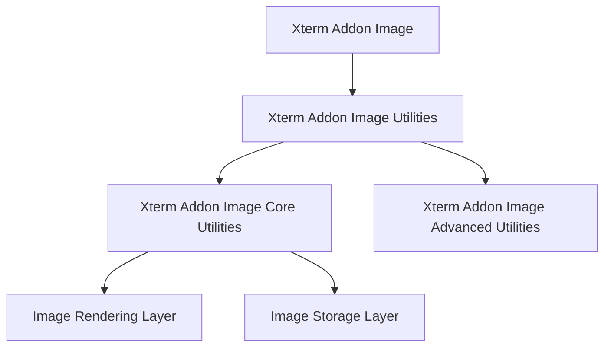
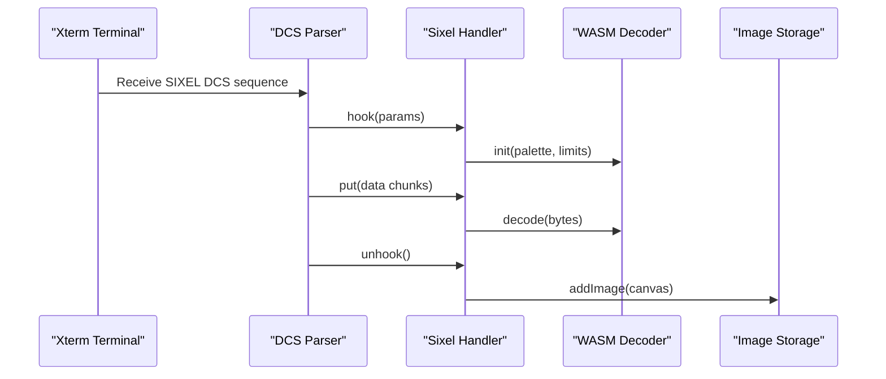
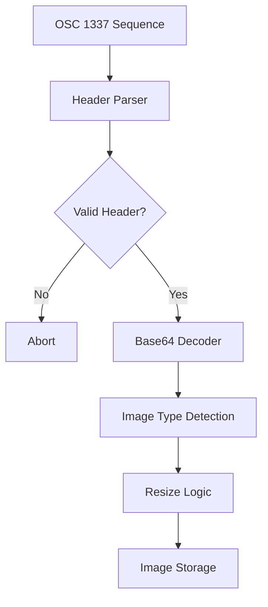
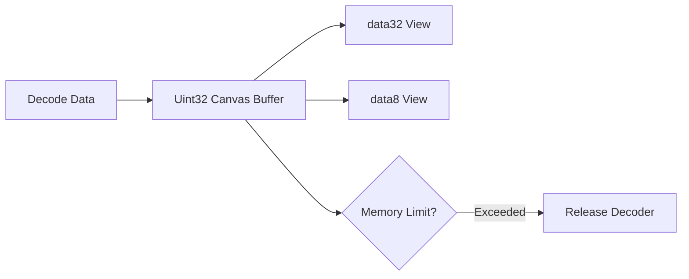
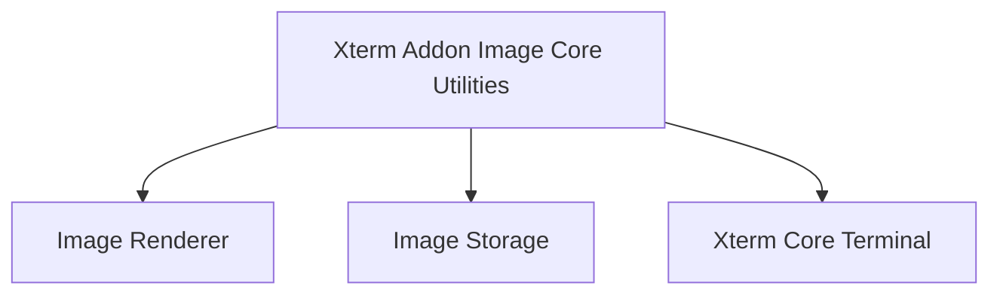
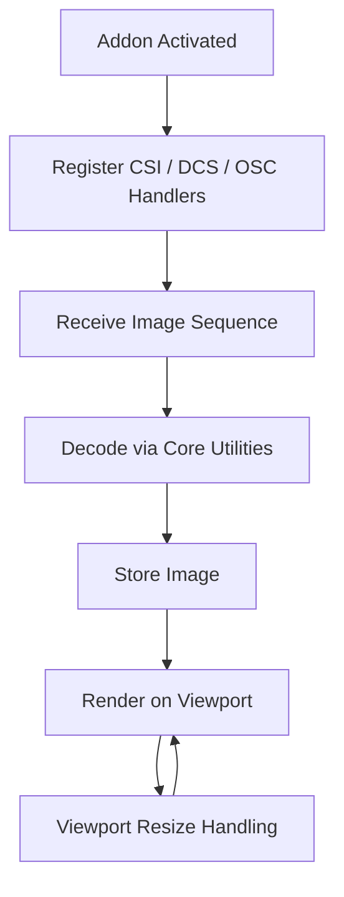

# Xterm Addon Image Core Utilities

The **Xterm Addon Image Core Utilities** module provides the low-level decoding, parsing, and image processing primitives that power image rendering inside the Xterm Addon Image extension. It focuses on core algorithms such as SIXEL decoding, base64 image handling, header parsing, and image type detection.

This module underpins higher-level utilities in the Xterm Addon Image system and is responsible for transforming encoded image streams into pixel buffers suitable for rendering and storage.

---

## Module Position in the Architecture

The Xterm Addon Image Core Utilities module sits within the Xterm Addon Image Utilities layer and provides reusable decoding and transformation services.

- Parent: [Xterm Addon Image Utilities](../xterm-addon-image-utilities.md)
- Sibling: [Xterm Addon Image Advanced Utilities](../xterm-addon-image-advanced-utilities/xterm-addon-image-advanced-utilities.md)
- Root: [Xterm Addon Image](../../xterm-addon-image.md)

### High-Level Placement

---

## Core Responsibilities

The Xterm Addon Image Core Utilities module is responsible for:

1. **SIXEL decoding via WebAssembly-backed decoder**
2. **Inline image (IIP) header parsing and validation**
3. **Image format detection (PNG, JPEG, GIF)**
4. **Palette and color normalization utilities**
5. **Pixel buffer generation (RGBA 32-bit and 8-bit views)**

It converts encoded terminal image sequences into structured image buffers ready for rendering.

---

## Core Components Overview

This module includes the following core components:

- `meshcentral.public.scripts.xterm-addon-image.h`
- `meshcentral.public.scripts.xterm-addon-image.n`
- `meshcentral.public.scripts.xterm-addon-image.o`

These correspond to:

- **SIXEL Handler and Decoder integration**
- **Inline Image Protocol (IIP) Handler**
- **Supporting parsing, storage, and image utilities**

---

# Architecture Breakdown

## 1. SIXEL Decoding Pipeline

SIXEL images are streamed through DCS sequences and decoded using a WebAssembly-based decoder.

### Processing Flow

### Key Characteristics

- Enforces configurable pixel and memory limits
- Supports palette resizing and reset operations
- Handles streaming decode in chunks
- Automatically releases decoder memory above threshold

---

## 2. Inline Image Protocol (IIP) Handling

The IIP Handler processes OSC 1337 image sequences, typically used for inline images in modern terminals.

### IIP Processing Flow

### Header Parsing Responsibilities

- Parses key-value fields such as:
  - `inline`
  - `size`
  - `width`
  - `height`
  - `preserveAspectRatio`
- Validates against configured size limits
- Rejects unsupported or malformed inputs

---

## 3. Image Type Detection

The module includes lightweight binary inspection logic to detect supported formats:

| Format | Detection Strategy |
|--------|--------------------|
| PNG    | Signature + IHDR check |
| JPEG   | SOI marker + segment scan |
| GIF    | Header validation |

If no known format matches, the type resolves to `unsupported` and processing aborts.

---

## 4. Pixel Buffer Management

Decoded images are exposed in two forms:

- `data32`: `Uint32Array` RGBA representation
- `data8`: `Uint8ClampedArray` byte-level RGBA buffer

### Memory Management Strategy

Key safeguards:

- Memory growth capped by configured limits
- Dynamic canvas resizing
- Efficient subarray views to avoid unnecessary copying

---

# Interaction with Other Modules

The Xterm Addon Image Core Utilities module collaborates closely with:

- **Renderer Layer** (ImageRenderer) — for canvas creation and drawing
- **Image Storage** — for mapping images to buffer cells
- **Xterm Core** — for parser hooks and buffer interaction

These integrations occur through controlled interfaces rather than direct DOM manipulation.

---

# Error Handling and Safety Controls

The module includes several defensive mechanisms:

- Abort on invalid headers
- Abort on excessive SIXEL data size
- Reject unsupported MIME types
- Enforce pixel area limits
- Guard against excessive WebAssembly memory allocation

These constraints prevent denial-of-service scenarios via malicious image payloads.

---

# Configuration Parameters

The module respects several configuration options inherited from the parent addon:

- `pixelLimit`
- `sixelSupport`
- `sixelPaletteLimit`
- `sixelSizeLimit`
- `storageLimit`
- `iipSupport`
- `iipSizeLimit`
- `showPlaceholder`

These determine decoding behavior, storage eviction, and safety thresholds.

---

# Lifecycle Summary

---

# Summary

The **Xterm Addon Image Core Utilities** module forms the decoding and parsing backbone of terminal image support within the Xterm Addon Image system. It provides:

- WebAssembly-accelerated SIXEL decoding
- Inline image protocol parsing
- Format detection and validation
- Efficient pixel buffer handling
- Strict safety and memory controls

By isolating these concerns into a dedicated core utilities layer, the addon maintains clean separation between decoding logic, rendering logic, and storage management, resulting in a modular and maintainable image rendering architecture.
