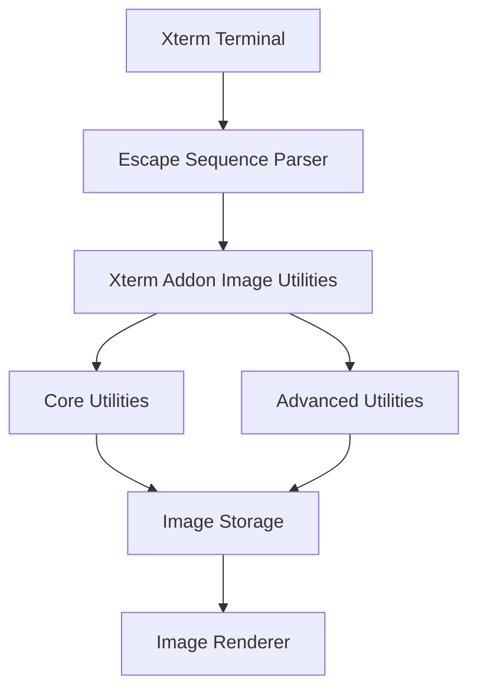
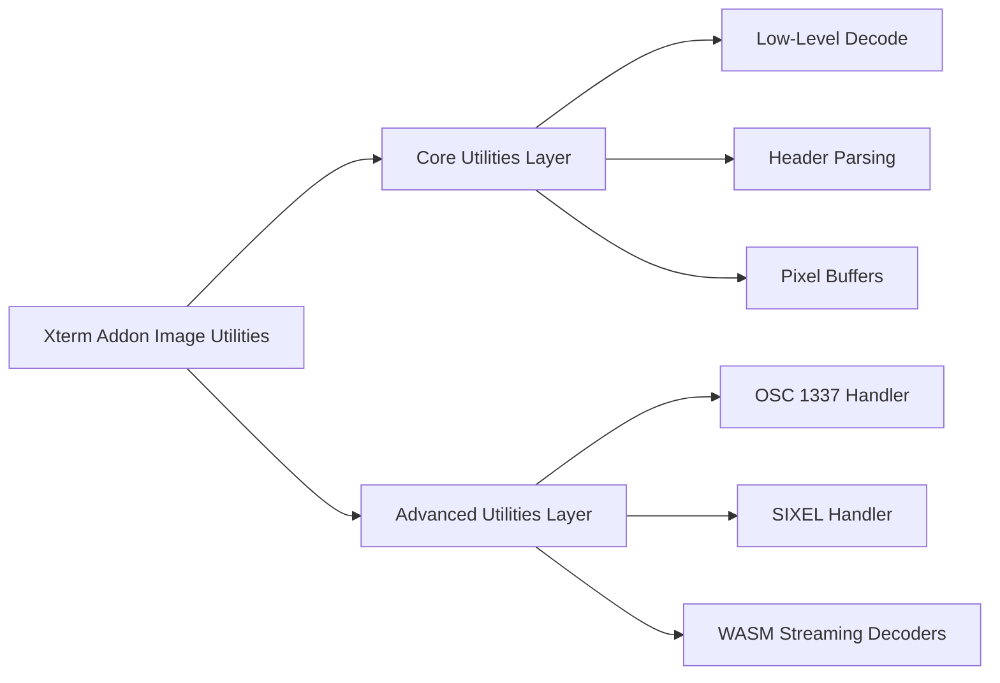
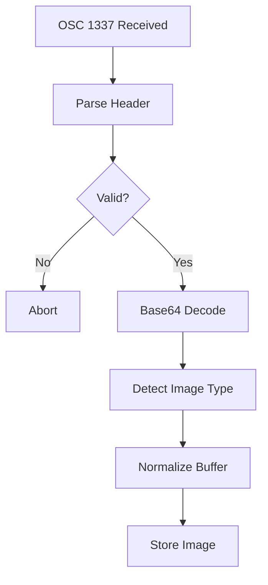
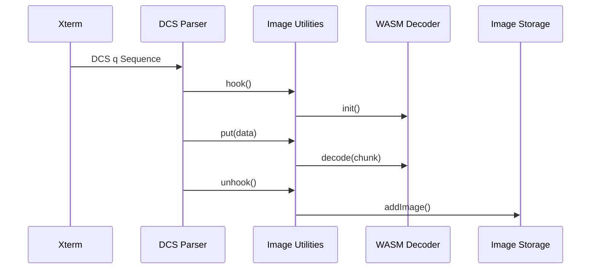
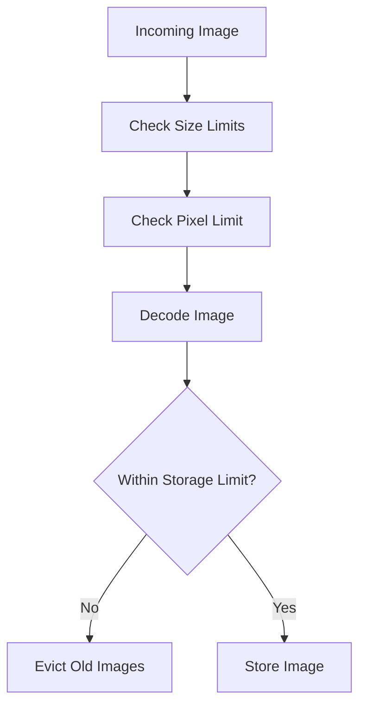
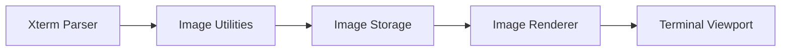
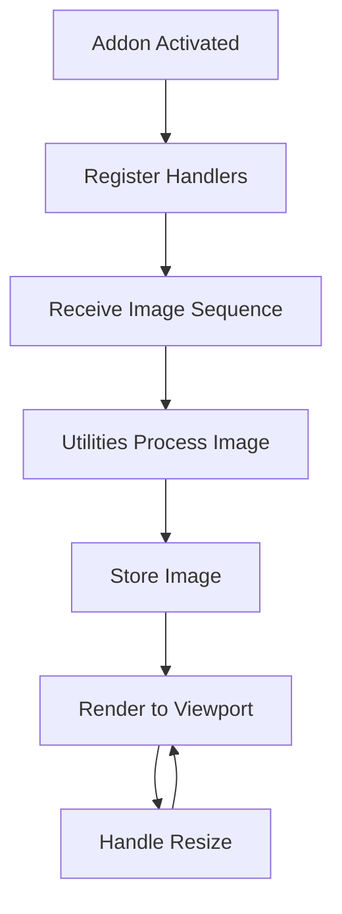

# Xterm Addon Image Utilities

The **Xterm Addon Image Utilities** module provides the shared utility layer that powers image decoding, validation, protocol handling, and memory management for terminal-rendered graphics inside MeshCentral’s Xterm integration.

It sits between the **Xterm Addon Image Core** and the specialized utility layers:

- **Xterm Addon Image Core Utilities**
- **Xterm Addon Image Advanced Utilities**

This module orchestrates image processing pipelines such as SIXEL and Inline Image Protocol (IIP), enforces safety limits, and exposes reusable decoding helpers to the rendering and storage subsystems.

---

## Purpose of the Module

The **Xterm Addon Image Utilities** module is responsible for:

- Coordinating SIXEL and OSC 1337 image handling
- Providing shared decoding helpers and parsing logic
- Enforcing pixel, size, palette, and memory limits
- Normalizing image buffers for renderer consumption
- Acting as a bridge between the Xterm parser and image storage

It ensures that terminal-embedded images are processed safely, efficiently, and consistently before rendering.

---

## Repository Structure

**Path:** `public/scripts`  
**Namespace:** `meshcentral.public.scripts.xterm-addon-image`

### Primary Utility Components

- `meshcentral.public.scripts.xterm-addon-image.h`
- `meshcentral.public.scripts.xterm-addon-image.n`
- `meshcentral.public.scripts.xterm-addon-image.o`
- `meshcentral.public.scripts.xterm-addon-image.r`
- `meshcentral.public.scripts.xterm-addon-image.u`

### Submodules

```text
xterm-addon-image-utilities/
├── xterm-addon-image-core-utilities/
│   ├── h
│   ├── n
│   └── o
└── xterm-addon-image-advanced-utilities/
    ├── r
    └── u
```

### Submodule Documentation

- **Xterm Addon Image Core Utilities**  
  Provides low-level decoding, header parsing, and pixel buffer generation.

- **Xterm Addon Image Advanced Utilities**  
  Implements protocol-aware handlers (SIXEL, OSC 1337) and streaming decoders.

---

# Architectural Position

The module acts as a coordination layer between terminal parsing and rendering/storage.



---

# Internal Layered Architecture

The utilities module is divided into two functional layers:



---

# Processing Pipelines

## 1. Inline Image Protocol (OSC 1337)



### Responsibilities

- Validate `inline=1`
- Enforce `iipSizeLimit`
- Detect PNG/JPEG/GIF signatures
- Apply resizing rules
- Pass decoded image to storage

---

## 2. SIXEL Image Handling



### SIXEL Features

- Streaming decode support
- Palette limit enforcement
- Pixel area checks
- Memory guardrails
- Decoder reuse and release strategy

---

# Core Responsibilities

| Area | Responsibility |
|------|---------------|
| Protocol Handling | Manage OSC 1337 and DCS q sequences |
| Decoding | WASM-backed SIXEL and Base64 decoding |
| Validation | Enforce size, pixel, and storage limits |
| Normalization | Convert decoded output into RGBA buffers |
| Integration | Pass images to storage and renderer |

---

# Memory and Safety Controls

The module enforces configurable limits inherited from the parent addon:

- `pixelLimit`
- `sixelSizeLimit`
- `sixelPaletteLimit`
- `iipSizeLimit`
- `storageLimit`
- `showPlaceholder`

### Memory Enforcement Flow



These checks prevent resource exhaustion and protect terminal responsiveness.

---

# Interaction with Related Modules

The **Xterm Addon Image Utilities** module integrates with:

- **Xterm Core Parser** — receives escape sequence hooks
- **Image Storage Layer** — manages tile mapping and lifecycle
- **Image Renderer** — draws overlays on the terminal viewport



---

# Lifecycle Overview



---

# Summary

The **Xterm Addon Image Utilities** module is the coordination and processing backbone of terminal image support within MeshCentral’s Xterm integration.

It:

- Bridges escape sequence parsing and rendering
- Delegates low-level work to Core Utilities
- Handles protocol logic through Advanced Utilities
- Enforces strict safety and memory constraints
- Normalizes decoded image buffers for efficient rendering

By cleanly separating decoding, protocol handling, and storage integration, the module maintains a modular, maintainable, and secure architecture for terminal image rendering.

---

## Related Documentation

- **Xterm Addon Image Core Utilities**
- **Xterm Addon Image Advanced Utilities**
- **Xterm Addon Image (Root Module)**

These modules together form the complete image rendering pipeline for terminal sessions.