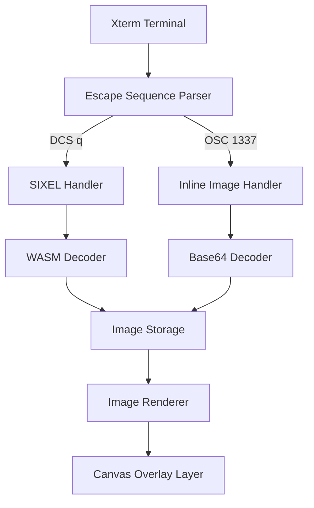
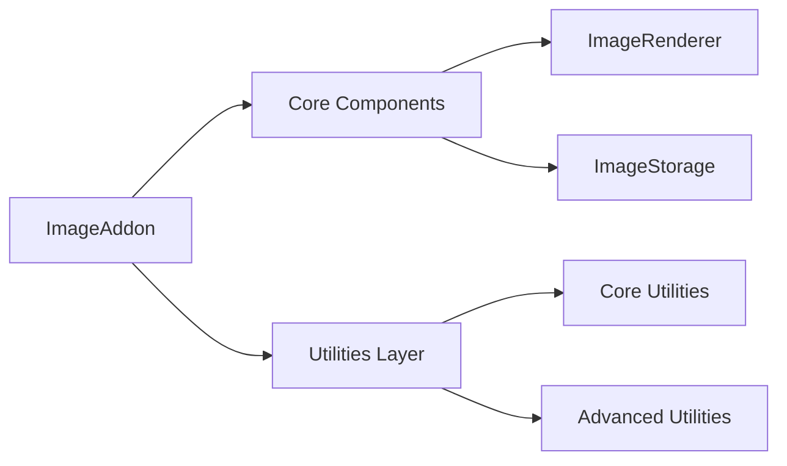
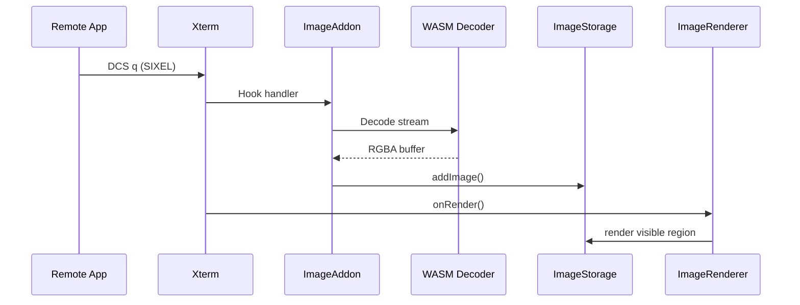
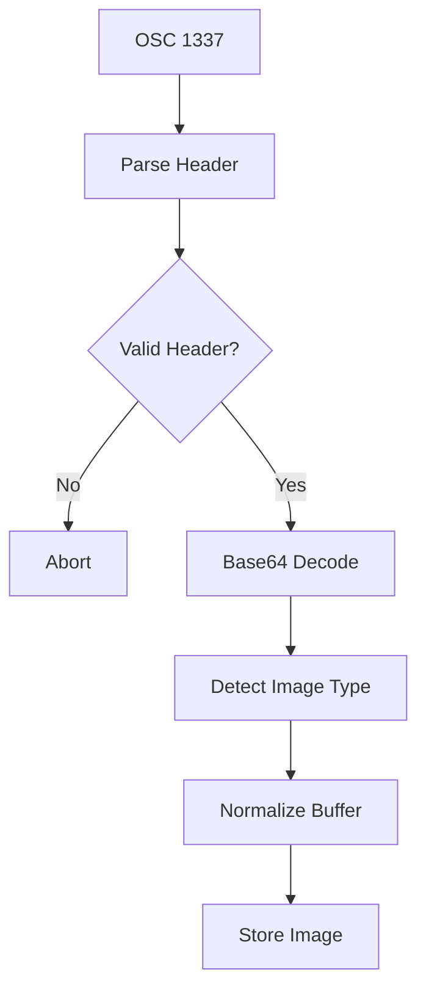
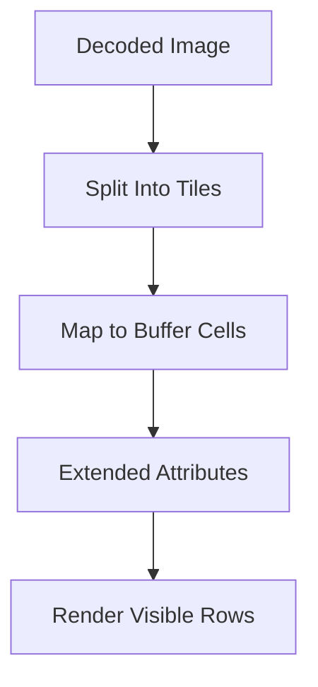
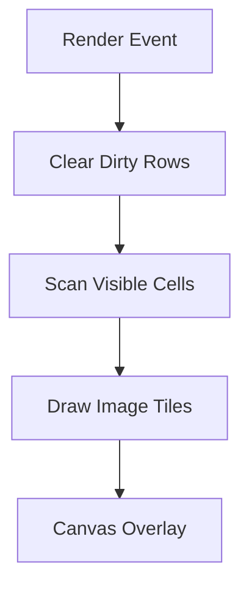
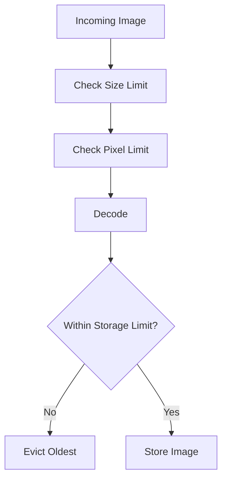
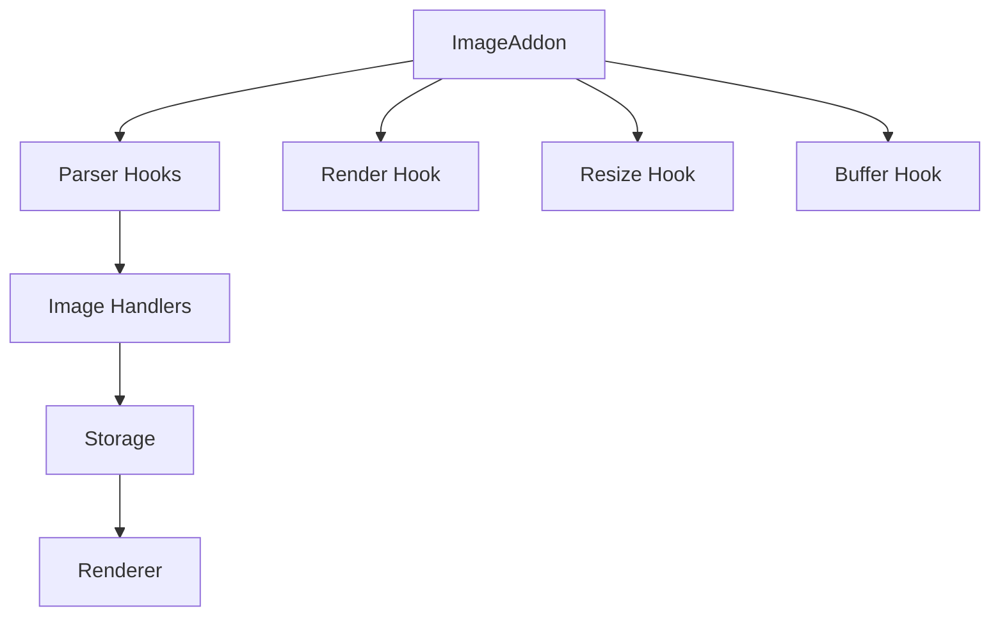

# Xterm Addon Image

The **Xterm Addon Image** module enables graphical image rendering inside terminal sessions in MeshCentral. It extends the Xterm.js terminal engine to support:

- ✅ SIXEL graphics (`DCS q`)
- ✅ Inline Image Protocol (OSC 1337)
- ✅ Canvas-based overlay rendering
- ✅ Terminal buffer–aware image storage
- ✅ Memory-safe and size-limited decoding

This module integrates tightly with the Xterm parser, rendering pipeline, and buffer system to allow terminal applications to display raster graphics directly inside terminal cells.

**Repository Path:** `public/scripts`  
**Namespace:** `meshcentral.public.scripts.xterm-addon-image`

---

# 1. Purpose of the Module

The **Xterm Addon Image** module provides the complete image rendering pipeline for terminal sessions:

| Layer | Responsibility |
|-------|----------------|
| Protocol Handling | Parse SIXEL and OSC 1337 sequences |
| Decoding | Convert encoded image data into pixel buffers |
| Storage | Map images to terminal buffer cells |
| Rendering | Draw image tiles aligned to terminal grid |
| Safety Controls | Enforce pixel, memory, and size limits |

It transforms raw escape sequences into safely rendered canvas graphics inside the terminal viewport.

---

# 2. Repository Structure

```
public/scripts/
└── xterm-addon-image
    ├── Core Components
    │   ├── B
    │   ├── Q
    │   ├── _
    │   └── a
    └── Utilities
        ├── h
        ├── n
        ├── o
        ├── r
        └── u
```

## 2.1 Primary Components

### Core Layer
- `meshcentral.public.scripts.xterm-addon-image.B`
- `meshcentral.public.scripts.xterm-addon-image.Q`
- `meshcentral.public.scripts.xterm-addon-image._`
- `meshcentral.public.scripts.xterm-addon-image.a`

### Utilities Layer
- `meshcentral.public.scripts.xterm-addon-image.h`
- `meshcentral.public.scripts.xterm-addon-image.n`
- `meshcentral.public.scripts.xterm-addon-image.o`
- `meshcentral.public.scripts.xterm-addon-image.r`
- `meshcentral.public.scripts.xterm-addon-image.u`

---

# 3. High-Level Architecture



The module is composed of four architectural layers:

1. **Protocol Layer** – Escape sequence registration and parsing  
2. **Decoding Layer** – SIXEL (WASM) and IIP decoding  
3. **Storage Layer** – Terminal buffer cell mapping and lifecycle control  
4. **Rendering Layer** – Canvas overlay rendering aligned to cell grid  

---

# 4. Internal Module Composition



## Responsibilities by Submodule

### Xterm Addon Image Core
- Image decoding orchestration
- Storage lifecycle
- Renderer integration
- Memory enforcement

📄 See: **Xterm Addon Image Core**

---

### Xterm Addon Image Utilities
- SIXEL streaming helpers
- OSC 1337 parsing
- Header validation
- Buffer normalization
- Pixel limit checks

📄 See: **Xterm Addon Image Utilities**

---

# 5. Image Processing Flow

## 5.1 SIXEL Processing



### Features
- Streaming decode
- Palette limit enforcement
- Pixel area guardrails
- Configurable size limits

---

## 5.2 Inline Image Protocol (OSC 1337)



Supported formats:
- PNG
- JPEG
- GIF

Security constraints:
- `iipSizeLimit`
- `pixelLimit`
- `storageLimit`

---

# 6. Storage Model

The module maps decoded images into terminal buffer cells.



### Storage Responsibilities

- Assign unique image IDs
- Track tile positions per cell
- Evict old images when memory exceeded
- Handle alternate buffer cleanup
- Respond to terminal resize events

---

# 7. Rendering Strategy

The renderer maintains a dedicated canvas overlay.



### Rendering Features

- Tile-based drawing
- Cell-aligned positioning
- Font-size aware scaling
- Dirty row optimization
- Optional placeholder patterns

---

# 8. Memory & Safety Controls

The module protects terminal performance using strict limits.



Configurable defaults:

```text
pixelLimit: 16777216
sixelSupport: true
sixelScrolling: true
sixelPaletteLimit: 256
sixelSizeLimit: 25e6
storageLimit: 128 MB
showPlaceholder: true
iipSupport: true
iipSizeLimit: 20e6
```

These limits prevent memory exhaustion from untrusted terminal streams.

---

# 9. Integration with Xterm Core



Integration points:

- Escape sequence handler registration
- Render cycle hooks
- Resize observers
- Buffer lifecycle notifications

---

# 10. Relationship to Other Modules

The **Xterm Addon Image** module works alongside:

- **Xterm Core** – Terminal engine and parser
- **Xterm Addon Image Core** – Decoding and rendering backbone
- **Xterm Addon Image Utilities** – Protocol and decoding helpers

The Core and Utilities modules together form the internal processing pipeline of the Xterm Addon Image system.

---

# 11. Summary

The **Xterm Addon Image** module enables high-performance, memory-safe image rendering inside MeshCentral terminal sessions.

It:

- Implements SIXEL and OSC 1337 support  
- Uses WebAssembly for efficient decoding  
- Maps images to terminal cells  
- Renders through a dedicated canvas overlay  
- Enforces strict memory and pixel constraints  

By separating protocol handling, decoding, storage, and rendering, the module maintains a modular and secure architecture while delivering full graphical support within terminal environments.