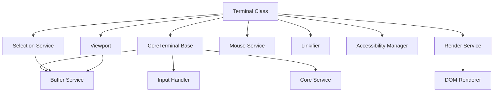
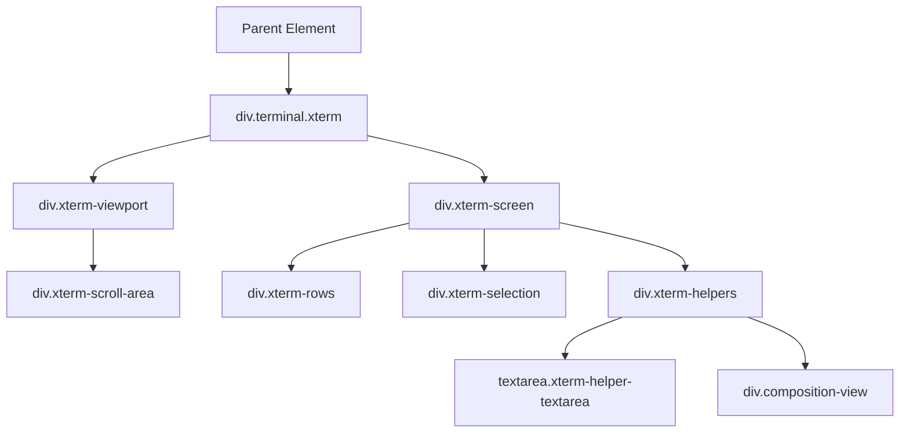
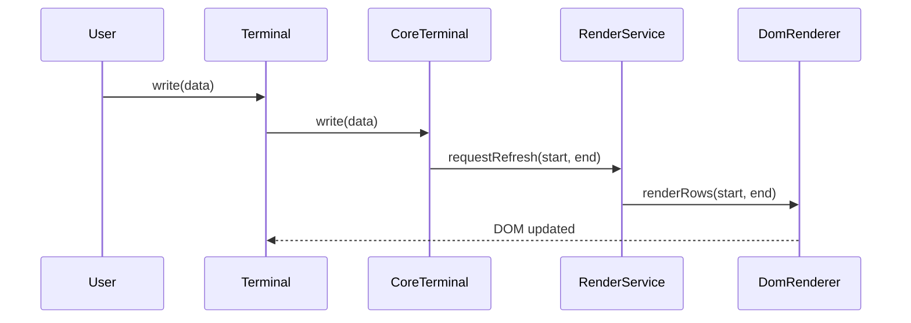
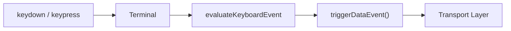
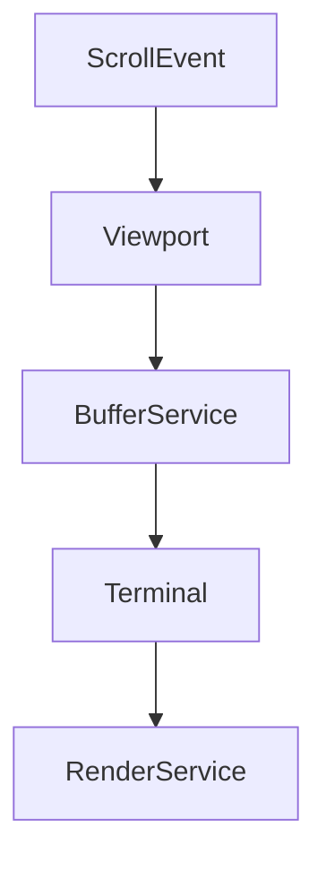

# Xterm Core Main

Xterm Core Main is the central browser-side terminal engine that powers interactive terminal sessions within MeshCentral. It builds on the lower-level CoreTerminal infrastructure and provides the concrete `Terminal` implementation responsible for DOM integration, rendering, input handling, accessibility, and event orchestration.

This module corresponds to the primary entry point for the Xterm runtime and exposes the public-facing `Terminal` class used throughout the UI.

---

## Module Responsibilities

Xterm Core Main is responsible for:

- Initializing and wiring core terminal services
- Managing the DOM structure of the terminal
- Coordinating rendering via the Render Service
- Handling keyboard, mouse, and composition input
- Managing selection and clipboard integration
- Enabling accessibility features
- Integrating link detection and decorations
- Bridging browser events to the CoreTerminal engine

It extends the lower-level engine defined in CoreTerminal and connects it to browser APIs.

---

## High-Level Architecture

Xterm Core Main acts as the orchestration layer that binds together:

- The terminal engine (CoreTerminal)
- The rendering pipeline (RenderService + DomRenderer)
- Input systems (Keyboard, Mouse, CompositionHelper)
- Auxiliary services (Selection, Linkifier, Decorations, Accessibility)

---

## Core Components

### Terminal (meshcentral.public.scripts.xterm.P)

The `Terminal` class is the primary public interface and extends `CoreTerminal`.

Key responsibilities:

- Creates and manages DOM elements (`div.terminal`, viewport, screen, textarea)
- Instantiates core services via the dependency injection container
- Registers event listeners for:
  - Keyboard events
  - Mouse events
  - Clipboard events
  - Composition (IME) events
- Forwards engine-level events to browser-facing APIs
- Coordinates rendering and resizing

### Supporting Component (meshcentral.public.scripts.xterm.S)

This component participates in the runtime wiring and export structure, ensuring the `Terminal` class is properly exposed in the bundled environment.

---

## DOM Structure

When `Terminal.open(element)` is called, Xterm Core Main constructs a layered DOM structure:

This structure separates:

- Scroll handling (viewport)
- Rendered rows
- Selection overlay
- Input capture (`textarea`)
- IME composition rendering

---

## Rendering Pipeline

Rendering is delegated to the Render Service and DOM Renderer.

Key behaviors:

- Batched rendering via a RenderDebouncer
- Viewport-based rendering
- Cursor rendering and blinking
- Selection highlighting
- Decoration overlays
- Overview ruler integration

---

## Input Handling

Xterm Core Main captures input through a hidden textarea and DOM events.

### Keyboard Flow

Features:

- Application cursor mode support
- Modifier handling (Ctrl, Alt, Meta)
- Bracketed paste mode
- Custom key event handlers
- Platform-specific behavior (Mac, Windows, Linux)

### Mouse Handling

- Protocol-based mouse tracking (X10, VT200, DRAG, ANY)
- SGR and pixel encodings
- Scroll wheel handling
- Selection vs mouse reporting coordination

---

## Selection System

The Selection Service:

- Tracks selection ranges in buffer coordinates
- Handles:
  - Single-click
  - Double-click (word selection)
  - Triple-click (line selection)
  - Column selection
- Integrates with clipboard
- Supports Linux primary selection

Selection rendering is performed by the DOM Renderer overlay.

---

## Accessibility Support

The Accessibility Manager:

- Creates an ARIA tree representation of visible rows
- Uses a live region for screen reader announcements
- Tracks focus boundaries
- Syncs terminal output with assistive technologies

This is enabled when `screenReaderMode` is active.

---

## Viewport & Scrolling

The Viewport component:

- Synchronizes scroll position with buffer `ydisp`
- Supports smooth scrolling
- Handles:
  - Mouse wheel
  - Touch scrolling
  - Programmatic scroll events

Scroll events propagate through:

---

## Decorations & Linkification

### Linkifier

- Detects clickable regions (e.g., URLs)
- Integrates with link providers
- Applies hover underline and pointer cursor

### Decoration Service

- Allows external modules to register decorations
- Supports:
  - Inline overlays
  - Overview ruler markers
  - Layered rendering (top/bottom)

---

## Lifecycle

### Initialization

1. Instantiate `Terminal`
2. Call `open(parentElement)`
3. Services are created and registered
4. Renderer initialized
5. Input and event listeners attached

### Runtime

- `write()` → parsed → buffer updated → rows refreshed
- User input → encoded → sent to backend
- Resize → buffer resized → renderer updated

### Disposal

- Event listeners removed
- DOM elements detached
- Services disposed via Disposable pattern

---

## Relationship to Other Modules

- Parent Module: [Xterm Core](../xterm-core.md)
- Sibling Module: [Xterm Core Utilities](../xterm-core-utilities/xterm-core-utilities.md)

Xterm Core Main builds on the engine and utility layers while providing the concrete browser-bound terminal implementation.

---

## Summary

Xterm Core Main is the orchestration and integration layer of the Xterm system. It:

- Bridges CoreTerminal with the browser DOM
- Manages rendering, input, and scrolling
- Provides accessibility and decoration support
- Exposes the public `Terminal` API

It is the central runtime component responsible for delivering a fully interactive, feature-rich terminal experience inside MeshCentral.