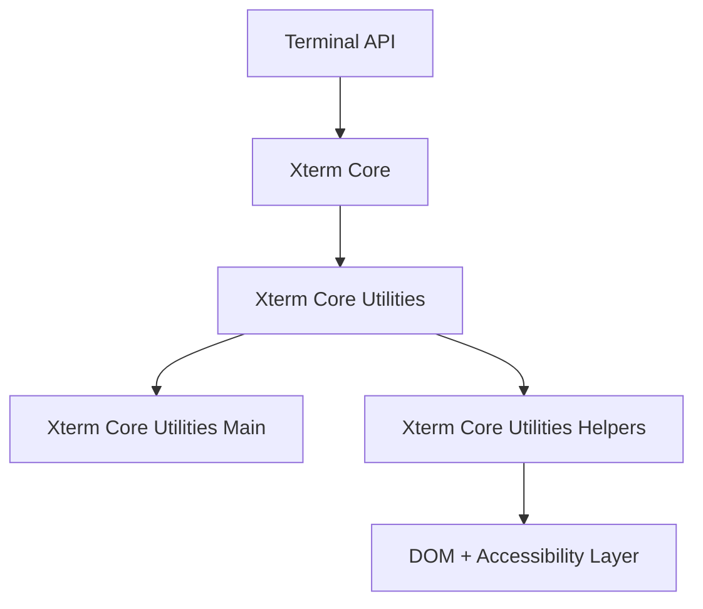
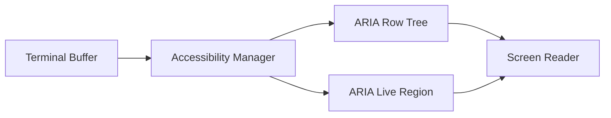
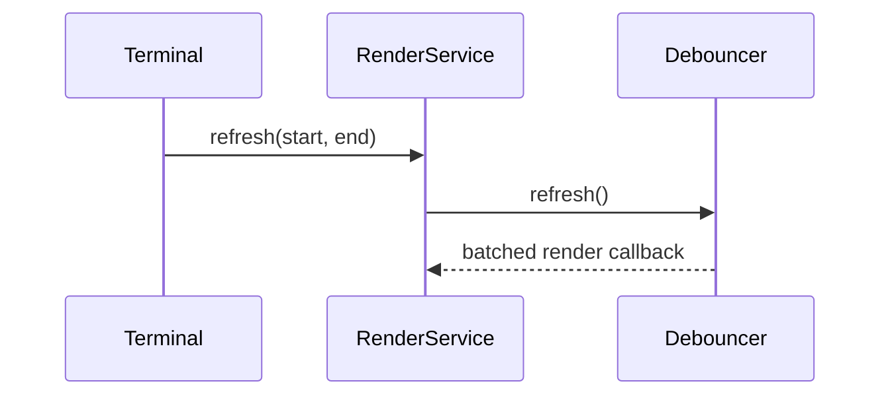
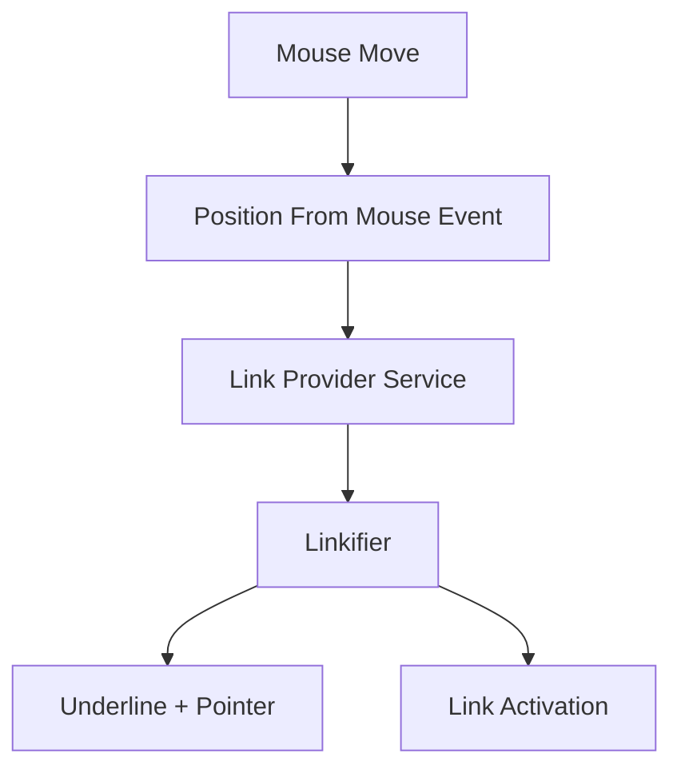
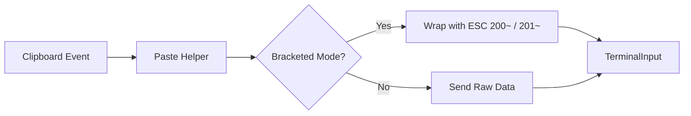
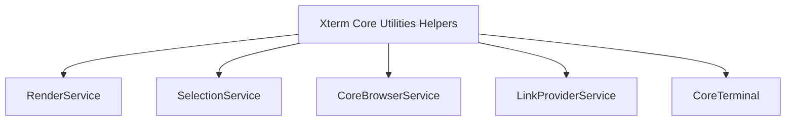
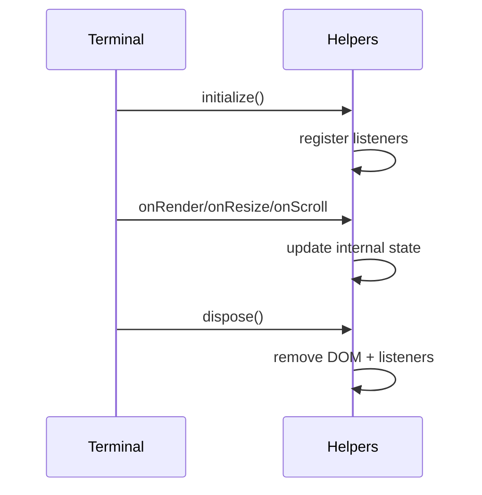

# Xterm Core Utilities Helpers

## Overview

The **Xterm Core Utilities Helpers** module provides low-level helper logic that supports the internal behavior of the Xterm rendering and interaction pipeline. It is a focused utility layer within the Xterm core, built around the component:

- `meshcentral.public.scripts.xterm.d`

This module contains foundational helper functionality used by the Xterm core to manage accessibility, rendering synchronization, input normalization, link handling, and DOM coordination.

Within the Xterm hierarchy, this module sits under:

- [Xterm Core Utilities](../xterm-core-utilities.md)
- Sibling module: [Xterm Core Utilities Main](../xterm-core-utilities-main/xterm-core-utilities-main.md)

It does not expose high-level APIs directly to consumers, but instead enables the higher layers of the Xterm subsystem to operate consistently and efficiently.

---

## Architectural Context

The Xterm subsystem is layered. The Helpers module sits at the lowest utility layer beneath rendering, input handling, and terminal orchestration.

The **Xterm Core Utilities Helpers** module is primarily responsible for:

- Accessibility tree management
- Debounced rendering helpers
- Link detection and interaction support
- Clipboard and paste normalization
- Character composition handling
- Lightweight event utilities

---

## Core Responsibilities

### 1. Accessibility Management

One of the most significant responsibilities of this module is managing accessibility behavior through the `AccessibilityManager`.

#### Responsibilities:

- Builds a virtual accessibility tree mirroring terminal rows
- Maintains ARIA roles and attributes
- Manages live region updates for screen readers
- Synchronizes terminal buffer changes to accessible DOM elements
- Handles focus boundary transitions

The module ensures screen readers receive controlled output updates and prevents overwhelming assistive technologies by:

- Debouncing row updates
- Limiting announced lines
- Clearing live regions on key events

---

### 2. Rendering Debounce Utilities

Rendering in a terminal environment is performance-sensitive. This module provides debouncing strategies to:

- Batch row updates
- Avoid excessive repainting
- Coordinate render cycles with browser animation frames

Key utility classes include:

- `RenderDebouncer`
- `TimeBasedDebouncer`

This architecture reduces layout thrashing and improves terminal responsiveness.

---

### 3. Link Handling and Hover Logic

The Helpers module includes link detection and hover management logic.

#### Responsibilities:

- Query link providers
- Resolve overlapping link ranges
- Manage hover state
- Trigger underline decorations
- Activate links on click

This mechanism ensures that terminal-rendered URLs behave like interactive hyperlinks without compromising performance.

---

### 4. Clipboard and Paste Helpers

The module normalizes clipboard interactions to align with terminal expectations.

#### Features:

- Bracketed paste support
- Raw vs processed paste modes
- Right-click selection logic
- Clipboard data sanitization

This ensures compatibility with applications that rely on bracketed paste sequences.

---

### 5. Composition and IME Handling

For languages requiring Input Method Editors (IME), the module manages composition sequences.

#### Responsibilities:

- Track composition start and end
- Position composition overlays
- Send finalized composed characters to core service
- Synchronize composition view with cursor

This guarantees proper handling of multi-byte and composed characters.

---

### 6. DOM Event Utilities

The module provides lightweight wrappers such as disposable DOM listeners to ensure:

- Memory-safe event registration
- Proper cleanup on terminal disposal
- Encapsulation of browser event lifecycles

These utilities prevent event leaks in long-lived terminal sessions.

---

## Interaction with Other Xterm Modules

The Helpers module collaborates closely with:

- **Xterm Core** — for buffer state and cursor tracking
- **Xterm Core Utilities Main** — for primary utility orchestration
- Render service — for viewport and dimension updates
- Selection service — for selection state synchronization
- Core browser service — for DPR and document management

It does not own terminal state, but observes and reacts to state changes.

---

## Lifecycle Behavior

The module follows a strict lifecycle pattern:

1. Construct helpers during terminal initialization
2. Register event listeners
3. React to resize, render, scroll, and key events
4. Dispose safely when terminal is destroyed

---

## Design Principles

The Xterm Core Utilities Helpers module adheres to the following principles:

- **Low coupling** — interacts through service interfaces
- **Performance-aware** — debounced and batched operations
- **Accessibility-first** — full ARIA support
- **Memory safe** — explicit disposal patterns
- **Non-API facing** — internal support layer only

---

## Summary

The **Xterm Core Utilities Helpers** module forms the invisible backbone of the Xterm subsystem. While it does not directly expose user-facing APIs, it enables:

- Accessible terminal output
- Efficient rendering cycles
- Safe event handling
- Robust link interactions
- Proper IME and clipboard behavior

By abstracting these concerns into a dedicated helper layer, the Xterm architecture remains modular, maintainable, and performant.