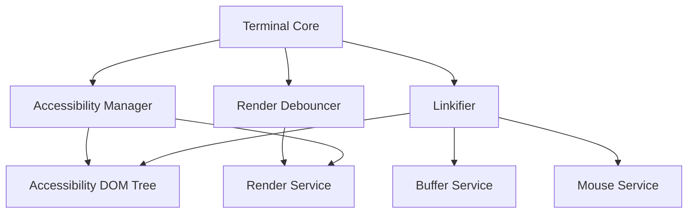
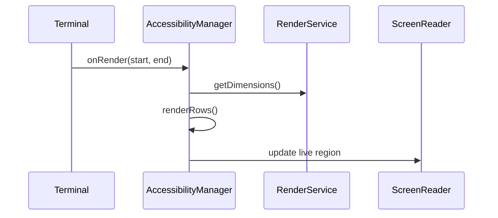
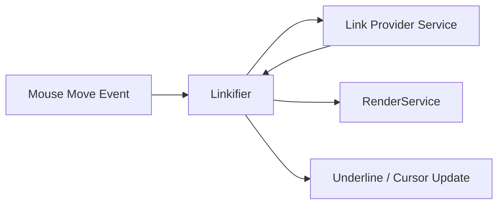
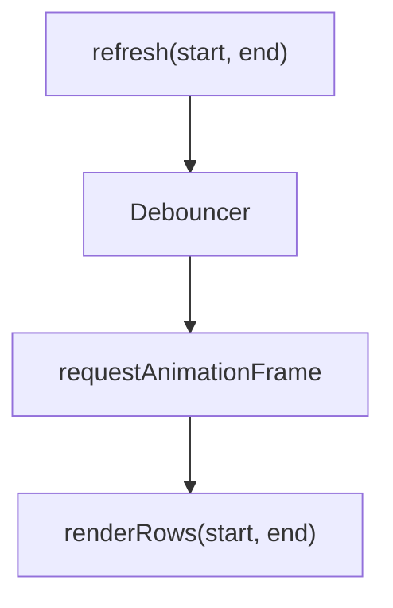
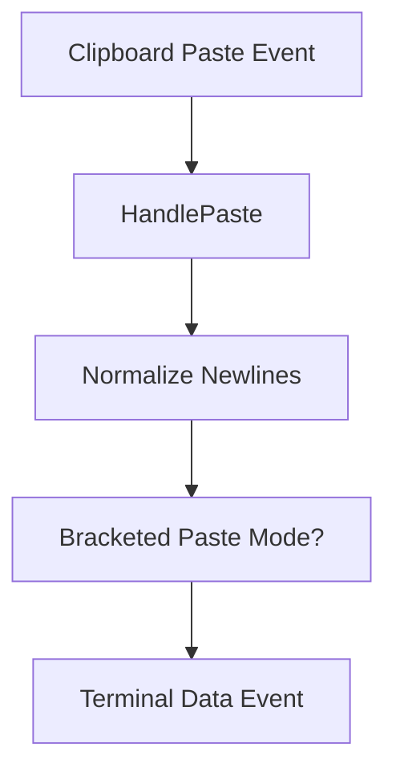
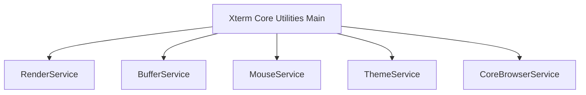

# Xterm Core Utilities Main

The **Xterm Core Utilities Main** module provides foundational browser-side utilities that support the core Xterm terminal runtime. It contains the primary utility classes and event-driven helpers used by the terminal for accessibility, link detection, rendering coordination, clipboard handling, and performance optimization.

This module builds on the lower-level abstractions from its parent module and collaborates closely with rendering, buffer, input, and browser services inside the Xterm subsystem.

---

## 1. Purpose and Responsibilities

The Xterm Core Utilities Main module is responsible for:

- Accessibility tree management for screen readers
- Link detection and interaction inside the terminal viewport
- Clipboard integration and paste handling
- Render debouncing and performance throttling
- Color contrast caching
- Disposable DOM event handling

Core components in this module:

- `meshcentral.public.scripts.xterm.a`
- `meshcentral.public.scripts.xterm.c`

These map to utility-level constructs such as:

- Accessibility Manager
- Linkifier
- Render Debouncer
- DOM disposable helpers
- Clipboard and paste utilities
- Color contrast cache

For shared helper utilities, see:

- [Xterm Core Utilities Helpers](../xterm-core-utilities-helpers/xterm-core-utilities-helpers.md)
- [Xterm Core Utilities](../xterm-core-utilities.md)

---

## 2. High-Level Architecture

The module operates between the **Terminal Core** and the **Browser DOM layer**, coordinating user interaction, rendering updates, and accessibility.

### Architectural Role

- Extends `Disposable` base patterns
- Uses event emitters for reactive updates
- Integrates with core services through dependency injection
- Bridges terminal buffer state to DOM representation

---

## 3. Accessibility Manager

The **Accessibility Manager** creates and maintains a screen-reader-friendly representation of the terminal buffer.

### Key Responsibilities

- Builds a semantic accessibility tree
- Maintains row-level ARIA attributes
- Announces typed characters via live regions
- Handles selection synchronization
- Responds to terminal resize and scroll events

### Interaction Flow

### Key Mechanisms

- Uses `aria-live` regions for dynamic announcements
- Debounces row updates using a time-based strategy
- Tracks row-to-column mappings for selection alignment

---

## 4. Linkifier

The **Linkifier** detects clickable links within terminal output.

### Responsibilities

- Monitors mouse movement
- Queries link providers
- Applies hover decorations
- Emits underline events
- Activates links on click

### Internal Data Flow

### Behavior

- Uses buffer coordinates to identify link ranges
- Prevents intersecting link conflicts
- Supports hover, leave, and activation callbacks
- Dynamically toggles pointer cursor and underline styling

---

## 5. Render Debouncing and Performance Utilities

### Render Debouncer

Coordinates rendering updates using animation frames.

Responsibilities:

- Batch multiple refresh requests
- Prevent redundant reflows
- Limit rendering to affected row ranges

### Time-Based Debouncer

- Enforces minimum delay between refresh cycles
- Prevents excessive DOM churn during high-output scenarios

---

## 6. Clipboard and Paste Handling

Utility functions manage clipboard integration.

### Capabilities

- Normalize line endings before paste
- Support bracketed paste mode
- Handle right-click paste behavior
- Move hidden textarea under mouse for context interactions

### Paste Flow

---

## 7. Color Contrast Cache

The **Color Contrast Cache** optimizes rendering performance by caching:

- Foreground/background contrast adjustments
- CSS-based color transformations

It avoids recalculating minimum contrast ratios for frequently rendered glyph combinations.

---

## 8. Disposable DOM Listener Utility

Provides a safe abstraction for DOM event listeners.

Responsibilities:

- Register event listeners
- Return disposable handles
- Automatically remove listeners during teardown

This aligns with the Xterm-wide `Disposable` lifecycle model.

---

## 9. Integration with the Terminal Core

The Xterm Core Utilities Main module is tightly integrated with:

- Render Service
- Buffer Service
- Mouse Service
- Theme Service
- Core Browser Service

These dependencies are injected via decorators and managed by the instantiation service.

---

## 10. Relationship to Neighboring Modules

- Parent: [Xterm Core Utilities](../xterm-core-utilities.md)
- Sibling: [Xterm Core Utilities Helpers](../xterm-core-utilities-helpers/xterm-core-utilities-helpers.md)

This module contains the **primary utility logic**, while the helpers module contains secondary and specialized utility helpers.

---

## 11. Summary

The **Xterm Core Utilities Main** module acts as the interaction layer between the terminal engine and the browser environment. It:

- Enhances accessibility
- Enables interactive links
- Manages clipboard integration
- Optimizes rendering performance
- Enforces disposable lifecycle patterns

It is essential for delivering a responsive, accessible, and feature-rich browser terminal experience.
