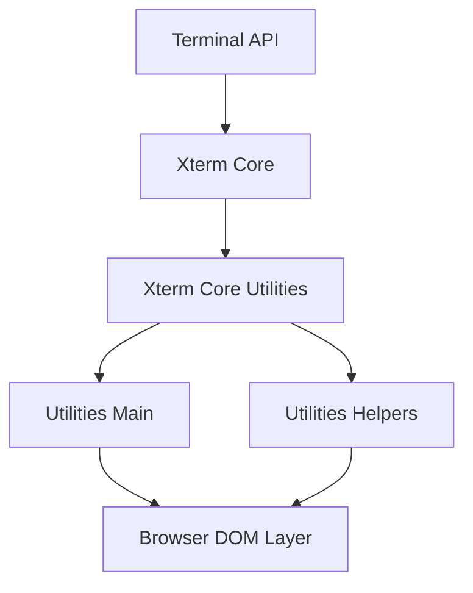
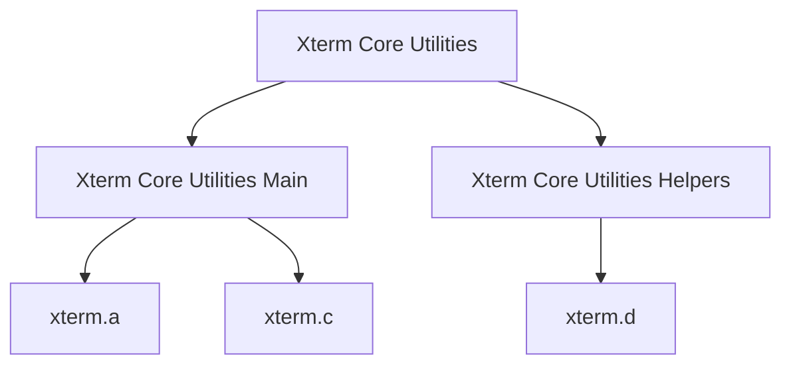
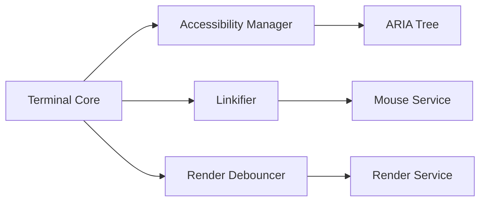
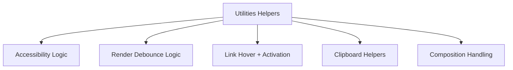
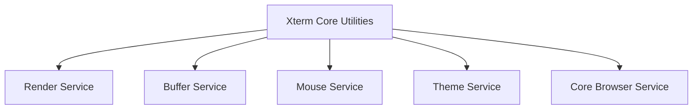
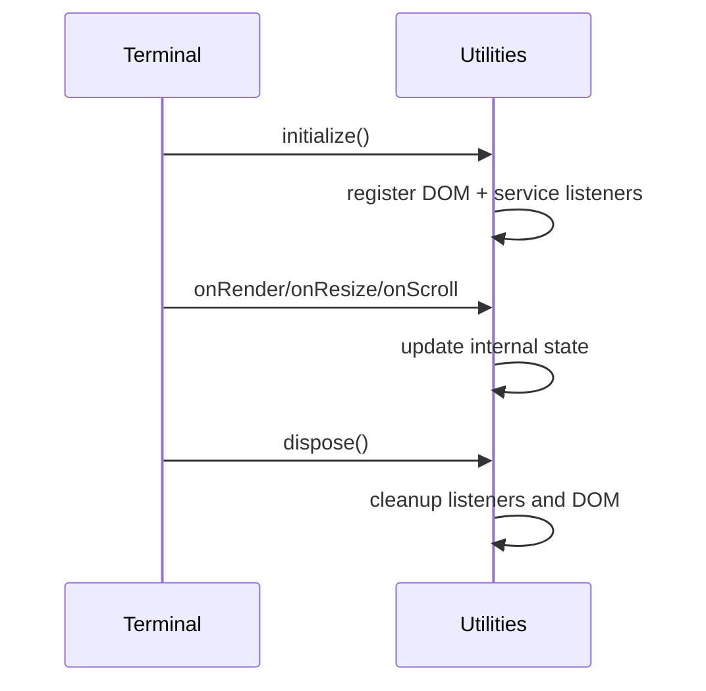

# Xterm Core Utilities

The **Xterm Core Utilities** module provides foundational utility logic for the Xterm terminal subsystem inside the MeshCentral web client. It acts as the internal utility layer between the **Xterm Core runtime** and the browser environment, supporting accessibility, rendering coordination, DOM interaction, link detection, clipboard behavior, and lifecycle management.

This module lives under:

```text
public/scripts/xterm/
```

Core components:

- `meshcentral.public.scripts.xterm.a`
- `meshcentral.public.scripts.xterm.c`
- `meshcentral.public.scripts.xterm.d`

It is composed of two submodules:

- **Xterm Core Utilities Main**
- **Xterm Core Utilities Helpers**

---

## 1. Purpose of the Module

The **Xterm Core Utilities** module exists to:

- Bridge the terminal engine and the browser DOM
- Manage accessibility (ARIA tree, live regions)
- Detect and activate links in terminal output
- Coordinate render debouncing and animation frames
- Normalize clipboard and paste interactions
- Provide disposable DOM event handling
- Support IME and character composition workflows

It does not own terminal state. Instead, it reacts to buffer, render, and input services provided by the Xterm Core.

---

## 2. High-Level Architecture

The module sits between the Xterm Core runtime and the browser DOM layer.



### Architectural Role

- Observes buffer and render events
- Translates terminal state into accessible DOM structures
- Coordinates UI behavior such as hover links and paste handling
- Uses disposable lifecycle patterns for cleanup
- Integrates via injected services (render, buffer, mouse, theme, browser)

---

## 3. Internal Structure

### Directory Location

```text
public/scripts/xterm/
```

### Core Components

```text
meshcentral.public.scripts.xterm.a
meshcentral.public.scripts.xterm.c
meshcentral.public.scripts.xterm.d
```

### Submodules



---

## 4. Xterm Core Utilities Main

Documentation:  
`xterm-core-utilities-main/xterm-core-utilities-main.md`

This submodule contains the primary runtime utilities responsible for:

- Accessibility Manager
- Linkifier
- Render Debouncer
- Clipboard integration
- Color contrast caching
- Disposable DOM listeners

### Responsibilities Overview



---

## 5. Xterm Core Utilities Helpers

Documentation:  
`xterm-core-utilities-helpers/xterm-core-utilities-helpers.md`

This submodule provides low-level helpers used by the Main utilities layer.

Primary component:

```text
meshcentral.public.scripts.xterm.d
```

### Responsibilities

- Accessibility tree synchronization
- Debounced render coordination
- Link hover resolution logic
- Clipboard normalization
- IME composition support
- Lightweight DOM event wrappers



The Helpers layer enables the Main utilities to remain modular and focused.

---

## 6. Interaction with Core Services

The Xterm Core Utilities module integrates with multiple services injected by the Xterm Core:



Key characteristics:

- Event-driven updates
- Service-based architecture
- Disposable lifecycle management
- Performance-aware batching and throttling

---

## 7. Lifecycle Behavior

The module follows a strict initialization and disposal pattern:



This ensures:

- No memory leaks
- Safe teardown of long-lived terminal sessions
- Consistent browser behavior

---

## 8. Relationship to Other Xterm Modules

The module is part of the larger Xterm hierarchy:

- **Parent Layer:** Xterm Core
- **Sibling Modules:** Xterm Utilities, Xterm Addons
- **Children:**
  - Xterm Core Utilities Main
  - Xterm Core Utilities Helpers

It acts as a shared internal utility layer rather than a user-facing API module.

---

## 9. Design Principles

The **Xterm Core Utilities** module follows these principles:

- **Separation of concerns** — utilities isolated from core terminal state
- **Accessibility-first** — complete ARIA and screen reader support
- **Performance-aware** — debounced rendering and minimal DOM churn
- **Service-oriented** — integrates through injected service contracts
- **Memory-safe** — disposable patterns enforced

---

## 10. Summary

The **Xterm Core Utilities** module is the foundational browser-side support layer of the Xterm subsystem in MeshCentral. It:

- Connects terminal state to the DOM
- Enables accessible terminal output
- Supports interactive link handling
- Optimizes rendering performance
- Manages clipboard and IME behavior
- Enforces lifecycle-safe DOM interaction

By separating these responsibilities into Main and Helper submodules, the Xterm architecture remains modular, maintainable, performant, and accessible.