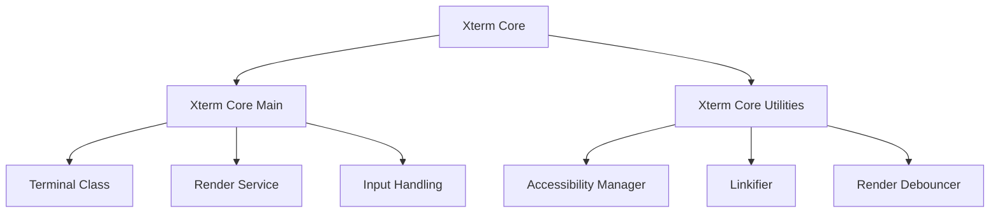
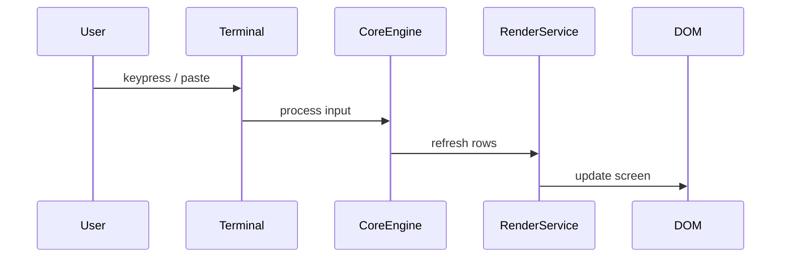
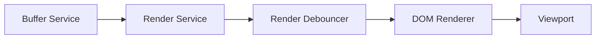
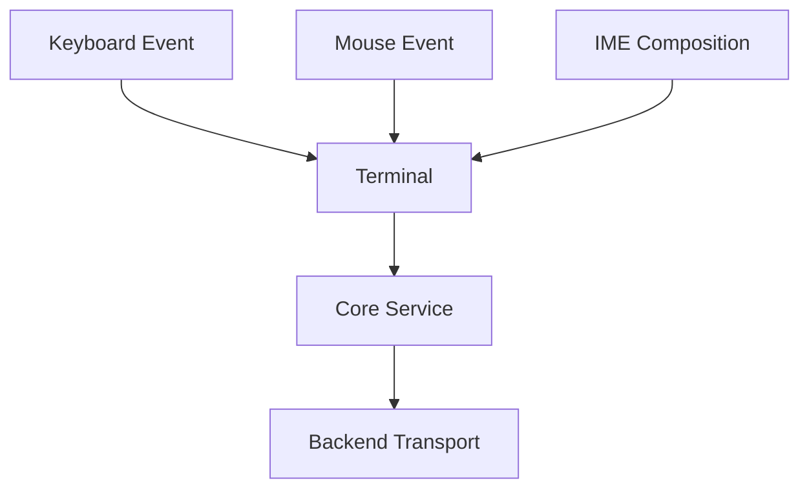
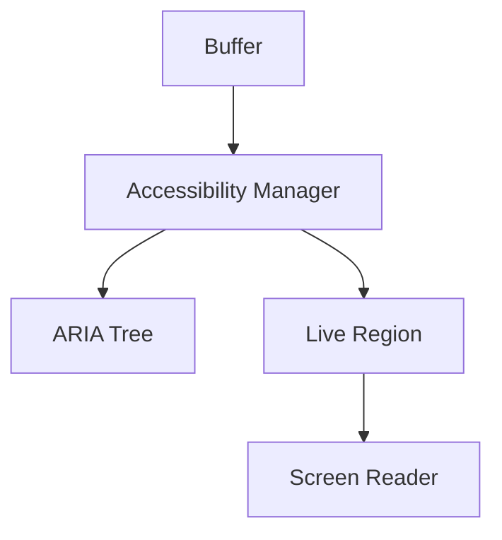
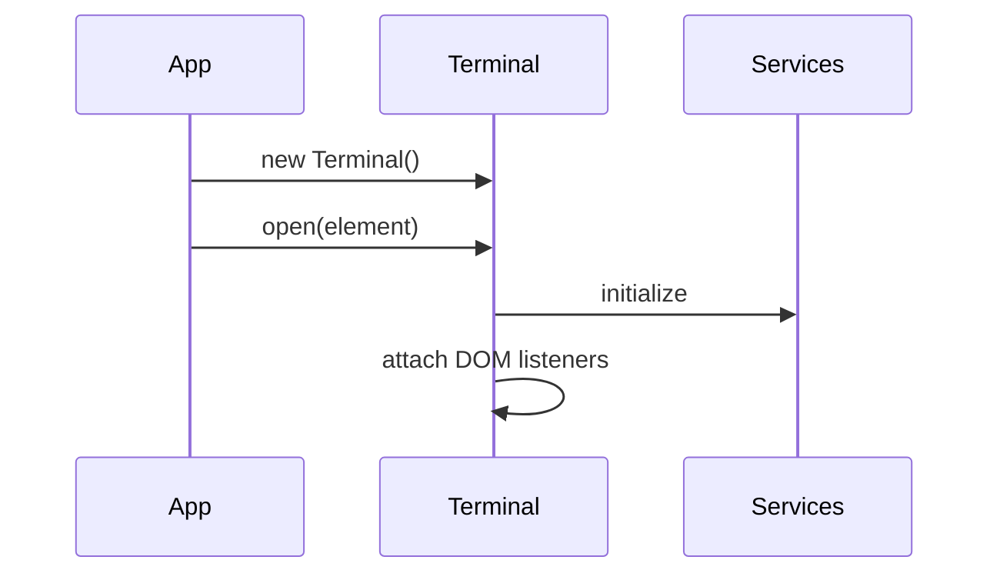

# Xterm Core

The **Xterm Core** module is the browser-side terminal subsystem used within MeshCentral. It provides the runtime engine that powers interactive terminal sessions, including rendering, input handling, buffer management, accessibility support, and integration with the browser DOM.

Located under:

```text
public/scripts/xterm/
```

Xterm Core acts as the central orchestration layer that binds together:

- The `Terminal` runtime
- Rendering services
- Input and event processing
- Accessibility features
- Utility services and lifecycle management

It is the foundation for all terminal-based functionality inside the MeshCentral web client.

---

## Purpose of the Module

The **Xterm Core** module is responsible for:

- Providing the browser-based terminal engine
- Managing terminal buffers and cursor state
- Rendering terminal rows efficiently in the DOM
- Handling keyboard, mouse, and IME input
- Coordinating accessibility and ARIA output
- Supporting link detection and decorations
- Managing lifecycle and disposal of terminal instances

It exposes the main `Terminal` implementation used by the UI.

---

## High-Level Architecture

Xterm Core is composed of two primary submodules:

- **Xterm Core Main**
- **Xterm Core Utilities**



### Architectural Role

- **Core Main** provides the concrete `Terminal` implementation and DOM integration.
- **Core Utilities** provides accessibility, link handling, rendering coordination, and browser helpers.
- Both layers rely on injected services such as buffer, render, mouse, and theme services.

---

## Internal Structure

```text
public/scripts/xterm/
│
├── P  (Terminal implementation)
├── S  (Runtime/export support)
├── a  (Core utilities main)
├── c  (Core utilities main)
└── d  (Core utilities helpers)
```

### Component Mapping

| Component | Responsibility |
|------------|----------------|
| `meshcentral.public.scripts.xterm.P` | Primary `Terminal` implementation |
| `meshcentral.public.scripts.xterm.S` | Runtime/export integration |
| `meshcentral.public.scripts.xterm.a` | Core utility logic |
| `meshcentral.public.scripts.xterm.c` | Core utility logic |
| `meshcentral.public.scripts.xterm.d` | Utility helpers |

---

## Core Runtime Flow

The Xterm Core module coordinates terminal execution from input to rendering.



### Data Flow Overview

1. User input is captured through DOM listeners.
2. Input is translated into terminal escape sequences.
3. The buffer updates accordingly.
4. Render service schedules a refresh.
5. DOM renderer updates visible rows.

---

## Rendering Architecture

Rendering is coordinated through a debounced pipeline to ensure high performance.



Key characteristics:

- Batched row refresh
- Viewport-aware rendering
- Cursor blinking and overlay support
- Selection and decoration layering
- Minimal DOM churn for performance

---

## Input Handling Architecture

Xterm Core captures browser input and converts it into terminal data events.



Supported features include:

- Modifier-aware key handling
- Bracketed paste mode
- Mouse tracking protocols
- Clipboard integration
- IME composition support

---

## Submodules

### 1. Xterm Core Main

**Documentation:**  
`xterm-core-main/xterm-core-main.md`

This submodule:

- Implements the `Terminal` class
- Constructs and manages DOM elements
- Registers event listeners
- Connects rendering and input services
- Coordinates lifecycle management

It is the primary runtime engine of the terminal.

---

### 2. Xterm Core Utilities

**Documentation:**  
`xterm-core-utilities/xterm-core-utilities.md`

This submodule provides:

- Accessibility manager (ARIA tree, screen reader support)
- Linkifier for clickable terminal content
- Render debouncing
- Clipboard normalization
- Disposable DOM helpers

It is divided into:

- **Xterm Core Utilities Main**
- **Xterm Core Utilities Helpers**

---

## Accessibility Integration

Accessibility is a first-class concern in Xterm Core.



When enabled:

- Visible rows are mirrored into an ARIA tree.
- Output changes are announced through a live region.
- Focus management ensures screen reader compatibility.

---

## Lifecycle

### Initialization



### Runtime

- `write()` updates buffer and schedules render
- Resize triggers buffer recalculation
- Scroll events synchronize viewport and display

### Disposal

- Event listeners removed
- Services disposed
- DOM elements detached
- Memory references cleared

---

## Relationship to Other Modules

Xterm Core integrates with:

- **Xterm Utilities** (higher-level helper functionality)
- **Xterm Addons** (e.g., image addon)
- MeshCentral backend transport for terminal data streaming

It forms the foundation upon which all browser-based terminal functionality is built.

---

## Design Principles

The Xterm Core module follows these principles:

- **Separation of concerns** — runtime vs utilities
- **Service-oriented architecture** — dependency injection for core services
- **Performance-first rendering** — debounced and viewport-based updates
- **Accessibility-first design** — ARIA tree and screen reader support
- **Lifecycle safety** — disposable patterns prevent memory leaks

---

## Summary

The **Xterm Core** module is the central browser-side terminal engine inside MeshCentral. It:

- Implements the `Terminal` runtime
- Coordinates rendering and input
- Integrates accessibility and link detection
- Provides structured lifecycle management
- Serves as the foundation for interactive terminal sessions

For detailed internal documentation, refer to:

- `xterm-core-main/xterm-core-main.md`
- `xterm-core-utilities/xterm-core-utilities.md`

Together, these submodules deliver a performant, accessible, and fully interactive terminal experience within the MeshCentral web client.