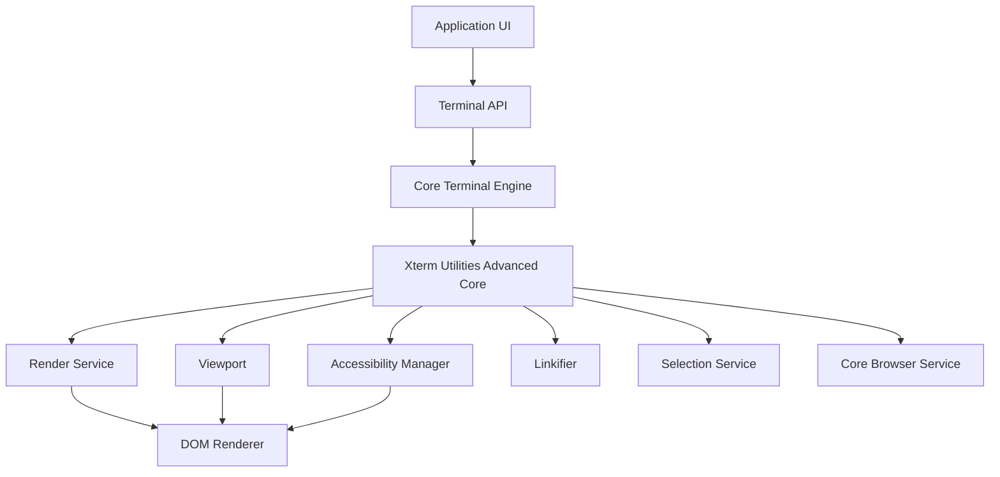
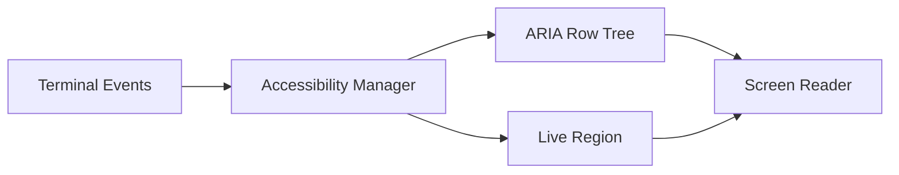
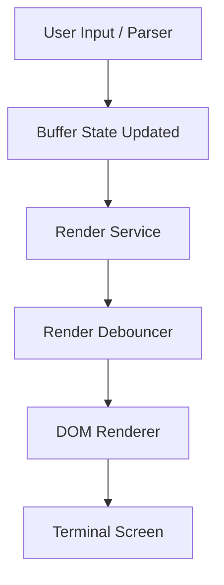
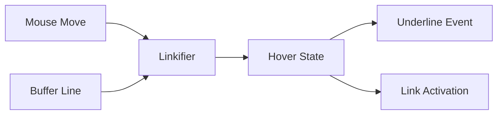
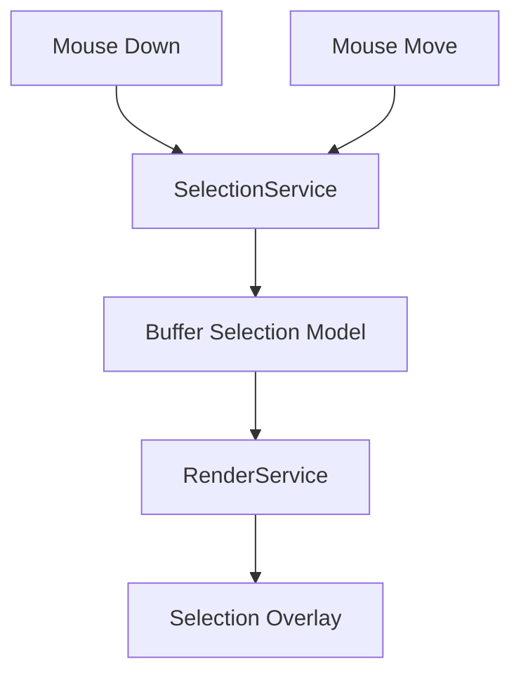
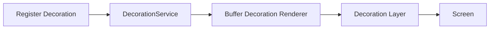
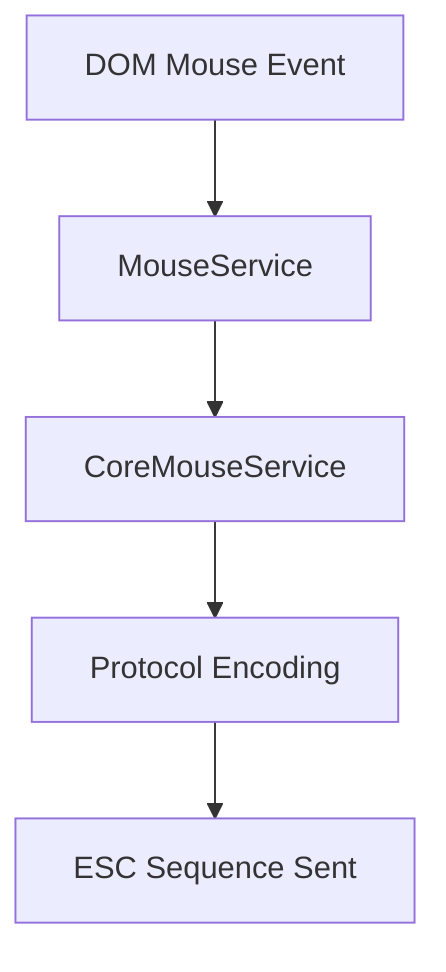
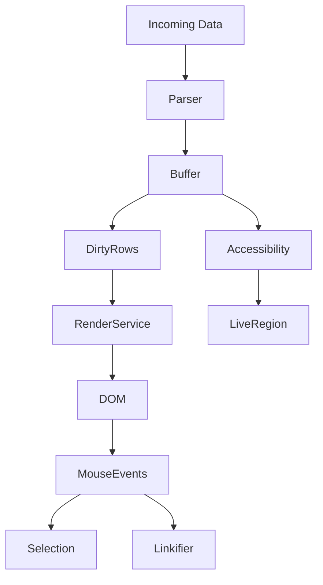

# Xterm Utilities Advanced Core

The **Xterm Utilities Advanced Core** module provides the foundational advanced runtime features for the Xterm integration within MeshCentral. It builds on top of the lower-level terminal engine and utility layers to deliver:

- Accessibility support (screen readers, live regions)
- Advanced link detection and interaction
- Rendering coordination and debouncing
- Viewport and scroll management
- Decoration and overlay rendering
- Clipboard, selection, and composition handling

This module contains the core advanced implementations (`meshcentral.public.scripts.xterm.n` and `meshcentral.public.scripts.xterm.o`) that orchestrate browser services, rendering services, buffer services, and event pipelines.

It sits under the advanced utilities layer:

- Parent: [Xterm Utilities Advanced](../xterm-utilities-advanced.md)
- Sibling: [Xterm Utilities Advanced Helpers](xterm-utilities-advanced-helpers/xterm-utilities-advanced-helpers.md)

---

## 1. Purpose and Responsibilities

The Xterm Utilities Advanced Core module is responsible for:

1. Extending the base terminal with browser-integrated capabilities.
2. Managing advanced rendering cycles and viewport synchronization.
3. Providing accessibility (ARIA tree, live announcements).
4. Handling advanced input scenarios (IME composition, clipboard, mouse protocols).
5. Coordinating decorations, links, and overlays.

At runtime, it bridges:

- Core terminal engine (buffer, parser, input handler)
- DOM renderer and viewport
- Browser services (DPR, focus, window events)
- Higher-level UI logic

---

## 2. High-Level Architecture

The Xterm Utilities Advanced Core layer sits between the terminal engine and the browser DOM.

### Key Characteristics

- **Event-driven**: Uses event emitters for render, resize, scroll, and input.
- **Service-based architecture**: Services injected via instantiation service.
- **Stateful coordination**: Maintains cursor, buffer, scroll, and selection state.
- **Browser-aware**: Reacts to device pixel ratio, focus, and selection changes.

---

## 3. Core Components Overview

The module exposes and orchestrates two primary compiled components:

- `meshcentral.public.scripts.xterm.n`
- `meshcentral.public.scripts.xterm.o`

These represent the advanced runtime layer and terminal orchestration logic.

Internally, they coordinate the following subsystems:

- AccessibilityManager
- Linkifier
- RenderService
- Viewport
- SelectionService
- CompositionHelper
- BufferDecorationRenderer
- OverviewRulerRenderer
- CoreBrowserService

---

## 4. Accessibility Architecture

The **AccessibilityManager** creates a parallel ARIA representation of the terminal content.

### Responsibilities

- Maintain a screen-reader-friendly tree of rows.
- Announce characters via live region.
- Track resize, scroll, and render events.
- Synchronize selection between DOM and terminal buffer.

### Key Behaviors

- Debounced row rendering for assistive technologies.
- Boundary focus handling for infinite scroll.
- Live region batching to avoid excessive announcements.
- Selection synchronization with buffer coordinates.

This ensures the terminal is usable in screen reader mode without affecting core performance.

---

## 5. Rendering and Viewport Coordination

The **RenderService** and **Viewport** components coordinate visual updates.

### Render Pipeline

### RenderService Responsibilities

- Track dirty rows.
- Debounce frame updates.
- Notify viewport of dimension changes.
- Forward rendered viewport events.

### Viewport Responsibilities

- Sync scroll area height.
- Handle wheel and touch scrolling.
- Manage smooth scroll animations.
- Translate scroll position to buffer offsets.

The Advanced Core ensures:

- Rendering is paused when off-screen.
- Device pixel ratio changes trigger layout recalculation.
- Scroll and selection updates remain synchronized.

---

## 6. Link Detection and Interaction

The **Linkifier** detects interactive links within terminal output.

### Features

- Line-based link provider architecture.
- Support for OSC 8 hyperlinks.
- Hover decoration (underline, pointer cursor).
- Click activation callbacks.
- Viewport-aware link invalidation.

The Advanced Core integrates the LinkProviderService and ensures link visuals remain aligned with rendered rows.

---

## 7. Selection and Clipboard Handling

The **SelectionService** manages buffer-based text selection.

### Selection Modes

- Normal selection
- Column selection
- Word selection
- Line selection

### Clipboard Integration

- Copy handler writes selected text to clipboard.
- Paste handler normalizes newlines and bracketed paste mode.
- Linux mouse selection support.

The Advanced Core connects DOM events to terminal buffer coordinates.

---

## 8. Input Composition and IME Support

The **CompositionHelper** handles complex text input (IME, multi-byte characters).

### Responsibilities

- Track composition start, update, and end.
- Render temporary composition overlay.
- Translate composed text into terminal input events.
- Handle surrogate pairs and wide characters.

This ensures compatibility with:

- East Asian input methods
- Accented character composition
- Dead keys and combined glyphs

---

## 9. Decorations and Overview Ruler

The Advanced Core supports buffer decorations and visual markers.

### Decoration Flow

### Overview Ruler

- Renders markers along the scroll bar.
- Groups color zones for performance.
- Updates on buffer and viewport changes.

Decorations are tied to buffer markers and automatically adjust during scroll and resize operations.

---

## 10. Mouse Protocol Handling

The Advanced Core integrates mouse tracking modes:

- X10
- VT200
- DRAG
- ANY

### Event Encoding

- DEFAULT
- SGR
- SGR_PIXELS

This enables terminal applications (e.g., text editors) to receive structured mouse input.

---

## 11. Resize and Device Pixel Ratio Handling

The Advanced Core listens to:

- Window resize
- Device pixel ratio changes
- Font and theme changes

On such events it:

1. Recomputes cell dimensions.
2. Updates canvas width and height.
3. Refreshes viewport scroll area.
4. Forces row re-rendering if required.

This guarantees visual consistency across:

- Retina displays
- Zoom changes
- Dynamic layout shifts

---

## 12. Data and Event Flow Summary

The Advanced Core ensures:

- Data parsing updates buffer state.
- Dirty rows trigger efficient re-rendering.
- User interactions map back into buffer operations.
- Accessibility and decoration layers remain synchronized.

---

## 13. Integration Within the System

Within the broader MeshCentral UI:

- The terminal widget uses the Xterm API.
- The Xterm API delegates to the Core Terminal.
- The Core Terminal relies on the Xterm Utilities Advanced Core for browser-specific behavior.

This separation allows:

- Reuse of terminal logic.
- Isolation of browser-dependent code.
- Extensibility via addons and helpers.

For utility extensions and additional helpers, see:

- [Xterm Utilities Advanced Helpers](xterm-utilities-advanced-helpers/xterm-utilities-advanced-helpers.md)

---

## 14. Design Principles

1. **Performance-first rendering** (batched, debounced updates).
2. **Strict buffer-DOM synchronization**.
3. **Accessibility parity with visual rendering**.
4. **Protocol correctness** for ANSI, OSC, CSI, and mouse events.
5. **Service-oriented architecture** for testability and modularity.

---

## Conclusion

The **Xterm Utilities Advanced Core** module is the operational backbone of the browser-based terminal experience. It transforms a raw terminal engine into a fully interactive, accessible, and high-performance web terminal by:

- Coordinating rendering and viewport logic
- Managing advanced input and selection flows
- Supporting accessibility and hyperlinks
- Handling decorations and scroll state

It acts as the bridge between the terminal core and the browser runtime, ensuring a robust and extensible terminal subsystem within MeshCentral.