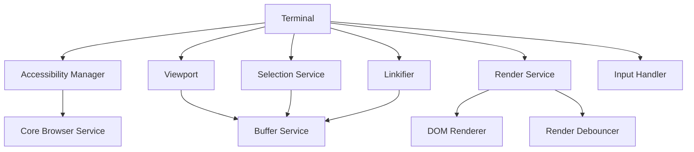
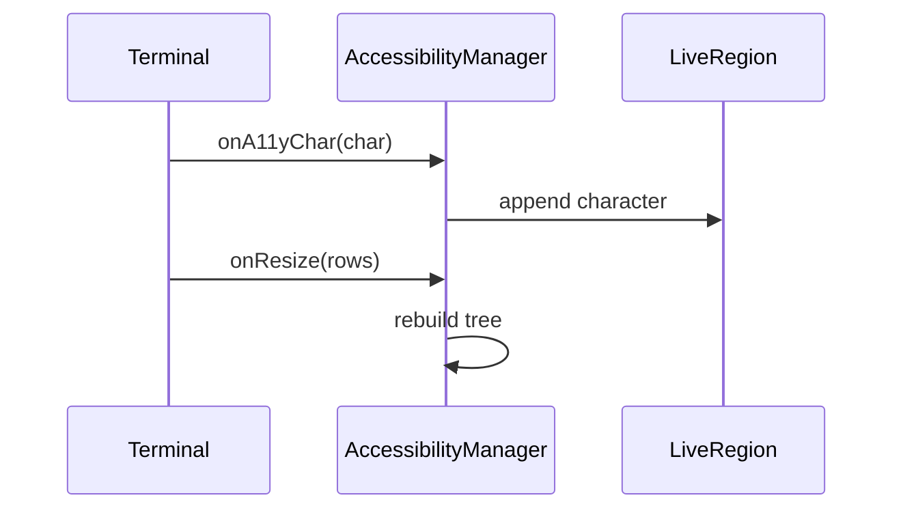
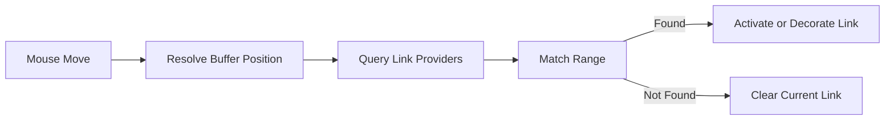
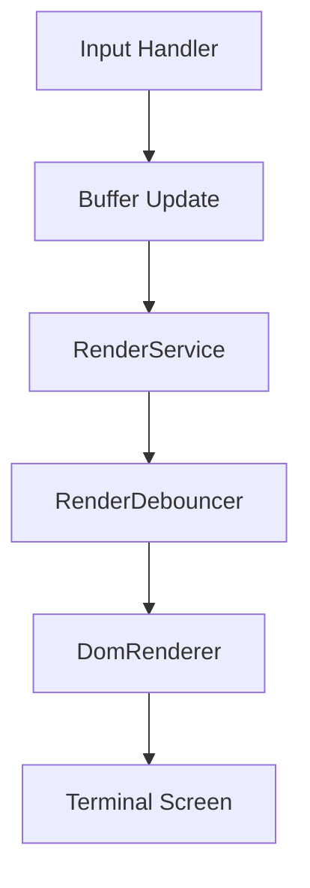
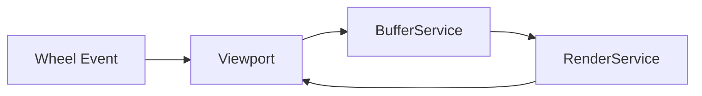
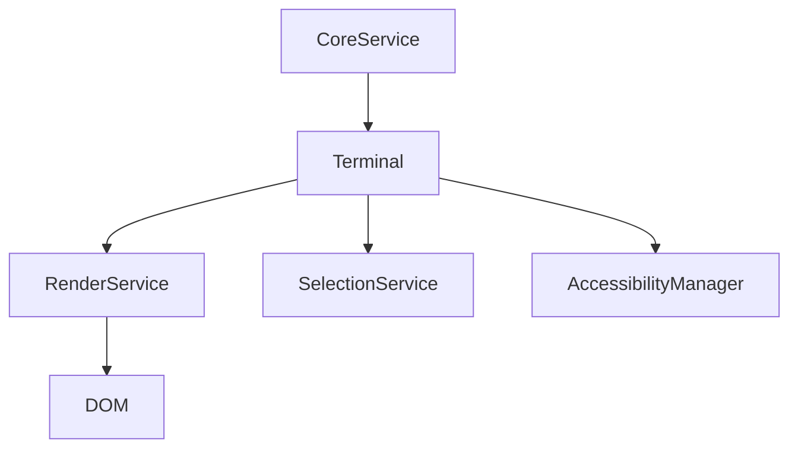
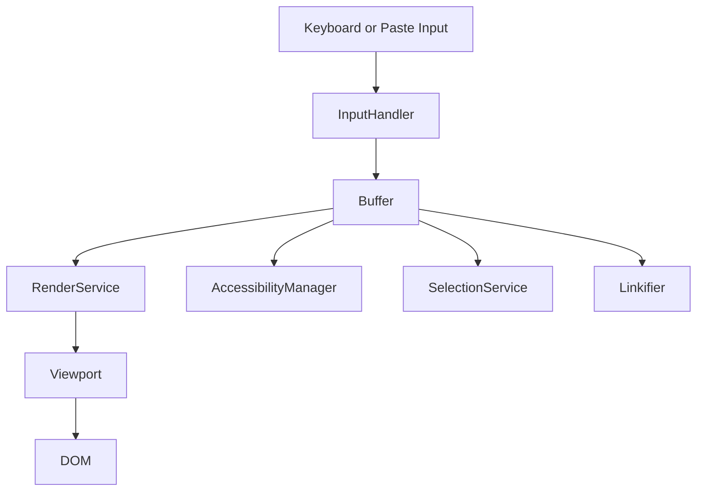
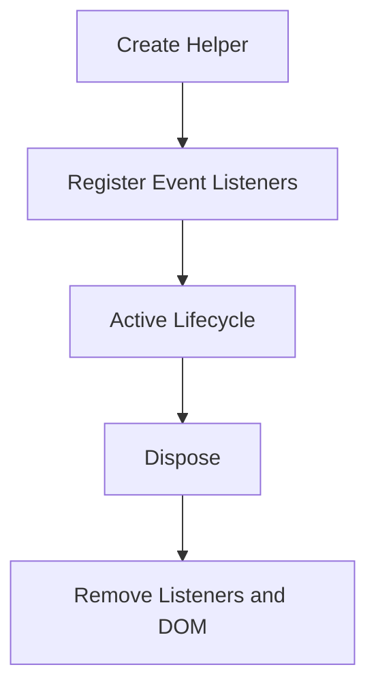

# Xterm Utilities Advanced Helpers

The **Xterm Utilities Advanced Helpers** module provides high-level helper functionality that enhances the core Xterm rendering, interaction, accessibility, and parsing subsystems. Built around the `meshcentral.public.scripts.xterm.s` component, this module exposes advanced browser-side utilities such as accessibility support, link detection, selection management, rendering orchestration, and viewport coordination.

It acts as a bridge between low-level terminal emulation logic and user-facing browser behaviors, ensuring that the terminal is accessible, interactive, performant, and extensible.

---

## 1. Module Responsibilities

The Xterm Utilities Advanced Helpers module is responsible for:

- Accessibility tree management (screen reader integration)
- Link detection and interaction
- Clipboard handling and paste behavior
- Selection logic and mouse interaction
- Rendering orchestration and debouncing
- Viewport scrolling and synchronization
- Decoration and overview ruler rendering
- Composition and IME support
- Input parsing coordination

This module works closely with:

- [Xterm Utilities Advanced Core](../xterm-utilities-advanced-core/xterm-utilities-advanced-core.md)
- [Xterm Utilities Advanced](../xterm-utilities-advanced.md)

---

## 2. High-Level Architecture

The module integrates several cooperating services layered above the core terminal engine.

### Architectural Characteristics

- Event-driven interactions
- Disposable lifecycle management
- Service-based dependency injection
- Separation between buffer logic and DOM rendering
- Performance-conscious rendering with debouncing

---

## 3. Core Components

### 3.1 Accessibility Manager

The **Accessibility Manager** creates an ARIA-compatible representation of terminal rows.

Responsibilities:

- Generates an accessibility tree (`role="list"`, `listitem` rows)
- Announces characters through a live region
- Tracks scroll and resize updates
- Maintains focus boundaries
- Synchronizes DOM selection with terminal selection

Accessibility flow:

Key behavior:

- Debounced rendering of accessible rows
- Limits announcement to prevent screen reader overload
- Clears live region on blur

---

### 3.2 Linkifier

The **Linkifier** detects clickable links in terminal content.

Features:

- Mouse hover detection
- Link underline decoration
- Cursor style switching
- Multi-provider link support
- Activation callbacks

Link detection flow:

The Linkifier cooperates with the rendering layer to show underlines only when hovered.

---

### 3.3 Selection Service

The **Selection Service** manages text selection across wrapped lines and scrollback.

Capabilities:

- Word, line, and column selection
- Mouse drag tracking
- Scroll-aware selection
- Linux middle-click behavior
- Selection change events

Selection logic integrates with:

- Buffer coordinates
- Viewport scroll state
- DOM rendering

---

### 3.4 Render Service and Debouncing

The **Render Service** orchestrates row rendering while minimizing layout thrashing.

Key helpers:

- `RenderDebouncer` (animation-frame batching)
- `TimeBasedDebouncer` (rate limiting)
- Viewport change notifications

Rendering pipeline:

Advantages:

- Coalesced updates
- Reduced reflows
- Smooth scrolling
- Separation between logical buffer and visual representation

---

### 3.5 Viewport

The **Viewport** manages scrolling behavior and synchronizes buffer scrollback with DOM scroll.

Responsibilities:

- Scroll position calculation
- Smooth scrolling support
- Mouse wheel handling
- Scroll area resizing
- Buffer height synchronization

Viewport coordination:

---

### 3.6 Composition Helper

Handles IME composition for complex character input.

- Tracks composition start/update/end
- Positions composition overlay
- Sends composed text to core service

This ensures correct input for multi-byte and non-Latin scripts.

---

### 3.7 Decoration and Overview Ruler

Decorations allow visual overlays inside the terminal:

- Inline decorations
- Background color overlays
- Overview ruler markers

Rendering coordination ensures decorations:

- Move with scrollback
- Adjust with DPI changes
- Respect layering rules

---

## 4. Event Model

The module heavily relies on event emitters.

Common events:

- `onRender`
- `onResize`
- `onScroll`
- `onSelectionChange`
- `onCursorMove`
- `onTitleChange`

Event propagation model:

Events are forwarded using internal forwarding utilities to keep components loosely coupled.

---

## 5. Data Flow Across Helpers

Key properties:

- Buffer remains source of truth
- Helpers react to buffer changes
- Rendering is decoupled from parsing

---

## 6. Performance Considerations

The module implements multiple optimization strategies:

- Batched rendering via animation frames
- Lazy decoration recalculation
- Incremental row refresh
- Debounced accessibility updates
- Efficient buffer line reuse

This ensures stable performance even with:

- Large scrollback buffers
- High-frequency output
- Complex rendering modes

---

## 7. Lifecycle and Disposal

All major helpers extend a Disposable base class.

Lifecycle pattern:

This prevents memory leaks and ensures consistent teardown behavior.

---

## 8. How This Module Fits in the System

The Xterm Utilities Advanced Helpers module sits between:

- Core terminal emulation logic
- Browser DOM
- User interaction layer

It transforms raw terminal state into:

- Accessible DOM structures
- Interactive link surfaces
- Scrollable viewport
- Styled decorations
- Selectable content

Without this layer, the terminal would:

- Lack accessibility support
- Provide no hyperlink handling
- Render inefficiently
- Fail to coordinate scrollback and DOM

---

## 9. Summary

The **Xterm Utilities Advanced Helpers** module is the behavioral and presentation coordination layer of the Xterm subsystem. It:

- Orchestrates rendering
- Enables accessibility
- Manages advanced user interaction
- Coordinates scroll, selection, and link handling
- Integrates DOM rendering with core buffer state

By encapsulating these responsibilities, the module ensures that the terminal remains:

- Performant
- Accessible
- Extensible
- Browser-native

It is a foundational part of the advanced Xterm architecture and complements the logic provided by the core and advanced modules.