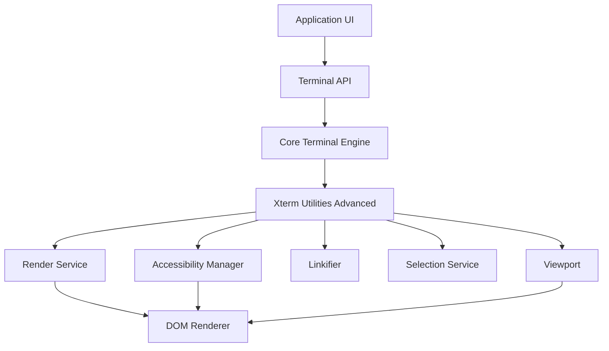
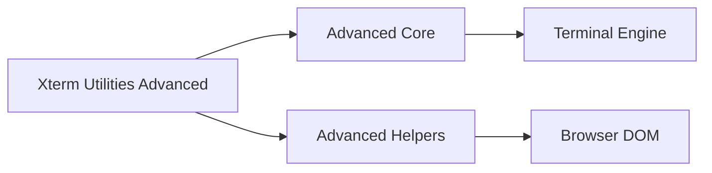
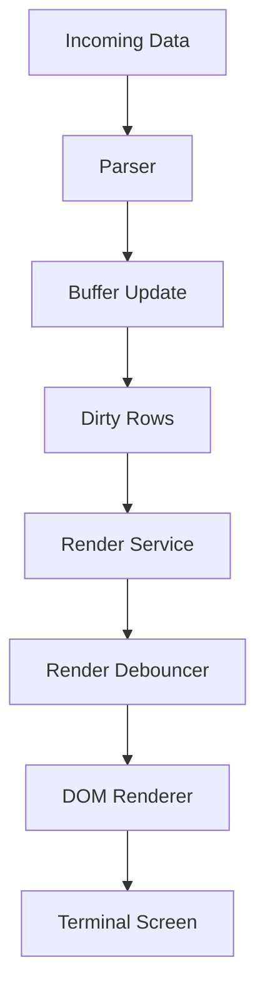
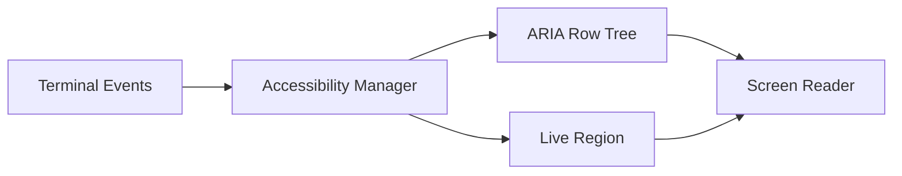
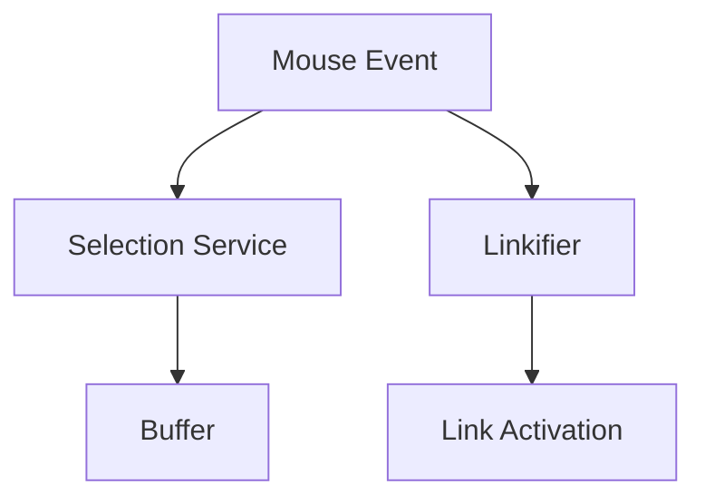
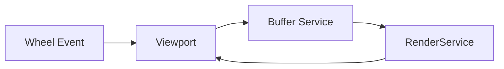
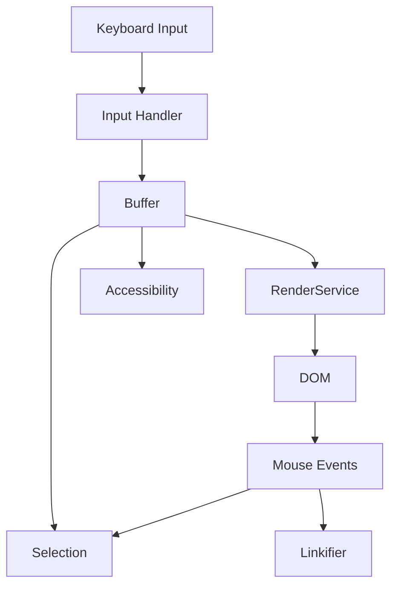

# Xterm Utilities Advanced

The **Xterm Utilities Advanced** module provides the high-level advanced runtime layer for the Xterm integration within MeshCentral. It extends the core terminal engine and base utility layer with:

- Advanced browser integration
- Accessibility and screen reader support
- Interactive link detection
- Selection and clipboard coordination
- Rendering orchestration and debouncing
- Viewport and scroll synchronization
- Decoration and overlay management

This module lives under `public/scripts` and contains the advanced utility components:

- `meshcentral.public.scripts.xterm.n`
- `meshcentral.public.scripts.xterm.o`
- `meshcentral.public.scripts.xterm.s`

It is structured into:

- **Xterm Utilities Advanced Core**
- **Xterm Utilities Advanced Helpers**

---

## 1. Purpose of the Module

The Xterm Utilities Advanced layer acts as the **bridge between the terminal engine and the browser DOM runtime**.

Its primary responsibilities are:

1. Coordinating rendering updates between buffer and DOM.
2. Managing accessibility layers (ARIA tree, live region).
3. Handling advanced input scenarios (IME, composition, clipboard).
4. Supporting hyperlink detection and activation.
5. Managing decorations and scroll-aware overlays.
6. Synchronizing viewport scroll with buffer state.

Without this layer, the terminal would lack:

- Screen reader compatibility
- Efficient rendering under high output load
- Clickable links inside terminal output
- Proper selection and clipboard behavior
- Scrollback synchronization with DOM

---

## 2. Repository Structure

```text
public/scripts/xterm-utilities-advanced
│
├── xterm-utilities-advanced-core
│   ├── meshcentral.public.scripts.xterm.n
│   └── meshcentral.public.scripts.xterm.o
│
└── xterm-utilities-advanced-helpers
    └── meshcentral.public.scripts.xterm.s
```

### Core Components

| Component | Responsibility |
|------------|----------------|
| `meshcentral.public.scripts.xterm.n` | Advanced runtime orchestration |
| `meshcentral.public.scripts.xterm.o` | Rendering and service coordination |
| `meshcentral.public.scripts.xterm.s` | Helper utilities and interaction layer |

---

## 3. High-Level Architecture

The Xterm Utilities Advanced module sits above the terminal core and below the browser DOM.



### Architectural Characteristics

- Event-driven services
- Disposable lifecycle management
- Service-based dependency coordination
- Strict buffer-as-source-of-truth model
- Performance-focused rendering

---

## 4. Internal Layering

The module is internally divided into **Core** and **Helpers**.



### 4.1 Advanced Core

See:
- [Xterm Utilities Advanced Core](xterm-utilities-advanced-core/xterm-utilities-advanced-core.md)

The Core layer provides:

- Rendering coordination
- Viewport synchronization
- Accessibility orchestration
- Mouse protocol encoding
- Resize and DPR handling
- Decoration and overview ruler support

Primary components:

- `meshcentral.public.scripts.xterm.n`
- `meshcentral.public.scripts.xterm.o`

---

### 4.2 Advanced Helpers

See:
- [Xterm Utilities Advanced Helpers](xterm-utilities-advanced-helpers/xterm-utilities-advanced-helpers.md)

The Helpers layer provides:

- Accessibility tree generation
- Link detection and activation
- Clipboard integration
- Selection handling
- Composition (IME) support
- Render debouncing helpers

Primary component:

- `meshcentral.public.scripts.xterm.s`

---

## 5. Rendering Pipeline

Rendering is carefully batched and debounced for performance.



### Key Properties

- Dirty-row tracking
- Animation-frame batching
- Incremental updates
- Scroll-aware rendering
- DPI recalculation support

---

## 6. Accessibility Architecture

Accessibility is implemented using an ARIA-compatible virtual row tree.



Features:

- Debounced row announcements
- Live region character batching
- Scroll boundary management
- Selection synchronization

---

## 7. Interaction Model

User interaction is mapped back into buffer coordinates.



Supported capabilities:

- Word, line, and column selection
- Hover-based link underline
- OSC 8 hyperlink support
- Clipboard normalization
- Linux middle-click paste

---

## 8. Viewport Coordination

The viewport synchronizes scrollback with DOM scroll.



Responsibilities:

- Scroll position translation
- Scroll area height management
- Smooth scrolling
- Scrollback synchronization

---

## 9. Data and Event Flow Summary



Principles:

- Buffer remains the single source of truth.
- Rendering reacts to buffer mutations.
- Accessibility mirrors visual output.
- Interaction maps DOM coordinates back to buffer indices.

---

## 10. Design Principles

1. **Performance-first rendering** (batched updates).
2. **Strict buffer-DOM synchronization**.
3. **Accessibility parity with visual rendering**.
4. **Service-oriented architecture**.
5. **Clear separation of core logic and browser utilities**.

---

## 11. Relationship to Other Modules

The Xterm Utilities Advanced module depends on:

- Xterm Core (terminal engine)
- Xterm Utilities (base utility layer)

It is extended by:

- Xterm addons (e.g., image addon)
- Higher-level UI terminal widgets

For detailed implementation breakdowns, refer to:

- **Xterm Utilities Advanced Core**
- **Xterm Utilities Advanced Helpers**

---

## Conclusion

The **Xterm Utilities Advanced** module is the operational and interaction backbone of the browser-based terminal experience in MeshCentral. It transforms the core terminal engine into a:

- Accessible
- Interactive
- High-performance
- Browser-integrated

terminal system capable of handling advanced rendering, selection, accessibility, and interaction requirements at scale.