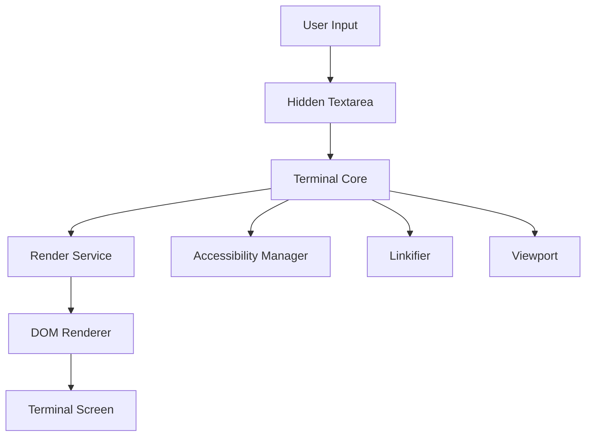
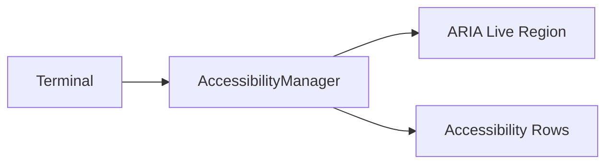
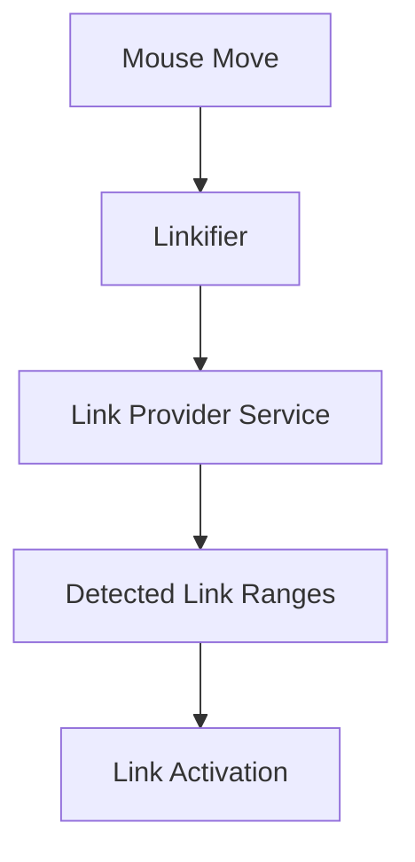
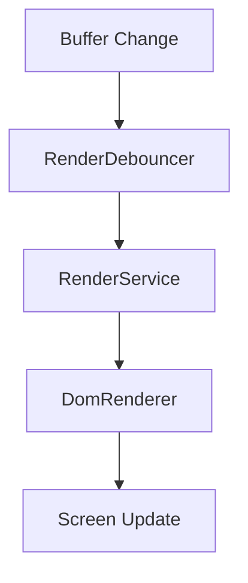
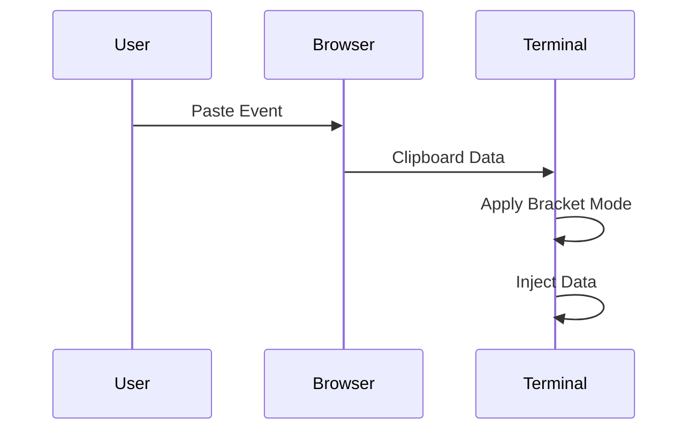
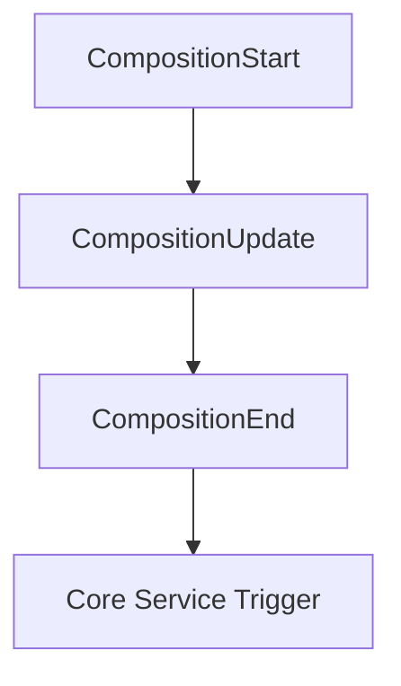
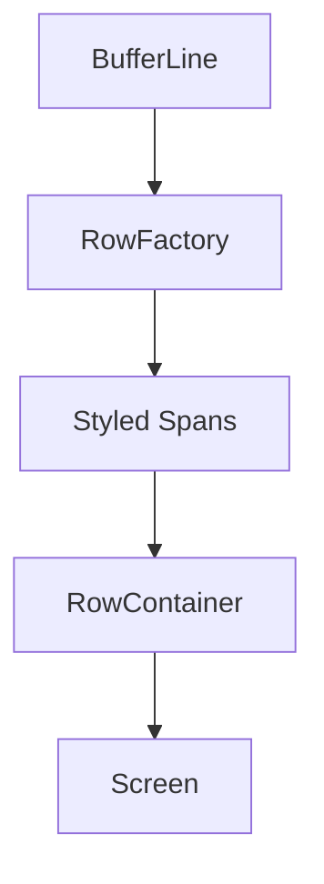
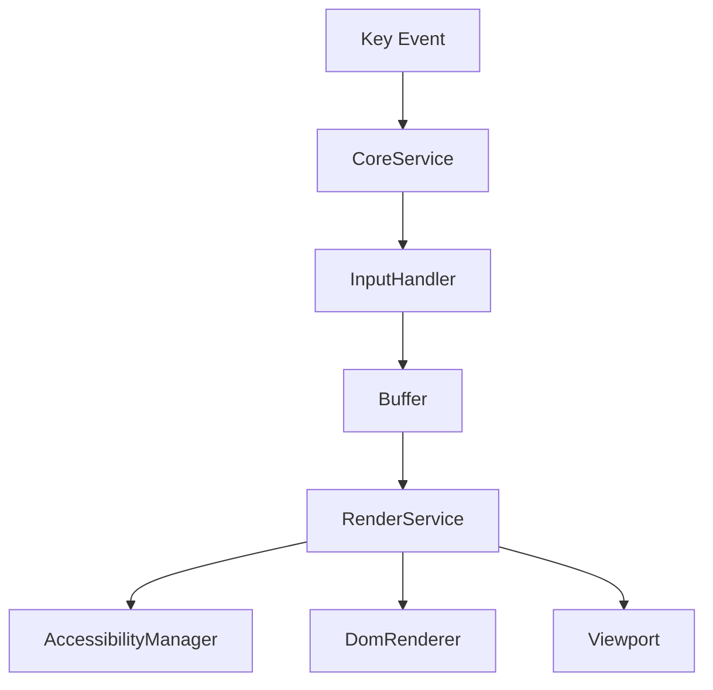

# Xterm Utilities Core

## Overview

The **Xterm Utilities Core** module provides the foundational browser-side utilities that support terminal rendering, input processing, accessibility, parsing, and viewport management for the Xterm integration within MeshCentral.

It builds on top of the Xterm engine and exposes essential infrastructure services such as:

- Accessibility management (screen reader support)
- Clipboard and paste handling
- Link detection and activation
- Rendering coordination and debouncing
- Viewport scrolling and synchronization
- Composition (IME) support
- Low-level event handling utilities

This module acts as the **utility backbone** for terminal interaction, ensuring correct behavior across browsers, input methods, and accessibility environments.

---

## Core Components

The module includes the following primary components from `public/scripts/xterm.js`:

- `meshcentral.public.scripts.xterm.h`
- `meshcentral.public.scripts.xterm.k`
- `meshcentral.public.scripts.xterm.l`

These components collectively implement:

- AccessibilityManager
- Linkifier
- Render and Viewport coordination
- Clipboard utilities
- Input composition helpers
- DOM-based rendering infrastructure

---

## Architectural Position

Xterm Utilities Core sits between the terminal engine and the browser runtime.

### Key Responsibilities

| Layer | Responsibility |
|--------|---------------|
| Terminal Core | Escape parsing, buffer management |
| Xterm Utilities Core | Browser integration, rendering orchestration |
| DOM Layer | Visual representation |
| Accessibility Layer | Screen reader support |

---

## Component Responsibilities

### 1. Accessibility Manager

Provides screen reader compatibility by:

- Creating an accessibility tree
- Managing ARIA live regions
- Debouncing row rendering for assistive technologies
- Synchronizing terminal buffer rows with accessibility DOM nodes

It listens to:

- Resize events
- Render events
- Scroll events
- Character announcements

This ensures visually rendered output is mirrored for screen readers.

---

### 2. Linkifier

Detects and manages clickable links in terminal content.

Responsibilities:

- Mouse hover detection
- Link underline rendering
- Activation callbacks
- Integration with link provider services

The Linkifier prevents overlapping links and dynamically updates based on viewport changes.

---

### 3. Render Service Integration

The Render Service coordinates drawing and refresh scheduling.

Core utilities include:

- `RenderDebouncer`
- `TimeBasedDebouncer`
- Dimension synchronization
- Viewport change tracking

This prevents excessive reflows and ensures efficient incremental rendering.

---

### 4. Viewport Management

The Viewport component synchronizes scroll state between:

- Buffer content
- Scroll area DOM element
- User wheel/touch input

Features include:

- Smooth scrolling
- Scroll region enforcement
- Device pixel ratio handling
- Touch support

---

### 5. Clipboard & Paste Utilities

Utility functions handle:

- Copy events
- Bracketed paste mode
- Paste sanitization
- Right-click behavior

Process flow:

These utilities respect terminal private modes such as bracketed paste mode.

---

### 6. Composition (IME) Support

Handles complex input methods such as:

- CJK composition
- Dead keys
- Multi-stage character input

The Composition Helper:

- Tracks composition state
- Adjusts textarea positioning
- Synchronizes with cursor position

---

### 7. DOM Renderer Infrastructure

The DOM renderer:

- Converts buffer lines into DOM spans
- Applies ANSI styling
- Manages selection overlays
- Handles cursor rendering

It supports:

- Bold, italic, underline
- Extended colors
- Decorations
- Selection layers
- Cursor blink styles

---

## Event Flow Model

This illustrates how Xterm Utilities Core participates in nearly every terminal lifecycle event.

---

## Browser Service Abstraction

The module abstracts browser-specific behavior through a Core Browser Service:

- Device Pixel Ratio tracking
- Window change detection
- Focus state tracking
- DOM listener disposal

This ensures consistent behavior across:

- Chromium-based browsers
- Firefox
- Safari
- Electron environments

---

## Performance Considerations

Xterm Utilities Core includes multiple optimizations:

- Batched rendering
- Idle task queues
- Render debouncing
- Lazy DOM updates
- Incremental row rendering
- Memory cleanup batching

These mechanisms allow high-throughput terminal output without freezing the UI.

---

## Integration Summary

Xterm Utilities Core is responsible for transforming raw terminal buffer changes into:

- Rendered DOM output
- Accessible screen reader content
- Interactive link regions
- Scroll-synchronized viewport updates
- Correct IME behavior
- Efficient clipboard handling

It forms the essential browser integration layer that makes the Xterm-based terminal usable, accessible, and performant inside MeshCentral.

---

## Conclusion

The **Xterm Utilities Core** module provides the infrastructure necessary for terminal usability in modern browsers. It coordinates rendering, accessibility, interaction, and performance concerns while remaining tightly integrated with the underlying terminal engine.

Without this layer, the terminal would lack:

- Accessibility support
- Proper input handling
- Efficient rendering
- Link detection
- Scroll synchronization

It is therefore a critical component in the overall Xterm subsystem architecture.