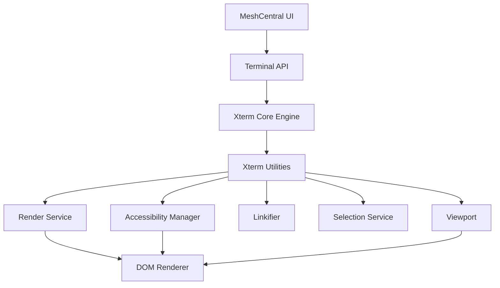
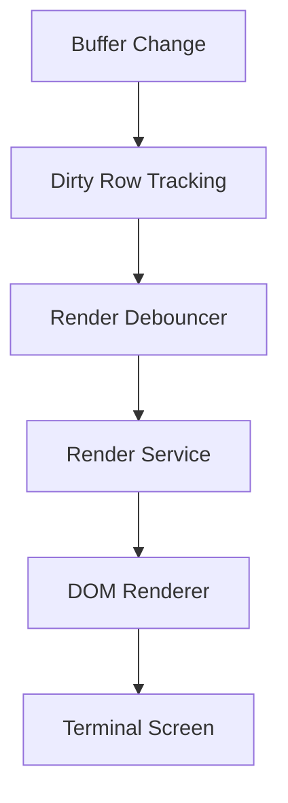
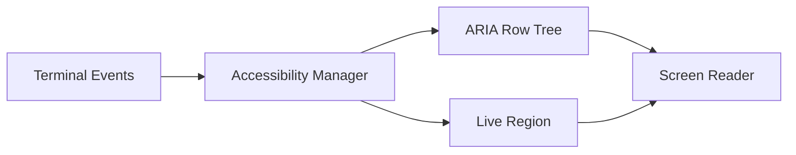
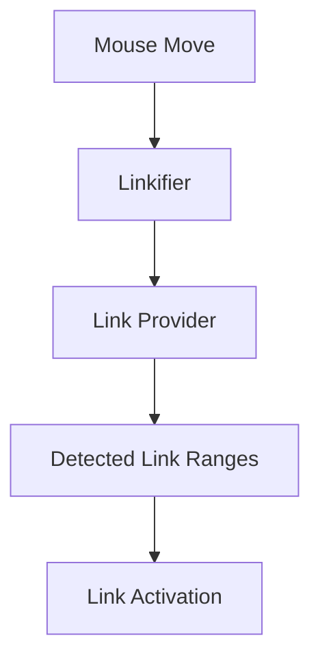
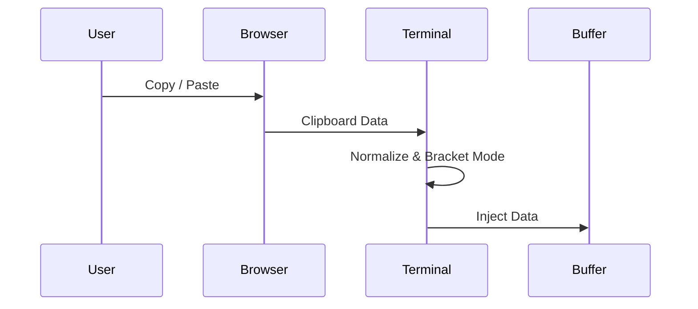
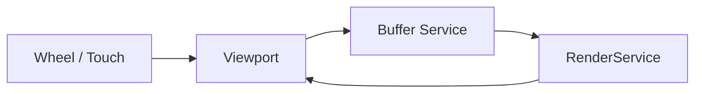
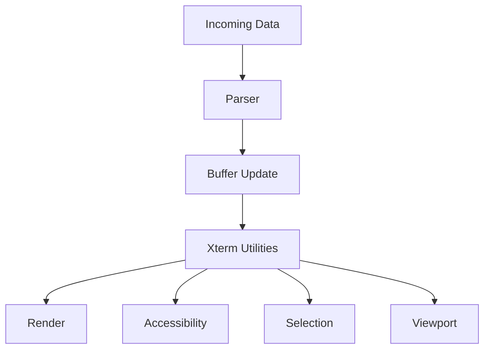
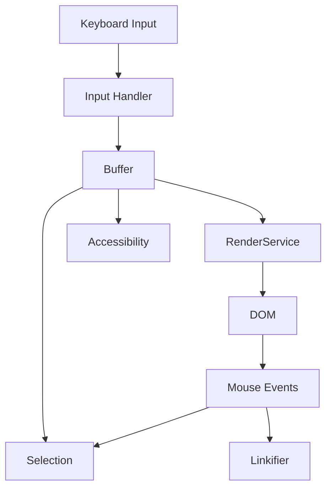

# Xterm Utilities

## Overview

The **Xterm Utilities** module provides the browser-side runtime infrastructure that transforms the Xterm core engine into a fully interactive, accessible, and high-performance web terminal inside MeshCentral.

Located under:

```text
public/scripts
```

This module extends the Xterm core by delivering:

- Advanced rendering coordination
- Accessibility (ARIA + screen reader) integration
- Selection and clipboard handling
- Hyperlink detection and activation
- Viewport and scroll synchronization
- Decoration and overlay management
- Advanced event orchestration

It acts as the **integration layer between the Xterm core engine and the browser DOM runtime**.

---

## Repository Structure

```text
public/scripts/xterm (utilities section)
│
├── meshcentral.public.scripts.xterm.h
├── meshcentral.public.scripts.xterm.k
├── meshcentral.public.scripts.xterm.l
├── meshcentral.public.scripts.xterm.n
├── meshcentral.public.scripts.xterm.o
└── meshcentral.public.scripts.xterm.s
```

### Internal Organization

The module is divided into two major layers:

- **Xterm Utilities Core**
- **Xterm Utilities Advanced**

| Layer | Components | Responsibility |
|--------|------------|---------------|
| Utilities Core | `h`, `k`, `l` | Foundational browser integration utilities |
| Utilities Advanced | `n`, `o`, `s` | High-level runtime orchestration & interaction |

For deeper details, refer to:
- **Xterm Utilities Core** documentation
- **Xterm Utilities Advanced** documentation

---

## Architectural Position

Xterm Utilities sits between the Xterm engine and the browser DOM.



### Architectural Role

- Reacts to buffer mutations
- Coordinates DOM rendering
- Maintains accessibility parity
- Maps DOM events back to buffer coordinates
- Ensures high-performance output handling

---

## Core Responsibilities

### 1. Rendering Coordination

Xterm Utilities batches and debounces rendering updates to prevent excessive reflows.



Key features:

- Dirty-row tracking
- Animation-frame batching
- Incremental rendering
- DPI and resize synchronization

---

### 2. Accessibility Management

Provides screen reader compatibility via ARIA row trees and live regions.



Capabilities:

- Debounced row announcements
- Live character batching
- Scroll boundary synchronization
- Selection-aware accessibility output

---

### 3. Link Detection (Linkifier)

Enables clickable hyperlinks within terminal output.



Supports:

- OSC 8 hyperlinks
- Hover underline effects
- Click callbacks
- Overlap prevention
- Dynamic viewport updates

---

### 4. Selection & Clipboard Integration

Handles advanced copy and paste scenarios.



Features:

- Bracketed paste mode
- Word/line/column selection
- Linux middle-click paste
- Clipboard normalization
- Scroll-aware selection

---

### 5. Viewport & Scroll Synchronization

Synchronizes buffer scrollback with DOM scroll state.



Responsibilities:

- Scroll position translation
- Scroll area height calculation
- Smooth scrolling
- Touch and device pixel ratio support

---

### 6. Advanced Runtime Orchestration

The Advanced layer coordinates:

- Rendering lifecycle
- Decoration overlays
- Resize handling
- Device pixel ratio tracking
- Service disposal and lifecycle cleanup



---

## Event Flow Model



### Key Principles

- Buffer is the single source of truth.
- Rendering reacts to buffer mutations.
- Accessibility mirrors visual output.
- Interaction maps DOM coordinates back to buffer indices.
- All updates are performance-optimized.

---

## Relationship to Other Modules

### Depends On

- **Xterm Core** (terminal engine, parsing, buffer management)
- Browser DOM runtime

### Extended By

- Xterm Addons (e.g., image addon)
- Higher-level terminal UI components

### Related Documentation

For deeper component breakdowns:

- **Xterm Utilities Core**
- **Xterm Utilities Advanced**
- **Xterm Core**

---

## Design Principles

1. Performance-first rendering
2. Strict buffer-DOM synchronization
3. Accessibility parity with visual output
4. Service-oriented architecture
5. Clear separation between core engine and browser integration

---

## Summary

The **Xterm Utilities** module is the operational backbone that transforms the raw Xterm engine into a:

- Fully interactive
- Accessible
- Scroll-synchronized
- High-performance
- Browser-native terminal

It ensures that terminal output, accessibility layers, user interaction, and rendering remain synchronized and efficient within the MeshCentral web environment.