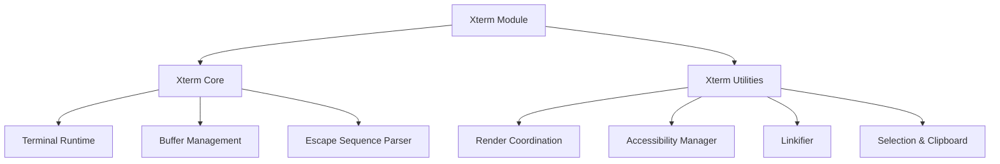
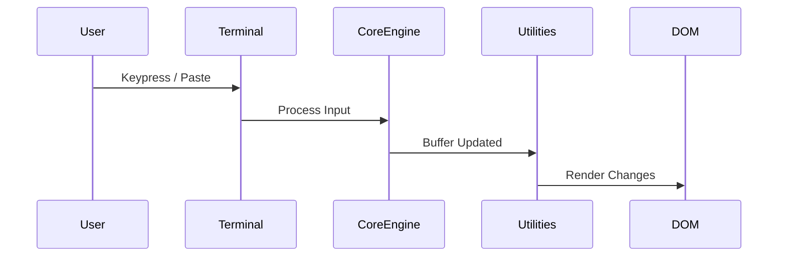
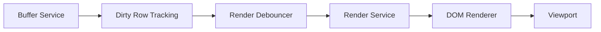
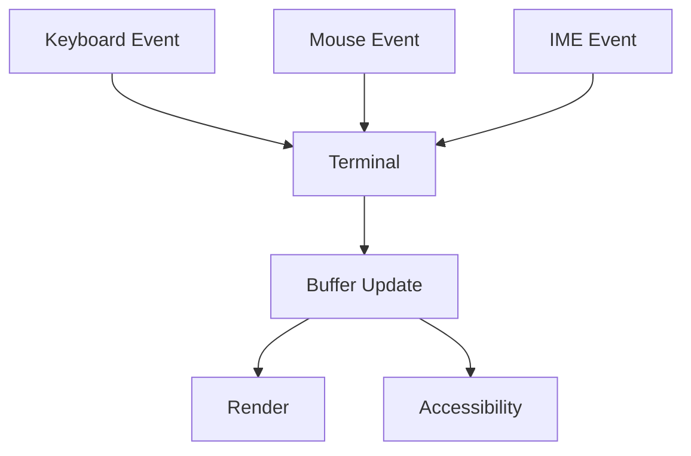
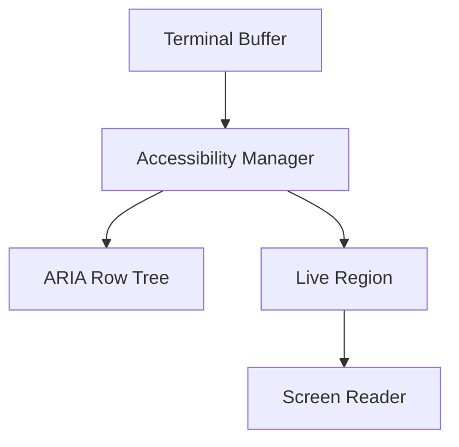
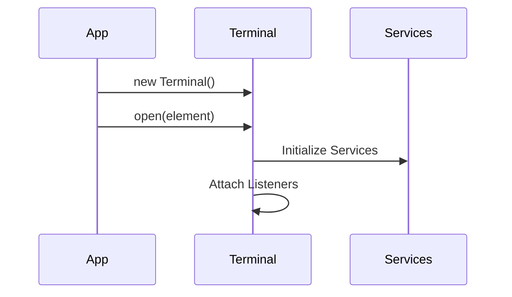

# Xterm

The **Xterm** module provides the browser-based terminal implementation used within MeshCentral. It delivers a fully interactive, high-performance terminal runtime integrated into the web UI, supporting:

- Terminal emulation
- Input handling and event coordination
- Rendering and buffer management
- Accessibility integration
- Utility services and lifecycle control
- Addon support (e.g., image rendering)

Located under:

```text
public/scripts/xterm/
```

The Xterm module is divided into two primary subsystems:

- **Xterm Core**
- **Xterm Utilities**

Together, these layers transform the terminal engine into a browser-native, accessible, and performant runtime.

---

## Purpose of the Module

The **Xterm** module is responsible for:

- Rendering interactive terminal sessions in the browser
- Managing terminal buffers and cursor state
- Handling keyboard, mouse, and composition input
- Synchronizing DOM rendering with buffer changes
- Providing accessibility (ARIA + screen reader) support
- Supporting decorations, link detection, and addons
- Managing lifecycle and disposal of terminal instances

It forms the foundation of all terminal-based functionality in the MeshCentral web client.

---

## High-Level Architecture



### Architectural Layers

| Layer | Responsibility |
|--------|----------------|
| Xterm Core | Terminal engine, parsing, buffers, runtime orchestration |
| Xterm Utilities | Browser integration, rendering coordination, accessibility, selection, viewport management |

---

## Repository Structure

```text
public/scripts/xterm/
│
├── xterm-core/
│   ├── xterm-core-main/
│   └── xterm-core-utilities/
│
└── xterm-utilities/
    ├── xterm-utilities-core/
    └── xterm-utilities-advanced/
```

### Component Mapping

#### Xterm Core

Located under:

```text
public/scripts/xterm (core section)
```

Key components:

- `meshcentral.public.scripts.xterm.P`
- `meshcentral.public.scripts.xterm.S`
- `meshcentral.public.scripts.xterm.a`
- `meshcentral.public.scripts.xterm.c`
- `meshcentral.public.scripts.xterm.d`

Submodules:

- **Xterm Core Main**
- **Xterm Core Utilities**

---

#### Xterm Utilities

Located under:

```text
public/scripts/xterm (utilities section)
```

Key components:

- `meshcentral.public.scripts.xterm.h`
- `meshcentral.public.scripts.xterm.k`
- `meshcentral.public.scripts.xterm.l`
- `meshcentral.public.scripts.xterm.n`
- `meshcentral.public.scripts.xterm.o`
- `meshcentral.public.scripts.xterm.s`

Submodules:

- **Xterm Utilities Core**
- **Xterm Utilities Advanced**

---

## Runtime Data Flow



### Flow Description

1. User input is captured by the `Terminal`.
2. The Core engine parses and updates the buffer.
3. Utilities detect buffer mutations.
4. Rendering is scheduled and applied to the DOM.
5. Accessibility and selection layers are synchronized.

---

## Rendering Pipeline



Key characteristics:

- Batched rendering
- Viewport-aware updates
- Minimal DOM mutations
- Device pixel ratio tracking
- Scroll synchronization

---

## Input & Interaction Model



Supported features:

- Modifier-aware keyboard input
- Bracketed paste mode
- Mouse tracking protocols
- Clipboard normalization
- IME composition handling
- Word/line/column selection

---

## Accessibility Integration



Capabilities:

- ARIA tree mirroring visible rows
- Debounced announcements
- Live region updates
- Selection-aware output
- Focus management

Accessibility is deeply integrated into the rendering and buffer lifecycle.

---

## Lifecycle Overview

### Initialization



### Runtime

- `write()` updates buffer and schedules rendering
- Resize recalculates buffer and viewport
- Scroll synchronizes DOM and internal state

### Disposal

- Event listeners removed
- Services disposed
- DOM references released
- Memory cleaned up

---

## Relationship to Other Modules

The Xterm module integrates with:

- **Xterm Addons** (e.g., image addon)
- MeshCentral backend transport for terminal data streaming
- Higher-level UI components in the web client

It acts as the terminal engine powering:

- Remote shell sessions
- Agent command consoles
- Embedded terminal panels in the MeshCentral UI

---

## Core Component Documentation References

For deeper documentation, refer to:

- `xterm-core/xterm-core-main.md`
- `xterm-core/xterm-core-utilities.md`
- `xterm-utilities/xterm-utilities-core.md`
- `xterm-utilities/xterm-utilities-advanced.md`

These documents provide detailed internal breakdowns of rendering services, accessibility managers, input handling, and lifecycle coordination.

---

## Design Principles

The Xterm module follows these architectural principles:

1. **Separation of concerns** — engine vs browser integration
2. **Service-oriented architecture** — modular services for rendering, buffer, and accessibility
3. **Performance-first rendering** — batched updates and viewport awareness
4. **Accessibility-first design** — ARIA parity with visual output
5. **Lifecycle safety** — disposable patterns prevent leaks
6. **Extensibility** — addon-compatible runtime

---

## Summary

The **Xterm** module is the browser-based terminal engine within MeshCentral. It:

- Implements a full terminal runtime
- Manages buffer and parsing logic
- Coordinates DOM rendering
- Provides accessibility and interaction support
- Integrates addons and UI components
- Ensures high performance and lifecycle safety

It forms the foundation of interactive terminal experiences across the MeshCentral web interface.